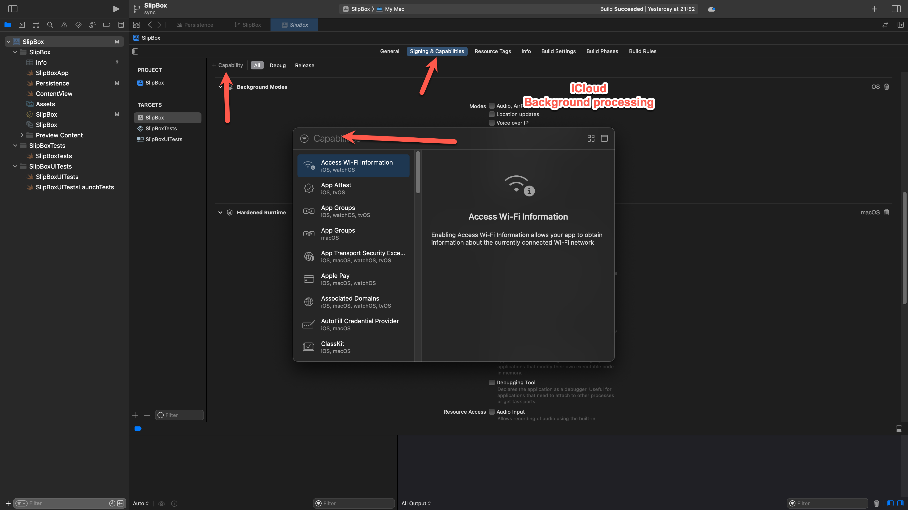
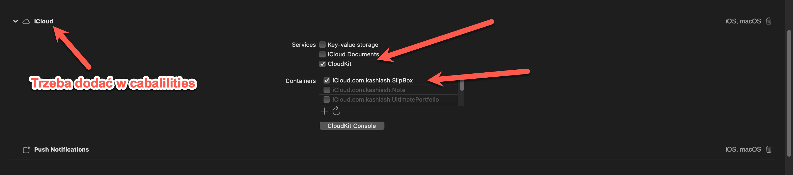
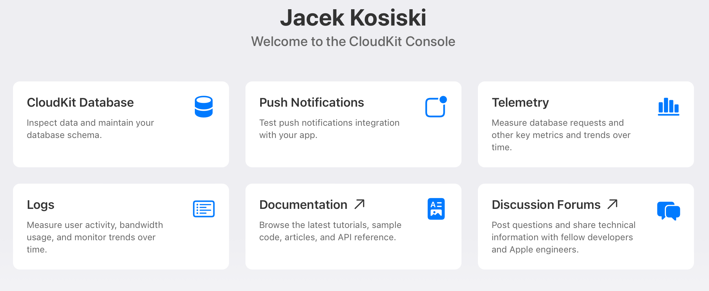
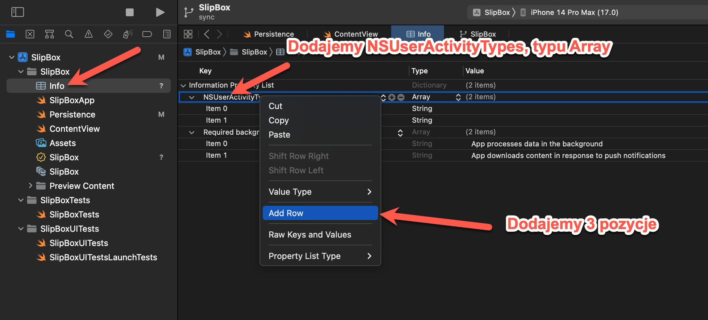
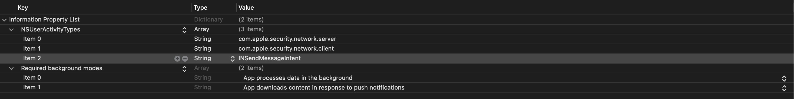

# Core Data + iCloud Sync


Teraz chcę porozmawiać o używaniu Core Data z synchronizacją iCloud. Muszę wprowadzić kilka dostosowań, głównie dotyczących możliwości. Chcę także pokazać Ci panel iCloud, gdzie znajdują się dane i jak działa ich przepływ. Porozmawiamy też trochę o problemach z synchronizacją iCloud. Jak zdobyć więcej informacji na ten temat? Ponieważ nie jest to łatwe do znalezienia. Tworzę osobne gałęzie dla tego projektu. Korzystam z SourceTree, ponieważ jest bezpłatne. Tworzę więc oddzielną gałąź o nazwie "sync" i przekierowuję się do niej. Jeśli chcesz wrócić do głównej gałęzi, wystarczy dwukrotnie kliknąć. Dodaję to także do mojego projektu, więc teraz mogę przełączać się między tymi dwoma gałęziami. Muszę być w gałęzi "sync", ponieważ dodaję wszystkie zmiany tutaj. 

Ułatwia to pracę, ponieważ w razie potrzeby można je połączyć z główną gałęzią, a wszystko jest zachowane oddzielnie i uporządkowane. Przechodzę do ustawień celu, gdzie muszę dodać kilka możliwości. Większość z tych możliwości działa tylko dla płatnych kont deweloperów. Jeśli nie masz takiego konta i próbujesz dodać iCloud, to nie pojawi się ono. Muszę więc teraz przełączyć się na płatne konto dewelopera. W tym przypadku mam większą liczbę możliwości i mogę dodać iCloud. Teraz, pod sekcją iCloud, włączam CloudKit i musisz dodać kontener. Kontener mówi, jaki serwer chcesz użyć, jest to odpowiednik serwera i kontenera.




Muszę teraz przełączyć się na płatne konto dewelopera. W tym przypadku mam znacznie więcej możliwości i mogę dodać iCloud. Teraz, pod sekcją iCloud, włączam CloudKit i musisz dodać kontener. Kontener mówi, jaki serwer chcesz użyć, jest to odpowiednik serwera i kontenera. Ponieważ już mam tutaj kilka, po prostu wybieram jeden z nich. Możesz także dodać nowy kontener i musi on mieć nazwę. Określa, jaki rodzaj kontenera chcesz utworzyć. Zazwyczaj kopiujesz identyfikator pakietu, ponieważ jest on unikalny i ma sens, żeby identyfikator aplikacji i identyfikator serwera były ze sobą powiązane. Kopiujesz to, wracasz tutaj i w sekcji iCloud naciskasz przycisk "plus", a następnie dodajesz ten kontener. 




Mam już tak wiele kontenerów, że nie muszę tutaj klikać przycisku "odśwież". Po pewnym czasie powinno to działać i kontener zostanie utworzony na serwerze CloudKit. Dlatego dodano tutaj przycisk "Konsola CloudKit". Teraz przechodzimy do konsoli i wybieramy bazę danych CloudKit. 



U góry możesz wybrać różne kontenery. Na początku nie masz tutaj nic. Jeśli klikniesz na "indeksy", zobaczysz tylko jeden rodzaj rekordu, którym są użytkownicy. Teraz uruchamiamy naszą aplikację. Po prawidłowej konfiguracji dla CloudKit powinniśmy zobaczyć, że nasza definicja schematu lub modelu zostanie również zsynchronizowana z CloudKit. Powinniśmy to zobaczyć. Wracamy, aby zakończyć wszystkie konfiguracje. Razem z **CloudKit** dodane zostały również powiadomienia `push`. Dzieje się tak dlatego, że kiedy **CloudKit** łączy się z naszą bazą danych, musi przekazać wszystkie aktualizacje z serwera z powrotem do naszej aplikacji. Dlatego musimy mieć automatyczne tło, które będzie to robić w tle. Nie widzimy tego bezpośrednio; jest to kodowanie **CloudKit**. Muszę również komunikować się w tle, aby otrzymywać aktualizacje. 


Po synchronizacji muszę również dodać tryb pracy w tle. Teraz, dla tej sekcji, potrzebuję powiadomień zdalnych oraz przetwarzania w tle. Konkretnie dla systemu macOS, ponieważ ten cel dotyczy również macOS, muszę przejść do sekcji `Signing & Capabilities` (Podpisywanie i Możliwości) i zaznaczyć `Network incoming connections` (Przychodzące połączenia sieciowe). Domyślnie w systemie macOS nie jest dozwolone pobieranie ani przesyłanie danych do internetu, dlatego musimy to jasno zadeklarować. To wystarczy, aby to działało. 

​	Dodam jeszcze jeden klucz w pliku `Info.plist`, aby uniknąć problemów podczas wysyłania aplikacji do App Store. 




W pliku `Info.plist` muszę dodać kilka więcej kluczy. Jeden z nich to `NSUserActivityTypes`, który jest typu `Array`.  Muszę również mieć kilka wpisów, które są wolne. Rozwijam to miejsce i dodaję trzy elementy, które są typu `string`. To, co jest interesujące, to wartości, które tutaj wprowadzamy. Pierwsza to `com.apple.security.networked-on-server`, następna to `client` i `sendMessageIntent`. Dodane zostało również wprowadzenie dla wymaganych trybów pracy w tle, ale domyślnie są one dodawane, więc nie musisz ich również dodawać. Teraz wszystko jest w porządku z ustawieniami i możemy przejść do kontenera **CloudKit**.




Teraz musimy naprawdę mieć tutaj ten **CloudKit**, aby to działało. W inicjalizatorze, gdy to konfigurujemy, chcę dodać kilka rzeczy. Ponieważ powiedziałem, że musimy przesłać nasz schemat do **CloudKit**, muszę dodać niektóre opcje, aby to zrobić. W inicjalizatorze chcę dodać te opcje, ale nie wtedy, gdy ywamy zapisu do pamieci. Kiedy ywamy in memory, oznacza to, że jest to tymczasowe miejsce, które zostanie wyczyszczone przy kolejnym uruchomieniu, na które nie zwracam uwagi. Dlatego mogę również użyć `else`. Nie chcę również tego robić, gdy jestem w trybie debug. Wtedy używam zmiennej `debug` i opcji. To jest opcje inicjalizacji schematu kontenera CloudKit. Wtedy mogę powiedzieć `container.initialCloudKitSchema(options: myOptions)`. To może generować błąd, więc muszę użyć `try`, a następnie skorzystać z bloku `do-catch`, aby uzyskać wszystkie informacje.

```swift
        if inMemory {
            container.persistentStoreDescriptions.first!.url = URL(fileURLWithPath: "/dev/null")
        } else {
            #if DEBUG
            setupSchemaSync()
            #endif
        }
```

Chodzi mi tylko o przesłanie mojego schematu. Wtedy jestem wtedy, kiedy jestem sobą, gdy uruchamiam to i dlatego korzystam z trybu debug. Jeśli debugujesz, używam opcji. Jest to opcja inicjalizacji schematu kontenera **CloudKit**. Następnie mogę powiedzieć `container.initialCloudKitSchema(options: myOptions)`. To może generować błąd, więc muszę użyć `try`, a następnie skorzystać z bloku `do-catch`, aby uzyskać wszystkie informacje.

```swift
    func setupSchemaSync() {
        let options = NSPersistentCloudKitContainerSchemaInitializationOptions()
        do {
            try container.initializeCloudKitSchema(options: options)
        } catch {
            print("cloudkit sync - schema error: \(error)")
        }
    }
```

Bardzo ważne jest użycie `catch`, ponieważ czasami mogą wystąpić niespodziewane problemy. Nie łapię ich. Tutaj drukuję `cloudKitSchemaError` i błąd. Zapomniałem o zamknięciu znacznika `#end`. Jeśli chcesz to trochę ułatwić do odczytania, możesz również wyodrębnić to jako funkcję `setUpSchemaSync`. Przeniosę ten fragment tutaj.

Teraz, w trybie debug, mogę zobaczyć, że muszę przeprowadzić przesyłanie schematu. Skonfigurowałem wszystko dla mojego kontenera, wczytuję mój kontener i konfiguruję moje konteksty widoku w celu automatycznego scalania zmian z rodzica. Możesz również dodać inną politykę scalania. Używam `NSMergeByPropertyObjectTrumpMergePolicy`, więc to dotyczy zmian w pamięci lub w trybie `NSMergeByPropertyObjectTrumpMergePolicy`, który jest polityką bazową dla właściwości. Używam tylko pierwszej polityki.

   `container.viewContext.mergePolicy = NSMergeByPropertyObjectTrumpMergePolicy`

Teraz, gdy to uruchamiam, powinienem móc uruchomić to z synchronizacją **iCloud**. Spróbujmy na **MacOS**. Właśnie wyczyściłem moje dane wcześniej. Teraz, jeśli tutaj dodam kilka wpisów, pierwszą rzeczą, którą zobaczysz, jest to, że jest tu ogromny ruch w komunikacji pomiędzy bazą, aplikacją i cloudSync

```txt
CoreData: debug: CoreData+CloudKit: -[PFCloudKitThrottledNotificationObserver noteRecievedNotification:](49): <PFCloudKitThrottledNotificationObserver: 0x6000006d8840>: Got: NSApplicationWillBecomeActiveNotification - 0
CoreData: debug: CoreData+CloudKit: -[PFCloudKitThrottledNotificationObserver noteRecievedNotification:](49): <PFCloudKitThrottledNotificationObserver: 0x6000006d8840>: Got: NSApplicationDidBecomeActiveNotification - 1
CoreData: CloudKit: CoreData+CloudKit: -[PFCloudKitThrottledNotificationObserver noteRecievedNotification:](70): <PFCloudKitThrottledNotificationObserver: 0x6000006d8840> - Already scheduled a block to respond to 'NSApplicationDidBecomeActiveNotification', 2 notifications since.
CoreData: sql: BEGIN EXCLUSIVE
CoreData: sql: COMMIT
CoreData: sql: BEGIN EXCLUSIVE
CoreData: sql: INSERT INTO ZITEM(Z_PK, Z_ENT, Z_OPT, ZTIMESTAMP) VALUES(?, ?, ?, ?)
CoreData: sql: INSERT OR IGNORE INTO ATRANSACTIONSTRING(Z_PK, Z_ENT, Z_OPT, ZNAME) VALUES(?, ?, ?, ?)
CoreData: sql: SELECT Z_PK FROM ATRANSACTIONSTRING WHERE ZNAME = ?
CoreData: sql: INSERT OR IGNORE INTO ATRANSACTIONSTRING(Z_PK, Z_ENT, Z_OPT, ZNAME) VALUES(?, ?, ?, ?)
CoreData: sql: SELECT Z_PK FROM ATRANSACTIONSTRING WHERE ZNAME = ?
CoreData: sql: INSERT INTO ATRANSACTION(Z_PK, Z_ENT, Z_OPT, ZAUTHORTS, ZBUNDLEIDTS, ZCONTEXTNAMETS, ZPROCESSIDTS, ZAUTHOR, ZBUNDLEID, ZCONTEXTNAME, ZPROCESSID, ZQUERYGEN, ZTIMESTAMP) VALUES(?, ?, ?, ?, ?, ?, ?, ?, ?, ?, ?, ?, ?)
CoreData: sql: INSERT INTO ACHANGE(Z_PK, Z_ENT, Z_OPT, ZTRANSACTIONID, ZCHANGETYPE, ZCOLUMNS, ZENTITY, ZENTITYPK) VALUES(?, ?, ?, ?, ?, ?, ?, ?)
CoreData: sql: COMMIT
CoreData: sql: BEGIN TRANSACTION
CoreData: annotation: connection 0x15a108190 created snapshot:
	ss {length = 48, bytes = 0x18e22d00 00000000 c0030000 01000010 ... 2ffb68f3 ed565942 } value: 
	pointer value:{length = 8, bytes = 0xe0a56b0000600000}
	pointer: 0x6000006ba5e0
CoreData: sql: BEGIN TRANSACTION
CoreData: annotation: connection 0x158e06350 adopting snapshot:
	ss value: {length = 48, bytes = 0x18e22d00 00000000 c0030000 01000010 ... 2ffb68f3 ed565942 }
	pointer value:_PFSQLiteSnapshotWrapper (0x6000008e5600) : {length = 48, bytes = 0x18e22d00 00000000 c0030000 01000010 ... 2ffb68f3 ed565942 }
	pointer: 0x6000006ba5e0
CoreData: sql: ROLLBACK
CoreData: sql: ROLLBACK
CoreData: sql: SELECT MAX(Z_PK) FROM ATRANSACTION
CoreData: debug: CoreData+CloudKit: -[NSCloudKitMirroringDelegate managedObjectContextSaved:](2952): <NSCloudKitMirroringDelegate: 0x6000031a8700>: Observed context save: <NSPersistentStoreCoordinator: 0x6000026a4a00> - <NSManagedObjectContext: 0x6000033a8680>
CoreData: CloudKit: CoreData+CloudKit: -[NSCloudKitMirroringDelegate _scheduleAutomatedExportWithLabel:activity:completionHandler:](3446): <NSCloudKitMirroringDelegate: 0x6000031a8700> - Beginning automated export - ExportActivity:
<CKSchedulerActivity: 0x600002cb0720; relatedApplications=[ com.kashiash.SlipBox ], containerID=<CKContainerID: 0x60000062f930; containerIdentifier=iCloud.com.kashiash.SlipBox, containerEnvironment="Sandbox">, identifier=com.apple.coredata.cloudkit.activity.export.8FA774D8-8957-4771-B6BA-D07FD6AD4580, priority=2, xpcActivityCriteriaOverrides={ Delay=0, ActivityGroupName=com.apple.coredata.cloudkit.SlipBox.8FA774D8-8957-4771-B6BA-D07FD6AD4580, Priority=Utility }>
CoreData: CloudKit: CoreData+CloudKit: -[NSCloudKitMirroringDelegate executeMirroringRequest:error:](944): <NSCloudKitMirroringDelegate: 0x6000031a8700>: Asked to execute request: <NSCloudKitMirroringExportRequest: 0x600002bbae90> 7E9A900D-46FB-423B-BAD9-571EED3EA4BC
CoreData: CloudKit: CoreData+CloudKit: -[NSCloudKitMirroringDelegate _enqueueRequest:]_block_invoke(978): <NSCloudKitMirroringDelegate: 0x6000031a8700>: enqueuing request: <NSCloudKitMirroringExportRequest: 0x600002bbae90> 7E9A900D-46FB-423B-BAD9-571EED3EA4BC
CoreData: CloudKit: CoreData+CloudKit: -[NSCloudKitMirroringDelegate _enqueueRequest:]_block_invoke_2(987): Enqueued request: <NSCloudKitMirroringExportRequest: 0x600002bbae90> 7E9A900D-46FB-423B-BAD9-571EED3EA4BC
CoreData: CloudKit: CoreData+CloudKit: -[NSCloudKitMirroringDelegate checkAndExecuteNextRequest](3328): <NSCloudKitMirroringDelegate: 0x6000031a8700>: Checking for pending requests.
CoreData: CloudKit: CoreData+CloudKit: -[NSCloudKitMirroringDelegate checkAndExecuteNextRequest]_block_invoke(3341): <NSCloudKitMirroringDelegate: 0x6000031a8700>: Executing: <NSCloudKitMirroringExportRequest: 0x600002bbae90> 7E9A900D-46FB-423B-BAD9-571EED3EA4BC
CoreData: sql: BEGIN EXCLUSIVE
CoreData: sql: COMMIT
CoreData: sql: BEGIN EXCLUSIVE
CoreData: sql: INSERT INTO ANSCKEVENT(Z_PK, Z_ENT, Z_OPT, ZCLOUDKITEVENTTYPE, ZCOUNTAFFECTEDOBJECTS, ZCOUNTFINISHEDOBJECTS, ZENDEDAT, ZERRORCODE, ZERRORDOMAIN, ZSTARTEDAT, ZSUCCEEDED) VALUES(?, ?, ?, ?, ?, ?, ?, ?, ?, ?, ?)
CoreData: sql: UPDATE OR FAIL ANSCKEVENT SET ZEVENTIDENTIFIER = ? WHERE Z_PK = ?
CoreData: sql: COMMIT
CoreData: sql: BEGIN TRANSACTION
CoreData: annotation: connection 0x15a108190 created snapshot:
	ss {length = 48, bytes = 0x18e22d00 00000000 c2030000 01000010 ... c76a954e 5f0ab067 } value: 
	pointer value:{length = 8, bytes = 0xd0bb6a0000600000}
	pointer: 0x6000006abbd0
CoreData: sql: BEGIN TRANSACTION
CoreData: annotation: connection 0x158e06350 adopting snapshot:
	ss value: {length = 48, bytes = 0x18e22d00 00000000 c2030000 01000010 ... c76a954e 5f0ab067 }
	pointer value:_PFSQLiteSnapshotWrapper (0x6000008e21c0) : {length = 48, bytes = 0x18e22d00 00000000 c2030000 01000010 ... c76a954e 5f0ab067 }
	pointer: 0x6000006abbd0
CoreData: sql: ROLLBACK
CoreData: sql: pragma page_count
CoreData: annotation: sql execution time: 0.0000s
CoreData: sql: pragma freelist_count
CoreData: annotation: sql execution time: 0.0000s
CoreData: sql: ROLLBACK
CoreData: sql: SELECT MAX(Z_PK) FROM ATRANSACTION
CoreData: debug: CoreData+CloudKit: -[NSCloudKitMirroringDelegate managedObjectContextSaved:](2952): <NSCloudKitMirroringDelegate: 0x6000031a8700>: Observed context save: <NSPersistentStoreCoordinator: 0x6000026a4a00> - <NSManagedObjectContext: 0x600003380000>
CoreData: sql: BEGIN TRANSACTION
CoreData: annotation: connection 0x158e06350 created snapshot:
	ss {length = 48, bytes = 0x18e22d00 00000000 c2030000 01000010 ... c76a954e 5f0ab067 } value: 
	pointer value:{length = 8, bytes = 0x00c0620000600000}
	pointer: 0x60000062c000
CoreData: annotation: connection 0x158e06350 adopting snapshot:
	ss value: {length = 48, bytes = 0x18e22d00 00000000 c2030000 01000010 ... c76a954e 5f0ab067 }
	pointer value:_PFSQLiteSnapshotWrapper (0x6000008e2aa0) : {length = 48, bytes = 0x18e22d00 00000000 c2030000 01000010 ... c76a954e 5f0ab067 }
	pointer: 0x60000062c000
CoreData: sql: BEGIN TRANSACTION
CoreData: annotation: connection 0x15a108190 adopting snapshot:
	ss value: {length = 48, bytes = 0x18e22d00 00000000 c2030000 01000010 ... c76a954e 5f0ab067 }
	pointer value:_PFSQLiteSnapshotWrapper (0x6000008e2aa0) : {length = 48, bytes = 0x18e22d00 00000000 c2030000 01000010 ... c76a954e 5f0ab067 }
	pointer: 0x60000062c000
CoreData: sql: SELECT 0, t0.Z_PK, t0.Z_OPT, t0.ZCKOWNERNAME, t0.ZCKRECORDZONENAME, t0.ZCURRENTCHANGETOKEN, t0.ZENCODEDSHAREDATA, t0.ZHASRECORDZONENUM, t0.ZHASSUBSCRIPTIONNUM, t0.ZLASTFETCHDATE, t0.ZNEEDSIMPORT, t0.ZNEEDSNEWSHAREINVITATION, t0.ZNEEDSRECOVERYFROMIDENTITYLOSS, t0.ZNEEDSRECOVERYFROMUSERPURGE, t0.ZNEEDSRECOVERYFROMZONEDELETE, t0.ZNEEDSSHAREDELETE, t0.ZNEEDSSHAREUPDATE, t0.ZSUPPORTSATOMICCHANGES, t0.ZSUPPORTSFETCHCHANGES, t0.ZSUPPORTSRECORDSHARING, t0.ZSUPPORTSZONESHARING, t0.ZDATABASE FROM ANSCKRECORDZONEMETADATA t0 JOIN ANSCKDATABASEMETADATA t1 ON t0.ZDATABASE = t1.Z_PK WHERE ( t0.ZCKRECORDZONENAME = ? AND  t0.ZCKOWNERNAME = ? AND  t1.ZDATABASESCOPENUM = ?) 
CoreData: annotation: sql connection fetch time: 0.0011s
CoreData: annotation: total fetch execution time: 0.0013s for 1 rows.
CoreData: sql: COMMIT
CoreData: sql: BEGIN TRANSACTION
CoreData: annotation: connection 0x15a108190 adopting snapshot:
	ss value: {length = 48, bytes = 0x18e22d00 00000000 c2030000 01000010 ... c76a954e 5f0ab067 }
	pointer value:_PFSQLiteSnapshotWrapper (0x6000008e2aa0) : {length = 48, bytes = 0x18e22d00 00000000 c2030000 01000010 ... c76a954e 5f0ab067 }
	pointer: 0x60000062c000
CoreData: sql: SELECT 0, t0.Z_PK, t0.Z_OPT, t0.ZCKOWNERNAME, t0.ZCKRECORDZONENAME, t0.ZCURRENTCHANGETOKEN, t0.ZENCODEDSHAREDATA, t0.ZHASRECORDZONENUM, t0.ZHASSUBSCRIPTIONNUM, t0.ZLASTFETCHDATE, t0.ZNEEDSIMPORT, t0.ZNEEDSNEWSHAREINVITATION, t0.ZNEEDSRECOVERYFROMIDENTITYLOSS, t0.ZNEEDSRECOVERYFROMUSERPURGE, t0.ZNEEDSRECOVERYFROMZONEDELETE, t0.ZNEEDSSHAREDELETE, t0.ZNEEDSSHAREUPDATE, t0.ZSUPPORTSATOMICCHANGES, t0.ZSUPPORTSFETCHCHANGES, t0.ZSUPPORTSRECORDSHARING, t0.ZSUPPORTSZONESHARING, t0.ZDATABASE FROM ANSCKRECORDZONEMETADATA t0 JOIN ANSCKDATABASEMETADATA t1 ON t0.ZDATABASE = t1.Z_PK WHERE ( t0.ZHASRECORDZONENUM = ? AND  t1.ZDATABASESCOPENUM = ?) 
CoreData: annotation: sql connection fetch time: 0.0001s
CoreData: annotation: total fetch execution time: 0.0002s for 0 rows.
CoreData: sql: COMMIT
CoreData: sql: ROLLBACK
CoreData: sql: BEGIN TRANSACTION
CoreData: annotation: connection 0x158e06350 created snapshot:
	ss {length = 48, bytes = 0x18e22d00 00000000 c2030000 01000010 ... c76a954e 5f0ab067 } value: 
	pointer value:{length = 8, bytes = 0x70a66a0000600000}
	pointer: 0x6000006aa670
CoreData: annotation: connection 0x158e06350 adopting snapshot:
	ss value: {length = 48, bytes = 0x18e22d00 00000000 c2030000 01000010 ... c76a954e 5f0ab067 }
	pointer value:_PFSQLiteSnapshotWrapper (0x6000008e1a00) : {length = 48, bytes = 0x18e22d00 00000000 c2030000 01000010 ... c76a954e 5f0ab067 }
	pointer: 0x6000006aa670
CoreData: sql: BEGIN TRANSACTION
CoreData: annotation: connection 0x15a108190 adopting snapshot:
	ss value: {length = 48, bytes = 0x18e22d00 00000000 c2030000 01000010 ... c76a954e 5f0ab067 }
	pointer value:_PFSQLiteSnapshotWrapper (0x6000008e1a00) : {length = 48, bytes = 0x18e22d00 00000000 c2030000 01000010 ... c76a954e 5f0ab067 }
	pointer: 0x6000006aa670
CoreData: sql: SELECT 0, t0.Z_PK, t0.Z_OPT, t0.ZBOOLVALUENUM, t0.ZDATEVALUE, t0.ZINTEGERVALUE, t0.ZKEY, t0.ZSTRINGVALUE, t0.ZTRANSFORMEDVALUE FROM ANSCKMETADATAENTRY t0 WHERE  t0.ZKEY IN  (?)  
CoreData: annotation: sql connection fetch time: 0.0002s
CoreData: annotation: total fetch execution time: 0.0005s for 1 rows.
CoreData: sql: COMMIT
CoreData: sql: BEGIN TRANSACTION
CoreData: annotation: connection 0x15a108190 adopting snapshot:
	ss value: {length = 48, bytes = 0x18e22d00 00000000 c2030000 01000010 ... c76a954e 5f0ab067 }
	pointer value:_PFSQLiteSnapshotWrapper (0x6000008e1a00) : {length = 48, bytes = 0x18e22d00 00000000 c2030000 01000010 ... c76a954e 5f0ab067 }
	pointer: 0x6000006aa670
CoreData: sql: SELECT 0, t0.Z_PK, t0.Z_OPT, t0.ZBOOLVALUENUM, t0.ZDATEVALUE, t0.ZINTEGERVALUE, t0.ZKEY, t0.ZSTRINGVALUE, t0.ZTRANSFORMEDVALUE FROM ANSCKMETADATAENTRY t0 WHERE  t0.ZKEY IN  (?)  
CoreData: annotation: sql connection fetch time: 0.0001s
CoreData: annotation: total fetch execution time: 0.0002s for 0 rows.
CoreData: sql: COMMIT
CoreData: CloudKit: CoreData+CloudKit: -[PFCloudKitExporter analyzeHistoryInStore:withManagedObjectContext:error:](511): <PFCloudKitExporter: 0x600002bbbc50>: Exporting changes since (0): <NSPersistentHistoryToken - {
    "8FA774D8-8957-4771-B6BA-D07FD6AD4580" = 38;
}>
CoreData: sql: BEGIN TRANSACTION
CoreData: annotation: connection 0x15a108190 adopting snapshot:
	ss value: {length = 48, bytes = 0x18e22d00 00000000 c2030000 01000010 ... c76a954e 5f0ab067 }
	pointer value:_PFSQLiteSnapshotWrapper (0x6000008e1a00) : {length = 48, bytes = 0x18e22d00 00000000 c2030000 01000010 ... c76a954e 5f0ab067 }
	pointer: 0x6000006aa670
CoreData: sql: SELECT COUNT(Z_PK) FROM ATRANSACTION WHERE Z_PK = 38
CoreData: sql: COMMIT
CoreData: sql: BEGIN TRANSACTION
CoreData: annotation: connection 0x15a108190 adopting snapshot:
	ss value: {length = 48, bytes = 0x18e22d00 00000000 c2030000 01000010 ... c76a954e 5f0ab067 }
	pointer value:_PFSQLiteSnapshotWrapper (0x6000008e1a00) : {length = 48, bytes = 0x18e22d00 00000000 c2030000 01000010 ... c76a954e 5f0ab067 }
	pointer: 0x6000006aa670
CoreData: sql: SELECT 0, t0.Z_PK FROM ATRANSACTION t0 WHERE  t0.Z_PK > ? ORDER BY t0.Z_PK LIMIT 20
CoreData: annotation: sql connection fetch time: 0.0002s
CoreData: annotation: total fetch execution time: 0.0003s for 1 rows.
CoreData: sql: COMMIT
CoreData: sql: BEGIN TRANSACTION
CoreData: annotation: connection 0x15a108190 adopting snapshot:
	ss value: {length = 48, bytes = 0x18e22d00 00000000 c2030000 01000010 ... c76a954e 5f0ab067 }
	pointer value:_PFSQLiteSnapshotWrapper (0x6000008e1a00) : {length = 48, bytes = 0x18e22d00 00000000 c2030000 01000010 ... c76a954e 5f0ab067 }
	pointer: 0x6000006aa670
CoreData: annotation: Bound intarray _Z_intarray0
CoreData: annotation: Bound intarray values.
CoreData: sql: SELECT 16002, t0.Z_PK,  t1.ZNAME,  t2.ZNAME,  t3.ZNAME,  t4.ZNAME, t0.ZAUTHOR, t0.ZBUNDLEID, t0.ZCONTEXTNAME, t0.ZPROCESSID, t0.ZQUERYGEN, t0.ZTIMESTAMP FROM ATRANSACTION t0 LEFT OUTER JOIN ATRANSACTIONSTRING t1 ON t0.ZAUTHORTS = t1.Z_PK LEFT OUTER JOIN ATRANSACTIONSTRING t2 ON t0.ZBUNDLEIDTS = t2.Z_PK LEFT OUTER JOIN ATRANSACTIONSTRING t3 ON t0.ZCONTEXTNAMETS = t3.Z_PK LEFT OUTER JOIN ATRANSACTIONSTRING t4 ON t0.ZPROCESSIDTS = t4.Z_PK WHERE  t0.Z_PK IN (SELECT * FROM _Z_intarray0)   LIMIT 111
CoreData: annotation: sql connection fetch time: 0.0006s
CoreData: annotation: total fetch execution time: 0.0007s for 1 rows.
CoreData: sql: COMMIT
CoreData: sql: BEGIN TRANSACTION
CoreData: annotation: connection 0x15a108190 adopting snapshot:
	ss value: {length = 48, bytes = 0x18e22d00 00000000 c2030000 01000010 ... c76a954e 5f0ab067 }
	pointer value:_PFSQLiteSnapshotWrapper (0x6000008e1a00) : {length = 48, bytes = 0x18e22d00 00000000 c2030000 01000010 ... c76a954e 5f0ab067 }
	pointer: 0x6000006aa670
CoreData: sql: SELECT DISTINCT 0, t0.Z_PK FROM ACHANGE t0 WHERE  t0.ZTRANSACTIONID IN  (?)  ORDER BY t0.Z_PK
CoreData: annotation: sql connection fetch time: 0.0001s
CoreData: annotation: total fetch execution time: 0.0001s for 1 rows.
CoreData: sql: COMMIT
CoreData: sql: BEGIN TRANSACTION
CoreData: annotation: connection 0x15a108190 adopting snapshot:
	ss value: {length = 48, bytes = 0x18e22d00 00000000 c2030000 01000010 ... c76a954e 5f0ab067 }
	pointer value:_PFSQLiteSnapshotWrapper (0x6000008e1a00) : {length = 48, bytes = 0x18e22d00 00000000 c2030000 01000010 ... c76a954e 5f0ab067 }
	pointer: 0x6000006aa670
CoreData: annotation: Bound intarray values.
CoreData: sql: SELECT 16001, t0.Z_PK,  t0.ZTRANSACTIONID, t0.ZCHANGETYPE, t0.ZCOLUMNS, t0.ZENTITY, t0.ZENTITYPK FROM ACHANGE t0 WHERE  t0.Z_PK IN (SELECT * FROM _Z_intarray0)   LIMIT 111
CoreData: annotation: sql connection fetch time: 0.0003s
CoreData: annotation: total fetch execution time: 0.0005s for 1 rows.
CoreData: sql: COMMIT
CoreData: sql: BEGIN TRANSACTION
CoreData: annotation: connection 0x15a108190 adopting snapshot:
	ss value: {length = 48, bytes = 0x18e22d00 00000000 c2030000 01000010 ... c76a954e 5f0ab067 }
	pointer value:_PFSQLiteSnapshotWrapper (0x6000008e1a00) : {length = 48, bytes = 0x18e22d00 00000000 c2030000 01000010 ... c76a954e 5f0ab067 }
	pointer: 0x6000006aa670
CoreData: sql: SELECT 0, t0.Z_PK, t0.Z_OPT, t0.ZENTITYID, t0.ZENTITYPK, t0.ZFINALCHANGEAUTHOR, t0.ZFINALCHANGETYPENUM, t0.ZFINALTRANSACTIONNUMBER, t0.ZORIGINALCHANGETYPENUM, t0.ZORIGINALTRANSACTIONNUMBER FROM ANSCKHISTORYANALYZERSTATE t0 WHERE ( t0.ZENTITYID = ? AND  t0.ZENTITYPK IN  (?) ) 
CoreData: annotation: sql connection fetch time: 0.0001s
CoreData: annotation: total fetch execution time: 0.0003s for 0 rows.
CoreData: sql: COMMIT
CoreData: sql: BEGIN TRANSACTION
CoreData: annotation: connection 0x15a108190 adopting snapshot:
	ss value: {length = 48, bytes = 0x18e22d00 00000000 c2030000 01000010 ... c76a954e 5f0ab067 }
	pointer value:_PFSQLiteSnapshotWrapper (0x6000008e1a00) : {length = 48, bytes = 0x18e22d00 00000000 c2030000 01000010 ... c76a954e 5f0ab067 }
	pointer: 0x6000006aa670
CoreData: sql: SELECT 0, t0.Z_PK, t0.Z_OPT, t0.ZBOOLVALUENUM, t0.ZDATEVALUE, t0.ZINTEGERVALUE, t0.ZKEY, t0.ZSTRINGVALUE, t0.ZTRANSFORMEDVALUE FROM ANSCKMETADATAENTRY t0 WHERE  t0.ZKEY IN  (?)  
CoreData: annotation: sql connection fetch time: 0.0001s
CoreData: annotation: total fetch execution time: 0.0003s for 1 rows.
CoreData: sql: COMMIT
CoreData: sql: SELECT 0, t0.Z_PK, t0.Z_OPT, t0.ZBOOLVALUENUM, t0.ZDATEVALUE, t0.ZINTEGERVALUE, t0.ZKEY, t0.ZSTRINGVALUE, t0.ZTRANSFORMEDVALUE FROM ANSCKMETADATAENTRY t0 WHERE  t0.Z_PK = ? 
CoreData: annotation: sql connection fetch time: 0.0001s
CoreData: annotation: total fetch execution time: 0.0002s for 1 rows.
CoreData: annotation: fault fulfilled from database for : 0x91eca28c071a4bec <x-coredata://8FA774D8-8957-4771-B6BA-D07FD6AD4580/NSCKMetadataEntry/p10>
CoreData: sql: BEGIN EXCLUSIVE
CoreData: sql: COMMIT
CoreData: sql: BEGIN EXCLUSIVE
CoreData: sql: INSERT INTO ANSCKHISTORYANALYZERSTATE(Z_PK, Z_ENT, Z_OPT, ZFINALCHANGEAUTHOR, ZFINALCHANGETYPENUM, ZFINALTRANSACTIONNUMBER, ZORIGINALCHANGETYPENUM, ZORIGINALTRANSACTIONNUMBER) VALUES(?, ?, ?, ?, ?, ?, ?, ?)
CoreData: sql: UPDATE OR FAIL ANSCKMETADATAENTRY SET ZTRANSFORMEDVALUE = ?, Z_OPT = ?  WHERE Z_PK = ? AND Z_OPT = ?
CoreData: sql: UPDATE OR FAIL ANSCKHISTORYANALYZERSTATE SET ZENTITYID = ?, ZENTITYPK = ? WHERE Z_PK = ?
CoreData: sql: COMMIT
CoreData: sql: BEGIN TRANSACTION
CoreData: annotation: connection 0x15a108190 created snapshot:
	ss {length = 48, bytes = 0x18e22d00 00000000 c4030000 01000010 ... 4aed7e3e c6ef5033 } value: 
	pointer value:{length = 8, bytes = 0xf0b06b0000600000}
	pointer: 0x6000006bb0f0
CoreData: sql: ROLLBACK
CoreData: sql: SELECT MAX(Z_PK) FROM ATRANSACTION
CoreData: annotation: connection 0x158e06350 adopting snapshot:
	ss value: {length = 48, bytes = 0x18e22d00 00000000 c4030000 01000010 ... 4aed7e3e c6ef5033 }
	pointer value:_PFSQLiteSnapshotWrapper (0x6000008fa860) : {length = 48, bytes = 0x18e22d00 00000000 c4030000 01000010 ... 4aed7e3e c6ef5033 }
	pointer: 0x6000006bb0f0
CoreData: debug: CoreData+CloudKit: -[NSCloudKitMirroringDelegate managedObjectContextSaved:](2952): <NSCloudKitMirroringDelegate: 0x6000031a8700>: Observed context save: <NSPersistentStoreCoordinator: 0x6000026a4a00> - <NSManagedObjectContext: 0x6000033bcc30>
CoreData: sql: ROLLBACK
CoreData: sql: BEGIN TRANSACTION
CoreData: annotation: connection 0x158e06350 created snapshot:
	ss {length = 48, bytes = 0x18e22d00 00000000 c4030000 01000010 ... 4aed7e3e c6ef5033 } value: 
	pointer value:{length = 8, bytes = 0x90a76b0000600000}
	pointer: 0x6000006ba790
CoreData: annotation: connection 0x158e06350 adopting snapshot:
	ss value: {length = 48, bytes = 0x18e22d00 00000000 c4030000 01000010 ... 4aed7e3e c6ef5033 }
	pointer value:_PFSQLiteSnapshotWrapper (0x6000008fb540) : {length = 48, bytes = 0x18e22d00 00000000 c4030000 01000010 ... 4aed7e3e c6ef5033 }
	pointer: 0x6000006ba790
CoreData: sql: BEGIN TRANSACTION
CoreData: annotation: connection 0x15a108190 adopting snapshot:
	ss value: {length = 48, bytes = 0x18e22d00 00000000 c4030000 01000010 ... 4aed7e3e c6ef5033 }
	pointer value:_PFSQLiteSnapshotWrapper (0x6000008fb540) : {length = 48, bytes = 0x18e22d00 00000000 c4030000 01000010 ... 4aed7e3e c6ef5033 }
	pointer: 0x6000006ba790
CoreData: sql: SELECT 0, t0.Z_PK, t0.Z_OPT, t0.ZBOOLVALUENUM, t0.ZDATEVALUE, t0.ZINTEGERVALUE, t0.ZKEY, t0.ZSTRINGVALUE, t0.ZTRANSFORMEDVALUE FROM ANSCKMETADATAENTRY t0 WHERE  t0.ZKEY IN  (?)  
CoreData: annotation: sql connection fetch time: 0.0006s
CoreData: annotation: total fetch execution time: 0.0010s for 1 rows.
CoreData: sql: COMMIT
CoreData: sql: BEGIN TRANSACTION
CoreData: annotation: connection 0x15a108190 adopting snapshot:
	ss value: {length = 48, bytes = 0x18e22d00 00000000 c4030000 01000010 ... 4aed7e3e c6ef5033 }
	pointer value:_PFSQLiteSnapshotWrapper (0x6000008fb540) : {length = 48, bytes = 0x18e22d00 00000000 c4030000 01000010 ... 4aed7e3e c6ef5033 }
	pointer: 0x6000006ba790
CoreData: sql: SELECT 0, t0.Z_PK, t0.Z_OPT, t0.ZBOOLVALUENUM, t0.ZDATEVALUE, t0.ZINTEGERVALUE, t0.ZKEY, t0.ZSTRINGVALUE, t0.ZTRANSFORMEDVALUE FROM ANSCKMETADATAENTRY t0 WHERE  t0.ZKEY IN  (?)  
CoreData: annotation: sql connection fetch time: 0.0001s
CoreData: annotation: total fetch execution time: 0.0004s for 0 rows.
CoreData: sql: COMMIT
CoreData: sql: SELECT 0, t0.Z_PK, t0.Z_OPT, t0.ZBOOLVALUENUM, t0.ZDATEVALUE, t0.ZINTEGERVALUE, t0.ZKEY, t0.ZSTRINGVALUE, t0.ZTRANSFORMEDVALUE FROM ANSCKMETADATAENTRY t0 WHERE  t0.Z_PK = ? 
CoreData: annotation: sql connection fetch time: 0.0000s
CoreData: annotation: total fetch execution time: 0.0002s for 1 rows.
CoreData: annotation: fault fulfilled from database for : 0x91eca28c071a4bec <x-coredata://8FA774D8-8957-4771-B6BA-D07FD6AD4580/NSCKMetadataEntry/p10>
CoreData: sql: BEGIN EXCLUSIVE
CoreData: sql: UPDATE OR FAIL ANSCKMETADATAENTRY SET Z_OPT = ?  WHERE Z_PK = ? AND Z_OPT = ?
CoreData: sql: COMMIT
CoreData: sql: BEGIN TRANSACTION
CoreData: annotation: connection 0x15a108190 created snapshot:
	ss {length = 48, bytes = 0x18e22d00 00000000 c5030000 01000010 ... 8d1f377e 79c4c815 } value: 
	pointer value:{length = 8, bytes = 0xc0ad6b0000600000}
	pointer: 0x6000006badc0
CoreData: sql: ROLLBACK
CoreData: sql: SELECT MAX(Z_PK) FROM ATRANSACTION
CoreData: annotation: connection 0x158e06350 adopting snapshot:
	ss value: {length = 48, bytes = 0x18e22d00 00000000 c5030000 01000010 ... 8d1f377e 79c4c815 }
	pointer value:_PFSQLiteSnapshotWrapper (0x6000008fb0e0) : {length = 48, bytes = 0x18e22d00 00000000 c5030000 01000010 ... 8d1f377e 79c4c815 }
	pointer: 0x6000006badc0
CoreData: debug: CoreData+CloudKit: -[NSCloudKitMirroringDelegate managedObjectContextSaved:](2952): <NSCloudKitMirroringDelegate: 0x6000031a8700>: Observed context save: <NSPersistentStoreCoordinator: 0x6000026a4a00> - <NSManagedObjectContext: 0x6000033bcc30>
CoreData: sql: ROLLBACK
CoreData: sql: pragma page_count
CoreData: annotation: sql execution time: 0.0000s
CoreData: sql: pragma freelist_count
CoreData: annotation: sql execution time: 0.0000s
CoreData: sql: BEGIN TRANSACTION
CoreData: annotation: connection 0x158e06350 created snapshot:
	ss {length = 48, bytes = 0x18e22d00 00000000 c5030000 01000010 ... 8d1f377e 79c4c815 } value: 
	pointer value:{length = 8, bytes = 0xc0ad6b0000600000}
	pointer: 0x6000006badc0
CoreData: annotation: connection 0x158e06350 adopting snapshot:
	ss value: {length = 48, bytes = 0x18e22d00 00000000 c5030000 01000010 ... 8d1f377e 79c4c815 }
	pointer value:_PFSQLiteSnapshotWrapper (0x6000008f9440) : {length = 48, bytes = 0x18e22d00 00000000 c5030000 01000010 ... 8d1f377e 79c4c815 }
	pointer: 0x6000006badc0
CoreData: sql: BEGIN TRANSACTION
CoreData: annotation: connection 0x15a108190 adopting snapshot:
	ss value: {length = 48, bytes = 0x18e22d00 00000000 c5030000 01000010 ... 8d1f377e 79c4c815 }
	pointer value:_PFSQLiteSnapshotWrapper (0x6000008f9440) : {length = 48, bytes = 0x18e22d00 00000000 c5030000 01000010 ... 8d1f377e 79c4c815 }
	pointer: 0x6000006badc0
CoreData: sql: SELECT COUNT(*) FROM ANSCKHISTORYANALYZERSTATE
CoreData: annotation: total count request execution time: 0.0001s for count of 1.
CoreData: sql: COMMIT
CoreData: sql: BEGIN TRANSACTION
CoreData: annotation: connection 0x15a108190 adopting snapshot:
	ss value: {length = 48, bytes = 0x18e22d00 00000000 c5030000 01000010 ... 8d1f377e 79c4c815 }
	pointer value:_PFSQLiteSnapshotWrapper (0x6000008f9440) : {length = 48, bytes = 0x18e22d00 00000000 c5030000 01000010 ... 8d1f377e 79c4c815 }
	pointer: 0x6000006badc0
CoreData: sql: SELECT 0, t0.Z_PK, t0.Z_OPT, t0.ZBOOLVALUENUM, t0.ZDATEVALUE, t0.ZINTEGERVALUE, t0.ZKEY, t0.ZSTRINGVALUE, t0.ZTRANSFORMEDVALUE FROM ANSCKMETADATAENTRY t0 WHERE  t0.ZKEY IN  (?)  
CoreData: annotation: sql connection fetch time: 0.0001s
CoreData: annotation: total fetch execution time: 0.0002s for 1 rows.
CoreData: sql: COMMIT
CoreData: sql: BEGIN TRANSACTION
CoreData: annotation: connection 0x15a108190 adopting snapshot:
	ss value: {length = 48, bytes = 0x18e22d00 00000000 c5030000 01000010 ... 8d1f377e 79c4c815 }
	pointer value:_PFSQLiteSnapshotWrapper (0x6000008f9440) : {length = 48, bytes = 0x18e22d00 00000000 c5030000 01000010 ... 8d1f377e 79c4c815 }
	pointer: 0x6000006badc0
CoreData: sql: SELECT 0, t0.Z_PK FROM ANSCKHISTORYANALYZERSTATE t0 
CoreData: annotation: sql connection fetch time: 0.0001s
CoreData: annotation: total fetch execution time: 0.0002s for 1 rows.
CoreData: sql: COMMIT
CoreData: sql: BEGIN TRANSACTION
CoreData: annotation: connection 0x15a108190 adopting snapshot:
	ss value: {length = 48, bytes = 0x18e22d00 00000000 c5030000 01000010 ... 8d1f377e 79c4c815 }
	pointer value:_PFSQLiteSnapshotWrapper (0x6000008f9440) : {length = 48, bytes = 0x18e22d00 00000000 c5030000 01000010 ... 8d1f377e 79c4c815 }
	pointer: 0x6000006badc0
CoreData: annotation: Bound intarray values.
CoreData: sql: SELECT 17006, t0.Z_PK, t0.ZENTITYPK, t0.ZENTITYID, t0.ZFINALCHANGETYPENUM FROM ANSCKHISTORYANALYZERSTATE t0 WHERE  t0.Z_PK IN (SELECT * FROM _Z_intarray0)   LIMIT 200
CoreData: annotation: sql connection fetch time: 0.0004s
CoreData: annotation: total fetch execution time: 0.0006s for 1 rows.
CoreData: sql: COMMIT
CoreData: sql: ROLLBACK
CoreData: sql: BEGIN TRANSACTION
CoreData: annotation: connection 0x158e06350 created snapshot:
	ss {length = 48, bytes = 0x18e22d00 00000000 c5030000 01000010 ... 8d1f377e 79c4c815 } value: 
	pointer value:{length = 8, bytes = 0x70b86a0000600000}
	pointer: 0x6000006ab870
CoreData: annotation: connection 0x158e06350 adopting snapshot:
	ss value: {length = 48, bytes = 0x18e22d00 00000000 c5030000 01000010 ... 8d1f377e 79c4c815 }
	pointer value:_PFSQLiteSnapshotWrapper (0x6000008e3a00) : {length = 48, bytes = 0x18e22d00 00000000 c5030000 01000010 ... 8d1f377e 79c4c815 }
	pointer: 0x6000006ab870
CoreData: sql: BEGIN EXCLUSIVE
CoreData: sql: CREATE TEMP TABLE IF NOT EXISTS TEMP_CDBATCHUPDATEOBJECTIDS (ENTITYID INTEGER, PRIMEKEY INTEGER, TYPE INTEGER, ATTRIBUTENAME VARCHAR)
CoreData: sql: CREATE TEMPORARY TRIGGER IF NOT EXISTS ZQ_UPDATE_TEMP_CDBATCHUPDATEOBJECTIDS_NSCKRecordMetadata AFTER UPDATE ON ANSCKRECORDMETADATA FOR EACH ROW BEGIN INSERT INTO TEMP_CDBATCHUPDATEOBJECTIDS (ENTITYID, PRIMEKEY, TYPE) SELECT OLD.Z_ENT, OLD.Z_PK, 1; END
CoreData: sql: CREATE TEMPORARY TRIGGER IF NOT EXISTS ZQ_UPDATE_TEMP_CDBATCHUPDATEOBJECTIDS_NSCKRecordMetadata_needsUpload AFTER UPDATE ON ANSCKRECORDMETADATA FOR EACH ROW WHEN OLD.ZNEEDSUPLOAD IS NOT NEW.ZNEEDSUPLOAD BEGIN INSERT INTO TEMP_CDBATCHUPDATEOBJECTIDS (ENTITYID, PRIMEKEY, TYPE, ATTRIBUTENAME) SELECT OLD.Z_ENT, OLD.Z_PK, 1, 'needsUpload'; END
CoreData: sql: CREATE TEMPORARY TRIGGER IF NOT EXISTS ZQ_UPDATE_TEMP_CDBATCHUPDATEOBJECTIDS_NSCKRecordMetadata_needsCloudDelete AFTER UPDATE ON ANSCKRECORDMETADATA FOR EACH ROW WHEN OLD.ZNEEDSCLOUDDELETE IS NOT NEW.ZNEEDSCLOUDDELETE BEGIN INSERT INTO TEMP_CDBATCHUPDATEOBJECTIDS (ENTITYID, PRIMEKEY, TYPE, ATTRIBUTENAME) SELECT OLD.Z_ENT, OLD.Z_PK, 1, 'needsCloudDelete'; END
CoreData: sql: CREATE TEMPORARY TRIGGER IF NOT EXISTS ZQ_UPDATE_TEMP_CDBATCHUPDATEOBJECTIDS_NSCKRecordMetadata_pendingExportTransactionNumber AFTER UPDATE ON ANSCKRECORDMETADATA FOR EACH ROW WHEN OLD.ZPENDINGEXPORTTRANSACTIONNUMBER IS NOT NEW.ZPENDINGEXPORTTRANSACTIONNUMBER BEGIN INSERT INTO TEMP_CDBATCHUPDATEOBJECTIDS (ENTITYID, PRIMEKEY, TYPE, ATTRIBUTENAME) SELECT OLD.Z_ENT, OLD.Z_PK, 1, 'pendingExportTransactionNumber'; END
CoreData: sql: UPDATE OR FAIL ANSCKRECORDMETADATA AS t0 SET ZNEEDSUPLOAD = ?, ZNEEDSCLOUDDELETE = ?, ZPENDINGEXPORTTRANSACTIONNUMBER = ?, Z_OPT = (Z_OPT + 1) WHERE (ZENTITYID = ? AND ZENTITYPK IN  (?) ) 
CoreData: sql: SELECT count(*) FROM (SELECT 0 FROM TEMP_CDBATCHUPDATEOBJECTIDS LIMIT 1)
CoreData: annotation: sql execution time: 0.0000s
CoreData: sql: DROP TABLE IF EXISTS TEMP_CDBATCHUPDATEOBJECTIDS
CoreData: sql: DROP TRIGGER IF EXISTS ZQ_UPDATE_TEMP_CDBATCHUPDATEOBJECTIDS_NSCKRecordMetadata
CoreData: sql: DROP TRIGGER IF EXISTS ZQ_UPDATE_TEMP_CDBATCHUPDATEOBJECTIDS_NSCKRecordMetadata_needsUpload
CoreData: sql: DROP TRIGGER IF EXISTS ZQ_UPDATE_TEMP_CDBATCHUPDATEOBJECTIDS_NSCKRecordMetadata_needsCloudDelete
CoreData: sql: DROP TRIGGER IF EXISTS ZQ_UPDATE_TEMP_CDBATCHUPDATEOBJECTIDS_NSCKRecordMetadata_pendingExportTransactionNumber
CoreData: sql: COMMIT
CoreData: sql: Batch update did not affect any rows, not registering a query generation
CoreData: sql: SELECT MAX(Z_PK) FROM ATRANSACTION
CoreData: sql: BEGIN TRANSACTION
CoreData: annotation: connection 0x15a108190 adopting snapshot:
	ss value: {length = 48, bytes = 0x18e22d00 00000000 c5030000 01000010 ... 8d1f377e 79c4c815 }
	pointer value:_PFSQLiteSnapshotWrapper (0x6000008e3a00) : {length = 48, bytes = 0x18e22d00 00000000 c5030000 01000010 ... 8d1f377e 79c4c815 }
	pointer: 0x6000006ab870
CoreData: annotation: total fetch execution time: 0.0000s for 0 rows.
CoreData: sql: COMMIT
CoreData: CloudKit: CoreData+CloudKit: -[PFCloudKitExportContext processAnalyzedHistoryInStore:inManagedObjectContext:error:]_block_invoke_3(251): Finished processing analyzed history with 1 metadata objects to create, 0 deleted rows without metadata.
CoreData: sql: BEGIN TRANSACTION
CoreData: annotation: connection 0x15a108190 adopting snapshot:
	ss value: {length = 48, bytes = 0x18e22d00 00000000 c5030000 01000010 ... 8d1f377e 79c4c815 }
	pointer value:_PFSQLiteSnapshotWrapper (0x6000008e3a00) : {length = 48, bytes = 0x18e22d00 00000000 c5030000 01000010 ... 8d1f377e 79c4c815 }
	pointer: 0x6000006ab870
CoreData: sql: SELECT 0, t0.Z_PK, t0.Z_OPT, t0.ZTIMESTAMP FROM ZITEM t0 WHERE  t0.Z_PK = ? 
CoreData: annotation: sql connection fetch time: 0.0001s
CoreData: annotation: total fetch execution time: 0.0001s for 1 rows.
CoreData: annotation: fault fulfilled from database for : 0x91eca28c027a4bbc <x-coredata://8FA774D8-8957-4771-B6BA-D07FD6AD4580/Item/p33>
CoreData: sql: COMMIT
CoreData: sql: BEGIN TRANSACTION
CoreData: annotation: connection 0x15a108190 adopting snapshot:
	ss value: {length = 48, bytes = 0x18e22d00 00000000 c5030000 01000010 ... 8d1f377e 79c4c815 }
	pointer value:_PFSQLiteSnapshotWrapper (0x6000008e3a00) : {length = 48, bytes = 0x18e22d00 00000000 c5030000 01000010 ... 8d1f377e 79c4c815 }
	pointer: 0x6000006ab870
CoreData: sql: SELECT  t1.ZCKRECORDZONENAME,  t1.ZCKOWNERNAME FROM ANSCKRECORDMETADATA t0 LEFT OUTER JOIN ANSCKRECORDZONEMETADATA t1 ON t0.ZRECORDZONE = t1.Z_PK WHERE ( t0.ZENTITYID = ? AND  t0.ZENTITYPK IN  (?) ) GROUP BY  t1.ZCKRECORDZONENAME,  t1.ZCKOWNERNAME 
CoreData: annotation: sql connection fetch time: 0.0001s
CoreData: annotation: total fetch execution time: 0.0002s for 0 rows.
CoreData: sql: COMMIT
CoreData: sql: BEGIN TRANSACTION
CoreData: annotation: connection 0x15a108190 adopting snapshot:
	ss value: {length = 48, bytes = 0x18e22d00 00000000 c5030000 01000010 ... 8d1f377e 79c4c815 }
	pointer value:_PFSQLiteSnapshotWrapper (0x6000008e3a00) : {length = 48, bytes = 0x18e22d00 00000000 c5030000 01000010 ... 8d1f377e 79c4c815 }
	pointer: 0x6000006ab870
CoreData: sql: SELECT 0, t0.Z_PK FROM ZITEM t0 WHERE  t0.Z_PK IN  (?)  
CoreData: annotation: sql connection fetch time: 0.0000s
CoreData: annotation: total fetch execution time: 0.0001s for 1 rows.
CoreData: sql: COMMIT
CoreData: sql: BEGIN TRANSACTION
CoreData: annotation: connection 0x15a108190 adopting snapshot:
	ss value: {length = 48, bytes = 0x18e22d00 00000000 c5030000 01000010 ... 8d1f377e 79c4c815 }
	pointer value:_PFSQLiteSnapshotWrapper (0x6000008e3a00) : {length = 48, bytes = 0x18e22d00 00000000 c5030000 01000010 ... 8d1f377e 79c4c815 }
	pointer: 0x6000006ab870
CoreData: annotation: Bound intarray values.
CoreData: sql: SELECT 0, t0.Z_PK, t0.Z_OPT, t0.ZTIMESTAMP FROM ZITEM t0 WHERE  t0.Z_PK IN (SELECT * FROM _Z_intarray0)   LIMIT 500
CoreData: annotation: sql connection fetch time: 0.0002s
CoreData: annotation: total fetch execution time: 0.0003s for 1 rows.
CoreData: sql: COMMIT
CoreData: sql: BEGIN TRANSACTION
CoreData: annotation: connection 0x15a108190 adopting snapshot:
	ss value: {length = 48, bytes = 0x18e22d00 00000000 c5030000 01000010 ... 8d1f377e 79c4c815 }
	pointer value:_PFSQLiteSnapshotWrapper (0x6000008e3a00) : {length = 48, bytes = 0x18e22d00 00000000 c5030000 01000010 ... 8d1f377e 79c4c815 }
	pointer: 0x6000006ab870
CoreData: sql: SELECT 0, t0.Z_PK, t0.Z_OPT, t0.ZCKOWNERNAME, t0.ZCKRECORDZONENAME, t0.ZCURRENTCHANGETOKEN, t0.ZENCODEDSHAREDATA, t0.ZHASRECORDZONENUM, t0.ZHASSUBSCRIPTIONNUM, t0.ZLASTFETCHDATE, t0.ZNEEDSIMPORT, t0.ZNEEDSNEWSHAREINVITATION, t0.ZNEEDSRECOVERYFROMIDENTITYLOSS, t0.ZNEEDSRECOVERYFROMUSERPURGE, t0.ZNEEDSRECOVERYFROMZONEDELETE, t0.ZNEEDSSHAREDELETE, t0.ZNEEDSSHAREUPDATE, t0.ZSUPPORTSATOMICCHANGES, t0.ZSUPPORTSFETCHCHANGES, t0.ZSUPPORTSRECORDSHARING, t0.ZSUPPORTSZONESHARING, t0.ZDATABASE FROM ANSCKRECORDZONEMETADATA t0 JOIN ANSCKDATABASEMETADATA t1 ON t0.ZDATABASE = t1.Z_PK WHERE ( t0.ZCKRECORDZONENAME = ? AND  t0.ZCKOWNERNAME = ? AND  t1.ZDATABASESCOPENUM = ?) 
CoreData: annotation: sql connection fetch time: 0.0001s
CoreData: annotation: total fetch execution time: 0.0003s for 1 rows.
CoreData: sql: COMMIT
CoreData: sql: BEGIN TRANSACTION
CoreData: annotation: connection 0x15a108190 adopting snapshot:
	ss value: {length = 48, bytes = 0x18e22d00 00000000 c5030000 01000010 ... 8d1f377e 79c4c815 }
	pointer value:_PFSQLiteSnapshotWrapper (0x6000008e3a00) : {length = 48, bytes = 0x18e22d00 00000000 c5030000 01000010 ... 8d1f377e 79c4c815 }
	pointer: 0x6000006ab870
CoreData: sql: SELECT 0, t0.Z_PK FROM ANSCKRECORDMETADATA t0 WHERE  t0.ZRECORDZONE = ? 
CoreData: annotation: sql connection fetch time: 0.0001s
CoreData: annotation: total fetch execution time: 0.0001s for 14 rows.
CoreData: annotation: to-many relationship fault "records" for objectID 0x91eca28c067a4bfc <x-coredata://8FA774D8-8957-4771-B6BA-D07FD6AD4580/NSCKRecordZoneMetadata/p1> fulfilled from database.  Got 14 rows
CoreData: sql: COMMIT
CoreData: sql: SELECT 0, t0.Z_PK, t0.Z_OPT, t0.ZCKOWNERNAME, t0.ZCKRECORDZONENAME, t0.ZCURRENTCHANGETOKEN, t0.ZENCODEDSHAREDATA, t0.ZHASRECORDZONENUM, t0.ZHASSUBSCRIPTIONNUM, t0.ZLASTFETCHDATE, t0.ZNEEDSIMPORT, t0.ZNEEDSNEWSHAREINVITATION, t0.ZNEEDSRECOVERYFROMIDENTITYLOSS, t0.ZNEEDSRECOVERYFROMUSERPURGE, t0.ZNEEDSRECOVERYFROMZONEDELETE, t0.ZNEEDSSHAREDELETE, t0.ZNEEDSSHAREUPDATE, t0.ZSUPPORTSATOMICCHANGES, t0.ZSUPPORTSFETCHCHANGES, t0.ZSUPPORTSRECORDSHARING, t0.ZSUPPORTSZONESHARING, t0.ZDATABASE FROM ANSCKRECORDZONEMETADATA t0 WHERE  t0.Z_PK = ? 
CoreData: annotation: sql connection fetch time: 0.0008s
CoreData: annotation: total fetch execution time: 0.0020s for 1 rows.
CoreData: annotation: fault fulfilled from database for : 0x91eca28c067a4bfc <x-coredata://8FA774D8-8957-4771-B6BA-D07FD6AD4580/NSCKRecordZoneMetadata/p1>
CoreData: sql: BEGIN EXCLUSIVE
CoreData: sql: COMMIT
CoreData: sql: SELECT 0, t0.Z_PK FROM ANSCKRECORDMETADATA t0 WHERE  t0.ZRECORDZONE = ? 
CoreData: annotation: sql connection fetch time: 0.0001s
CoreData: annotation: total fetch execution time: 0.0014s for 14 rows.
CoreData: annotation: to-many relationship fault "records" for objectID 0x91eca28c067a4bfc <x-coredata://8FA774D8-8957-4771-B6BA-D07FD6AD4580/NSCKRecordZoneMetadata/p1> fulfilled from database.  Got 14 rows
CoreData: sql: BEGIN EXCLUSIVE
CoreData: sql: INSERT INTO ANSCKRECORDMETADATA(Z_PK, Z_ENT, Z_OPT, ZCKRECORDSYSTEMFIELDS, ZCKSHARE, ZENCODEDRECORD, ZLASTEXPORTEDTRANSACTIONNUMBER, ZNEEDSCLOUDDELETE, ZNEEDSLOCALDELETE, ZNEEDSUPLOAD, ZPENDINGEXPORTCHANGETYPENUMBER, ZPENDINGEXPORTTRANSACTIONNUMBER) VALUES(?, ?, ?, ?, ?, ?, ?, ?, ?, ?, ?, ?)
CoreData: sql: UPDATE OR FAIL ANSCKRECORDZONEMETADATA SET Z_OPT = ?  WHERE Z_PK = ? AND Z_OPT = ?
CoreData: sql: UPDATE OR FAIL ANSCKRECORDMETADATA SET ZRECORDZONE = ?, ZCKRECORDNAME = ?, ZENTITYID = ?, ZENTITYPK = ? WHERE Z_PK = ?
CoreData: sql: UPDATE OR FAIL ANSCKRECORDZONEMETADATA SET ZDATABASE = ?, ZCKOWNERNAME = ?, ZCKRECORDZONENAME = ? WHERE Z_PK = ?
CoreData: sql: COMMIT
CoreData: sql: BEGIN TRANSACTION
CoreData: annotation: connection 0x15a108190 created snapshot:
	ss {length = 48, bytes = 0x18e22d00 00000000 c7030000 01000010 ... fa3338b0 545ebb39 } value: 
	pointer value:{length = 8, bytes = 0x00a16a0000600000}
	pointer: 0x6000006aa100
CoreData: sql: ROLLBACK
CoreData: sql: SELECT MAX(Z_PK) FROM ATRANSACTION
CoreData: debug: CoreData+CloudKit: -[NSCloudKitMirroringDelegate managedObjectContextSaved:](2952): <NSCloudKitMirroringDelegate: 0x6000031a8700>: Observed context save: <NSPersistentStoreCoordinator: 0x6000026a4a00> - <NSManagedObjectContext: 0x6000033bcc30>
CoreData: sql: ROLLBACK
CoreData: sql: BEGIN TRANSACTION
CoreData: annotation: connection 0x158e06350 created snapshot:
	ss {length = 48, bytes = 0x18e22d00 00000000 c7030000 01000010 ... fa3338b0 545ebb39 } value: 
	pointer value:{length = 8, bytes = 0x10a96a0000600000}
	pointer: 0x6000006aa910
CoreData: annotation: connection 0x158e06350 adopting snapshot:
	ss value: {length = 48, bytes = 0x18e22d00 00000000 c7030000 01000010 ... fa3338b0 545ebb39 }
	pointer value:_PFSQLiteSnapshotWrapper (0x6000008e29a0) : {length = 48, bytes = 0x18e22d00 00000000 c7030000 01000010 ... fa3338b0 545ebb39 }
	pointer: 0x6000006aa910
CoreData: sql: BEGIN EXCLUSIVE
CoreData: sql: DROP TABLE IF EXISTS TEMP_CDACHANGE
CoreData: sql: CREATE TEMP TABLE TEMP_CDACHANGE ( Z_PK INTEGER PRIMARY KEY, Z_ENT INTEGER, Z_OPT INTEGER, ZCHANGETYPE INTEGER, ZENTITY INTEGER, ZENTITYPK INTEGER, ZTRANSACTIONID INTEGER, ZCOLUMNS BLOB, CONSTRAINT ZENTITY_ZENTITYPK UNIQUE (ZENTITY, ZENTITYPK)) 
CoreData: sql: DELETE FROM ANSCKHISTORYANALYZERSTATE WHERE Z_PK IN (SELECT t0.Z_PK FROM ANSCKHISTORYANALYZERSTATE t0 )
CoreData: sql: SELECT TBL_NAME FROM SQLITE_TEMP_MASTER WHERE TBL_NAME = 'TEMP_CDACHANGE'
CoreData: sql: SELECT count(*) FROM (SELECT 0 FROM TEMP_CDACHANGE LIMIT 1)
CoreData: annotation: sql execution time: 0.0004s
CoreData: sql: DROP TABLE IF EXISTS TEMP_CDACHANGE
CoreData: sql: COMMIT
CoreData: sql: BEGIN TRANSACTION
CoreData: annotation: connection 0x15a108190 created snapshot:
	ss {length = 48, bytes = 0x18e22d00 00000000 c8030000 01000010 ... bbd590be 9d51d47e } value: 
	pointer value:{length = 8, bytes = 0x00a16a0000600000}
	pointer: 0x6000006aa100
CoreData: sql: ROLLBACK
CoreData: sql: SELECT MAX(Z_PK) FROM ATRANSACTION
CoreData: sql: ROLLBACK
CoreData: sql: BEGIN TRANSACTION
CoreData: annotation: connection 0x158e06350 created snapshot:
	ss {length = 48, bytes = 0x18e22d00 00000000 c8030000 01000010 ... bbd590be 9d51d47e } value: 
	pointer value:{length = 8, bytes = 0xf0f9620000600000}
	pointer: 0x60000062f9f0
CoreData: annotation: connection 0x158e06350 adopting snapshot:
	ss value: {length = 48, bytes = 0x18e22d00 00000000 c8030000 01000010 ... bbd590be 9d51d47e }
	pointer value:_PFSQLiteSnapshotWrapper (0x6000008e6de0) : {length = 48, bytes = 0x18e22d00 00000000 c8030000 01000010 ... bbd590be 9d51d47e }
	pointer: 0x60000062f9f0
CoreData: sql: BEGIN TRANSACTION
CoreData: annotation: connection 0x15a108190 adopting snapshot:
	ss value: {length = 48, bytes = 0x18e22d00 00000000 c8030000 01000010 ... bbd590be 9d51d47e }
	pointer value:_PFSQLiteSnapshotWrapper (0x6000008e6de0) : {length = 48, bytes = 0x18e22d00 00000000 c8030000 01000010 ... bbd590be 9d51d47e }
	pointer: 0x60000062f9f0
CoreData: sql: SELECT 0, t0.Z_PK, t0.Z_OPT, t0.ZBOOLVALUENUM, t0.ZDATEVALUE, t0.ZINTEGERVALUE, t0.ZKEY, t0.ZSTRINGVALUE, t0.ZTRANSFORMEDVALUE FROM ANSCKMETADATAENTRY t0 WHERE  t0.ZKEY IN  (?)  
CoreData: annotation: sql connection fetch time: 0.0001s
CoreData: annotation: total fetch execution time: 0.0004s for 0 rows.
CoreData: sql: COMMIT
CoreData: sql: BEGIN TRANSACTION
CoreData: annotation: connection 0x15a108190 adopting snapshot:
	ss value: {length = 48, bytes = 0x18e22d00 00000000 c8030000 01000010 ... bbd590be 9d51d47e }
	pointer value:_PFSQLiteSnapshotWrapper (0x6000008e6de0) : {length = 48, bytes = 0x18e22d00 00000000 c8030000 01000010 ... bbd590be 9d51d47e }
	pointer: 0x60000062f9f0
CoreData: sql: SELECT 0, t0.Z_PK FROM ANSCKRECORDZONEMOVERECEIPT t0 WHERE  t0.ZNEEDSCLOUDDELETE = ? 
CoreData: annotation: sql connection fetch time: 0.0004s
CoreData: annotation: total fetch execution time: 0.0011s for 0 rows.
CoreData: sql: COMMIT
CoreData: sql: ROLLBACK
CoreData: sql: BEGIN TRANSACTION
CoreData: annotation: connection 0x158e06350 created snapshot:
	ss {length = 48, bytes = 0x18e22d00 00000000 c8030000 01000010 ... bbd590be 9d51d47e } value: 
	pointer value:{length = 8, bytes = 0x40a06a0000600000}
	pointer: 0x6000006aa040
CoreData: annotation: connection 0x158e06350 adopting snapshot:
	ss value: {length = 48, bytes = 0x18e22d00 00000000 c8030000 01000010 ... bbd590be 9d51d47e }
	pointer value:_PFSQLiteSnapshotWrapper (0x6000008e7ce0) : {length = 48, bytes = 0x18e22d00 00000000 c8030000 01000010 ... bbd590be 9d51d47e }
	pointer: 0x6000006aa040
CoreData: sql: BEGIN TRANSACTION
CoreData: annotation: connection 0x15a108190 adopting snapshot:
	ss value: {length = 48, bytes = 0x18e22d00 00000000 c8030000 01000010 ... bbd590be 9d51d47e }
	pointer value:_PFSQLiteSnapshotWrapper (0x6000008e7ce0) : {length = 48, bytes = 0x18e22d00 00000000 c8030000 01000010 ... bbd590be 9d51d47e }
	pointer: 0x6000006aa040
CoreData: sql: SELECT COUNT( DISTINCT t0.Z_PK) FROM ANSCKRECORDMETADATA t0 WHERE  t0.ZNEEDSUPLOAD = ? 
CoreData: annotation: total count request execution time: 0.0008s for count of 1.
CoreData: sql: COMMIT
CoreData: sql: BEGIN TRANSACTION
CoreData: annotation: connection 0x15a108190 adopting snapshot:
	ss value: {length = 48, bytes = 0x18e22d00 00000000 c8030000 01000010 ... bbd590be 9d51d47e }
	pointer value:_PFSQLiteSnapshotWrapper (0x6000008e7ce0) : {length = 48, bytes = 0x18e22d00 00000000 c8030000 01000010 ... bbd590be 9d51d47e }
	pointer: 0x6000006aa040
CoreData: sql: SELECT COUNT( DISTINCT t0.Z_PK) FROM ANSCKMIRROREDRELATIONSHIP t0 WHERE  t0.ZISUPLOADED = ? 
CoreData: annotation: total count request execution time: 0.0003s for count of 0.
CoreData: sql: COMMIT
CoreData: sql: BEGIN TRANSACTION
CoreData: annotation: connection 0x15a108190 adopting snapshot:
	ss value: {length = 48, bytes = 0x18e22d00 00000000 c8030000 01000010 ... bbd590be 9d51d47e }
	pointer value:_PFSQLiteSnapshotWrapper (0x6000008e7ce0) : {length = 48, bytes = 0x18e22d00 00000000 c8030000 01000010 ... bbd590be 9d51d47e }
	pointer: 0x6000006aa040
CoreData: sql: SELECT COUNT( DISTINCT t0.Z_PK) FROM ANSCKRECORDZONEMETADATA t0 WHERE ( t0.ZNEEDSSHAREUPDATE = ? OR  t0.ZNEEDSSHAREDELETE = ?) 
CoreData: annotation: total count request execution time: 0.0002s for count of 0.
CoreData: sql: COMMIT
CoreData: sql: BEGIN TRANSACTION
CoreData: annotation: connection 0x15a108190 adopting snapshot:
	ss value: {length = 48, bytes = 0x18e22d00 00000000 c8030000 01000010 ... bbd590be 9d51d47e }
	pointer value:_PFSQLiteSnapshotWrapper (0x6000008e7ce0) : {length = 48, bytes = 0x18e22d00 00000000 c8030000 01000010 ... bbd590be 9d51d47e }
	pointer: 0x6000006aa040
CoreData: sql: SELECT COUNT( DISTINCT t0.Z_PK) FROM ANSCKRECORDZONEMOVERECEIPT t0 WHERE  t0.ZNEEDSCLOUDDELETE = ? 
CoreData: annotation: total count request execution time: 0.0002s for count of 0.
CoreData: sql: COMMIT
CoreData: CloudKit: CoreData+CloudKit: -[PFCloudKitExporter exportIfNecessary]_block_invoke_2(332): <PFCloudKitExporter: 0x600002bbbc50>: Found 1 objects needing export.
CoreData: sql: BEGIN TRANSACTION
CoreData: annotation: connection 0x15a108190 adopting snapshot:
	ss value: {length = 48, bytes = 0x18e22d00 00000000 c8030000 01000010 ... bbd590be 9d51d47e }
	pointer value:_PFSQLiteSnapshotWrapper (0x6000008e7ce0) : {length = 48, bytes = 0x18e22d00 00000000 c8030000 01000010 ... bbd590be 9d51d47e }
	pointer: 0x6000006aa040
CoreData: sql: SELECT 17011, t0.Z_PK, t0.ZENTITYID, t0.ZENTITYPK FROM ANSCKRECORDMETADATA t0 WHERE  t0.ZNEEDSUPLOAD = ?  LIMIT 400
CoreData: annotation: sql connection fetch time: 0.0001s
CoreData: annotation: total fetch execution time: 0.0004s for 1 rows.
CoreData: sql: COMMIT
CoreData: sql: BEGIN TRANSACTION
CoreData: annotation: connection 0x15a108190 adopting snapshot:
	ss value: {length = 48, bytes = 0x18e22d00 00000000 c8030000 01000010 ... bbd590be 9d51d47e }
	pointer value:_PFSQLiteSnapshotWrapper (0x6000008e7ce0) : {length = 48, bytes = 0x18e22d00 00000000 c8030000 01000010 ... bbd590be 9d51d47e }
	pointer: 0x6000006aa040
CoreData: sql: SELECT 0, t0.Z_PK FROM ANSCKRECORDMETADATA t0 WHERE ( t0.ZENTITYID = ? AND  t0.ZENTITYPK IN  (?) ) 
CoreData: annotation: sql connection fetch time: 0.0002s
CoreData: annotation: total fetch execution time: 0.0003s for 1 rows.
CoreData: sql: COMMIT
CoreData: sql: BEGIN TRANSACTION
CoreData: annotation: connection 0x15a108190 adopting snapshot:
	ss value: {length = 48, bytes = 0x18e22d00 00000000 c8030000 01000010 ... bbd590be 9d51d47e }
	pointer value:_PFSQLiteSnapshotWrapper (0x6000008e7ce0) : {length = 48, bytes = 0x18e22d00 00000000 c8030000 01000010 ... bbd590be 9d51d47e }
	pointer: 0x6000006aa040
CoreData: annotation: Bound intarray values.
CoreData: sql: SELECT 0, t0.Z_PK, t0.Z_OPT, t0.ZCKRECORDNAME, t0.ZCKRECORDSYSTEMFIELDS, t0.ZCKSHARE, t0.ZENCODEDRECORD, t0.ZENTITYID, t0.ZENTITYPK, t0.ZLASTEXPORTEDTRANSACTIONNUMBER, t0.ZNEEDSCLOUDDELETE, t0.ZNEEDSLOCALDELETE, t0.ZNEEDSUPLOAD, t0.ZPENDINGEXPORTCHANGETYPENUMBER, t0.ZPENDINGEXPORTTRANSACTIONNUMBER, t0.ZRECORDZONE FROM ANSCKRECORDMETADATA t0 WHERE  t0.Z_PK IN (SELECT * FROM _Z_intarray0)   LIMIT 500
CoreData: annotation: sql connection fetch time: 0.0003s
CoreData: annotation: total fetch execution time: 0.0003s for 1 rows.
CoreData: sql: COMMIT
CoreData: sql: BEGIN TRANSACTION
CoreData: annotation: connection 0x15a108190 adopting snapshot:
	ss value: {length = 48, bytes = 0x18e22d00 00000000 c8030000 01000010 ... bbd590be 9d51d47e }
	pointer value:_PFSQLiteSnapshotWrapper (0x6000008e7ce0) : {length = 48, bytes = 0x18e22d00 00000000 c8030000 01000010 ... bbd590be 9d51d47e }
	pointer: 0x6000006aa040
CoreData: sql: SELECT 0, t0.Z_PK, t0.Z_OPT, t0.ZCKOWNERNAME, t0.ZCKRECORDZONENAME, t0.ZCURRENTCHANGETOKEN, t0.ZENCODEDSHAREDATA, t0.ZHASRECORDZONENUM, t0.ZHASSUBSCRIPTIONNUM, t0.ZLASTFETCHDATE, t0.ZNEEDSIMPORT, t0.ZNEEDSNEWSHAREINVITATION, t0.ZNEEDSRECOVERYFROMIDENTITYLOSS, t0.ZNEEDSRECOVERYFROMUSERPURGE, t0.ZNEEDSRECOVERYFROMZONEDELETE, t0.ZNEEDSSHAREDELETE, t0.ZNEEDSSHAREUPDATE, t0.ZSUPPORTSATOMICCHANGES, t0.ZSUPPORTSFETCHCHANGES, t0.ZSUPPORTSRECORDSHARING, t0.ZSUPPORTSZONESHARING, t0.ZDATABASE FROM ANSCKRECORDZONEMETADATA t0 WHERE  t0.Z_PK = ? 
CoreData: annotation: sql connection fetch time: 0.0001s
CoreData: annotation: total fetch execution time: 0.0003s for 1 rows.
CoreData: annotation: fault fulfilled from database for : 0x91eca28c067a4bfc <x-coredata://8FA774D8-8957-4771-B6BA-D07FD6AD4580/NSCKRecordZoneMetadata/p1>
CoreData: sql: COMMIT
CoreData: sql: BEGIN TRANSACTION
CoreData: annotation: connection 0x15a108190 adopting snapshot:
	ss value: {length = 48, bytes = 0x18e22d00 00000000 c8030000 01000010 ... bbd590be 9d51d47e }
	pointer value:_PFSQLiteSnapshotWrapper (0x6000008e7ce0) : {length = 48, bytes = 0x18e22d00 00000000 c8030000 01000010 ... bbd590be 9d51d47e }
	pointer: 0x6000006aa040
CoreData: sql: SELECT 0, t0.Z_PK, t0.Z_OPT, t0.ZCDENTITYNAME, t0.ZCKRECORDID, t0.ZCKRECORDSYSTEMFIELDS, t0.ZISPENDING, t0.ZISUPLOADED, t0.ZNEEDSDELETE, t0.ZRECORDNAME, t0.ZRELATEDENTITYNAME, t0.ZRELATEDRECORDNAME, t0.ZRELATIONSHIPNAME, t0.ZRECORDZONE FROM ANSCKMIRROREDRELATIONSHIP t0 JOIN ANSCKRECORDZONEMETADATA t1 ON t0.ZRECORDZONE = t1.Z_PK WHERE (( t0.ZCKRECORDID IN  (?)  OR  t0.ZRECORDNAME IN  (?)  OR  t0.ZRELATEDRECORDNAME IN  (?) ) AND  t1.ZCKRECORDZONENAME = ? AND  t1.ZCKOWNERNAME = ?) 
CoreData: annotation: sql connection fetch time: 0.0002s
CoreData: annotation: total fetch execution time: 0.0003s for 0 rows.
CoreData: sql: COMMIT
CoreData: sql: BEGIN TRANSACTION
CoreData: annotation: connection 0x15a108190 adopting snapshot:
	ss value: {length = 48, bytes = 0x18e22d00 00000000 c8030000 01000010 ... bbd590be 9d51d47e }
	pointer value:_PFSQLiteSnapshotWrapper (0x6000008e7ce0) : {length = 48, bytes = 0x18e22d00 00000000 c8030000 01000010 ... bbd590be 9d51d47e }
	pointer: 0x6000006aa040
CoreData: sql: SELECT 0, t0.Z_PK, t0.Z_OPT, t0.ZCKOWNERNAME, t0.ZCKRECORDZONENAME, t0.ZCURRENTCHANGETOKEN, t0.ZENCODEDSHAREDATA, t0.ZHASRECORDZONENUM, t0.ZHASSUBSCRIPTIONNUM, t0.ZLASTFETCHDATE, t0.ZNEEDSIMPORT, t0.ZNEEDSNEWSHAREINVITATION, t0.ZNEEDSRECOVERYFROMIDENTITYLOSS, t0.ZNEEDSRECOVERYFROMUSERPURGE, t0.ZNEEDSRECOVERYFROMZONEDELETE, t0.ZNEEDSSHAREDELETE, t0.ZNEEDSSHAREUPDATE, t0.ZSUPPORTSATOMICCHANGES, t0.ZSUPPORTSFETCHCHANGES, t0.ZSUPPORTSRECORDSHARING, t0.ZSUPPORTSZONESHARING, t0.ZDATABASE FROM ANSCKRECORDZONEMETADATA t0 
CoreData: annotation: sql connection fetch time: 0.0001s
CoreData: annotation: total fetch execution time: 0.0002s for 1 rows.
CoreData: sql: COMMIT
CoreData: sql: BEGIN TRANSACTION
CoreData: annotation: connection 0x15a108190 adopting snapshot:
	ss value: {length = 48, bytes = 0x18e22d00 00000000 c8030000 01000010 ... bbd590be 9d51d47e }
	pointer value:_PFSQLiteSnapshotWrapper (0x6000008e7ce0) : {length = 48, bytes = 0x18e22d00 00000000 c8030000 01000010 ... bbd590be 9d51d47e }
	pointer: 0x6000006aa040
CoreData: sql: SELECT 0, t0.Z_PK, t0.Z_OPT, t0.ZTIMESTAMP FROM ZITEM t0 WHERE  t0.Z_PK = ? 
CoreData: annotation: sql connection fetch time: 0.0000s
CoreData: annotation: total fetch execution time: 0.0002s for 1 rows.
CoreData: annotation: fault fulfilled from database for : 0x91eca28c027a4bbc <x-coredata://8FA774D8-8957-4771-B6BA-D07FD6AD4580/Item/p33>
CoreData: sql: COMMIT
CoreData: sql: BEGIN TRANSACTION
CoreData: annotation: connection 0x15a108190 adopting snapshot:
	ss value: {length = 48, bytes = 0x18e22d00 00000000 c8030000 01000010 ... bbd590be 9d51d47e }
	pointer value:_PFSQLiteSnapshotWrapper (0x6000008e7ce0) : {length = 48, bytes = 0x18e22d00 00000000 c8030000 01000010 ... bbd590be 9d51d47e }
	pointer: 0x6000006aa040
CoreData: sql: SELECT 0, t0.Z_PK FROM ANSCKRECORDZONEMOVERECEIPT t0 WHERE  t0.ZRECORDMETADATA = ? 
CoreData: annotation: sql connection fetch time: 0.0001s
CoreData: annotation: total fetch execution time: 0.0002s for 0 rows.
CoreData: annotation: to-many relationship fault "moveReceipts" for objectID 0x91eca28c027a4bdc <x-coredata://8FA774D8-8957-4771-B6BA-D07FD6AD4580/NSCKRecordMetadata/p33> fulfilled from database.  Got 0 rows
CoreData: sql: COMMIT
CoreData: debug: CoreData+CloudKit: -[PFCloudKitSerializer newCKRecordsFromObject:fullyMaterializeRecords:includeRelationships:error:](575): Serializer has finished creating record: <CKRecord: 0x128e0e9c0; recordType=CD_Item, recordID=B2F954F9-1DCF-4148-AE30-7A5A5575B29E:(com.apple.coredata.cloudkit.zone:__defaultOwner__), values={
    "CD_entityName" = Item;
    "CD_timestamp" = "2023-06-24 09:45:53 +0000";
}>
Modified Fields: (
    "CD_entityName",
    "CD_timestamp"
)
CoreData: sql: BEGIN TRANSACTION
CoreData: annotation: connection 0x15a108190 adopting snapshot:
	ss value: {length = 48, bytes = 0x18e22d00 00000000 c8030000 01000010 ... bbd590be 9d51d47e }
	pointer value:_PFSQLiteSnapshotWrapper (0x6000008e7ce0) : {length = 48, bytes = 0x18e22d00 00000000 c8030000 01000010 ... bbd590be 9d51d47e }
	pointer: 0x6000006aa040
CoreData: sql: SELECT 0, t0.Z_PK FROM ANSCKMIRROREDRELATIONSHIP t0 WHERE  t0.ZISUPLOADED = ? 
CoreData: annotation: sql connection fetch time: 0.0002s
CoreData: annotation: total fetch execution time: 0.0003s for 0 rows.
CoreData: sql: COMMIT
CoreData: sql: BEGIN TRANSACTION
CoreData: annotation: connection 0x15a108190 adopting snapshot:
	ss value: {length = 48, bytes = 0x18e22d00 00000000 c8030000 01000010 ... bbd590be 9d51d47e }
	pointer value:_PFSQLiteSnapshotWrapper (0x6000008e7ce0) : {length = 48, bytes = 0x18e22d00 00000000 c8030000 01000010 ... bbd590be 9d51d47e }
	pointer: 0x6000006aa040
CoreData: sql: SELECT 17012, t0.Z_PK, t0.ZENCODEDSHAREDATA FROM ANSCKRECORDZONEMETADATA t0 WHERE ( t0.ZNEEDSSHAREUPDATE = ? OR  t0.ZNEEDSSHAREDELETE = ?) 
CoreData: annotation: sql connection fetch time: 0.0001s
CoreData: annotation: total fetch execution time: 0.0001s for 0 rows.
CoreData: sql: COMMIT
CoreData: sql: BEGIN TRANSACTION
CoreData: annotation: connection 0x15a108190 adopting snapshot:
	ss value: {length = 48, bytes = 0x18e22d00 00000000 c8030000 01000010 ... bbd590be 9d51d47e }
	pointer value:_PFSQLiteSnapshotWrapper (0x6000008e7ce0) : {length = 48, bytes = 0x18e22d00 00000000 c8030000 01000010 ... bbd590be 9d51d47e }
	pointer: 0x6000006aa040
CoreData: sql: SELECT 0, t0.Z_PK, t0.Z_OPT, t0.ZMOVEDAT, t0.ZNEEDSCLOUDDELETE, t0.ZOWNERNAME, t0.ZRECORDNAME, t0.ZZONENAME, t0.ZRECORDMETADATA FROM ANSCKRECORDZONEMOVERECEIPT t0 WHERE  t0.ZNEEDSCLOUDDELETE = ?  LIMIT 400
CoreData: annotation: sql connection fetch time: 0.0000s
CoreData: annotation: total fetch execution time: 0.0001s for 0 rows.
CoreData: sql: COMMIT
CoreData: sql: ROLLBACK
CoreData: debug: CoreData+CloudKit: -[PFCloudKitThrottledNotificationObserver noteRecievedNotification:]_block_invoke(57): <PFCloudKitThrottledNotificationObserver: 0x6000006d8840>: Executing 'AppActivateObserver' block for 'NSApplicationWillBecomeActiveNotification' clearing 2 iterations.
CoreData: CloudKit: CoreData+CloudKit: -[NSCloudKitMirroringDelegate _scheduleAutomatedExportWithLabel:activity:completionHandler:](3446): <NSCloudKitMirroringDelegate: 0x6000031a8700> - Beginning automated export - AppActivationExport:
(null)
CoreData: CloudKit: CoreData+CloudKit: -[NSCloudKitMirroringDelegate executeMirroringRequest:error:](944): <NSCloudKitMirroringDelegate: 0x6000031a8700>: Asked to execute request: <NSCloudKitMirroringExportRequest: 0x600002bcfd90> C631F276-EAC1-4C63-95B5-49D7A1ED8000
CoreData: CloudKit: CoreData+CloudKit: -[NSCloudKitMirroringDelegate _scheduleAutomatedImportWithLabel:activity:completionHandler:](3410): <NSCloudKitMirroringDelegate: 0x6000031a8700> - Beginning automated import - AppActivationImport - in response to activity:
(null)
CoreData: CloudKit: CoreData+CloudKit: -[NSCloudKitMirroringDelegate executeMirroringRequest:error:](944): <NSCloudKitMirroringDelegate: 0x6000031a8700>: Asked to execute request: <NSCloudKitMirroringImportRequest: 0x600002bcea80> 58BAD98B-AEED-46DF-9D38-A5C1F69D15F8
CoreData: CloudKit: CoreData+CloudKit: -[NSCloudKitMirroringDelegate _enqueueRequest:]_block_invoke(978): <NSCloudKitMirroringDelegate: 0x6000031a8700>: enqueuing request: <NSCloudKitMirroringExportRequest: 0x600002bcfd90> C631F276-EAC1-4C63-95B5-49D7A1ED8000
CoreData: CloudKit: CoreData+CloudKit: -[NSCloudKitMirroringDelegate _enqueueRequest:]_block_invoke_2(987): Enqueued request: <NSCloudKitMirroringExportRequest: 0x600002bcfd90> C631F276-EAC1-4C63-95B5-49D7A1ED8000
CoreData: CloudKit: CoreData+CloudKit: -[NSCloudKitMirroringDelegate checkAndExecuteNextRequest](3328): <NSCloudKitMirroringDelegate: 0x6000031a8700>: Checking for pending requests.
CoreData: CloudKit: CoreData+CloudKit: -[NSCloudKitMirroringDelegate _enqueueRequest:]_block_invoke(978): <NSCloudKitMirroringDelegate: 0x6000031a8700>: enqueuing request: <NSCloudKitMirroringImportRequest: 0x600002bcea80> 58BAD98B-AEED-46DF-9D38-A5C1F69D15F8
CoreData: CloudKit: CoreData+CloudKit: -[NSCloudKitMirroringDelegate _enqueueRequest:]_block_invoke_2(987): Enqueued request: <NSCloudKitMirroringImportRequest: 0x600002bcea80> 58BAD98B-AEED-46DF-9D38-A5C1F69D15F8
CoreData: CloudKit: CoreData+CloudKit: -[NSCloudKitMirroringDelegate checkAndExecuteNextRequest](3328): <NSCloudKitMirroringDelegate: 0x6000031a8700>: Checking for pending requests.
CoreData: CloudKit: CoreData+CloudKit: -[NSCloudKitMirroringDelegate checkAndExecuteNextRequest]_block_invoke(3337): <NSCloudKitMirroringDelegate: 0x6000031a8700>: Deferring additional work. There is still an active request: <NSCloudKitMirroringExportRequest: 0x600002bbae90> 7E9A900D-46FB-423B-BAD9-571EED3EA4BC
CoreData: CloudKit: CoreData+CloudKit: -[NSCloudKitMirroringDelegate checkAndExecuteNextRequest]_block_invoke(3337): <NSCloudKitMirroringDelegate: 0x6000031a8700>: Deferring additional work. There is still an active request: <NSCloudKitMirroringExportRequest: 0x600002bbae90> 7E9A900D-46FB-423B-BAD9-571EED3EA4BC
CoreData: warning: CoreData+CloudKit: -[PFCloudKitExporter exportOperationFinished:withSavedRecords:deletedRecordIDs:operationError:](650): Modify records finished: (
    "<CKRecord: 0x128e0e9c0; recordType=CD_Item, recordID=B2F954F9-1DCF-4148-AE30-7A5A5575B29E:(com.apple.coredata.cloudkit.zone:__defaultOwner__), recordChangeTag=1i, values={\n    \"CD_entityName\" = Item;\n    \"CD_timestamp\" = \"2023-06-24 09:45:53 +0000\";\n}>"
)
(
)
(null)
CoreData: sql: SELECT 0, t0.Z_PK, t0.Z_OPT, t0.ZCKOWNERNAME, t0.ZCKRECORDZONENAME, t0.ZCURRENTCHANGETOKEN, t0.ZENCODEDSHAREDATA, t0.ZHASRECORDZONENUM, t0.ZHASSUBSCRIPTIONNUM, t0.ZLASTFETCHDATE, t0.ZNEEDSIMPORT, t0.ZNEEDSNEWSHAREINVITATION, t0.ZNEEDSRECOVERYFROMIDENTITYLOSS, t0.ZNEEDSRECOVERYFROMUSERPURGE, t0.ZNEEDSRECOVERYFROMZONEDELETE, t0.ZNEEDSSHAREDELETE, t0.ZNEEDSSHAREUPDATE, t0.ZSUPPORTSATOMICCHANGES, t0.ZSUPPORTSFETCHCHANGES, t0.ZSUPPORTSRECORDSHARING, t0.ZSUPPORTSZONESHARING, t0.ZDATABASE FROM ANSCKRECORDZONEMETADATA t0 JOIN ANSCKDATABASEMETADATA t1 ON t0.ZDATABASE = t1.Z_PK WHERE ( t0.ZCKRECORDZONENAME = ? AND  t0.ZCKOWNERNAME = ? AND  t1.ZDATABASESCOPENUM = ?) 
CoreData: annotation: sql connection fetch time: 0.0002s
CoreData: annotation: total fetch execution time: 0.0004s for 1 rows.
CoreData: sql: SELECT 0, t0.Z_PK, t0.Z_OPT, t0.ZCKRECORDNAME, t0.ZCKRECORDSYSTEMFIELDS, t0.ZCKSHARE, t0.ZENCODEDRECORD, t0.ZENTITYID, t0.ZENTITYPK, t0.ZLASTEXPORTEDTRANSACTIONNUMBER, t0.ZNEEDSCLOUDDELETE, t0.ZNEEDSLOCALDELETE, t0.ZNEEDSUPLOAD, t0.ZPENDINGEXPORTCHANGETYPENUMBER, t0.ZPENDINGEXPORTTRANSACTIONNUMBER, t0.ZRECORDZONE FROM ANSCKRECORDMETADATA t0 WHERE ( t0.ZRECORDZONE = ? AND  t0.ZCKRECORDNAME IN  (?) ) 
CoreData: annotation: sql connection fetch time: 0.0001s
CoreData: annotation: total fetch execution time: 0.0002s for 1 rows.
CoreData: sql: SELECT 0, t0.Z_PK, t0.Z_OPT, t0.ZCDENTITYNAME, t0.ZCKRECORDID, t0.ZCKRECORDSYSTEMFIELDS, t0.ZISPENDING, t0.ZISUPLOADED, t0.ZNEEDSDELETE, t0.ZRECORDNAME, t0.ZRELATEDENTITYNAME, t0.ZRELATEDRECORDNAME, t0.ZRELATIONSHIPNAME, t0.ZRECORDZONE FROM ANSCKMIRROREDRELATIONSHIP t0 WHERE ( t0.ZNEEDSDELETE = ? AND  t0.ZISUPLOADED = ?) 
CoreData: annotation: sql connection fetch time: 0.0001s
CoreData: annotation: total fetch execution time: 0.0001s for 0 rows.
CoreData: sql: BEGIN EXCLUSIVE
CoreData: sql: UPDATE OR FAIL ANSCKRECORDMETADATA SET ZENCODEDRECORD = ?, ZNEEDSUPLOAD = ?, Z_OPT = ?  WHERE Z_PK = ? AND Z_OPT = ?
CoreData: sql: UPDATE OR FAIL ANSCKRECORDMETADATA SET ZRECORDZONE = ?, ZCKRECORDNAME = ?, ZENTITYID = ?, ZENTITYPK = ? WHERE Z_PK = ?
CoreData: sql: COMMIT
CoreData: sql: BEGIN TRANSACTION
CoreData: annotation: connection 0x15a108190 created snapshot:
	ss {length = 48, bytes = 0x18e22d00 00000000 c9030000 01000010 ... 8766fa5e f183bac7 } value: 
	pointer value:{length = 8, bytes = 0x70ec620000600000}
	pointer: 0x60000062ec70
CoreData: sql: BEGIN TRANSACTION
CoreData: annotation: connection 0x158e06350 adopting snapshot:
	ss value: {length = 48, bytes = 0x18e22d00 00000000 c9030000 01000010 ... 8766fa5e f183bac7 }
	pointer value:_PFSQLiteSnapshotWrapper (0x6000008f8f20) : {length = 48, bytes = 0x18e22d00 00000000 c9030000 01000010 ... 8766fa5e f183bac7 }
	pointer: 0x60000062ec70
CoreData: sql: ROLLBACK
CoreData: sql: ROLLBACK
CoreData: sql: SELECT MAX(Z_PK) FROM ATRANSACTION
CoreData: debug: CoreData+CloudKit: -[NSCloudKitMirroringDelegate managedObjectContextSaved:](2952): <NSCloudKitMirroringDelegate: 0x6000031a8700>: Observed context save: <NSPersistentStoreCoordinator: 0x6000026a4a00> - <NSManagedObjectContext: 0x60000338b5a0>
CoreData: sql: SELECT 0, t0.Z_PK, t0.Z_OPT, t0.ZCKOWNERNAME, t0.ZCKRECORDZONENAME, t0.ZCURRENTCHANGETOKEN, t0.ZENCODEDSHAREDATA, t0.ZHASRECORDZONENUM, t0.ZHASSUBSCRIPTIONNUM, t0.ZLASTFETCHDATE, t0.ZNEEDSIMPORT, t0.ZNEEDSNEWSHAREINVITATION, t0.ZNEEDSRECOVERYFROMIDENTITYLOSS, t0.ZNEEDSRECOVERYFROMUSERPURGE, t0.ZNEEDSRECOVERYFROMZONEDELETE, t0.ZNEEDSSHAREDELETE, t0.ZNEEDSSHAREUPDATE, t0.ZSUPPORTSATOMICCHANGES, t0.ZSUPPORTSFETCHCHANGES, t0.ZSUPPORTSRECORDSHARING, t0.ZSUPPORTSZONESHARING, t0.ZDATABASE FROM ANSCKRECORDZONEMETADATA t0 JOIN ANSCKDATABASEMETADATA t1 ON t0.ZDATABASE = t1.Z_PK WHERE ( t0.ZCKRECORDZONENAME = ? AND  t0.ZCKOWNERNAME = ? AND  t1.ZDATABASESCOPENUM = ?) 
CoreData: annotation: sql connection fetch time: 0.0195s
CoreData: annotation: total fetch execution time: 0.0202s for 1 rows.
CoreData: sql: SELECT 0, t0.Z_PK, t0.Z_OPT, t0.ZCKRECORDNAME, t0.ZCKRECORDSYSTEMFIELDS, t0.ZCKSHARE, t0.ZENCODEDRECORD, t0.ZENTITYID, t0.ZENTITYPK, t0.ZLASTEXPORTEDTRANSACTIONNUMBER, t0.ZNEEDSCLOUDDELETE, t0.ZNEEDSLOCALDELETE, t0.ZNEEDSUPLOAD, t0.ZPENDINGEXPORTCHANGETYPENUMBER, t0.ZPENDINGEXPORTTRANSACTIONNUMBER, t0.ZRECORDZONE FROM ANSCKRECORDMETADATA t0 WHERE ( t0.ZRECORDZONE = ? AND  t0.ZCKRECORDNAME IN  (?) ) 
CoreData: annotation: sql connection fetch time: 0.0046s
CoreData: annotation: total fetch execution time: 0.0058s for 1 rows.
CoreData: sql: BEGIN EXCLUSIVE
CoreData: sql: UPDATE OR FAIL ANSCKRECORDMETADATA SET ZLASTEXPORTEDTRANSACTIONNUMBER = ?, ZPENDINGEXPORTTRANSACTIONNUMBER = ?, Z_OPT = ?  WHERE Z_PK = ? AND Z_OPT = ?
CoreData: sql: UPDATE OR FAIL ANSCKRECORDMETADATA SET ZRECORDZONE = ?, ZCKRECORDNAME = ?, ZENTITYID = ?, ZENTITYPK = ? WHERE Z_PK = ?
CoreData: sql: COMMIT
CoreData: sql: BEGIN TRANSACTION
CoreData: annotation: connection 0x15a108190 created snapshot:
	ss {length = 48, bytes = 0x18e22d00 00000000 ca030000 01000010 ... 21023e78 d1c2c182 } value: 
	pointer value:{length = 8, bytes = 0xf0f9620000600000}
	pointer: 0x60000062f9f0
CoreData: sql: BEGIN TRANSACTION
CoreData: annotation: connection 0x158e06350 adopting snapshot:
	ss value: {length = 48, bytes = 0x18e22d00 00000000 ca030000 01000010 ... 21023e78 d1c2c182 }
	pointer value:_PFSQLiteSnapshotWrapper (0x6000008fae60) : {length = 48, bytes = 0x18e22d00 00000000 ca030000 01000010 ... 21023e78 d1c2c182 }
	pointer: 0x60000062f9f0
CoreData: sql: ROLLBACK
CoreData: sql: ROLLBACK
CoreData: sql: SELECT MAX(Z_PK) FROM ATRANSACTION
CoreData: debug: CoreData+CloudKit: -[NSCloudKitMirroringDelegate managedObjectContextSaved:](2952): <NSCloudKitMirroringDelegate: 0x6000031a8700>: Observed context save: <NSPersistentStoreCoordinator: 0x6000026a4a00> - <NSManagedObjectContext: 0x60000338b5a0>
CoreData: sql: BEGIN TRANSACTION
CoreData: annotation: connection 0x158e06350 created snapshot:
	ss {length = 48, bytes = 0x18e22d00 00000000 ca030000 01000010 ... 21023e78 d1c2c182 } value: 
	pointer value:{length = 8, bytes = 0x208d620000600000}
	pointer: 0x600000628d20
CoreData: annotation: connection 0x158e06350 adopting snapshot:
	ss value: {length = 48, bytes = 0x18e22d00 00000000 ca030000 01000010 ... 21023e78 d1c2c182 }
	pointer value:_PFSQLiteSnapshotWrapper (0x600000899900) : {length = 48, bytes = 0x18e22d00 00000000 ca030000 01000010 ... 21023e78 d1c2c182 }
	pointer: 0x600000628d20
CoreData: sql: BEGIN TRANSACTION
CoreData: annotation: connection 0x15a108190 adopting snapshot:
	ss value: {length = 48, bytes = 0x18e22d00 00000000 ca030000 01000010 ... 21023e78 d1c2c182 }
	pointer value:_PFSQLiteSnapshotWrapper (0x600000899900) : {length = 48, bytes = 0x18e22d00 00000000 ca030000 01000010 ... 21023e78 d1c2c182 }
	pointer: 0x600000628d20
CoreData: sql: SELECT 0, t0.Z_PK, t0.Z_OPT, t0.ZBOOLVALUENUM, t0.ZDATEVALUE, t0.ZINTEGERVALUE, t0.ZKEY, t0.ZSTRINGVALUE, t0.ZTRANSFORMEDVALUE FROM ANSCKMETADATAENTRY t0 WHERE  t0.ZKEY IN  (?)  
CoreData: annotation: sql connection fetch time: 0.0001s
CoreData: annotation: total fetch execution time: 0.0003s for 1 rows.
CoreData: sql: COMMIT
CoreData: sql: BEGIN TRANSACTION
CoreData: annotation: connection 0x15a108190 adopting snapshot:
	ss value: {length = 48, bytes = 0x18e22d00 00000000 ca030000 01000010 ... 21023e78 d1c2c182 }
	pointer value:_PFSQLiteSnapshotWrapper (0x600000899900) : {length = 48, bytes = 0x18e22d00 00000000 ca030000 01000010 ... 21023e78 d1c2c182 }
	pointer: 0x600000628d20
CoreData: sql: SELECT 0, t0.Z_PK, t0.Z_OPT, t0.ZBOOLVALUENUM, t0.ZDATEVALUE, t0.ZINTEGERVALUE, t0.ZKEY, t0.ZSTRINGVALUE, t0.ZTRANSFORMEDVALUE FROM ANSCKMETADATAENTRY t0 WHERE  t0.ZKEY IN  (?)  
CoreData: annotation: sql connection fetch time: 0.0001s
CoreData: annotation: total fetch execution time: 0.0001s for 0 rows.
CoreData: sql: COMMIT
CoreData: CloudKit: CoreData+CloudKit: -[PFCloudKitExporter analyzeHistoryInStore:withManagedObjectContext:error:](511): <PFCloudKitExporter: 0x600002bbbc50>: Exporting changes since (0): <NSPersistentHistoryToken - {
    "8FA774D8-8957-4771-B6BA-D07FD6AD4580" = 39;
}>
CoreData: sql: BEGIN TRANSACTION
CoreData: annotation: connection 0x15a108190 adopting snapshot:
	ss value: {length = 48, bytes = 0x18e22d00 00000000 ca030000 01000010 ... 21023e78 d1c2c182 }
	pointer value:_PFSQLiteSnapshotWrapper (0x600000899900) : {length = 48, bytes = 0x18e22d00 00000000 ca030000 01000010 ... 21023e78 d1c2c182 }
	pointer: 0x600000628d20
CoreData: sql: SELECT COUNT(Z_PK) FROM ATRANSACTION WHERE Z_PK = 39
CoreData: sql: COMMIT
CoreData: sql: BEGIN TRANSACTION
CoreData: annotation: connection 0x15a108190 adopting snapshot:
	ss value: {length = 48, bytes = 0x18e22d00 00000000 ca030000 01000010 ... 21023e78 d1c2c182 }
	pointer value:_PFSQLiteSnapshotWrapper (0x600000899900) : {length = 48, bytes = 0x18e22d00 00000000 ca030000 01000010 ... 21023e78 d1c2c182 }
	pointer: 0x600000628d20
CoreData: sql: SELECT 0, t0.Z_PK FROM ATRANSACTION t0 WHERE  t0.Z_PK > ? ORDER BY t0.Z_PK LIMIT 20
CoreData: annotation: sql connection fetch time: 0.0000s
CoreData: annotation: total fetch execution time: 0.0001s for 0 rows.
CoreData: sql: COMMIT
CoreData: sql: SELECT MAX(Z_PK) FROM ATRANSACTION
CoreData: debug: CoreData+CloudKit: -[NSCloudKitMirroringDelegate managedObjectContextSaved:](2952): <NSCloudKitMirroringDelegate: 0x6000031a8700>: Observed context save: <NSPersistentStoreCoordinator: 0x6000026a4a00> - <NSManagedObjectContext: 0x60000338b670>
CoreData: sql: ROLLBACK
CoreData: sql: BEGIN TRANSACTION
CoreData: annotation: connection 0x158e06350 created snapshot:
	ss {length = 48, bytes = 0x18e22d00 00000000 ca030000 01000010 ... 21023e78 d1c2c182 } value: 
	pointer value:{length = 8, bytes = 0x40c8620000600000}
	pointer: 0x60000062c840
CoreData: annotation: connection 0x158e06350 adopting snapshot:
	ss value: {length = 48, bytes = 0x18e22d00 00000000 ca030000 01000010 ... 21023e78 d1c2c182 }
	pointer value:_PFSQLiteSnapshotWrapper (0x6000008f9040) : {length = 48, bytes = 0x18e22d00 00000000 ca030000 01000010 ... 21023e78 d1c2c182 }
	pointer: 0x60000062c840
CoreData: sql: BEGIN TRANSACTION
CoreData: annotation: connection 0x15a108190 adopting snapshot:
	ss value: {length = 48, bytes = 0x18e22d00 00000000 ca030000 01000010 ... 21023e78 d1c2c182 }
	pointer value:_PFSQLiteSnapshotWrapper (0x6000008f9040) : {length = 48, bytes = 0x18e22d00 00000000 ca030000 01000010 ... 21023e78 d1c2c182 }
	pointer: 0x60000062c840
CoreData: sql: SELECT COUNT(*) FROM ANSCKHISTORYANALYZERSTATE
CoreData: annotation: total count request execution time: 0.0001s for count of 0.
CoreData: sql: COMMIT
CoreData: sql: BEGIN TRANSACTION
CoreData: annotation: connection 0x15a108190 adopting snapshot:
	ss value: {length = 48, bytes = 0x18e22d00 00000000 ca030000 01000010 ... 21023e78 d1c2c182 }
	pointer value:_PFSQLiteSnapshotWrapper (0x6000008f9040) : {length = 48, bytes = 0x18e22d00 00000000 ca030000 01000010 ... 21023e78 d1c2c182 }
	pointer: 0x60000062c840
CoreData: sql: SELECT COUNT( DISTINCT t0.Z_PK) FROM ANSCKRECORDZONEMOVERECEIPT t0 WHERE  t0.ZNEEDSCLOUDDELETE = ? 
CoreData: annotation: total count request execution time: 0.0001s for count of 0.
CoreData: sql: COMMIT
CoreData: sql: ROLLBACK
CoreData: sql: BEGIN TRANSACTION
CoreData: annotation: connection 0x158e06350 created snapshot:
	ss {length = 48, bytes = 0x18e22d00 00000000 ca030000 01000010 ... 21023e78 d1c2c182 } value: 
	pointer value:{length = 8, bytes = 0xd09d600000600000}
	pointer: 0x600000609dd0
CoreData: annotation: connection 0x158e06350 adopting snapshot:
	ss value: {length = 48, bytes = 0x18e22d00 00000000 ca030000 01000010 ... 21023e78 d1c2c182 }
	pointer value:_PFSQLiteSnapshotWrapper (0x6000008a7660) : {length = 48, bytes = 0x18e22d00 00000000 ca030000 01000010 ... 21023e78 d1c2c182 }
	pointer: 0x600000609dd0
CoreData: sql: BEGIN TRANSACTION
CoreData: annotation: connection 0x15a108190 adopting snapshot:
	ss value: {length = 48, bytes = 0x18e22d00 00000000 ca030000 01000010 ... 21023e78 d1c2c182 }
	pointer value:_PFSQLiteSnapshotWrapper (0x6000008a7660) : {length = 48, bytes = 0x18e22d00 00000000 ca030000 01000010 ... 21023e78 d1c2c182 }
	pointer: 0x600000609dd0
CoreData: sql: SELECT COUNT( DISTINCT t0.Z_PK) FROM ANSCKRECORDMETADATA t0 WHERE  t0.ZNEEDSUPLOAD = ? 
CoreData: annotation: total count request execution time: 0.0005s for count of 0.
CoreData: sql: COMMIT
CoreData: sql: BEGIN TRANSACTION
CoreData: annotation: connection 0x15a108190 adopting snapshot:
	ss value: {length = 48, bytes = 0x18e22d00 00000000 ca030000 01000010 ... 21023e78 d1c2c182 }
	pointer value:_PFSQLiteSnapshotWrapper (0x6000008a7660) : {length = 48, bytes = 0x18e22d00 00000000 ca030000 01000010 ... 21023e78 d1c2c182 }
	pointer: 0x600000609dd0
CoreData: sql: SELECT COUNT( DISTINCT t0.Z_PK) FROM ANSCKMIRROREDRELATIONSHIP t0 WHERE  t0.ZISUPLOADED = ? 
CoreData: annotation: total count request execution time: 0.0001s for count of 0.
CoreData: sql: COMMIT
CoreData: sql: BEGIN TRANSACTION
CoreData: annotation: connection 0x15a108190 adopting snapshot:
	ss value: {length = 48, bytes = 0x18e22d00 00000000 ca030000 01000010 ... 21023e78 d1c2c182 }
	pointer value:_PFSQLiteSnapshotWrapper (0x6000008a7660) : {length = 48, bytes = 0x18e22d00 00000000 ca030000 01000010 ... 21023e78 d1c2c182 }
	pointer: 0x600000609dd0
CoreData: sql: SELECT COUNT( DISTINCT t0.Z_PK) FROM ANSCKRECORDZONEMETADATA t0 WHERE ( t0.ZNEEDSSHAREUPDATE = ? OR  t0.ZNEEDSSHAREDELETE = ?) 
CoreData: annotation: total count request execution time: 0.0001s for count of 0.
CoreData: sql: COMMIT
CoreData: sql: BEGIN TRANSACTION
CoreData: annotation: connection 0x15a108190 adopting snapshot:
	ss value: {length = 48, bytes = 0x18e22d00 00000000 ca030000 01000010 ... 21023e78 d1c2c182 }
	pointer value:_PFSQLiteSnapshotWrapper (0x6000008a7660) : {length = 48, bytes = 0x18e22d00 00000000 ca030000 01000010 ... 21023e78 d1c2c182 }
	pointer: 0x600000609dd0
CoreData: sql: SELECT COUNT( DISTINCT t0.Z_PK) FROM ANSCKRECORDZONEMOVERECEIPT t0 WHERE  t0.ZNEEDSCLOUDDELETE = ? 
CoreData: annotation: total count request execution time: 0.0001s for count of 0.
CoreData: sql: COMMIT
CoreData: CloudKit: CoreData+CloudKit: -[PFCloudKitExporter exportIfNecessary]_block_invoke_2(332): <PFCloudKitExporter: 0x600002bbbc50>: Found 0 objects needing export.
CoreData: sql: SELECT 0, t0.Z_PK, t0.Z_OPT, t0.ZCLOUDKITEVENTTYPE, t0.ZCOUNTAFFECTEDOBJECTS, t0.ZCOUNTFINISHEDOBJECTS, t0.ZENDEDAT, t0.ZERRORCODE, t0.ZERRORDOMAIN, t0.ZEVENTIDENTIFIER, t0.ZSTARTEDAT, t0.ZSUCCEEDED FROM ANSCKEVENT t0 WHERE  t0.ZEVENTIDENTIFIER = ? 
CoreData: annotation: sql connection fetch time: 0.0001s
CoreData: annotation: total fetch execution time: 0.0001s for 1 rows.
CoreData: sql: BEGIN EXCLUSIVE
CoreData: sql: UPDATE OR FAIL ANSCKEVENT SET ZENDEDAT = ?, ZERRORCODE = ?, ZSUCCEEDED = ?, Z_OPT = ?  WHERE Z_PK = ? AND Z_OPT = ?
CoreData: sql: COMMIT
CoreData: sql: BEGIN TRANSACTION
CoreData: annotation: connection 0x15a108190 created snapshot:
	ss {length = 48, bytes = 0x18e22d00 00000000 cb030000 01000010 ... 1b458afc ff7e72d3 } value: 
	pointer value:{length = 8, bytes = 0x906a630000600000}
	pointer: 0x600000636a90
CoreData: sql: ROLLBACK
CoreData: sql: SELECT MAX(Z_PK) FROM ATRANSACTION
CoreData: debug: CoreData+CloudKit: -[NSCloudKitMirroringDelegate managedObjectContextSaved:](2952): <NSCloudKitMirroringDelegate: 0x6000031a8700>: Observed context save: <NSPersistentStoreCoordinator: 0x6000026a4a00> - <NSManagedObjectContext: 0x60000338b740>
CoreData: warning: CoreData+CloudKit: -[NSCloudKitMirroringDelegate _exportFinishedWithResult:exporter:](1439): Finished export: <PFCloudKitExporter: 0x600002bbbc50>
CoreData: CloudKit: CoreData+CloudKit: -[NSCloudKitMirroringDelegate _finishedRequest:withResult:](3359): Finished request: <NSCloudKitMirroringExportRequest: 0x600002bbae90> 7E9A900D-46FB-423B-BAD9-571EED3EA4BC with result: <NSCloudKitMirroringResult: 0x60000062dce0> storeIdentifier: 8FA774D8-8957-4771-B6BA-D07FD6AD4580 success: 1 madeChanges: 1 error: (null)
CoreData: CloudKit: CoreData+CloudKit: -[NSCloudKitMirroringDelegate _scheduleAutomatedExportWithLabel:activity:completionHandler:]_block_invoke(3457): <NSCloudKitMirroringDelegate: 0x6000031a8700> - Finished automatic export - ExportActivity - with result: <NSCloudKitMirroringResult: 0x60000062dce0> storeIdentifier: 8FA774D8-8957-4771-B6BA-D07FD6AD4580 success: 1 madeChanges: 1 error: (null)
CoreData: warning: CoreData+CloudKit: -[NSCloudKitMirroringDelegate finishedAutomatedRequestWithResult:](3372): Finished request '<NSCloudKitMirroringExportRequest: 0x600002bbae90> 7E9A900D-46FB-423B-BAD9-571EED3EA4BC' with result: <NSCloudKitMirroringResult: 0x60000062dce0> storeIdentifier: 8FA774D8-8957-4771-B6BA-D07FD6AD4580 success: 1 madeChanges: 1 error: (null)
CoreData: CloudKit: CoreData+CloudKit: -[NSCloudKitMirroringDelegate checkAndExecuteNextRequest](3328): <NSCloudKitMirroringDelegate: 0x6000031a8700>: Checking for pending requests.
CoreData: sql: ROLLBACK
CoreData: CloudKit: CoreData+CloudKit: -[NSCloudKitMirroringDelegate checkAndExecuteNextRequest]_block_invoke(3341): <NSCloudKitMirroringDelegate: 0x6000031a8700>: Executing: <NSCloudKitMirroringImportRequest: 0x600002bcea80> 58BAD98B-AEED-46DF-9D38-A5C1F69D15F8
CoreData: sql: BEGIN EXCLUSIVE
CoreData: sql: COMMIT
CoreData: sql: BEGIN EXCLUSIVE
CoreData: sql: INSERT INTO ANSCKEVENT(Z_PK, Z_ENT, Z_OPT, ZCLOUDKITEVENTTYPE, ZCOUNTAFFECTEDOBJECTS, ZCOUNTFINISHEDOBJECTS, ZENDEDAT, ZERRORCODE, ZERRORDOMAIN, ZSTARTEDAT, ZSUCCEEDED) VALUES(?, ?, ?, ?, ?, ?, ?, ?, ?, ?, ?)
CoreData: sql: UPDATE OR FAIL ANSCKEVENT SET ZEVENTIDENTIFIER = ? WHERE Z_PK = ?
CoreData: sql: COMMIT
CoreData: sql: BEGIN TRANSACTION
CoreData: annotation: connection 0x15a108190 created snapshot:
	ss {length = 48, bytes = 0x18e22d00 00000000 cd030000 01000010 ... 8577c632 7071eff2 } value: 
	pointer value:{length = 8, bytes = 0xf09b600000600000}
	pointer: 0x600000609bf0
CoreData: sql: BEGIN TRANSACTION
CoreData: annotation: connection 0x158e06350 adopting snapshot:
	ss value: {length = 48, bytes = 0x18e22d00 00000000 cd030000 01000010 ... 8577c632 7071eff2 }
	pointer value:_PFSQLiteSnapshotWrapper (0x60000089a1e0) : {length = 48, bytes = 0x18e22d00 00000000 cd030000 01000010 ... 8577c632 7071eff2 }
	pointer: 0x600000609bf0
CoreData: sql: ROLLBACK
CoreData: sql: ROLLBACK
CoreData: sql: pragma page_count
CoreData: annotation: sql execution time: 0.0000s
CoreData: sql: pragma freelist_count
CoreData: annotation: sql execution time: 0.0000s
CoreData: sql: SELECT MAX(Z_PK) FROM ATRANSACTION
CoreData: debug: CoreData+CloudKit: -[NSCloudKitMirroringDelegate managedObjectContextSaved:](2952): <NSCloudKitMirroringDelegate: 0x6000031a8700>: Observed context save: <NSPersistentStoreCoordinator: 0x6000026a4a00> - <NSManagedObjectContext: 0x60000338d2b0>
CoreData: sql: SELECT 17001, t0.Z_PK, t0.ZCURRENTCHANGETOKEN, t0.ZDATABASENAME, t0.ZDATABASESCOPENUM, t0.ZHASSUBSCRIPTIONNUM, t0.ZLASTFETCHDATE FROM ANSCKDATABASEMETADATA t0 WHERE  t0.ZDATABASESCOPENUM = ? 
CoreData: annotation: sql connection fetch time: 0.0001s
CoreData: annotation: total fetch execution time: 0.0002s for 1 rows.
CoreData: debug: CoreData+CloudKit: -[PFCloudKitThrottledNotificationObserver noteRecievedNotification:](49): <PFCloudKitThrottledNotificationObserver: 0x6000006d8450>: Got: NSApplicationWillResignActiveNotification - 0
CoreData: debug: CoreData+CloudKit: -[PFCloudKitThrottledNotificationObserver noteRecievedNotification:](49): <PFCloudKitThrottledNotificationObserver: 0x6000006d8450>: Got: NSApplicationDidResignActiveNotification - 1
CoreData: CloudKit: CoreData+CloudKit: -[PFCloudKitThrottledNotificationObserver noteRecievedNotification:](70): <PFCloudKitThrottledNotificationObserver: 0x6000006d8450> - Already scheduled a block to respond to 'NSApplicationDidResignActiveNotification', 2 notifications since.
CoreData: sql: SELECT 0, t0.Z_PK, t0.Z_OPT, t0.ZCKOWNERNAME, t0.ZCKRECORDZONENAME, t0.ZCURRENTCHANGETOKEN, t0.ZENCODEDSHAREDATA, t0.ZHASRECORDZONENUM, t0.ZHASSUBSCRIPTIONNUM, t0.ZLASTFETCHDATE, t0.ZNEEDSIMPORT, t0.ZNEEDSNEWSHAREINVITATION, t0.ZNEEDSRECOVERYFROMIDENTITYLOSS, t0.ZNEEDSRECOVERYFROMUSERPURGE, t0.ZNEEDSRECOVERYFROMZONEDELETE, t0.ZNEEDSSHAREDELETE, t0.ZNEEDSSHAREUPDATE, t0.ZSUPPORTSATOMICCHANGES, t0.ZSUPPORTSFETCHCHANGES, t0.ZSUPPORTSRECORDSHARING, t0.ZSUPPORTSZONESHARING, t0.ZDATABASE FROM ANSCKRECORDZONEMETADATA t0 JOIN ANSCKDATABASEMETADATA t1 ON t0.ZDATABASE = t1.Z_PK WHERE ( t0.ZNEEDSIMPORT = ? AND  t1.ZDATABASESCOPENUM = ? AND ( t0.ZNEEDSNEWSHAREINVITATION = ? OR  t0.ZNEEDSNEWSHAREINVITATION IS NULL)) 
CoreData: annotation: sql connection fetch time: 0.0005s
CoreData: annotation: total fetch execution time: 0.0013s for 0 rows.
CoreData: CloudKit: CoreData+CloudKit: -[PFCloudKitImporter databaseFetchFinishWithContext:error:completion:]_block_invoke(304): <PFCloudKitImporter: 0x600001d13e80>: Import request finished: <NSCloudKitMirroringImportRequest: 0x600002bcea80> 58BAD98B-AEED-46DF-9D38-A5C1F69D15F8 - <PFCloudKitImportDatabaseContext: 0x600000629110> {
Token: <CKServerChangeToken: 0x600000a88570; data=AQAAAYjsy2vb6UplUBJzEe6gUk1LaOxppw==>
Changed:
{(
    <CKRecordZoneID: 0x6000006a9290; zoneName=com.apple.coredata.cloudkit.zone, ownerName=__defaultOwner__>
)}
}
CoreData: CloudKit: CoreData+CloudKit: -[PFCloudKitImporter processWorkItemsWithCompletion:](418): <PFCloudKitImporter: 0x600001d13e80>: Processing work items: (
    "<PFCloudKitImporterZoneChangedWorkItem: 0x600003fac160 - <NSCloudKitMirroringImportRequest: 0x600002bcea80> 58BAD98B-AEED-46DF-9D38-A5C1F69D15F8> {\n(\n    \"<CKRecordZoneID: 0x6000006a9290; zoneName=com.apple.coredata.cloudkit.zone, ownerName=__defaultOwner__>\"\n)\n}"
)
CoreData: sql: BEGIN EXCLUSIVE
CoreData: sql: COMMIT
CoreData: sql: BEGIN EXCLUSIVE
CoreData: sql: INSERT INTO ANSCKIMPORTOPERATION(Z_PK, Z_ENT, Z_OPT, ZCHANGETOKENBYTES, ZIMPORTDATE, ZOPERATIONUUID) VALUES(?, ?, ?, ?, ?, ?)
CoreData: sql: COMMIT
CoreData: sql: BEGIN TRANSACTION
CoreData: annotation: connection 0x15a108190 created snapshot:
	ss {length = 48, bytes = 0x18e22d00 00000000 cf030000 01000010 ... 21c632b6 5c8eefcb } value: 
	pointer value:{length = 8, bytes = 0x8016620000600000}
	pointer: 0x600000621680
CoreData: sql: BEGIN TRANSACTION
CoreData: annotation: connection 0x158e06350 adopting snapshot:
	ss value: {length = 48, bytes = 0x18e22d00 00000000 cf030000 01000010 ... 21c632b6 5c8eefcb }
	pointer value:_PFSQLiteSnapshotWrapper (0x6000008e36c0) : {length = 48, bytes = 0x18e22d00 00000000 cf030000 01000010 ... 21c632b6 5c8eefcb }
	pointer: 0x600000621680
CoreData: sql: ROLLBACK
CoreData: sql: ROLLBACK
CoreData: sql: SELECT MAX(Z_PK) FROM ATRANSACTION
CoreData: debug: CoreData+CloudKit: -[NSCloudKitMirroringDelegate managedObjectContextSaved:](2952): <NSCloudKitMirroringDelegate: 0x6000031a8700>: Observed context save: <NSPersistentStoreCoordinator: 0x6000026a4a00> - <NSManagedObjectContext: 0x600003380000>
CoreData: sql: SELECT 0, t0.Z_PK, t0.Z_OPT, t0.ZCKOWNERNAME, t0.ZCKRECORDZONENAME, t0.ZCURRENTCHANGETOKEN, t0.ZENCODEDSHAREDATA, t0.ZHASRECORDZONENUM, t0.ZHASSUBSCRIPTIONNUM, t0.ZLASTFETCHDATE, t0.ZNEEDSIMPORT, t0.ZNEEDSNEWSHAREINVITATION, t0.ZNEEDSRECOVERYFROMIDENTITYLOSS, t0.ZNEEDSRECOVERYFROMUSERPURGE, t0.ZNEEDSRECOVERYFROMZONEDELETE, t0.ZNEEDSSHAREDELETE, t0.ZNEEDSSHAREUPDATE, t0.ZSUPPORTSATOMICCHANGES, t0.ZSUPPORTSFETCHCHANGES, t0.ZSUPPORTSRECORDSHARING, t0.ZSUPPORTSZONESHARING, t0.ZDATABASE FROM ANSCKRECORDZONEMETADATA t0 JOIN ANSCKDATABASEMETADATA t1 ON t0.ZDATABASE = t1.Z_PK WHERE ( t0.ZCKRECORDZONENAME = ? AND  t0.ZCKOWNERNAME = ? AND  t1.ZDATABASESCOPENUM = ?) 
CoreData: annotation: sql connection fetch time: 0.0001s
CoreData: annotation: total fetch execution time: 0.0003s for 1 rows.
CoreData: CloudKit: CoreData+CloudKit: -[NSCloudKitMirroringDelegate _scheduleAutomatedExportWithLabel:activity:completionHandler:](3446): <NSCloudKitMirroringDelegate: 0x6000031a8700> - Beginning automated export - ExportActivity:
<CKSchedulerActivity: 0x600002cb5ec0; relatedApplications=[ com.kashiash.SlipBox ], containerID=<CKContainerID: 0x6000006aa0d0; containerIdentifier=iCloud.com.kashiash.SlipBox, containerEnvironment="Sandbox">, identifier=com.apple.coredata.cloudkit.activity.export.8FA774D8-8957-4771-B6BA-D07FD6AD4580, priority=2, xpcActivityCriteriaOverrides={ Delay=0, ActivityGroupName=com.apple.coredata.cloudkit.SlipBox.8FA774D8-8957-4771-B6BA-D07FD6AD4580, Priority=Utility }>
CoreData: CloudKit: CoreData+CloudKit: -[NSCloudKitMirroringDelegate executeMirroringRequest:error:](944): <NSCloudKitMirroringDelegate: 0x6000031a8700>: Asked to execute request: <NSCloudKitMirroringExportRequest: 0x600002bbb5c0> BF61E079-6E93-4673-A523-E9ADC9F7EACC
CoreData: CloudKit: CoreData+CloudKit: -[NSCloudKitMirroringDelegate _enqueueRequest:]_block_invoke(978): <NSCloudKitMirroringDelegate: 0x6000031a8700>: enqueuing request: <NSCloudKitMirroringExportRequest: 0x600002bbb5c0> BF61E079-6E93-4673-A523-E9ADC9F7EACC
CoreData: warning: CoreData+CloudKit: -[NSCloudKitMirroringDelegate _enqueueRequest:]_block_invoke_2(990): Failed to enqueue request: <NSCloudKitMirroringExportRequest: 0x600002bbb5c0> BF61E079-6E93-4673-A523-E9ADC9F7EACC
Error Domain=NSCocoaErrorDomain Code=134417 "Request '<NSCloudKitMirroringExportRequest: 0x600002bbb5c0> BF61E079-6E93-4673-A523-E9ADC9F7EACC' was cancelled because there is already a pending request of type 'NSCloudKitMirroringExportRequest'." UserInfo={NSLocalizedFailureReason=Request '<NSCloudKitMirroringExportRequest: 0x600002bbb5c0> BF61E079-6E93-4673-A523-E9ADC9F7EACC' was cancelled because there is already a pending request of type 'NSCloudKitMirroringExportRequest'.}
CoreData: CloudKit: CoreData+CloudKit: -[NSCloudKitMirroringDelegate _scheduleAutomatedExportWithLabel:activity:completionHandler:]_block_invoke(3457): <NSCloudKitMirroringDelegate: 0x6000031a8700> - Finished automatic export - ExportActivity - with result: <NSCloudKitMirroringResult: 0x6000006bbdb0> storeIdentifier: 8FA774D8-8957-4771-B6BA-D07FD6AD4580 success: 0 madeChanges: 0 error: Error Domain=NSCocoaErrorDomain Code=134417 "Request '<NSCloudKitMirroringExportRequest: 0x600002bbb5c0> BF61E079-6E93-4673-A523-E9ADC9F7EACC' was cancelled because there is already a pending request of type 'NSCloudKitMirroringExportRequest'." UserInfo={NSLocalizedFailureReason=Request '<NSCloudKitMirroringExportRequest: 0x600002bbb5c0> BF61E079-6E93-4673-A523-E9ADC9F7EACC' was cancelled because there is already a pending request of type 'NSCloudKitMirroringExportRequest'.}
CoreData: warning: CoreData+CloudKit: -[NSCloudKitMirroringDelegate finishedAutomatedRequestWithResult:](3372): Finished request '<NSCloudKitMirroringExportRequest: 0x600002bbb5c0> BF61E079-6E93-4673-A523-E9ADC9F7EACC' with result: <NSCloudKitMirroringResult: 0x6000006bbdb0> storeIdentifier: 8FA774D8-8957-4771-B6BA-D07FD6AD4580 success: 0 madeChanges: 0 error: Error Domain=NSCocoaErrorDomain Code=134417 "Request '<NSCloudKitMirroringExportRequest: 0x600002bbb5c0> BF61E079-6E93-4673-A523-E9ADC9F7EACC' was cancelled because there is already a pending request of type 'NSCloudKitMirroringExportRequest'." UserInfo={NSLocalizedFailureReason=Request '<NSCloudKitMirroringExportRequest: 0x600002bbb5c0> BF61E079-6E93-4673-A523-E9ADC9F7EACC' was cancelled because there is already a pending request of type 'NSCloudKitMirroringExportRequest'.}
CoreData: sql: BEGIN TRANSACTION
CoreData: annotation: connection 0x158e06350 created snapshot:
	ss {length = 48, bytes = 0x18e22d00 00000000 cf030000 01000010 ... 21c632b6 5c8eefcb } value: 
	pointer value:{length = 8, bytes = 0x90a76b0000600000}
	pointer: 0x6000006ba790
CoreData: annotation: connection 0x158e06350 adopting snapshot:
	ss value: {length = 48, bytes = 0x18e22d00 00000000 cf030000 01000010 ... 21c632b6 5c8eefcb }
	pointer value:_PFSQLiteSnapshotWrapper (0x6000008e2620) : {length = 48, bytes = 0x18e22d00 00000000 cf030000 01000010 ... 21c632b6 5c8eefcb }
	pointer: 0x6000006ba790
CoreData: sql: BEGIN TRANSACTION
CoreData: annotation: connection 0x15a108190 adopting snapshot:
	ss value: {length = 48, bytes = 0x18e22d00 00000000 cf030000 01000010 ... 21c632b6 5c8eefcb }
	pointer value:_PFSQLiteSnapshotWrapper (0x6000008e2620) : {length = 48, bytes = 0x18e22d00 00000000 cf030000 01000010 ... 21c632b6 5c8eefcb }
	pointer: 0x6000006ba790
CoreData: sql: SELECT 0, t0.Z_PK, t0.Z_OPT, t0.ZCHANGETOKENBYTES, t0.ZIMPORTDATE, t0.ZOPERATIONUUID FROM ANSCKIMPORTOPERATION t0 WHERE  t0.ZOPERATIONUUID = ? 
CoreData: annotation: sql connection fetch time: 0.0002s
CoreData: annotation: total fetch execution time: 0.0003s for 1 rows.
CoreData: sql: COMMIT
CoreData: sql: BEGIN TRANSACTION
CoreData: annotation: connection 0x15a108190 adopting snapshot:
	ss value: {length = 48, bytes = 0x18e22d00 00000000 cf030000 01000010 ... 21c632b6 5c8eefcb }
	pointer value:_PFSQLiteSnapshotWrapper (0x6000008e2620) : {length = 48, bytes = 0x18e22d00 00000000 cf030000 01000010 ... 21c632b6 5c8eefcb }
	pointer: 0x6000006ba790
CoreData: sql: SELECT 0, t0.Z_PK, t0.Z_OPT, t0.ZCKOWNERNAME, t0.ZCKRECORDZONENAME, t0.ZCURRENTCHANGETOKEN, t0.ZENCODEDSHAREDATA, t0.ZHASRECORDZONENUM, t0.ZHASSUBSCRIPTIONNUM, t0.ZLASTFETCHDATE, t0.ZNEEDSIMPORT, t0.ZNEEDSNEWSHAREINVITATION, t0.ZNEEDSRECOVERYFROMIDENTITYLOSS, t0.ZNEEDSRECOVERYFROMUSERPURGE, t0.ZNEEDSRECOVERYFROMZONEDELETE, t0.ZNEEDSSHAREDELETE, t0.ZNEEDSSHAREUPDATE, t0.ZSUPPORTSATOMICCHANGES, t0.ZSUPPORTSFETCHCHANGES, t0.ZSUPPORTSRECORDSHARING, t0.ZSUPPORTSZONESHARING, t0.ZDATABASE FROM ANSCKRECORDZONEMETADATA t0 JOIN ANSCKDATABASEMETADATA t1 ON t0.ZDATABASE = t1.Z_PK WHERE ( t0.ZCKRECORDZONENAME = ? AND  t0.ZCKOWNERNAME = ? AND  t1.ZDATABASESCOPENUM = ?) 
CoreData: annotation: sql connection fetch time: 0.0002s
CoreData: annotation: total fetch execution time: 0.0003s for 1 rows.
CoreData: sql: COMMIT
CoreData: sql: BEGIN TRANSACTION
CoreData: annotation: connection 0x15a108190 adopting snapshot:
	ss value: {length = 48, bytes = 0x18e22d00 00000000 cf030000 01000010 ... 21c632b6 5c8eefcb }
	pointer value:_PFSQLiteSnapshotWrapper (0x6000008e2620) : {length = 48, bytes = 0x18e22d00 00000000 cf030000 01000010 ... 21c632b6 5c8eefcb }
	pointer: 0x6000006ba790
CoreData: sql: SELECT 0, t0.Z_PK, t0.Z_OPT, t0.ZCKRECORDNAME, t0.ZCKRECORDSYSTEMFIELDS, t0.ZCKSHARE, t0.ZENCODEDRECORD, t0.ZENTITYID, t0.ZENTITYPK, t0.ZLASTEXPORTEDTRANSACTIONNUMBER, t0.ZNEEDSCLOUDDELETE, t0.ZNEEDSLOCALDELETE, t0.ZNEEDSUPLOAD, t0.ZPENDINGEXPORTCHANGETYPENUMBER, t0.ZPENDINGEXPORTTRANSACTIONNUMBER, t0.ZRECORDZONE FROM ANSCKRECORDMETADATA t0 WHERE ( t0.ZRECORDZONE = ? AND  t0.ZCKRECORDNAME IN  (?) ) 
CoreData: annotation: sql connection fetch time: 0.0001s
CoreData: annotation: total fetch execution time: 0.0001s for 1 rows.
CoreData: sql: COMMIT
CoreData: sql: BEGIN TRANSACTION
CoreData: annotation: connection 0x15a108190 adopting snapshot:
	ss value: {length = 48, bytes = 0x18e22d00 00000000 cf030000 01000010 ... 21c632b6 5c8eefcb }
	pointer value:_PFSQLiteSnapshotWrapper (0x6000008e2620) : {length = 48, bytes = 0x18e22d00 00000000 cf030000 01000010 ... 21c632b6 5c8eefcb }
	pointer: 0x6000006ba790
CoreData: sql: SELECT 0, t0.Z_PK, t0.Z_OPT, t0.ZCDENTITYNAME, t0.ZCKRECORDID, t0.ZCKRECORDSYSTEMFIELDS, t0.ZISPENDING, t0.ZISUPLOADED, t0.ZNEEDSDELETE, t0.ZRECORDNAME, t0.ZRELATEDENTITYNAME, t0.ZRELATEDRECORDNAME, t0.ZRELATIONSHIPNAME, t0.ZRECORDZONE FROM ANSCKMIRROREDRELATIONSHIP t0 JOIN ANSCKRECORDZONEMETADATA t1 ON t0.ZRECORDZONE = t1.Z_PK WHERE (( t0.ZCKRECORDID IN  (?)  OR  t0.ZRECORDNAME IN  (?)  OR  t0.ZRELATEDRECORDNAME IN  (?) ) AND  t1.ZCKRECORDZONENAME = ? AND  t1.ZCKOWNERNAME = ?) 
CoreData: annotation: sql connection fetch time: 0.0001s
CoreData: annotation: total fetch execution time: 0.0001s for 0 rows.
CoreData: sql: COMMIT
CoreData: sql: BEGIN TRANSACTION
CoreData: annotation: connection 0x15a108190 adopting snapshot:
	ss value: {length = 48, bytes = 0x18e22d00 00000000 cf030000 01000010 ... 21c632b6 5c8eefcb }
	pointer value:_PFSQLiteSnapshotWrapper (0x6000008e2620) : {length = 48, bytes = 0x18e22d00 00000000 cf030000 01000010 ... 21c632b6 5c8eefcb }
	pointer: 0x6000006ba790
CoreData: sql: SELECT 0, t0.Z_PK, t0.Z_OPT, t0.ZCKOWNERNAME, t0.ZCKRECORDZONENAME, t0.ZCURRENTCHANGETOKEN, t0.ZENCODEDSHAREDATA, t0.ZHASRECORDZONENUM, t0.ZHASSUBSCRIPTIONNUM, t0.ZLASTFETCHDATE, t0.ZNEEDSIMPORT, t0.ZNEEDSNEWSHAREINVITATION, t0.ZNEEDSRECOVERYFROMIDENTITYLOSS, t0.ZNEEDSRECOVERYFROMUSERPURGE, t0.ZNEEDSRECOVERYFROMZONEDELETE, t0.ZNEEDSSHAREDELETE, t0.ZNEEDSSHAREUPDATE, t0.ZSUPPORTSATOMICCHANGES, t0.ZSUPPORTSFETCHCHANGES, t0.ZSUPPORTSRECORDSHARING, t0.ZSUPPORTSZONESHARING, t0.ZDATABASE FROM ANSCKRECORDZONEMETADATA t0 
CoreData: annotation: sql connection fetch time: 0.0001s
CoreData: annotation: total fetch execution time: 0.0003s for 1 rows.
CoreData: sql: COMMIT
CoreData: sql: BEGIN TRANSACTION
CoreData: annotation: connection 0x15a108190 adopting snapshot:
	ss value: {length = 48, bytes = 0x18e22d00 00000000 cf030000 01000010 ... 21c632b6 5c8eefcb }
	pointer value:_PFSQLiteSnapshotWrapper (0x6000008e2620) : {length = 48, bytes = 0x18e22d00 00000000 cf030000 01000010 ... 21c632b6 5c8eefcb }
	pointer: 0x6000006ba790
CoreData: sql: SELECT 16001, t0.Z_PK,  t0.ZTRANSACTIONID, t0.ZCHANGETYPE, t0.ZCOLUMNS, t0.ZENTITY, t0.ZENTITYPK FROM ACHANGE t0 WHERE ( t0.ZTRANSACTIONID > ? AND  t0.ZENTITY = ? AND  t0.ZENTITYPK IN  (?) ) 
CoreData: annotation: sql connection fetch time: 0.0002s
CoreData: annotation: total fetch execution time: 0.0003s for 0 rows.
CoreData: sql: COMMIT
CoreData: debug: CoreData+CloudKit: -[PFCloudKitImportRecordsWorkItem applyAccumulatedChangesToStore:inManagedObjectContext:withStoreMonitor:madeChanges:error:]_block_invoke(373): <PFCloudKitImporterZoneChangedWorkItem: 0x600003fac160 - <NSCloudKitMirroringImportRequest: 0x600002bcea80> 58BAD98B-AEED-46DF-9D38-A5C1F69D15F8> {
(
    "<CKRecordZoneID: 0x6000006a9290; zoneName=com.apple.coredata.cloudkit.zone, ownerName=__defaultOwner__>"
)
} - Importing updated records:
(
    "<CKRecord: 0x128f08a30; recordType=CD_Item, recordID=B2F954F9-1DCF-4148-AE30-7A5A5575B29E:(com.apple.coredata.cloudkit.zone:__defaultOwner__), recordChangeTag=1i, values={\n    \"CD_entityName\" = Item;\n    \"CD_timestamp\" = \"2023-06-24 09:45:53 +0000\";\n}>"
)
Deleted RecordIDs:
{
}
CoreData: sql: BEGIN TRANSACTION
CoreData: annotation: connection 0x15a108190 adopting snapshot:
	ss value: {length = 48, bytes = 0x18e22d00 00000000 cf030000 01000010 ... 21c632b6 5c8eefcb }
	pointer value:_PFSQLiteSnapshotWrapper (0x6000008e2620) : {length = 48, bytes = 0x18e22d00 00000000 cf030000 01000010 ... 21c632b6 5c8eefcb }
	pointer: 0x6000006ba790
CoreData: sql: SELECT 0, t0.Z_PK, t0.Z_OPT, t0.ZCDENTITYNAME, t0.ZCKRECORDID, t0.ZCKRECORDSYSTEMFIELDS, t0.ZISPENDING, t0.ZISUPLOADED, t0.ZNEEDSDELETE, t0.ZRECORDNAME, t0.ZRELATEDENTITYNAME, t0.ZRELATEDRECORDNAME, t0.ZRELATIONSHIPNAME, t0.ZRECORDZONE FROM ANSCKMIRROREDRELATIONSHIP t0 JOIN ANSCKRECORDZONEMETADATA t1 ON t0.ZRECORDZONE = t1.Z_PK WHERE (( t0.ZCKRECORDID IN  (?)  OR  t0.ZRECORDNAME IN  (?)  OR  t0.ZRELATEDRECORDNAME IN  (?) ) AND  t1.ZCKRECORDZONENAME = ? AND  t1.ZCKOWNERNAME = ?) 
CoreData: annotation: sql connection fetch time: 0.0002s
CoreData: annotation: total fetch execution time: 0.0002s for 0 rows.
CoreData: sql: COMMIT
CoreData: sql: BEGIN TRANSACTION
CoreData: annotation: connection 0x15a108190 adopting snapshot:
	ss value: {length = 48, bytes = 0x18e22d00 00000000 cf030000 01000010 ... 21c632b6 5c8eefcb }
	pointer value:_PFSQLiteSnapshotWrapper (0x6000008e2620) : {length = 48, bytes = 0x18e22d00 00000000 cf030000 01000010 ... 21c632b6 5c8eefcb }
	pointer: 0x6000006ba790
CoreData: sql: SELECT 0, t0.Z_PK, t0.Z_OPT, t0.ZCKOWNERNAME, t0.ZCKRECORDZONENAME, t0.ZCURRENTCHANGETOKEN, t0.ZENCODEDSHAREDATA, t0.ZHASRECORDZONENUM, t0.ZHASSUBSCRIPTIONNUM, t0.ZLASTFETCHDATE, t0.ZNEEDSIMPORT, t0.ZNEEDSNEWSHAREINVITATION, t0.ZNEEDSRECOVERYFROMIDENTITYLOSS, t0.ZNEEDSRECOVERYFROMUSERPURGE, t0.ZNEEDSRECOVERYFROMZONEDELETE, t0.ZNEEDSSHAREDELETE, t0.ZNEEDSSHAREUPDATE, t0.ZSUPPORTSATOMICCHANGES, t0.ZSUPPORTSFETCHCHANGES, t0.ZSUPPORTSRECORDSHARING, t0.ZSUPPORTSZONESHARING, t0.ZDATABASE FROM ANSCKRECORDZONEMETADATA t0 JOIN ANSCKDATABASEMETADATA t1 ON t0.ZDATABASE = t1.Z_PK WHERE ( t0.ZCKRECORDZONENAME = ? AND  t0.ZCKOWNERNAME = ? AND  t1.ZDATABASESCOPENUM = ?) 
CoreData: annotation: sql connection fetch time: 0.0002s
CoreData: annotation: total fetch execution time: 0.0003s for 1 rows.
CoreData: sql: COMMIT
CoreData: sql: BEGIN TRANSACTION
CoreData: annotation: connection 0x15a108190 adopting snapshot:
	ss value: {length = 48, bytes = 0x18e22d00 00000000 cf030000 01000010 ... 21c632b6 5c8eefcb }
	pointer value:_PFSQLiteSnapshotWrapper (0x6000008e2620) : {length = 48, bytes = 0x18e22d00 00000000 cf030000 01000010 ... 21c632b6 5c8eefcb }
	pointer: 0x6000006ba790
CoreData: sql: SELECT 0, t0.Z_PK, t0.Z_OPT, t0.ZCKRECORDNAME, t0.ZCKRECORDSYSTEMFIELDS, t0.ZCKSHARE, t0.ZENCODEDRECORD, t0.ZENTITYID, t0.ZENTITYPK, t0.ZLASTEXPORTEDTRANSACTIONNUMBER, t0.ZNEEDSCLOUDDELETE, t0.ZNEEDSLOCALDELETE, t0.ZNEEDSUPLOAD, t0.ZPENDINGEXPORTCHANGETYPENUMBER, t0.ZPENDINGEXPORTTRANSACTIONNUMBER, t0.ZRECORDZONE FROM ANSCKRECORDMETADATA t0 WHERE ( t0.ZRECORDZONE = ? AND  t0.ZCKRECORDNAME IN  (?) ) 
CoreData: annotation: sql connection fetch time: 0.0001s
CoreData: annotation: total fetch execution time: 0.0002s for 1 rows.
CoreData: sql: COMMIT
CoreData: sql: BEGIN TRANSACTION
CoreData: annotation: connection 0x15a108190 adopting snapshot:
	ss value: {length = 48, bytes = 0x18e22d00 00000000 cf030000 01000010 ... 21c632b6 5c8eefcb }
	pointer value:_PFSQLiteSnapshotWrapper (0x6000008e2620) : {length = 48, bytes = 0x18e22d00 00000000 cf030000 01000010 ... 21c632b6 5c8eefcb }
	pointer: 0x6000006ba790
CoreData: sql: SELECT 0, t0.Z_PK, t0.Z_OPT, t0.ZCHANGETOKENBYTES, t0.ZIMPORTDATE, t0.ZOPERATIONUUID FROM ANSCKIMPORTOPERATION t0 
CoreData: annotation: sql connection fetch time: 0.0000s
CoreData: annotation: total fetch execution time: 0.0001s for 1 rows.
CoreData: sql: COMMIT
CoreData: sql: BEGIN TRANSACTION
CoreData: annotation: connection 0x15a108190 adopting snapshot:
	ss value: {length = 48, bytes = 0x18e22d00 00000000 cf030000 01000010 ... 21c632b6 5c8eefcb }
	pointer value:_PFSQLiteSnapshotWrapper (0x6000008e2620) : {length = 48, bytes = 0x18e22d00 00000000 cf030000 01000010 ... 21c632b6 5c8eefcb }
	pointer: 0x6000006ba790
CoreData: sql: SELECT 0, t0.Z_PK FROM ANSCKIMPORTPENDINGRELATIONSHIP t0 WHERE  t0.ZOPERATION = ? 
CoreData: annotation: sql connection fetch time: 0.0001s
CoreData: annotation: total fetch execution time: 0.0001s for 0 rows.
CoreData: annotation: to-many relationship fault "pendingRelationships" for objectID 0x91eca28c029a4b8c <x-coredata://8FA774D8-8957-4771-B6BA-D07FD6AD4580/NSCKImportOperation/p38> fulfilled from database.  Got 0 rows
CoreData: sql: COMMIT
CoreData: sql: BEGIN TRANSACTION
CoreData: annotation: connection 0x15a108190 adopting snapshot:
	ss value: {length = 48, bytes = 0x18e22d00 00000000 cf030000 01000010 ... 21c632b6 5c8eefcb }
	pointer value:_PFSQLiteSnapshotWrapper (0x6000008e2620) : {length = 48, bytes = 0x18e22d00 00000000 cf030000 01000010 ... 21c632b6 5c8eefcb }
	pointer: 0x6000006ba790
CoreData: sql: SELECT 0, t0.Z_PK, t0.Z_OPT, t0.ZCKRECORDNAME, t0.ZCKRECORDSYSTEMFIELDS, t0.ZCKSHARE, t0.ZENCODEDRECORD, t0.ZENTITYID, t0.ZENTITYPK, t0.ZLASTEXPORTEDTRANSACTIONNUMBER, t0.ZNEEDSCLOUDDELETE, t0.ZNEEDSLOCALDELETE, t0.ZNEEDSUPLOAD, t0.ZPENDINGEXPORTCHANGETYPENUMBER, t0.ZPENDINGEXPORTTRANSACTIONNUMBER, t0.ZRECORDZONE FROM ANSCKRECORDMETADATA t0 JOIN ANSCKRECORDZONEMETADATA t1 ON t0.ZRECORDZONE = t1.Z_PK WHERE ( t0.ZCKRECORDNAME = ? AND  t1.ZCKRECORDZONENAME = ? AND  t1.ZCKOWNERNAME = ?) 
CoreData: annotation: sql connection fetch time: 0.0001s
CoreData: annotation: total fetch execution time: 0.0002s for 1 rows.
CoreData: sql: COMMIT
CoreData: sql: BEGIN TRANSACTION
CoreData: annotation: connection 0x15a108190 adopting snapshot:
	ss value: {length = 48, bytes = 0x18e22d00 00000000 cf030000 01000010 ... 21c632b6 5c8eefcb }
	pointer value:_PFSQLiteSnapshotWrapper (0x6000008e2620) : {length = 48, bytes = 0x18e22d00 00000000 cf030000 01000010 ... 21c632b6 5c8eefcb }
	pointer: 0x6000006ba790
CoreData: sql: SELECT 0, t0.Z_PK, t0.Z_OPT, t0.ZTIMESTAMP FROM ZITEM t0 WHERE  t0.Z_PK = ? 
CoreData: annotation: sql connection fetch time: 0.0000s
CoreData: annotation: total fetch execution time: 0.0001s for 1 rows.
CoreData: annotation: fault fulfilled from database for : 0x91eca28c027a4bbc <x-coredata://8FA774D8-8957-4771-B6BA-D07FD6AD4580/Item/p33>
CoreData: sql: COMMIT
CoreData: sql: SELECT 0, t0.Z_PK, t0.Z_OPT, t0.ZCKRECORDNAME, t0.ZCKRECORDSYSTEMFIELDS, t0.ZCKSHARE, t0.ZENCODEDRECORD, t0.ZENTITYID, t0.ZENTITYPK, t0.ZLASTEXPORTEDTRANSACTIONNUMBER, t0.ZNEEDSCLOUDDELETE, t0.ZNEEDSLOCALDELETE, t0.ZNEEDSUPLOAD, t0.ZPENDINGEXPORTCHANGETYPENUMBER, t0.ZPENDINGEXPORTTRANSACTIONNUMBER, t0.ZRECORDZONE FROM ANSCKRECORDMETADATA t0 WHERE  t0.Z_PK = ? 
CoreData: annotation: sql connection fetch time: 0.0001s
CoreData: annotation: total fetch execution time: 0.0002s for 1 rows.
CoreData: annotation: fault fulfilled from database for : 0x91eca28c027a4bdc <x-coredata://8FA774D8-8957-4771-B6BA-D07FD6AD4580/NSCKRecordMetadata/p33>
CoreData: sql: BEGIN EXCLUSIVE
CoreData: sql: UPDATE OR FAIL ANSCKRECORDMETADATA SET ZENCODEDRECORD = ?, Z_OPT = ?  WHERE Z_PK = ? AND Z_OPT = ?
CoreData: sql: UPDATE OR FAIL ZITEM SET Z_OPT = ?  WHERE Z_PK = ? AND Z_OPT = ?
CoreData: sql: UPDATE OR FAIL ANSCKRECORDMETADATA SET ZRECORDZONE = ?, ZCKRECORDNAME = ?, ZENTITYID = ?, ZENTITYPK = ? WHERE Z_PK = ?
CoreData: sql: COMMIT
CoreData: sql: BEGIN TRANSACTION
CoreData: annotation: connection 0x15a108190 created snapshot:
	ss {length = 48, bytes = 0x18e22d00 00000000 d0030000 01000010 ... 3bbdf077 c56aac91 } value: 
	pointer value:{length = 8, bytes = 0x10856a0000600000}
	pointer: 0x6000006a8510
CoreData: sql: ROLLBACK
CoreData: sql: pragma page_count
CoreData: annotation: sql execution time: 0.0000s
CoreData: sql: pragma freelist_count
CoreData: annotation: sql execution time: 0.0000s
CoreData: sql: SELECT MAX(Z_PK) FROM ATRANSACTION
CoreData: annotation: connection 0x158e06350 adopting snapshot:
	ss value: {length = 48, bytes = 0x18e22d00 00000000 d0030000 01000010 ... 3bbdf077 c56aac91 }
	pointer value:_PFSQLiteSnapshotWrapper (0x600000829340) : {length = 48, bytes = 0x18e22d00 00000000 d0030000 01000010 ... 3bbdf077 c56aac91 }
	pointer: 0x6000006a8510
CoreData: debug: CoreData+CloudKit: -[NSCloudKitMirroringDelegate managedObjectContextSaved:](2952): <NSCloudKitMirroringDelegate: 0x6000031a8700>: Observed context save: <NSPersistentStoreCoordinator: 0x6000026a4a00> - <NSManagedObjectContext: 0x6000033bc5b0>
CoreData: debug: CoreData+CloudKit: -[PFCloudKitImportZoneContext populateUnresolvedIDsInStore:withManagedObjectContext:error:]_block_invoke(551): Populating unresolved relationships:
{
}
CoreData: sql: BEGIN TRANSACTION
CoreData: sql: SELECT 0, t0.Z_PK, t0.Z_OPT, t0.ZTIMESTAMP FROM ZITEM t0 WHERE  t0.Z_PK = ? 
CoreData: annotation: sql connection fetch time: 0.0001s
CoreData: annotation: total fetch execution time: 0.0002s for 1 rows.
CoreData: annotation: fault fulfilled from database for : 0x91eca28c027a4bbc <x-coredata://8FA774D8-8957-4771-B6BA-D07FD6AD4580/Item/p33>
CoreData: annotation: connection 0x15a108190 adopting snapshot:
	ss value: {length = 48, bytes = 0x18e22d00 00000000 d0030000 01000010 ... 3bbdf077 c56aac91 }
	pointer value:_PFSQLiteSnapshotWrapper (0x600000829340) : {length = 48, bytes = 0x18e22d00 00000000 d0030000 01000010 ... 3bbdf077 c56aac91 }
	pointer: 0x6000006a8510
CoreData: sql: SELECT 0, t0.Z_PK FROM ANSCKIMPORTPENDINGRELATIONSHIP t0 
CoreData: annotation: sql connection fetch time: 0.0000s
CoreData: annotation: total fetch execution time: 0.0002s for 0 rows.
CoreData: sql: COMMIT
CoreData: sql: BEGIN TRANSACTION
CoreData: annotation: connection 0x15a108190 adopting snapshot:
	ss value: {length = 48, bytes = 0x18e22d00 00000000 d0030000 01000010 ... 3bbdf077 c56aac91 }
	pointer value:_PFSQLiteSnapshotWrapper (0x600000829340) : {length = 48, bytes = 0x18e22d00 00000000 d0030000 01000010 ... 3bbdf077 c56aac91 }
	pointer: 0x6000006a8510
CoreData: sql: SELECT 0, t0.Z_PK, t0.Z_OPT, t0.ZCDENTITYNAME, t0.ZCKRECORDID, t0.ZCKRECORDSYSTEMFIELDS, t0.ZISPENDING, t0.ZISUPLOADED, t0.ZNEEDSDELETE, t0.ZRECORDNAME, t0.ZRELATEDENTITYNAME, t0.ZRELATEDRECORDNAME, t0.ZRELATIONSHIPNAME, t0.ZRECORDZONE FROM ANSCKMIRROREDRELATIONSHIP t0 WHERE  t0.ZISPENDING = ? 
CoreData: annotation: sql connection fetch time: 0.0001s
CoreData: annotation: total fetch execution time: 0.0003s for 0 rows.
CoreData: sql: COMMIT
CoreData: sql: BEGIN TRANSACTION
CoreData: annotation: connection 0x15a108190 adopting snapshot:
	ss value: {length = 48, bytes = 0x18e22d00 00000000 d0030000 01000010 ... 3bbdf077 c56aac91 }
	pointer value:_PFSQLiteSnapshotWrapper (0x600000829340) : {length = 48, bytes = 0x18e22d00 00000000 d0030000 01000010 ... 3bbdf077 c56aac91 }
	pointer: 0x6000006a8510
CoreData: sql: SELECT 0, t0.Z_PK, t0.Z_OPT, t0.ZCDENTITYNAME, t0.ZCKRECORDID, t0.ZCKRECORDSYSTEMFIELDS, t0.ZISPENDING, t0.ZISUPLOADED, t0.ZNEEDSDELETE, t0.ZRECORDNAME, t0.ZRELATEDENTITYNAME, t0.ZRELATEDRECORDNAME, t0.ZRELATIONSHIPNAME, t0.ZRECORDZONE FROM ANSCKMIRROREDRELATIONSHIP t0 WHERE ( t0.ZNEEDSDELETE = ? AND  t0.ZISUPLOADED = ?) 
CoreData: annotation: sql connection fetch time: 0.0001s
CoreData: annotation: total fetch execution time: 0.0001s for 0 rows.
CoreData: sql: COMMIT
CoreData: sql: BEGIN TRANSACTION
CoreData: annotation: connection 0x15a108190 adopting snapshot:
	ss value: {length = 48, bytes = 0x18e22d00 00000000 d0030000 01000010 ... 3bbdf077 c56aac91 }
	pointer value:_PFSQLiteSnapshotWrapper (0x600000829340) : {length = 48, bytes = 0x18e22d00 00000000 d0030000 01000010 ... 3bbdf077 c56aac91 }
	pointer: 0x6000006a8510
CoreData: sql: SELECT 0, t0.Z_PK, t0.Z_OPT, t0.ZCKOWNERNAME, t0.ZCKRECORDZONENAME, t0.ZCURRENTCHANGETOKEN, t0.ZENCODEDSHAREDATA, t0.ZHASRECORDZONENUM, t0.ZHASSUBSCRIPTIONNUM, t0.ZLASTFETCHDATE, t0.ZNEEDSIMPORT, t0.ZNEEDSNEWSHAREINVITATION, t0.ZNEEDSRECOVERYFROMIDENTITYLOSS, t0.ZNEEDSRECOVERYFROMUSERPURGE, t0.ZNEEDSRECOVERYFROMZONEDELETE, t0.ZNEEDSSHAREDELETE, t0.ZNEEDSSHAREUPDATE, t0.ZSUPPORTSATOMICCHANGES, t0.ZSUPPORTSFETCHCHANGES, t0.ZSUPPORTSRECORDSHARING, t0.ZSUPPORTSZONESHARING, t0.ZDATABASE FROM ANSCKRECORDZONEMETADATA t0 JOIN ANSCKDATABASEMETADATA t1 ON t0.ZDATABASE = t1.Z_PK WHERE ( t0.ZCKRECORDZONENAME = ? AND  t0.ZCKOWNERNAME = ? AND  t1.ZDATABASESCOPENUM = ?) 
CoreData: annotation: sql connection fetch time: 0.0001s
CoreData: annotation: total fetch execution time: 0.0002s for 1 rows.
CoreData: sql: COMMIT
CoreData: sql: ROLLBACK
CoreData: sql: BEGIN TRANSACTION
CoreData: annotation: connection 0x158e06350 created snapshot:
	ss {length = 48, bytes = 0x18e22d00 00000000 d0030000 01000010 ... 3bbdf077 c56aac91 } value: 
	pointer value:{length = 8, bytes = 0x30f06d0000600000}
	pointer: 0x6000006df030
CoreData: annotation: connection 0x158e06350 adopting snapshot:
	ss value: {length = 48, bytes = 0x18e22d00 00000000 d0030000 01000010 ... 3bbdf077 c56aac91 }
	pointer value:_PFSQLiteSnapshotWrapper (0x6000008f2460) : {length = 48, bytes = 0x18e22d00 00000000 d0030000 01000010 ... 3bbdf077 c56aac91 }
	pointer: 0x6000006df030
CoreData: sql: BEGIN TRANSACTION
CoreData: annotation: connection 0x15a108190 adopting snapshot:
	ss value: {length = 48, bytes = 0x18e22d00 00000000 d0030000 01000010 ... 3bbdf077 c56aac91 }
	pointer value:_PFSQLiteSnapshotWrapper (0x6000008f2460) : {length = 48, bytes = 0x18e22d00 00000000 d0030000 01000010 ... 3bbdf077 c56aac91 }
	pointer: 0x6000006df030
CoreData: sql: SELECT 0, t0.Z_PK, t0.Z_OPT, t0.ZCHANGETOKENBYTES, t0.ZIMPORTDATE, t0.ZOPERATIONUUID FROM ANSCKIMPORTOPERATION t0 WHERE  t0.ZOPERATIONUUID = ? 
CoreData: annotation: sql connection fetch time: 0.0000s
CoreData: annotation: total fetch execution time: 0.0001s for 1 rows.
CoreData: sql: COMMIT
CoreData: sql: SELECT 0, t0.Z_PK, t0.Z_OPT, t0.ZCKOWNERNAME, t0.ZCKRECORDZONENAME, t0.ZCURRENTCHANGETOKEN, t0.ZENCODEDSHAREDATA, t0.ZHASRECORDZONENUM, t0.ZHASSUBSCRIPTIONNUM, t0.ZLASTFETCHDATE, t0.ZNEEDSIMPORT, t0.ZNEEDSNEWSHAREINVITATION, t0.ZNEEDSRECOVERYFROMIDENTITYLOSS, t0.ZNEEDSRECOVERYFROMUSERPURGE, t0.ZNEEDSRECOVERYFROMZONEDELETE, t0.ZNEEDSSHAREDELETE, t0.ZNEEDSSHAREUPDATE, t0.ZSUPPORTSATOMICCHANGES, t0.ZSUPPORTSFETCHCHANGES, t0.ZSUPPORTSRECORDSHARING, t0.ZSUPPORTSZONESHARING, t0.ZDATABASE FROM ANSCKRECORDZONEMETADATA t0 WHERE  t0.Z_PK = ? 
CoreData: annotation: sql connection fetch time: 0.0000s
CoreData: annotation: total fetch execution time: 0.0001s for 1 rows.
CoreData: annotation: fault fulfilled from database for : 0x91eca28c067a4bfc <x-coredata://8FA774D8-8957-4771-B6BA-D07FD6AD4580/NSCKRecordZoneMetadata/p1>
CoreData: sql: BEGIN EXCLUSIVE
CoreData: sql: UPDATE OR FAIL ANSCKRECORDZONEMETADATA SET ZCURRENTCHANGETOKEN = ?, Z_OPT = ?  WHERE Z_PK = ? AND Z_OPT = ?
CoreData: sql: UPDATE OR FAIL ANSCKRECORDZONEMETADATA SET ZDATABASE = ?, ZCKOWNERNAME = ?, ZCKRECORDZONENAME = ? WHERE Z_PK = ?
CoreData: sql: COMMIT
CoreData: sql: BEGIN TRANSACTION
CoreData: annotation: connection 0x15a108190 created snapshot:
	ss {length = 48, bytes = 0x18e22d00 00000000 d1030000 01000010 ... 985ea558 f6d92b6e } value: 
	pointer value:{length = 8, bytes = 0xd048660000600000}
	pointer: 0x6000006648d0
CoreData: sql: ROLLBACK
CoreData: sql: SELECT MAX(Z_PK) FROM ATRANSACTION
CoreData: annotation: connection 0x158e06350 adopting snapshot:
	ss value: {length = 48, bytes = 0x18e22d00 00000000 d1030000 01000010 ... 985ea558 f6d92b6e }
	pointer value:_PFSQLiteSnapshotWrapper (0x6000008f2500) : {length = 48, bytes = 0x18e22d00 00000000 d1030000 01000010 ... 985ea558 f6d92b6e }
	pointer: 0x6000006648d0
CoreData: debug: CoreData+CloudKit: -[NSCloudKitMirroringDelegate managedObjectContextSaved:](2952): <NSCloudKitMirroringDelegate: 0x6000031a8700>: Observed context save: <NSPersistentStoreCoordinator: 0x6000026a4a00> - <NSManagedObjectContext: 0x6000033bc5b0>
CoreData: sql: SELECT MAX(Z_PK) FROM ATRANSACTION
CoreData: debug: CoreData+CloudKit: -[NSCloudKitMirroringDelegate managedObjectContextSaved:](2952): <NSCloudKitMirroringDelegate: 0x6000031a8700>: Observed context save: <NSPersistentStoreCoordinator: 0x6000026a4a00> - <NSManagedObjectContext: 0x6000033bc5b0>
CoreData: warning: CoreData+CloudKit: -[PFCloudKitImportRecordsWorkItem applyAccumulatedChangesToStore:inManagedObjectContext:withStoreMonitor:madeChanges:error:](517): Finished importing applying changes for request: <NSCloudKitMirroringImportRequest: 0x600002bcea80> 58BAD98B-AEED-46DF-9D38-A5C1F69D15F8
CoreData: sql: BEGIN TRANSACTION
CoreData: annotation: connection 0x15a108190 adopting snapshot:
	ss value: {length = 48, bytes = 0x18e22d00 00000000 d1030000 01000010 ... 985ea558 f6d92b6e }
	pointer value:_PFSQLiteSnapshotWrapper (0x6000008f2500) : {length = 48, bytes = 0x18e22d00 00000000 d1030000 01000010 ... 985ea558 f6d92b6e }
	pointer: 0x6000006648d0
CoreData: sql: SELECT 0, t0.Z_PK, t0.Z_OPT, t0.ZCHANGETOKENBYTES, t0.ZIMPORTDATE, t0.ZOPERATIONUUID FROM ANSCKIMPORTOPERATION t0 WHERE  t0.ZOPERATIONUUID = ? 
CoreData: annotation: sql connection fetch time: 0.0000s
CoreData: annotation: total fetch execution time: 0.0001s for 1 rows.
CoreData: sql: COMMIT
CoreData: sql: BEGIN TRANSACTION
CoreData: annotation: connection 0x15a108190 adopting snapshot:
	ss value: {length = 48, bytes = 0x18e22d00 00000000 d1030000 01000010 ... 985ea558 f6d92b6e }
	pointer value:_PFSQLiteSnapshotWrapper (0x6000008f2500) : {length = 48, bytes = 0x18e22d00 00000000 d1030000 01000010 ... 985ea558 f6d92b6e }
	pointer: 0x6000006648d0
CoreData: sql: SELECT 0, t0.Z_PK, t0.Z_OPT, t0.ZCKOWNERNAME, t0.ZCKRECORDZONENAME, t0.ZCURRENTCHANGETOKEN, t0.ZENCODEDSHAREDATA, t0.ZHASRECORDZONENUM, t0.ZHASSUBSCRIPTIONNUM, t0.ZLASTFETCHDATE, t0.ZNEEDSIMPORT, t0.ZNEEDSNEWSHAREINVITATION, t0.ZNEEDSRECOVERYFROMIDENTITYLOSS, t0.ZNEEDSRECOVERYFROMUSERPURGE, t0.ZNEEDSRECOVERYFROMZONEDELETE, t0.ZNEEDSSHAREDELETE, t0.ZNEEDSSHAREUPDATE, t0.ZSUPPORTSATOMICCHANGES, t0.ZSUPPORTSFETCHCHANGES, t0.ZSUPPORTSRECORDSHARING, t0.ZSUPPORTSZONESHARING, t0.ZDATABASE FROM ANSCKRECORDZONEMETADATA t0 JOIN ANSCKDATABASEMETADATA t1 ON t0.ZDATABASE = t1.Z_PK WHERE ( t0.ZCKRECORDZONENAME = ? AND  t0.ZCKOWNERNAME = ? AND  t1.ZDATABASESCOPENUM = ?) 
CoreData: annotation: sql connection fetch time: 0.0001s
CoreData: annotation: total fetch execution time: 0.0001s for 1 rows.
CoreData: sql: COMMIT
CoreData: sql: BEGIN TRANSACTION
CoreData: annotation: connection 0x15a108190 adopting snapshot:
	ss value: {length = 48, bytes = 0x18e22d00 00000000 d1030000 01000010 ... 985ea558 f6d92b6e }
	pointer value:_PFSQLiteSnapshotWrapper (0x6000008f2500) : {length = 48, bytes = 0x18e22d00 00000000 d1030000 01000010 ... 985ea558 f6d92b6e }
	pointer: 0x6000006648d0
CoreData: sql: SELECT 0, t0.Z_PK, t0.Z_OPT, t0.ZCHANGETOKENBYTES, t0.ZIMPORTDATE, t0.ZOPERATIONUUID FROM ANSCKIMPORTOPERATION t0 
CoreData: annotation: sql connection fetch time: 0.0000s
CoreData: annotation: total fetch execution time: 0.0001s for 1 rows.
CoreData: sql: COMMIT
CoreData: sql: BEGIN TRANSACTION
CoreData: annotation: connection 0x15a108190 adopting snapshot:
	ss value: {length = 48, bytes = 0x18e22d00 00000000 d1030000 01000010 ... 985ea558 f6d92b6e }
	pointer value:_PFSQLiteSnapshotWrapper (0x6000008f2500) : {length = 48, bytes = 0x18e22d00 00000000 d1030000 01000010 ... 985ea558 f6d92b6e }
	pointer: 0x6000006648d0
CoreData: sql: SELECT 0, t0.Z_PK FROM ANSCKIMPORTPENDINGRELATIONSHIP t0 WHERE  t0.ZOPERATION = ? 
CoreData: annotation: sql connection fetch time: 0.0000s
CoreData: annotation: total fetch execution time: 0.0000s for 0 rows.
CoreData: annotation: to-many relationship fault "pendingRelationships" for objectID 0x91eca28c029a4b8c <x-coredata://8FA774D8-8957-4771-B6BA-D07FD6AD4580/NSCKImportOperation/p38> fulfilled from database.  Got 0 rows
CoreData: sql: COMMIT
CoreData: sql: BEGIN TRANSACTION
CoreData: annotation: connection 0x15a108190 adopting snapshot:
	ss value: {length = 48, bytes = 0x18e22d00 00000000 d1030000 01000010 ... 985ea558 f6d92b6e }
	pointer value:_PFSQLiteSnapshotWrapper (0x6000008f2500) : {length = 48, bytes = 0x18e22d00 00000000 d1030000 01000010 ... 985ea558 f6d92b6e }
	pointer: 0x6000006648d0
CoreData: sql: SELECT 0, t0.Z_PK, t0.Z_OPT, t0.ZCHANGETOKENBYTES, t0.ZIMPORTDATE, t0.ZOPERATIONUUID FROM ANSCKIMPORTOPERATION t0 WHERE  t0.Z_PK IN  (?)  
CoreData: annotation: sql connection fetch time: 0.0000s
CoreData: annotation: total fetch execution time: 0.0001s for 1 rows.
CoreData: sql: COMMIT
CoreData: sql: SELECT 0, t0.Z_PK, t0.Z_OPT, t0.ZCKOWNERNAME, t0.ZCKRECORDZONENAME, t0.ZCURRENTCHANGETOKEN, t0.ZENCODEDSHAREDATA, t0.ZHASRECORDZONENUM, t0.ZHASSUBSCRIPTIONNUM, t0.ZLASTFETCHDATE, t0.ZNEEDSIMPORT, t0.ZNEEDSNEWSHAREINVITATION, t0.ZNEEDSRECOVERYFROMIDENTITYLOSS, t0.ZNEEDSRECOVERYFROMUSERPURGE, t0.ZNEEDSRECOVERYFROMZONEDELETE, t0.ZNEEDSSHAREDELETE, t0.ZNEEDSSHAREUPDATE, t0.ZSUPPORTSATOMICCHANGES, t0.ZSUPPORTSFETCHCHANGES, t0.ZSUPPORTSRECORDSHARING, t0.ZSUPPORTSZONESHARING, t0.ZDATABASE FROM ANSCKRECORDZONEMETADATA t0 WHERE  t0.Z_PK = ? 
CoreData: annotation: sql connection fetch time: 0.0000s
CoreData: annotation: total fetch execution time: 0.0001s for 1 rows.
CoreData: annotation: fault fulfilled from database for : 0x91eca28c067a4bfc <x-coredata://8FA774D8-8957-4771-B6BA-D07FD6AD4580/NSCKRecordZoneMetadata/p1>
CoreData: sql: SELECT 0, t0.Z_PK, t0.Z_OPT, t0.ZCHANGETOKENBYTES, t0.ZIMPORTDATE, t0.ZOPERATIONUUID FROM ANSCKIMPORTOPERATION t0 WHERE  t0.Z_PK = ? 
CoreData: annotation: sql connection fetch time: 0.0000s
CoreData: annotation: total fetch execution time: 0.0001s for 1 rows.
CoreData: annotation: fault fulfilled from database for : 0x91eca28c029a4b8c <x-coredata://8FA774D8-8957-4771-B6BA-D07FD6AD4580/NSCKImportOperation/p38>
CoreData: sql: BEGIN EXCLUSIVE
CoreData: sql: DELETE FROM ANSCKIMPORTOPERATION WHERE Z_PK = ? AND Z_OPT = ?
CoreData: sql: UPDATE OR FAIL ANSCKRECORDZONEMETADATA SET ZLASTFETCHDATE = ?, Z_OPT = ?  WHERE Z_PK = ? AND Z_OPT = ?
CoreData: sql: UPDATE OR FAIL ANSCKRECORDZONEMETADATA SET ZDATABASE = ?, ZCKOWNERNAME = ?, ZCKRECORDZONENAME = ? WHERE Z_PK = ?
CoreData: sql: COMMIT
CoreData: sql: BEGIN TRANSACTION
CoreData: annotation: connection 0x15a108190 created snapshot:
	ss {length = 48, bytes = 0x18e22d00 00000000 d2030000 01000010 ... 153601cf c8bad6b2 } value: 
	pointer value:{length = 8, bytes = 0x70dd670000600000}
	pointer: 0x60000067dd70
CoreData: sql: ROLLBACK
CoreData: sql: SELECT MAX(Z_PK) FROM ATRANSACTION
CoreData: debug: CoreData+CloudKit: -[NSCloudKitMirroringDelegate managedObjectContextSaved:](2952): <NSCloudKitMirroringDelegate: 0x6000031a8700>: Observed context save: <NSPersistentStoreCoordinator: 0x6000026a4a00> - <NSManagedObjectContext: 0x6000033bc5b0>
CoreData: sql: SELECT MAX(Z_PK) FROM ATRANSACTION
CoreData: debug: CoreData+CloudKit: -[NSCloudKitMirroringDelegate managedObjectContextSaved:](2952): <NSCloudKitMirroringDelegate: 0x6000031a8700>: Observed context save: <NSPersistentStoreCoordinator: 0x6000026a4a00> - <NSManagedObjectContext: 0x6000033bc5b0>
CoreData: warning: CoreData+CloudKit: -[PFCloudKitImportRecordsWorkItem newMirroringResultByApplyingAccumulatedChanges]_block_invoke(241): Finished importing changes for request: <NSCloudKitMirroringImportRequest: 0x600002bcea80> 58BAD98B-AEED-46DF-9D38-A5C1F69D15F8
CoreData: CloudKit: CoreData+CloudKit: -[PFCloudKitImporter processWorkItemsWithCompletion:](418): <PFCloudKitImporter: 0x600001d13e80>: Processing work items: (
)
CoreData: sql: SELECT 17001, t0.Z_PK, t0.ZCURRENTCHANGETOKEN, t0.ZDATABASENAME, t0.ZDATABASESCOPENUM, t0.ZHASSUBSCRIPTIONNUM, t0.ZLASTFETCHDATE FROM ANSCKDATABASEMETADATA t0 WHERE  t0.ZDATABASESCOPENUM = ? 
CoreData: annotation: sql connection fetch time: 0.0001s
CoreData: annotation: total fetch execution time: 0.0001s for 1 rows.
CoreData: sql: SELECT 0, t0.Z_PK, t0.Z_OPT, t0.ZCURRENTCHANGETOKEN, t0.ZDATABASENAME, t0.ZDATABASESCOPENUM, t0.ZHASSUBSCRIPTIONNUM, t0.ZLASTFETCHDATE FROM ANSCKDATABASEMETADATA t0 WHERE  t0.Z_PK = ? 
CoreData: annotation: sql connection fetch time: 0.0001s
CoreData: annotation: total fetch execution time: 0.0001s for 1 rows.
CoreData: annotation: fault fulfilled from database for : 0x91eca28c067a4bcc <x-coredata://8FA774D8-8957-4771-B6BA-D07FD6AD4580/NSCKDatabaseMetadata/p1>
CoreData: sql: BEGIN EXCLUSIVE
CoreData: sql: UPDATE OR FAIL ANSCKDATABASEMETADATA SET ZCURRENTCHANGETOKEN = ?, ZLASTFETCHDATE = ?, Z_OPT = ?  WHERE Z_PK = ? AND Z_OPT = ?
CoreData: sql: COMMIT
CoreData: sql: BEGIN TRANSACTION
CoreData: annotation: connection 0x15a108190 created snapshot:
	ss {length = 48, bytes = 0x18e22d00 00000000 d3030000 01000010 ... ad4cd369 66c9ea26 } value: 
	pointer value:{length = 8, bytes = 0x1029600000600000}
	pointer: 0x600000602910
CoreData: sql: ROLLBACK
CoreData: sql: SELECT MAX(Z_PK) FROM ATRANSACTION
CoreData: debug: CoreData+CloudKit: -[NSCloudKitMirroringDelegate managedObjectContextSaved:](2952): <NSCloudKitMirroringDelegate: 0x6000031a8700>: Observed context save: <NSPersistentStoreCoordinator: 0x6000026a4a00> - <NSManagedObjectContext: 0x6000033b91e0>
CoreData: sql: SELECT 0, t0.Z_PK, t0.Z_OPT, t0.ZCLOUDKITEVENTTYPE, t0.ZCOUNTAFFECTEDOBJECTS, t0.ZCOUNTFINISHEDOBJECTS, t0.ZENDEDAT, t0.ZERRORCODE, t0.ZERRORDOMAIN, t0.ZEVENTIDENTIFIER, t0.ZSTARTEDAT, t0.ZSUCCEEDED FROM ANSCKEVENT t0 WHERE  t0.ZEVENTIDENTIFIER = ? 
CoreData: annotation: sql connection fetch time: 0.0001s
CoreData: annotation: total fetch execution time: 0.0001s for 1 rows.
CoreData: sql: BEGIN EXCLUSIVE
CoreData: sql: UPDATE OR FAIL ANSCKEVENT SET ZENDEDAT = ?, ZERRORCODE = ?, ZSUCCEEDED = ?, Z_OPT = ?  WHERE Z_PK = ? AND Z_OPT = ?
CoreData: sql: COMMIT
CoreData: sql: BEGIN TRANSACTION
CoreData: annotation: connection 0x15a108190 created snapshot:
	ss {length = 48, bytes = 0x18e22d00 00000000 d4030000 01000010 ... 71da29fd 0b51ba80 } value: 
	pointer value:{length = 8, bytes = 0x4038600000600000}
	pointer: 0x600000603840
CoreData: sql: ROLLBACK
CoreData: sql: SELECT MAX(Z_PK) FROM ATRANSACTION
CoreData: debug: CoreData+CloudKit: -[NSCloudKitMirroringDelegate managedObjectContextSaved:](2952): <NSCloudKitMirroringDelegate: 0x6000031a8700>: Observed context save: <NSPersistentStoreCoordinator: 0x6000026a4a00> - <NSManagedObjectContext: 0x6000033b0750>
CoreData: CloudKit: CoreData+CloudKit: -[NSCloudKitMirroringDelegate _finishedRequest:withResult:](3359): Finished request: <NSCloudKitMirroringImportRequest: 0x600002bcea80> 58BAD98B-AEED-46DF-9D38-A5C1F69D15F8 with result: <NSCloudKitMirroringResult: 0x60000067dec0> storeIdentifier: 8FA774D8-8957-4771-B6BA-D07FD6AD4580 success: 1 madeChanges: 1 error: (null)
CoreData: CloudKit: CoreData+CloudKit: -[NSCloudKitMirroringDelegate _scheduleAutomatedImportWithLabel:activity:completionHandler:]_block_invoke(3421): <NSCloudKitMirroringDelegate: 0x6000031a8700> - Finished automatic import - AppActivationImport - with result: <NSCloudKitMirroringResult: 0x60000067dec0> storeIdentifier: 8FA774D8-8957-4771-B6BA-D07FD6AD4580 success: 1 madeChanges: 1 error: (null)
CoreData: warning: CoreData+CloudKit: -[NSCloudKitMirroringDelegate finishedAutomatedRequestWithResult:](3372): Finished request '<NSCloudKitMirroringImportRequest: 0x600002bcea80> 58BAD98B-AEED-46DF-9D38-A5C1F69D15F8' with result: <NSCloudKitMirroringResult: 0x60000067dec0> storeIdentifier: 8FA774D8-8957-4771-B6BA-D07FD6AD4580 success: 1 madeChanges: 1 error: (null)
CoreData: CloudKit: CoreData+CloudKit: -[NSCloudKitMirroringDelegate checkAndExecuteNextRequest](3328): <NSCloudKitMirroringDelegate: 0x6000031a8700>: Checking for pending requests.
CoreData: debug: CoreData+CloudKit: -[NSCloudKitMirroringDelegate checkAndScheduleImportIfNecessary:andStartAfterDate:]_block_invoke_2(3140): <NSCloudKitMirroringDelegate: 0x6000031a8700>: Checking to see if an automated import should be scheduled.
CoreData: sql: SELECT 17001, t0.Z_PK, t0.ZCURRENTCHANGETOKEN, t0.ZDATABASENAME, t0.ZDATABASESCOPENUM, t0.ZHASSUBSCRIPTIONNUM, t0.ZLASTFETCHDATE FROM ANSCKDATABASEMETADATA t0 WHERE  t0.ZDATABASESCOPENUM = ? 
CoreData: annotation: sql connection fetch time: 0.0001s
CoreData: annotation: total fetch execution time: 0.0002s for 1 rows.
CoreData: sql: SELECT 0, t0.Z_PK FROM ANSCKRECORDZONEMETADATA t0 WHERE  t0.ZDATABASE = ? 
CoreData: annotation: sql connection fetch time: 0.0001s
CoreData: annotation: total fetch execution time: 0.0001s for 1 rows.
CoreData: annotation: connection 0x158e06350 adopting snapshot:
	ss value: {length = 48, bytes = 0x18e22d00 00000000 d2030000 01000010 ... 153601cf c8bad6b2 }
	pointer value:_PFSQLiteSnapshotWrapper (0x6000008e36e0) : {length = 48, bytes = 0x18e22d00 00000000 d2030000 01000010 ... 153601cf c8bad6b2 }
	pointer: 0x60000067dd70
CoreData: annotation: to-many relationship fault "recordZones" for objectID 0x91eca28c067a4bcc <x-coredata://8FA774D8-8957-4771-B6BA-D07FD6AD4580/NSCKDatabaseMetadata/p1> fulfilled from database.  Got 1 rows
CoreData: sql: ROLLBACK
CoreData: sql: SELECT 0, t0.Z_PK, t0.Z_OPT, t0.ZCKOWNERNAME, t0.ZCKRECORDZONENAME, t0.ZCURRENTCHANGETOKEN, t0.ZENCODEDSHAREDATA, t0.ZHASRECORDZONENUM, t0.ZHASSUBSCRIPTIONNUM, t0.ZLASTFETCHDATE, t0.ZNEEDSIMPORT, t0.ZNEEDSNEWSHAREINVITATION, t0.ZNEEDSRECOVERYFROMIDENTITYLOSS, t0.ZNEEDSRECOVERYFROMUSERPURGE, t0.ZNEEDSRECOVERYFROMZONEDELETE, t0.ZNEEDSSHAREDELETE, t0.ZNEEDSSHAREUPDATE, t0.ZSUPPORTSATOMICCHANGES, t0.ZSUPPORTSFETCHCHANGES, t0.ZSUPPORTSRECORDSHARING, t0.ZSUPPORTSZONESHARING, t0.ZDATABASE FROM ANSCKRECORDZONEMETADATA t0 WHERE  t0.Z_PK = ? 
CoreData: annotation: sql connection fetch time: 0.0001s
CoreData: annotation: total fetch execution time: 0.0003s for 1 rows.
CoreData: annotation: fault fulfilled from database for : 0x91eca28c067a4bfc <x-coredata://8FA774D8-8957-4771-B6BA-D07FD6AD4580/NSCKRecordZoneMetadata/p1>
CoreData: CloudKit: CoreData+CloudKit: -[NSCloudKitMirroringDelegate checkAndExecuteNextRequest]_block_invoke(3341): <NSCloudKitMirroringDelegate: 0x6000031a8700>: Executing: <NSCloudKitMirroringExportRequest: 0x600002bcfd90> C631F276-EAC1-4C63-95B5-49D7A1ED8000
CoreData: sql: BEGIN EXCLUSIVE
CoreData: sql: COMMIT
CoreData: sql: BEGIN EXCLUSIVE
CoreData: sql: INSERT INTO ANSCKEVENT(Z_PK, Z_ENT, Z_OPT, ZCLOUDKITEVENTTYPE, ZCOUNTAFFECTEDOBJECTS, ZCOUNTFINISHEDOBJECTS, ZENDEDAT, ZERRORCODE, ZERRORDOMAIN, ZSTARTEDAT, ZSUCCEEDED) VALUES(?, ?, ?, ?, ?, ?, ?, ?, ?, ?, ?)
CoreData: sql: UPDATE OR FAIL ANSCKEVENT SET ZEVENTIDENTIFIER = ? WHERE Z_PK = ?
CoreData: sql: COMMIT
CoreData: sql: BEGIN TRANSACTION
CoreData: annotation: connection 0x15a108190 created snapshot:
	ss {length = 48, bytes = 0x18e22d00 00000000 d6030000 01000010 ... fea25521 4969afe2 } value: 
	pointer value:{length = 8, bytes = 0xc0ff670000600000}
	pointer: 0x60000067ffc0
CoreData: sql: BEGIN TRANSACTION
CoreData: annotation: connection 0x158e06350 adopting snapshot:
	ss value: {length = 48, bytes = 0x18e22d00 00000000 d6030000 01000010 ... fea25521 4969afe2 }
	pointer value:_PFSQLiteSnapshotWrapper (0x6000008eb640) : {length = 48, bytes = 0x18e22d00 00000000 d6030000 01000010 ... fea25521 4969afe2 }
	pointer: 0x60000067ffc0
CoreData: sql: ROLLBACK
CoreData: sql: ROLLBACK
CoreData: sql: SELECT MAX(Z_PK) FROM ATRANSACTION
CoreData: debug: CoreData+CloudKit: -[NSCloudKitMirroringDelegate managedObjectContextSaved:](2952): <NSCloudKitMirroringDelegate: 0x6000031a8700>: Observed context save: <NSPersistentStoreCoordinator: 0x6000026a4a00> - <NSManagedObjectContext: 0x6000033b0820>
CoreData: sql: BEGIN TRANSACTION
CoreData: annotation: connection 0x158e06350 created snapshot:
	ss {length = 48, bytes = 0x18e22d00 00000000 d6030000 01000010 ... fea25521 4969afe2 } value: 
	pointer value:{length = 8, bytes = 0xe074630000600000}
	pointer: 0x6000006374e0
CoreData: annotation: connection 0x158e06350 adopting snapshot:
	ss value: {length = 48, bytes = 0x18e22d00 00000000 d6030000 01000010 ... fea25521 4969afe2 }
	pointer value:_PFSQLiteSnapshotWrapper (0x6000008a9e00) : {length = 48, bytes = 0x18e22d00 00000000 d6030000 01000010 ... fea25521 4969afe2 }
	pointer: 0x6000006374e0
CoreData: sql: BEGIN TRANSACTION
CoreData: annotation: connection 0x15a108190 adopting snapshot:
	ss value: {length = 48, bytes = 0x18e22d00 00000000 d6030000 01000010 ... fea25521 4969afe2 }
	pointer value:_PFSQLiteSnapshotWrapper (0x6000008a9e00) : {length = 48, bytes = 0x18e22d00 00000000 d6030000 01000010 ... fea25521 4969afe2 }
	pointer: 0x6000006374e0
CoreData: sql: SELECT 0, t0.Z_PK, t0.Z_OPT, t0.ZCKOWNERNAME, t0.ZCKRECORDZONENAME, t0.ZCURRENTCHANGETOKEN, t0.ZENCODEDSHAREDATA, t0.ZHASRECORDZONENUM, t0.ZHASSUBSCRIPTIONNUM, t0.ZLASTFETCHDATE, t0.ZNEEDSIMPORT, t0.ZNEEDSNEWSHAREINVITATION, t0.ZNEEDSRECOVERYFROMIDENTITYLOSS, t0.ZNEEDSRECOVERYFROMUSERPURGE, t0.ZNEEDSRECOVERYFROMZONEDELETE, t0.ZNEEDSSHAREDELETE, t0.ZNEEDSSHAREUPDATE, t0.ZSUPPORTSATOMICCHANGES, t0.ZSUPPORTSFETCHCHANGES, t0.ZSUPPORTSRECORDSHARING, t0.ZSUPPORTSZONESHARING, t0.ZDATABASE FROM ANSCKRECORDZONEMETADATA t0 JOIN ANSCKDATABASEMETADATA t1 ON t0.ZDATABASE = t1.Z_PK WHERE ( t0.ZCKRECORDZONENAME = ? AND  t0.ZCKOWNERNAME = ? AND  t1.ZDATABASESCOPENUM = ?) 
CoreData: annotation: sql connection fetch time: 0.0001s
CoreData: annotation: total fetch execution time: 0.0002s for 1 rows.
CoreData: sql: COMMIT
CoreData: sql: BEGIN TRANSACTION
CoreData: annotation: connection 0x15a108190 adopting snapshot:
	ss value: {length = 48, bytes = 0x18e22d00 00000000 d6030000 01000010 ... fea25521 4969afe2 }
	pointer value:_PFSQLiteSnapshotWrapper (0x6000008a9e00) : {length = 48, bytes = 0x18e22d00 00000000 d6030000 01000010 ... fea25521 4969afe2 }
	pointer: 0x6000006374e0
CoreData: sql: SELECT 0, t0.Z_PK, t0.Z_OPT, t0.ZCKOWNERNAME, t0.ZCKRECORDZONENAME, t0.ZCURRENTCHANGETOKEN, t0.ZENCODEDSHAREDATA, t0.ZHASRECORDZONENUM, t0.ZHASSUBSCRIPTIONNUM, t0.ZLASTFETCHDATE, t0.ZNEEDSIMPORT, t0.ZNEEDSNEWSHAREINVITATION, t0.ZNEEDSRECOVERYFROMIDENTITYLOSS, t0.ZNEEDSRECOVERYFROMUSERPURGE, t0.ZNEEDSRECOVERYFROMZONEDELETE, t0.ZNEEDSSHAREDELETE, t0.ZNEEDSSHAREUPDATE, t0.ZSUPPORTSATOMICCHANGES, t0.ZSUPPORTSFETCHCHANGES, t0.ZSUPPORTSRECORDSHARING, t0.ZSUPPORTSZONESHARING, t0.ZDATABASE FROM ANSCKRECORDZONEMETADATA t0 JOIN ANSCKDATABASEMETADATA t1 ON t0.ZDATABASE = t1.Z_PK WHERE ( t0.ZHASRECORDZONENUM = ? AND  t1.ZDATABASESCOPENUM = ?) 
CoreData: annotation: sql connection fetch time: 0.0001s
CoreData: annotation: total fetch execution time: 0.0001s for 0 rows.
CoreData: sql: COMMIT
CoreData: sql: ROLLBACK
CoreData: sql: BEGIN TRANSACTION
CoreData: annotation: connection 0x158e06350 created snapshot:
	ss {length = 48, bytes = 0x18e22d00 00000000 d6030000 01000010 ... fea25521 4969afe2 } value: 
	pointer value:{length = 8, bytes = 0xd0fe670000600000}
	pointer: 0x60000067fed0
CoreData: annotation: connection 0x158e06350 adopting snapshot:
	ss value: {length = 48, bytes = 0x18e22d00 00000000 d6030000 01000010 ... fea25521 4969afe2 }
	pointer value:_PFSQLiteSnapshotWrapper (0x6000008eaca0) : {length = 48, bytes = 0x18e22d00 00000000 d6030000 01000010 ... fea25521 4969afe2 }
	pointer: 0x60000067fed0
CoreData: sql: BEGIN TRANSACTION
CoreData: annotation: connection 0x15a108190 adopting snapshot:
	ss value: {length = 48, bytes = 0x18e22d00 00000000 d6030000 01000010 ... fea25521 4969afe2 }
	pointer value:_PFSQLiteSnapshotWrapper (0x6000008eaca0) : {length = 48, bytes = 0x18e22d00 00000000 d6030000 01000010 ... fea25521 4969afe2 }
	pointer: 0x60000067fed0
CoreData: sql: SELECT 0, t0.Z_PK, t0.Z_OPT, t0.ZBOOLVALUENUM, t0.ZDATEVALUE, t0.ZINTEGERVALUE, t0.ZKEY, t0.ZSTRINGVALUE, t0.ZTRANSFORMEDVALUE FROM ANSCKMETADATAENTRY t0 WHERE  t0.ZKEY IN  (?)  
CoreData: annotation: sql connection fetch time: 0.0000s
CoreData: annotation: total fetch execution time: 0.0001s for 1 rows.
CoreData: sql: COMMIT
CoreData: sql: BEGIN TRANSACTION
CoreData: annotation: connection 0x15a108190 adopting snapshot:
	ss value: {length = 48, bytes = 0x18e22d00 00000000 d6030000 01000010 ... fea25521 4969afe2 }
	pointer value:_PFSQLiteSnapshotWrapper (0x6000008eaca0) : {length = 48, bytes = 0x18e22d00 00000000 d6030000 01000010 ... fea25521 4969afe2 }
	pointer: 0x60000067fed0
CoreData: sql: SELECT 0, t0.Z_PK, t0.Z_OPT, t0.ZBOOLVALUENUM, t0.ZDATEVALUE, t0.ZINTEGERVALUE, t0.ZKEY, t0.ZSTRINGVALUE, t0.ZTRANSFORMEDVALUE FROM ANSCKMETADATAENTRY t0 WHERE  t0.ZKEY IN  (?)  
CoreData: annotation: sql connection fetch time: 0.0000s
CoreData: annotation: total fetch execution time: 0.0001s for 0 rows.
CoreData: sql: COMMIT
CoreData: CloudKit: CoreData+CloudKit: -[PFCloudKitExporter analyzeHistoryInStore:withManagedObjectContext:error:](511): <PFCloudKitExporter: 0x600002bcfca0>: Exporting changes since (0): <NSPersistentHistoryToken - {
    "8FA774D8-8957-4771-B6BA-D07FD6AD4580" = 39;
}>
CoreData: sql: BEGIN TRANSACTION
CoreData: annotation: connection 0x15a108190 adopting snapshot:
	ss value: {length = 48, bytes = 0x18e22d00 00000000 d6030000 01000010 ... fea25521 4969afe2 }
	pointer value:_PFSQLiteSnapshotWrapper (0x6000008eaca0) : {length = 48, bytes = 0x18e22d00 00000000 d6030000 01000010 ... fea25521 4969afe2 }
	pointer: 0x60000067fed0
CoreData: sql: SELECT COUNT(Z_PK) FROM ATRANSACTION WHERE Z_PK = 39
CoreData: sql: COMMIT
CoreData: sql: BEGIN TRANSACTION
CoreData: annotation: connection 0x15a108190 adopting snapshot:
	ss value: {length = 48, bytes = 0x18e22d00 00000000 d6030000 01000010 ... fea25521 4969afe2 }
	pointer value:_PFSQLiteSnapshotWrapper (0x6000008eaca0) : {length = 48, bytes = 0x18e22d00 00000000 d6030000 01000010 ... fea25521 4969afe2 }
	pointer: 0x60000067fed0
CoreData: sql: SELECT 0, t0.Z_PK FROM ATRANSACTION t0 WHERE  t0.Z_PK > ? ORDER BY t0.Z_PK LIMIT 20
CoreData: annotation: sql connection fetch time: 0.0000s
CoreData: annotation: total fetch execution time: 0.0000s for 0 rows.
CoreData: sql: COMMIT
CoreData: sql: SELECT MAX(Z_PK) FROM ATRANSACTION
CoreData: debug: CoreData+CloudKit: -[NSCloudKitMirroringDelegate managedObjectContextSaved:](2952): <NSCloudKitMirroringDelegate: 0x6000031a8700>: Observed context save: <NSPersistentStoreCoordinator: 0x6000026a4a00> - <NSManagedObjectContext: 0x6000033aca90>
CoreData: sql: ROLLBACK
CoreData: sql: BEGIN TRANSACTION
CoreData: annotation: connection 0x158e06350 created snapshot:
	ss {length = 48, bytes = 0x18e22d00 00000000 d6030000 01000010 ... fea25521 4969afe2 } value: 
	pointer value:{length = 8, bytes = 0x80f4630000600000}
	pointer: 0x60000063f480
CoreData: annotation: connection 0x158e06350 adopting snapshot:
	ss value: {length = 48, bytes = 0x18e22d00 00000000 d6030000 01000010 ... fea25521 4969afe2 }
	pointer value:_PFSQLiteSnapshotWrapper (0x6000008e2700) : {length = 48, bytes = 0x18e22d00 00000000 d6030000 01000010 ... fea25521 4969afe2 }
	pointer: 0x60000063f480
CoreData: sql: BEGIN TRANSACTION
CoreData: annotation: connection 0x15a108190 adopting snapshot:
	ss value: {length = 48, bytes = 0x18e22d00 00000000 d6030000 01000010 ... fea25521 4969afe2 }
	pointer value:_PFSQLiteSnapshotWrapper (0x6000008e2700) : {length = 48, bytes = 0x18e22d00 00000000 d6030000 01000010 ... fea25521 4969afe2 }
	pointer: 0x60000063f480
CoreData: sql: SELECT COUNT(*) FROM ANSCKHISTORYANALYZERSTATE
CoreData: annotation: total count request execution time: 0.0000s for count of 0.
CoreData: sql: COMMIT
CoreData: sql: BEGIN TRANSACTION
CoreData: annotation: connection 0x15a108190 adopting snapshot:
	ss value: {length = 48, bytes = 0x18e22d00 00000000 d6030000 01000010 ... fea25521 4969afe2 }
	pointer value:_PFSQLiteSnapshotWrapper (0x6000008e2700) : {length = 48, bytes = 0x18e22d00 00000000 d6030000 01000010 ... fea25521 4969afe2 }
	pointer: 0x60000063f480
CoreData: sql: SELECT COUNT( DISTINCT t0.Z_PK) FROM ANSCKRECORDZONEMOVERECEIPT t0 WHERE  t0.ZNEEDSCLOUDDELETE = ? 
CoreData: annotation: total count request execution time: 0.0001s for count of 0.
CoreData: sql: COMMIT
CoreData: sql: ROLLBACK
CoreData: sql: BEGIN TRANSACTION
CoreData: annotation: connection 0x158e06350 created snapshot:
	ss {length = 48, bytes = 0x18e22d00 00000000 d6030000 01000010 ... fea25521 4969afe2 } value: 
	pointer value:{length = 8, bytes = 0xf070630000600000}
	pointer: 0x6000006370f0
CoreData: annotation: connection 0x158e06350 adopting snapshot:
	ss value: {length = 48, bytes = 0x18e22d00 00000000 d6030000 01000010 ... fea25521 4969afe2 }
	pointer value:_PFSQLiteSnapshotWrapper (0x6000008e3f20) : {length = 48, bytes = 0x18e22d00 00000000 d6030000 01000010 ... fea25521 4969afe2 }
	pointer: 0x6000006370f0
CoreData: sql: BEGIN TRANSACTION
CoreData: annotation: connection 0x15a108190 adopting snapshot:
	ss value: {length = 48, bytes = 0x18e22d00 00000000 d6030000 01000010 ... fea25521 4969afe2 }
	pointer value:_PFSQLiteSnapshotWrapper (0x6000008e3f20) : {length = 48, bytes = 0x18e22d00 00000000 d6030000 01000010 ... fea25521 4969afe2 }
	pointer: 0x6000006370f0
CoreData: sql: SELECT COUNT( DISTINCT t0.Z_PK) FROM ANSCKRECORDMETADATA t0 WHERE  t0.ZNEEDSUPLOAD = ? 
CoreData: annotation: total count request execution time: 0.0001s for count of 0.
CoreData: sql: COMMIT
CoreData: sql: BEGIN TRANSACTION
CoreData: annotation: connection 0x15a108190 adopting snapshot:
	ss value: {length = 48, bytes = 0x18e22d00 00000000 d6030000 01000010 ... fea25521 4969afe2 }
	pointer value:_PFSQLiteSnapshotWrapper (0x6000008e3f20) : {length = 48, bytes = 0x18e22d00 00000000 d6030000 01000010 ... fea25521 4969afe2 }
	pointer: 0x6000006370f0
CoreData: sql: SELECT COUNT( DISTINCT t0.Z_PK) FROM ANSCKMIRROREDRELATIONSHIP t0 WHERE  t0.ZISUPLOADED = ? 
CoreData: annotation: total count request execution time: 0.0000s for count of 0.
CoreData: sql: COMMIT
CoreData: sql: BEGIN TRANSACTION
CoreData: annotation: connection 0x15a108190 adopting snapshot:
	ss value: {length = 48, bytes = 0x18e22d00 00000000 d6030000 01000010 ... fea25521 4969afe2 }
	pointer value:_PFSQLiteSnapshotWrapper (0x6000008e3f20) : {length = 48, bytes = 0x18e22d00 00000000 d6030000 01000010 ... fea25521 4969afe2 }
	pointer: 0x6000006370f0
CoreData: sql: SELECT COUNT( DISTINCT t0.Z_PK) FROM ANSCKRECORDZONEMETADATA t0 WHERE ( t0.ZNEEDSSHAREUPDATE = ? OR  t0.ZNEEDSSHAREDELETE = ?) 
CoreData: annotation: total count request execution time: 0.0001s for count of 0.
CoreData: sql: COMMIT
CoreData: sql: BEGIN TRANSACTION
CoreData: annotation: connection 0x15a108190 adopting snapshot:
	ss value: {length = 48, bytes = 0x18e22d00 00000000 d6030000 01000010 ... fea25521 4969afe2 }
	pointer value:_PFSQLiteSnapshotWrapper (0x6000008e3f20) : {length = 48, bytes = 0x18e22d00 00000000 d6030000 01000010 ... fea25521 4969afe2 }
	pointer: 0x6000006370f0
CoreData: sql: SELECT COUNT( DISTINCT t0.Z_PK) FROM ANSCKRECORDZONEMOVERECEIPT t0 WHERE  t0.ZNEEDSCLOUDDELETE = ? 
CoreData: annotation: total count request execution time: 0.0000s for count of 0.
CoreData: sql: COMMIT
CoreData: CloudKit: CoreData+CloudKit: -[PFCloudKitExporter exportIfNecessary]_block_invoke_2(332): <PFCloudKitExporter: 0x600002bcfca0>: Found 0 objects needing export.
CoreData: sql: SELECT 0, t0.Z_PK, t0.Z_OPT, t0.ZCLOUDKITEVENTTYPE, t0.ZCOUNTAFFECTEDOBJECTS, t0.ZCOUNTFINISHEDOBJECTS, t0.ZENDEDAT, t0.ZERRORCODE, t0.ZERRORDOMAIN, t0.ZEVENTIDENTIFIER, t0.ZSTARTEDAT, t0.ZSUCCEEDED FROM ANSCKEVENT t0 WHERE  t0.ZEVENTIDENTIFIER = ? 
CoreData: annotation: sql connection fetch time: 0.0000s
CoreData: annotation: total fetch execution time: 0.0001s for 1 rows.
CoreData: sql: BEGIN EXCLUSIVE
CoreData: sql: UPDATE OR FAIL ANSCKEVENT SET ZENDEDAT = ?, ZERRORCODE = ?, ZSUCCEEDED = ?, Z_OPT = ?  WHERE Z_PK = ? AND Z_OPT = ?
CoreData: sql: COMMIT
CoreData: sql: BEGIN TRANSACTION
CoreData: annotation: connection 0x15a108190 created snapshot:
	ss {length = 48, bytes = 0x18e22d00 00000000 d7030000 01000010 ... 20bdd1b7 bb1c5ca8 } value: 
	pointer value:{length = 8, bytes = 0x806b600000600000}
	pointer: 0x600000606b80
CoreData: sql: ROLLBACK
CoreData: sql: SELECT MAX(Z_PK) FROM ATRANSACTION
CoreData: debug: CoreData+CloudKit: -[NSCloudKitMirroringDelegate managedObjectContextSaved:](2952): <NSCloudKitMirroringDelegate: 0x6000031a8700>: Observed context save: <NSPersistentStoreCoordinator: 0x6000026a4a00> - <NSManagedObjectContext: 0x6000033ae700>
CoreData: warning: CoreData+CloudKit: -[NSCloudKitMirroringDelegate _exportFinishedWithResult:exporter:](1439): Finished export: <PFCloudKitExporter: 0x600002bcfca0>
CoreData: CloudKit: CoreData+CloudKit: -[NSCloudKitMirroringDelegate _finishedRequest:withResult:](3359): Finished request: <NSCloudKitMirroringExportRequest: 0x600002bcfd90> C631F276-EAC1-4C63-95B5-49D7A1ED8000 with result: <NSCloudKitMirroringResult: 0x600000609b00> storeIdentifier: 8FA774D8-8957-4771-B6BA-D07FD6AD4580 success: 1 madeChanges: 0 error: (null)
CoreData: CloudKit: CoreData+CloudKit: -[NSCloudKitMirroringDelegate _scheduleAutomatedExportWithLabel:activity:completionHandler:]_block_invoke(3457): <NSCloudKitMirroringDelegate: 0x6000031a8700> - Finished automatic export - AppActivationExport - with result: <NSCloudKitMirroringResult: 0x600000609b00> storeIdentifier: 8FA774D8-8957-4771-B6BA-D07FD6AD4580 success: 1 madeChanges: 0 error: (null)
CoreData: warning: CoreData+CloudKit: -[NSCloudKitMirroringDelegate finishedAutomatedRequestWithResult:](3372): Finished request '<NSCloudKitMirroringExportRequest: 0x600002bcfd90> C631F276-EAC1-4C63-95B5-49D7A1ED8000' with result: <NSCloudKitMirroringResult: 0x600000609b00> storeIdentifier: 8FA774D8-8957-4771-B6BA-D07FD6AD4580 success: 1 madeChanges: 0 error: (null)
CoreData: CloudKit: CoreData+CloudKit: -[NSCloudKitMirroringDelegate checkAndExecuteNextRequest](3328): <NSCloudKitMirroringDelegate: 0x6000031a8700>: Checking for pending requests.
CoreData: sql: ROLLBACK
CoreData: CloudKit: CoreData+CloudKit: -[NSCloudKitMirroringDelegate checkAndExecuteNextRequest]_block_invoke(3344): <NSCloudKitMirroringDelegate: 0x6000031a8700>: No more requests to execute.
CoreData: CloudKit: CoreData+CloudKit: -[NSCloudKitMirroringDelegate _scheduleAutomatedExportWithLabel:activity:completionHandler:](3446): <NSCloudKitMirroringDelegate: 0x6000031a8700> - Beginning automated export - ExportActivity:
<CKSchedulerActivity: 0x600002cb5a40; relatedApplications=[ com.kashiash.SlipBox ], containerID=<CKContainerID: 0x6000006a9770; containerIdentifier=iCloud.com.kashiash.SlipBox, containerEnvironment="Sandbox">, identifier=com.apple.coredata.cloudkit.activity.export.8FA774D8-8957-4771-B6BA-D07FD6AD4580, priority=2, xpcActivityCriteriaOverrides={ Delay=0, ActivityGroupName=com.apple.coredata.cloudkit.SlipBox.8FA774D8-8957-4771-B6BA-D07FD6AD4580, Priority=Utility }>
CoreData: CloudKit: CoreData+CloudKit: -[NSCloudKitMirroringDelegate executeMirroringRequest:error:](944): <NSCloudKitMirroringDelegate: 0x6000031a8700>: Asked to execute request: <NSCloudKitMirroringExportRequest: 0x600002bb9fe0> 0C8BB3AE-BADE-4C17-A5EB-575927F47754
CoreData: CloudKit: CoreData+CloudKit: -[NSCloudKitMirroringDelegate _enqueueRequest:]_block_invoke(978): <NSCloudKitMirroringDelegate: 0x6000031a8700>: enqueuing request: <NSCloudKitMirroringExportRequest: 0x600002bb9fe0> 0C8BB3AE-BADE-4C17-A5EB-575927F47754
CoreData: CloudKit: CoreData+CloudKit: -[NSCloudKitMirroringDelegate _enqueueRequest:]_block_invoke_2(987): Enqueued request: <NSCloudKitMirroringExportRequest: 0x600002bb9fe0> 0C8BB3AE-BADE-4C17-A5EB-575927F47754
CoreData: CloudKit: CoreData+CloudKit: -[NSCloudKitMirroringDelegate checkAndExecuteNextRequest](3328): <NSCloudKitMirroringDelegate: 0x6000031a8700>: Checking for pending requests.
CoreData: CloudKit: CoreData+CloudKit: -[NSCloudKitMirroringDelegate checkAndExecuteNextRequest]_block_invoke(3341): <NSCloudKitMirroringDelegate: 0x6000031a8700>: Executing: <NSCloudKitMirroringExportRequest: 0x600002bb9fe0> 0C8BB3AE-BADE-4C17-A5EB-575927F47754
CoreData: sql: BEGIN EXCLUSIVE
CoreData: sql: COMMIT
CoreData: sql: BEGIN EXCLUSIVE
CoreData: sql: INSERT INTO ANSCKEVENT(Z_PK, Z_ENT, Z_OPT, ZCLOUDKITEVENTTYPE, ZCOUNTAFFECTEDOBJECTS, ZCOUNTFINISHEDOBJECTS, ZENDEDAT, ZERRORCODE, ZERRORDOMAIN, ZSTARTEDAT, ZSUCCEEDED) VALUES(?, ?, ?, ?, ?, ?, ?, ?, ?, ?, ?)
CoreData: sql: UPDATE OR FAIL ANSCKEVENT SET ZEVENTIDENTIFIER = ? WHERE Z_PK = ?
CoreData: sql: COMMIT
CoreData: sql: BEGIN TRANSACTION
CoreData: annotation: connection 0x15a108190 created snapshot:
	ss {length = 48, bytes = 0x18e22d00 00000000 d9030000 01000010 ... bc667ff0 84a70393 } value: 
	pointer value:{length = 8, bytes = 0xe074630000600000}
	pointer: 0x6000006374e0
CoreData: sql: BEGIN TRANSACTION
CoreData: annotation: connection 0x158e06350 adopting snapshot:
	ss value: {length = 48, bytes = 0x18e22d00 00000000 d9030000 01000010 ... bc667ff0 84a70393 }
	pointer value:_PFSQLiteSnapshotWrapper (0x600000894c20) : {length = 48, bytes = 0x18e22d00 00000000 d9030000 01000010 ... bc667ff0 84a70393 }
	pointer: 0x6000006374e0
CoreData: sql: ROLLBACK
CoreData: sql: ROLLBACK
CoreData: sql: SELECT MAX(Z_PK) FROM ATRANSACTION
CoreData: debug: CoreData+CloudKit: -[NSCloudKitMirroringDelegate managedObjectContextSaved:](2952): <NSCloudKitMirroringDelegate: 0x6000031a8700>: Observed context save: <NSPersistentStoreCoordinator: 0x6000026a4a00> - <NSManagedObjectContext: 0x600003380000>
CoreData: sql: BEGIN TRANSACTION
CoreData: annotation: connection 0x158e06350 created snapshot:
	ss {length = 48, bytes = 0x18e22d00 00000000 d9030000 01000010 ... bc667ff0 84a70393 } value: 
	pointer value:{length = 8, bytes = 0xa09a6a0000600000}
	pointer: 0x6000006a9aa0
CoreData: annotation: connection 0x158e06350 adopting snapshot:
	ss value: {length = 48, bytes = 0x18e22d00 00000000 d9030000 01000010 ... bc667ff0 84a70393 }
	pointer value:_PFSQLiteSnapshotWrapper (0x60000082eb60) : {length = 48, bytes = 0x18e22d00 00000000 d9030000 01000010 ... bc667ff0 84a70393 }
	pointer: 0x6000006a9aa0
CoreData: sql: BEGIN TRANSACTION
CoreData: annotation: connection 0x15a108190 adopting snapshot:
	ss value: {length = 48, bytes = 0x18e22d00 00000000 d9030000 01000010 ... bc667ff0 84a70393 }
	pointer value:_PFSQLiteSnapshotWrapper (0x60000082eb60) : {length = 48, bytes = 0x18e22d00 00000000 d9030000 01000010 ... bc667ff0 84a70393 }
	pointer: 0x6000006a9aa0
CoreData: sql: SELECT 0, t0.Z_PK, t0.Z_OPT, t0.ZCKOWNERNAME, t0.ZCKRECORDZONENAME, t0.ZCURRENTCHANGETOKEN, t0.ZENCODEDSHAREDATA, t0.ZHASRECORDZONENUM, t0.ZHASSUBSCRIPTIONNUM, t0.ZLASTFETCHDATE, t0.ZNEEDSIMPORT, t0.ZNEEDSNEWSHAREINVITATION, t0.ZNEEDSRECOVERYFROMIDENTITYLOSS, t0.ZNEEDSRECOVERYFROMUSERPURGE, t0.ZNEEDSRECOVERYFROMZONEDELETE, t0.ZNEEDSSHAREDELETE, t0.ZNEEDSSHAREUPDATE, t0.ZSUPPORTSATOMICCHANGES, t0.ZSUPPORTSFETCHCHANGES, t0.ZSUPPORTSRECORDSHARING, t0.ZSUPPORTSZONESHARING, t0.ZDATABASE FROM ANSCKRECORDZONEMETADATA t0 JOIN ANSCKDATABASEMETADATA t1 ON t0.ZDATABASE = t1.Z_PK WHERE ( t0.ZCKRECORDZONENAME = ? AND  t0.ZCKOWNERNAME = ? AND  t1.ZDATABASESCOPENUM = ?) 
CoreData: annotation: sql connection fetch time: 0.0002s
CoreData: annotation: total fetch execution time: 0.0004s for 1 rows.
CoreData: sql: COMMIT
CoreData: sql: BEGIN TRANSACTION
CoreData: annotation: connection 0x15a108190 adopting snapshot:
	ss value: {length = 48, bytes = 0x18e22d00 00000000 d9030000 01000010 ... bc667ff0 84a70393 }
	pointer value:_PFSQLiteSnapshotWrapper (0x60000082eb60) : {length = 48, bytes = 0x18e22d00 00000000 d9030000 01000010 ... bc667ff0 84a70393 }
	pointer: 0x6000006a9aa0
CoreData: sql: SELECT 0, t0.Z_PK, t0.Z_OPT, t0.ZCKOWNERNAME, t0.ZCKRECORDZONENAME, t0.ZCURRENTCHANGETOKEN, t0.ZENCODEDSHAREDATA, t0.ZHASRECORDZONENUM, t0.ZHASSUBSCRIPTIONNUM, t0.ZLASTFETCHDATE, t0.ZNEEDSIMPORT, t0.ZNEEDSNEWSHAREINVITATION, t0.ZNEEDSRECOVERYFROMIDENTITYLOSS, t0.ZNEEDSRECOVERYFROMUSERPURGE, t0.ZNEEDSRECOVERYFROMZONEDELETE, t0.ZNEEDSSHAREDELETE, t0.ZNEEDSSHAREUPDATE, t0.ZSUPPORTSATOMICCHANGES, t0.ZSUPPORTSFETCHCHANGES, t0.ZSUPPORTSRECORDSHARING, t0.ZSUPPORTSZONESHARING, t0.ZDATABASE FROM ANSCKRECORDZONEMETADATA t0 JOIN ANSCKDATABASEMETADATA t1 ON t0.ZDATABASE = t1.Z_PK WHERE ( t0.ZHASRECORDZONENUM = ? AND  t1.ZDATABASESCOPENUM = ?) 
CoreData: annotation: sql connection fetch time: 0.0001s
CoreData: annotation: total fetch execution time: 0.0002s for 0 rows.
CoreData: sql: COMMIT
CoreData: sql: ROLLBACK
CoreData: sql: BEGIN TRANSACTION
CoreData: annotation: connection 0x158e06350 created snapshot:
	ss {length = 48, bytes = 0x18e22d00 00000000 d9030000 01000010 ... bc667ff0 84a70393 } value: 
	pointer value:{length = 8, bytes = 0xd002630000600000}
	pointer: 0x6000006302d0
CoreData: annotation: connection 0x158e06350 adopting snapshot:
	ss value: {length = 48, bytes = 0x18e22d00 00000000 d9030000 01000010 ... bc667ff0 84a70393 }
	pointer value:_PFSQLiteSnapshotWrapper (0x60000089ca60) : {length = 48, bytes = 0x18e22d00 00000000 d9030000 01000010 ... bc667ff0 84a70393 }
	pointer: 0x6000006302d0
CoreData: sql: BEGIN TRANSACTION
CoreData: annotation: connection 0x15a108190 adopting snapshot:
	ss value: {length = 48, bytes = 0x18e22d00 00000000 d9030000 01000010 ... bc667ff0 84a70393 }
	pointer value:_PFSQLiteSnapshotWrapper (0x60000089ca60) : {length = 48, bytes = 0x18e22d00 00000000 d9030000 01000010 ... bc667ff0 84a70393 }
	pointer: 0x6000006302d0
CoreData: sql: SELECT 0, t0.Z_PK, t0.Z_OPT, t0.ZBOOLVALUENUM, t0.ZDATEVALUE, t0.ZINTEGERVALUE, t0.ZKEY, t0.ZSTRINGVALUE, t0.ZTRANSFORMEDVALUE FROM ANSCKMETADATAENTRY t0 WHERE  t0.ZKEY IN  (?)  
CoreData: annotation: sql connection fetch time: 0.0001s
CoreData: annotation: total fetch execution time: 0.0004s for 1 rows.
CoreData: sql: COMMIT
CoreData: sql: BEGIN TRANSACTION
CoreData: annotation: connection 0x15a108190 adopting snapshot:
	ss value: {length = 48, bytes = 0x18e22d00 00000000 d9030000 01000010 ... bc667ff0 84a70393 }
	pointer value:_PFSQLiteSnapshotWrapper (0x60000089ca60) : {length = 48, bytes = 0x18e22d00 00000000 d9030000 01000010 ... bc667ff0 84a70393 }
	pointer: 0x6000006302d0
CoreData: sql: SELECT 0, t0.Z_PK, t0.Z_OPT, t0.ZBOOLVALUENUM, t0.ZDATEVALUE, t0.ZINTEGERVALUE, t0.ZKEY, t0.ZSTRINGVALUE, t0.ZTRANSFORMEDVALUE FROM ANSCKMETADATAENTRY t0 WHERE  t0.ZKEY IN  (?)  
CoreData: annotation: sql connection fetch time: 0.0000s
CoreData: annotation: total fetch execution time: 0.0002s for 0 rows.
CoreData: sql: COMMIT
CoreData: CloudKit: CoreData+CloudKit: -[PFCloudKitExporter analyzeHistoryInStore:withManagedObjectContext:error:](511): <PFCloudKitExporter: 0x600002bbbc50>: Exporting changes since (0): <NSPersistentHistoryToken - {
    "8FA774D8-8957-4771-B6BA-D07FD6AD4580" = 39;
}>
CoreData: sql: BEGIN TRANSACTION
CoreData: annotation: connection 0x15a108190 adopting snapshot:
	ss value: {length = 48, bytes = 0x18e22d00 00000000 d9030000 01000010 ... bc667ff0 84a70393 }
	pointer value:_PFSQLiteSnapshotWrapper (0x60000089ca60) : {length = 48, bytes = 0x18e22d00 00000000 d9030000 01000010 ... bc667ff0 84a70393 }
	pointer: 0x6000006302d0
CoreData: sql: SELECT COUNT(Z_PK) FROM ATRANSACTION WHERE Z_PK = 39
CoreData: sql: COMMIT
CoreData: sql: BEGIN TRANSACTION
CoreData: annotation: connection 0x15a108190 adopting snapshot:
	ss value: {length = 48, bytes = 0x18e22d00 00000000 d9030000 01000010 ... bc667ff0 84a70393 }
	pointer value:_PFSQLiteSnapshotWrapper (0x60000089ca60) : {length = 48, bytes = 0x18e22d00 00000000 d9030000 01000010 ... bc667ff0 84a70393 }
	pointer: 0x6000006302d0
CoreData: sql: SELECT 0, t0.Z_PK FROM ATRANSACTION t0 WHERE  t0.Z_PK > ? ORDER BY t0.Z_PK LIMIT 20
CoreData: annotation: sql connection fetch time: 0.0001s
CoreData: annotation: total fetch execution time: 0.0003s for 0 rows.
CoreData: sql: COMMIT
CoreData: sql: SELECT MAX(Z_PK) FROM ATRANSACTION
CoreData: debug: CoreData+CloudKit: -[NSCloudKitMirroringDelegate managedObjectContextSaved:](2952): <NSCloudKitMirroringDelegate: 0x6000031a8700>: Observed context save: <NSPersistentStoreCoordinator: 0x6000026a4a00> - <NSManagedObjectContext: 0x6000033bc5b0>
CoreData: sql: ROLLBACK
CoreData: sql: pragma page_count
CoreData: annotation: sql execution time: 0.0000s
CoreData: sql: pragma freelist_count
CoreData: annotation: sql execution time: 0.0003s
CoreData: sql: BEGIN TRANSACTION
CoreData: annotation: connection 0x158e06350 created snapshot:
	ss {length = 48, bytes = 0x18e22d00 00000000 d9030000 01000010 ... bc667ff0 84a70393 } value: 
	pointer value:{length = 8, bytes = 0x50ab6b0000600000}
	pointer: 0x6000006bab50
CoreData: annotation: connection 0x158e06350 adopting snapshot:
	ss value: {length = 48, bytes = 0x18e22d00 00000000 d9030000 01000010 ... bc667ff0 84a70393 }
	pointer value:_PFSQLiteSnapshotWrapper (0x6000008c21c0) : {length = 48, bytes = 0x18e22d00 00000000 d9030000 01000010 ... bc667ff0 84a70393 }
	pointer: 0x6000006bab50
CoreData: sql: BEGIN TRANSACTION
CoreData: annotation: connection 0x15a108190 adopting snapshot:
	ss value: {length = 48, bytes = 0x18e22d00 00000000 d9030000 01000010 ... bc667ff0 84a70393 }
	pointer value:_PFSQLiteSnapshotWrapper (0x6000008c21c0) : {length = 48, bytes = 0x18e22d00 00000000 d9030000 01000010 ... bc667ff0 84a70393 }
	pointer: 0x6000006bab50
CoreData: sql: SELECT COUNT(*) FROM ANSCKHISTORYANALYZERSTATE
CoreData: annotation: total count request execution time: 0.0002s for count of 0.
CoreData: sql: COMMIT
CoreData: sql: BEGIN TRANSACTION
CoreData: annotation: connection 0x15a108190 adopting snapshot:
	ss value: {length = 48, bytes = 0x18e22d00 00000000 d9030000 01000010 ... bc667ff0 84a70393 }
	pointer value:_PFSQLiteSnapshotWrapper (0x6000008c21c0) : {length = 48, bytes = 0x18e22d00 00000000 d9030000 01000010 ... bc667ff0 84a70393 }
	pointer: 0x6000006bab50
CoreData: sql: SELECT COUNT( DISTINCT t0.Z_PK) FROM ANSCKRECORDZONEMOVERECEIPT t0 WHERE  t0.ZNEEDSCLOUDDELETE = ? 
CoreData: annotation: total count request execution time: 0.0002s for count of 0.
CoreData: sql: COMMIT
CoreData: sql: ROLLBACK
CoreData: sql: BEGIN TRANSACTION
CoreData: annotation: connection 0x158e06350 created snapshot:
	ss {length = 48, bytes = 0x18e22d00 00000000 d9030000 01000010 ... bc667ff0 84a70393 } value: 
	pointer value:{length = 8, bytes = 0xd002620000600000}
	pointer: 0x6000006202d0
CoreData: annotation: connection 0x158e06350 adopting snapshot:
	ss value: {length = 48, bytes = 0x18e22d00 00000000 d9030000 01000010 ... bc667ff0 84a70393 }
	pointer value:_PFSQLiteSnapshotWrapper (0x60000089d300) : {length = 48, bytes = 0x18e22d00 00000000 d9030000 01000010 ... bc667ff0 84a70393 }
	pointer: 0x6000006202d0
CoreData: sql: BEGIN TRANSACTION
CoreData: annotation: connection 0x15a108190 adopting snapshot:
	ss value: {length = 48, bytes = 0x18e22d00 00000000 d9030000 01000010 ... bc667ff0 84a70393 }
	pointer value:_PFSQLiteSnapshotWrapper (0x60000089d300) : {length = 48, bytes = 0x18e22d00 00000000 d9030000 01000010 ... bc667ff0 84a70393 }
	pointer: 0x6000006202d0
CoreData: sql: SELECT COUNT( DISTINCT t0.Z_PK) FROM ANSCKRECORDMETADATA t0 WHERE  t0.ZNEEDSUPLOAD = ? 
CoreData: annotation: total count request execution time: 0.0001s for count of 0.
CoreData: sql: COMMIT
CoreData: sql: BEGIN TRANSACTION
CoreData: annotation: connection 0x15a108190 adopting snapshot:
	ss value: {length = 48, bytes = 0x18e22d00 00000000 d9030000 01000010 ... bc667ff0 84a70393 }
	pointer value:_PFSQLiteSnapshotWrapper (0x60000089d300) : {length = 48, bytes = 0x18e22d00 00000000 d9030000 01000010 ... bc667ff0 84a70393 }
	pointer: 0x6000006202d0
CoreData: sql: SELECT COUNT( DISTINCT t0.Z_PK) FROM ANSCKMIRROREDRELATIONSHIP t0 WHERE  t0.ZISUPLOADED = ? 
CoreData: annotation: total count request execution time: 0.0001s for count of 0.
CoreData: sql: COMMIT
CoreData: sql: BEGIN TRANSACTION
CoreData: annotation: connection 0x15a108190 adopting snapshot:
	ss value: {length = 48, bytes = 0x18e22d00 00000000 d9030000 01000010 ... bc667ff0 84a70393 }
	pointer value:_PFSQLiteSnapshotWrapper (0x60000089d300) : {length = 48, bytes = 0x18e22d00 00000000 d9030000 01000010 ... bc667ff0 84a70393 }
	pointer: 0x6000006202d0
CoreData: sql: SELECT COUNT( DISTINCT t0.Z_PK) FROM ANSCKRECORDZONEMETADATA t0 WHERE ( t0.ZNEEDSSHAREUPDATE = ? OR  t0.ZNEEDSSHAREDELETE = ?) 
CoreData: annotation: total count request execution time: 0.0002s for count of 0.
CoreData: sql: COMMIT
CoreData: sql: BEGIN TRANSACTION
CoreData: annotation: connection 0x15a108190 adopting snapshot:
	ss value: {length = 48, bytes = 0x18e22d00 00000000 d9030000 01000010 ... bc667ff0 84a70393 }
	pointer value:_PFSQLiteSnapshotWrapper (0x60000089d300) : {length = 48, bytes = 0x18e22d00 00000000 d9030000 01000010 ... bc667ff0 84a70393 }
	pointer: 0x6000006202d0
CoreData: sql: SELECT COUNT( DISTINCT t0.Z_PK) FROM ANSCKRECORDZONEMOVERECEIPT t0 WHERE  t0.ZNEEDSCLOUDDELETE = ? 
CoreData: annotation: total count request execution time: 0.0001s for count of 0.
CoreData: sql: COMMIT
CoreData: CloudKit: CoreData+CloudKit: -[PFCloudKitExporter exportIfNecessary]_block_invoke_2(332): <PFCloudKitExporter: 0x600002bbbc50>: Found 0 objects needing export.
CoreData: sql: SELECT 0, t0.Z_PK, t0.Z_OPT, t0.ZCLOUDKITEVENTTYPE, t0.ZCOUNTAFFECTEDOBJECTS, t0.ZCOUNTFINISHEDOBJECTS, t0.ZENDEDAT, t0.ZERRORCODE, t0.ZERRORDOMAIN, t0.ZEVENTIDENTIFIER, t0.ZSTARTEDAT, t0.ZSUCCEEDED FROM ANSCKEVENT t0 WHERE  t0.ZEVENTIDENTIFIER = ? 
CoreData: annotation: sql connection fetch time: 0.0001s
CoreData: annotation: total fetch execution time: 0.0006s for 1 rows.
CoreData: sql: BEGIN EXCLUSIVE
CoreData: sql: UPDATE OR FAIL ANSCKEVENT SET ZENDEDAT = ?, ZERRORCODE = ?, ZSUCCEEDED = ?, Z_OPT = ?  WHERE Z_PK = ? AND Z_OPT = ?
CoreData: sql: COMMIT
CoreData: sql: BEGIN TRANSACTION
CoreData: annotation: connection 0x15a108190 created snapshot:
	ss {length = 48, bytes = 0x18e22d00 00000000 da030000 01000010 ... 1f12ad62 bb027749 } value: 
	pointer value:{length = 8, bytes = 0x30a76a0000600000}
	pointer: 0x6000006aa730
CoreData: sql: ROLLBACK
CoreData: sql: SELECT MAX(Z_PK) FROM ATRANSACTION
CoreData: debug: CoreData+CloudKit: -[NSCloudKitMirroringDelegate managedObjectContextSaved:](2952): <NSCloudKitMirroringDelegate: 0x6000031a8700>: Observed context save: <NSPersistentStoreCoordinator: 0x6000026a4a00> - <NSManagedObjectContext: 0x6000033bcc30>
CoreData: warning: CoreData+CloudKit: -[NSCloudKitMirroringDelegate _exportFinishedWithResult:exporter:](1439): Finished export: <PFCloudKitExporter: 0x600002bbbc50>
CoreData: CloudKit: CoreData+CloudKit: -[NSCloudKitMirroringDelegate _finishedRequest:withResult:](3359): Finished request: <NSCloudKitMirroringExportRequest: 0x600002bb9fe0> 0C8BB3AE-BADE-4C17-A5EB-575927F47754 with result: <NSCloudKitMirroringResult: 0x6000006a8b70> storeIdentifier: 8FA774D8-8957-4771-B6BA-D07FD6AD4580 success: 1 madeChanges: 0 error: (null)
CoreData: CloudKit: CoreData+CloudKit: -[NSCloudKitMirroringDelegate _scheduleAutomatedExportWithLabel:activity:completionHandler:]_block_invoke(3457): <NSCloudKitMirroringDelegate: 0x6000031a8700> - Finished automatic export - ExportActivity - with result: <NSCloudKitMirroringResult: 0x6000006a8b70> storeIdentifier: 8FA774D8-8957-4771-B6BA-D07FD6AD4580 success: 1 madeChanges: 0 error: (null)
CoreData: warning: CoreData+CloudKit: -[NSCloudKitMirroringDelegate finishedAutomatedRequestWithResult:](3372): Finished request '<NSCloudKitMirroringExportRequest: 0x600002bb9fe0> 0C8BB3AE-BADE-4C17-A5EB-575927F47754' with result: <NSCloudKitMirroringResult: 0x6000006a8b70> storeIdentifier: 8FA774D8-8957-4771-B6BA-D07FD6AD4580 success: 1 madeChanges: 0 error: (null)
CoreData: CloudKit: CoreData+CloudKit: -[NSCloudKitMirroringDelegate checkAndExecuteNextRequest](3328): <NSCloudKitMirroringDelegate: 0x6000031a8700>: Checking for pending requests.
CoreData: CloudKit: CoreData+CloudKit: -[NSCloudKitMirroringDelegate checkAndExecuteNextRequest]_block_invoke(3344): <NSCloudKitMirroringDelegate: 0x6000031a8700>: No more requests to execute.
CoreData: sql: ROLLBACK
CoreData: debug: CoreData+CloudKit: -[PFCloudKitThrottledNotificationObserver noteRecievedNotification:]_block_invoke(57): <PFCloudKitThrottledNotificationObserver: 0x6000006d8450>: Executing 'AppDeactivateObserver' block for 'NSApplicationWillResignActiveNotification' clearing 2 iterations.
CoreData: CloudKit: CoreData+CloudKit: -[NSCloudKitMirroringDelegate _scheduleAutomatedExportWithLabel:activity:completionHandler:](3446): <NSCloudKitMirroringDelegate: 0x6000031a8700> - Beginning automated export - AppDeactivationExport:
(null)
CoreData: CloudKit: CoreData+CloudKit: -[NSCloudKitMirroringDelegate executeMirroringRequest:error:](944): <NSCloudKitMirroringDelegate: 0x6000031a8700>: Asked to execute request: <NSCloudKitMirroringExportRequest: 0x600002b9b1b0> 251B97C0-B004-43E2-BC8D-8FBD2003C4E9
CoreData: CloudKit: CoreData+CloudKit: -[NSCloudKitMirroringDelegate _enqueueRequest:]_block_invoke(978): <NSCloudKitMirroringDelegate: 0x6000031a8700>: enqueuing request: <NSCloudKitMirroringExportRequest: 0x600002b9b1b0> 251B97C0-B004-43E2-BC8D-8FBD2003C4E9
CoreData: CloudKit: CoreData+CloudKit: -[NSCloudKitMirroringDelegate _enqueueRequest:]_block_invoke_2(987): Enqueued request: <NSCloudKitMirroringExportRequest: 0x600002b9b1b0> 251B97C0-B004-43E2-BC8D-8FBD2003C4E9
CoreData: CloudKit: CoreData+CloudKit: -[NSCloudKitMirroringDelegate checkAndExecuteNextRequest](3328): <NSCloudKitMirroringDelegate: 0x6000031a8700>: Checking for pending requests.
CoreData: CloudKit: CoreData+CloudKit: -[NSCloudKitMirroringDelegate checkAndExecuteNextRequest]_block_invoke(3341): <NSCloudKitMirroringDelegate: 0x6000031a8700>: Executing: <NSCloudKitMirroringExportRequest: 0x600002b9b1b0> 251B97C0-B004-43E2-BC8D-8FBD2003C4E9
CoreData: sql: BEGIN EXCLUSIVE
CoreData: sql: COMMIT
CoreData: sql: BEGIN EXCLUSIVE
CoreData: sql: INSERT INTO ANSCKEVENT(Z_PK, Z_ENT, Z_OPT, ZCLOUDKITEVENTTYPE, ZCOUNTAFFECTEDOBJECTS, ZCOUNTFINISHEDOBJECTS, ZENDEDAT, ZERRORCODE, ZERRORDOMAIN, ZSTARTEDAT, ZSUCCEEDED) VALUES(?, ?, ?, ?, ?, ?, ?, ?, ?, ?, ?)
CoreData: sql: UPDATE OR FAIL ANSCKEVENT SET ZEVENTIDENTIFIER = ? WHERE Z_PK = ?
CoreData: sql: COMMIT
CoreData: sql: BEGIN TRANSACTION
CoreData: annotation: connection 0x15a108190 created snapshot:
	ss {length = 48, bytes = 0x18e22d00 00000000 dc030000 01000010 ... 090402c9 3cf7641b } value: 
	pointer value:{length = 8, bytes = 0x9003630000600000}
	pointer: 0x600000630390
CoreData: sql: BEGIN TRANSACTION
CoreData: annotation: connection 0x158e06350 adopting snapshot:
	ss value: {length = 48, bytes = 0x18e22d00 00000000 dc030000 01000010 ... 090402c9 3cf7641b }
	pointer value:_PFSQLiteSnapshotWrapper (0x6000008ecdc0) : {length = 48, bytes = 0x18e22d00 00000000 dc030000 01000010 ... 090402c9 3cf7641b }
	pointer: 0x600000630390
CoreData: sql: ROLLBACK
CoreData: sql: ROLLBACK
CoreData: sql: SELECT MAX(Z_PK) FROM ATRANSACTION
CoreData: debug: CoreData+CloudKit: -[NSCloudKitMirroringDelegate managedObjectContextSaved:](2952): <NSCloudKitMirroringDelegate: 0x6000031a8700>: Observed context save: <NSPersistentStoreCoordinator: 0x6000026a4a00> - <NSManagedObjectContext: 0x6000033bcc30>
CoreData: sql: BEGIN TRANSACTION
CoreData: annotation: connection 0x158e06350 created snapshot:
	ss {length = 48, bytes = 0x18e22d00 00000000 dc030000 01000010 ... 090402c9 3cf7641b } value: 
	pointer value:{length = 8, bytes = 0xf0f6630000600000}
	pointer: 0x60000063f6f0
CoreData: annotation: connection 0x158e06350 adopting snapshot:
	ss value: {length = 48, bytes = 0x18e22d00 00000000 dc030000 01000010 ... 090402c9 3cf7641b }
	pointer value:_PFSQLiteSnapshotWrapper (0x6000008e8560) : {length = 48, bytes = 0x18e22d00 00000000 dc030000 01000010 ... 090402c9 3cf7641b }
	pointer: 0x60000063f6f0
CoreData: sql: BEGIN TRANSACTION
CoreData: annotation: connection 0x15a108190 adopting snapshot:
	ss value: {length = 48, bytes = 0x18e22d00 00000000 dc030000 01000010 ... 090402c9 3cf7641b }
	pointer value:_PFSQLiteSnapshotWrapper (0x6000008e8560) : {length = 48, bytes = 0x18e22d00 00000000 dc030000 01000010 ... 090402c9 3cf7641b }
	pointer: 0x60000063f6f0
CoreData: sql: SELECT 0, t0.Z_PK, t0.Z_OPT, t0.ZCKOWNERNAME, t0.ZCKRECORDZONENAME, t0.ZCURRENTCHANGETOKEN, t0.ZENCODEDSHAREDATA, t0.ZHASRECORDZONENUM, t0.ZHASSUBSCRIPTIONNUM, t0.ZLASTFETCHDATE, t0.ZNEEDSIMPORT, t0.ZNEEDSNEWSHAREINVITATION, t0.ZNEEDSRECOVERYFROMIDENTITYLOSS, t0.ZNEEDSRECOVERYFROMUSERPURGE, t0.ZNEEDSRECOVERYFROMZONEDELETE, t0.ZNEEDSSHAREDELETE, t0.ZNEEDSSHAREUPDATE, t0.ZSUPPORTSATOMICCHANGES, t0.ZSUPPORTSFETCHCHANGES, t0.ZSUPPORTSRECORDSHARING, t0.ZSUPPORTSZONESHARING, t0.ZDATABASE FROM ANSCKRECORDZONEMETADATA t0 JOIN ANSCKDATABASEMETADATA t1 ON t0.ZDATABASE = t1.Z_PK WHERE ( t0.ZCKRECORDZONENAME = ? AND  t0.ZCKOWNERNAME = ? AND  t1.ZDATABASESCOPENUM = ?) 
CoreData: annotation: sql connection fetch time: 0.0002s
CoreData: annotation: total fetch execution time: 0.0004s for 1 rows.
CoreData: sql: COMMIT
CoreData: sql: BEGIN TRANSACTION
CoreData: annotation: connection 0x15a108190 adopting snapshot:
	ss value: {length = 48, bytes = 0x18e22d00 00000000 dc030000 01000010 ... 090402c9 3cf7641b }
	pointer value:_PFSQLiteSnapshotWrapper (0x6000008e8560) : {length = 48, bytes = 0x18e22d00 00000000 dc030000 01000010 ... 090402c9 3cf7641b }
	pointer: 0x60000063f6f0
CoreData: sql: SELECT 0, t0.Z_PK, t0.Z_OPT, t0.ZCKOWNERNAME, t0.ZCKRECORDZONENAME, t0.ZCURRENTCHANGETOKEN, t0.ZENCODEDSHAREDATA, t0.ZHASRECORDZONENUM, t0.ZHASSUBSCRIPTIONNUM, t0.ZLASTFETCHDATE, t0.ZNEEDSIMPORT, t0.ZNEEDSNEWSHAREINVITATION, t0.ZNEEDSRECOVERYFROMIDENTITYLOSS, t0.ZNEEDSRECOVERYFROMUSERPURGE, t0.ZNEEDSRECOVERYFROMZONEDELETE, t0.ZNEEDSSHAREDELETE, t0.ZNEEDSSHAREUPDATE, t0.ZSUPPORTSATOMICCHANGES, t0.ZSUPPORTSFETCHCHANGES, t0.ZSUPPORTSRECORDSHARING, t0.ZSUPPORTSZONESHARING, t0.ZDATABASE FROM ANSCKRECORDZONEMETADATA t0 JOIN ANSCKDATABASEMETADATA t1 ON t0.ZDATABASE = t1.Z_PK WHERE ( t0.ZHASRECORDZONENUM = ? AND  t1.ZDATABASESCOPENUM = ?) 
CoreData: annotation: sql connection fetch time: 0.0001s
CoreData: annotation: total fetch execution time: 0.0002s for 0 rows.
CoreData: sql: COMMIT
CoreData: sql: BEGIN TRANSACTION
CoreData: annotation: connection 0x15a108190 adopting snapshot:
	ss value: {length = 48, bytes = 0x18e22d00 00000000 dc030000 01000010 ... 090402c9 3cf7641b }
	pointer value:_PFSQLiteSnapshotWrapper (0x6000008e8560) : {length = 48, bytes = 0x18e22d00 00000000 dc030000 01000010 ... 090402c9 3cf7641b }
	pointer: 0x60000063f6f0
CoreData: sql: SELECT 0, t0.Z_PK, t0.Z_OPT, t0.ZBOOLVALUENUM, t0.ZDATEVALUE, t0.ZINTEGERVALUE, t0.ZKEY, t0.ZSTRINGVALUE, t0.ZTRANSFORMEDVALUE FROM ANSCKMETADATAENTRY t0 WHERE  t0.ZKEY IN  (?)  
CoreData: annotation: sql connection fetch time: 0.0001s
CoreData: annotation: total fetch execution time: 0.0002s for 1 rows.
CoreData: sql: COMMIT
CoreData: sql: BEGIN TRANSACTION
CoreData: annotation: connection 0x15a108190 adopting snapshot:
	ss value: {length = 48, bytes = 0x18e22d00 00000000 dc030000 01000010 ... 090402c9 3cf7641b }
	pointer value:_PFSQLiteSnapshotWrapper (0x6000008e8560) : {length = 48, bytes = 0x18e22d00 00000000 dc030000 01000010 ... 090402c9 3cf7641b }
	pointer: 0x60000063f6f0
CoreData: sql: SELECT 0, t0.Z_PK, t0.Z_OPT, t0.ZBOOLVALUENUM, t0.ZDATEVALUE, t0.ZINTEGERVALUE, t0.ZKEY, t0.ZSTRINGVALUE, t0.ZTRANSFORMEDVALUE FROM ANSCKMETADATAENTRY t0 WHERE  t0.ZKEY IN  (?)  
CoreData: annotation: sql connection fetch time: 0.0000s
CoreData: annotation: total fetch execution time: 0.0001s for 0 rows.
CoreData: sql: COMMIT
CoreData: CloudKit: CoreData+CloudKit: -[PFCloudKitExporter analyzeHistoryInStore:withManagedObjectContext:error:](511): <PFCloudKitExporter: 0x600002bb9ef0>: Exporting changes since (0): <NSPersistentHistoryToken - {
    "8FA774D8-8957-4771-B6BA-D07FD6AD4580" = 39;
}>
CoreData: sql: BEGIN TRANSACTION
CoreData: annotation: connection 0x15a108190 adopting snapshot:
	ss value: {length = 48, bytes = 0x18e22d00 00000000 dc030000 01000010 ... 090402c9 3cf7641b }
	pointer value:_PFSQLiteSnapshotWrapper (0x6000008e8560) : {length = 48, bytes = 0x18e22d00 00000000 dc030000 01000010 ... 090402c9 3cf7641b }
	pointer: 0x60000063f6f0
CoreData: sql: SELECT COUNT(Z_PK) FROM ATRANSACTION WHERE Z_PK = 39
CoreData: sql: COMMIT
CoreData: sql: BEGIN TRANSACTION
CoreData: annotation: connection 0x15a108190 adopting snapshot:
	ss value: {length = 48, bytes = 0x18e22d00 00000000 dc030000 01000010 ... 090402c9 3cf7641b }
	pointer value:_PFSQLiteSnapshotWrapper (0x6000008e8560) : {length = 48, bytes = 0x18e22d00 00000000 dc030000 01000010 ... 090402c9 3cf7641b }
	pointer: 0x60000063f6f0
CoreData: sql: SELECT 0, t0.Z_PK FROM ATRANSACTION t0 WHERE  t0.Z_PK > ? ORDER BY t0.Z_PK LIMIT 20
CoreData: annotation: sql connection fetch time: 0.0000s
CoreData: annotation: total fetch execution time: 0.0001s for 0 rows.
CoreData: sql: COMMIT
CoreData: sql: SELECT MAX(Z_PK) FROM ATRANSACTION
CoreData: debug: CoreData+CloudKit: -[NSCloudKitMirroringDelegate managedObjectContextSaved:](2952): <NSCloudKitMirroringDelegate: 0x6000031a8700>: Observed context save: <NSPersistentStoreCoordinator: 0x6000026a4a00> - <NSManagedObjectContext: 0x6000033801a0>
CoreData: sql: ROLLBACK
CoreData: sql: BEGIN TRANSACTION
CoreData: annotation: connection 0x158e06350 created snapshot:
	ss {length = 48, bytes = 0x18e22d00 00000000 dc030000 01000010 ... 090402c9 3cf7641b } value: 
	pointer value:{length = 8, bytes = 0x909b6a0000600000}
	pointer: 0x6000006a9b90
CoreData: annotation: connection 0x158e06350 adopting snapshot:
	ss value: {length = 48, bytes = 0x18e22d00 00000000 dc030000 01000010 ... 090402c9 3cf7641b }
	pointer value:_PFSQLiteSnapshotWrapper (0x600000894ca0) : {length = 48, bytes = 0x18e22d00 00000000 dc030000 01000010 ... 090402c9 3cf7641b }
	pointer: 0x6000006a9b90
CoreData: sql: BEGIN TRANSACTION
CoreData: annotation: connection 0x15a108190 adopting snapshot:
	ss value: {length = 48, bytes = 0x18e22d00 00000000 dc030000 01000010 ... 090402c9 3cf7641b }
	pointer value:_PFSQLiteSnapshotWrapper (0x600000894ca0) : {length = 48, bytes = 0x18e22d00 00000000 dc030000 01000010 ... 090402c9 3cf7641b }
	pointer: 0x6000006a9b90
CoreData: sql: SELECT COUNT(*) FROM ANSCKHISTORYANALYZERSTATE
CoreData: annotation: total count request execution time: 0.0001s for count of 0.
CoreData: sql: COMMIT
CoreData: sql: BEGIN TRANSACTION
CoreData: annotation: connection 0x15a108190 adopting snapshot:
	ss value: {length = 48, bytes = 0x18e22d00 00000000 dc030000 01000010 ... 090402c9 3cf7641b }
	pointer value:_PFSQLiteSnapshotWrapper (0x600000894ca0) : {length = 48, bytes = 0x18e22d00 00000000 dc030000 01000010 ... 090402c9 3cf7641b }
	pointer: 0x6000006a9b90
CoreData: sql: SELECT COUNT( DISTINCT t0.Z_PK) FROM ANSCKRECORDZONEMOVERECEIPT t0 WHERE  t0.ZNEEDSCLOUDDELETE = ? 
CoreData: annotation: total count request execution time: 0.0006s for count of 0.
CoreData: sql: COMMIT
CoreData: sql: ROLLBACK
CoreData: sql: BEGIN TRANSACTION
CoreData: annotation: connection 0x158e06350 created snapshot:
	ss {length = 48, bytes = 0x18e22d00 00000000 dc030000 01000010 ... 090402c9 3cf7641b } value: 
	pointer value:{length = 8, bytes = 0x00b06b0000600000}
	pointer: 0x6000006bb000
CoreData: annotation: connection 0x158e06350 adopting snapshot:
	ss value: {length = 48, bytes = 0x18e22d00 00000000 dc030000 01000010 ... 090402c9 3cf7641b }
	pointer value:_PFSQLiteSnapshotWrapper (0x6000008f77a0) : {length = 48, bytes = 0x18e22d00 00000000 dc030000 01000010 ... 090402c9 3cf7641b }
	pointer: 0x6000006bb000
CoreData: sql: BEGIN TRANSACTION
CoreData: annotation: connection 0x15a108190 adopting snapshot:
	ss value: {length = 48, bytes = 0x18e22d00 00000000 dc030000 01000010 ... 090402c9 3cf7641b }
	pointer value:_PFSQLiteSnapshotWrapper (0x6000008f77a0) : {length = 48, bytes = 0x18e22d00 00000000 dc030000 01000010 ... 090402c9 3cf7641b }
	pointer: 0x6000006bb000
CoreData: sql: SELECT COUNT( DISTINCT t0.Z_PK) FROM ANSCKRECORDMETADATA t0 WHERE  t0.ZNEEDSUPLOAD = ? 
CoreData: annotation: total count request execution time: 0.0001s for count of 0.
CoreData: sql: COMMIT
CoreData: sql: BEGIN TRANSACTION
CoreData: annotation: connection 0x15a108190 adopting snapshot:
	ss value: {length = 48, bytes = 0x18e22d00 00000000 dc030000 01000010 ... 090402c9 3cf7641b }
	pointer value:_PFSQLiteSnapshotWrapper (0x6000008f77a0) : {length = 48, bytes = 0x18e22d00 00000000 dc030000 01000010 ... 090402c9 3cf7641b }
	pointer: 0x6000006bb000
CoreData: sql: SELECT COUNT( DISTINCT t0.Z_PK) FROM ANSCKMIRROREDRELATIONSHIP t0 WHERE  t0.ZISUPLOADED = ? 
CoreData: annotation: total count request execution time: 0.0001s for count of 0.
CoreData: sql: COMMIT
CoreData: sql: BEGIN TRANSACTION
CoreData: annotation: connection 0x15a108190 adopting snapshot:
	ss value: {length = 48, bytes = 0x18e22d00 00000000 dc030000 01000010 ... 090402c9 3cf7641b }
	pointer value:_PFSQLiteSnapshotWrapper (0x6000008f77a0) : {length = 48, bytes = 0x18e22d00 00000000 dc030000 01000010 ... 090402c9 3cf7641b }
	pointer: 0x6000006bb000
CoreData: sql: SELECT COUNT( DISTINCT t0.Z_PK) FROM ANSCKRECORDZONEMETADATA t0 WHERE ( t0.ZNEEDSSHAREUPDATE = ? OR  t0.ZNEEDSSHAREDELETE = ?) 
CoreData: annotation: total count request execution time: 0.0001s for count of 0.
CoreData: sql: COMMIT
CoreData: sql: BEGIN TRANSACTION
CoreData: annotation: connection 0x15a108190 adopting snapshot:
	ss value: {length = 48, bytes = 0x18e22d00 00000000 dc030000 01000010 ... 090402c9 3cf7641b }
	pointer value:_PFSQLiteSnapshotWrapper (0x6000008f77a0) : {length = 48, bytes = 0x18e22d00 00000000 dc030000 01000010 ... 090402c9 3cf7641b }
	pointer: 0x6000006bb000
CoreData: sql: SELECT COUNT( DISTINCT t0.Z_PK) FROM ANSCKRECORDZONEMOVERECEIPT t0 WHERE  t0.ZNEEDSCLOUDDELETE = ? 
CoreData: annotation: total count request execution time: 0.0001s for count of 0.
CoreData: sql: COMMIT
CoreData: CloudKit: CoreData+CloudKit: -[PFCloudKitExporter exportIfNecessary]_block_invoke_2(332): <PFCloudKitExporter: 0x600002bb9ef0>: Found 0 objects needing export.
CoreData: sql: SELECT 0, t0.Z_PK, t0.Z_OPT, t0.ZCLOUDKITEVENTTYPE, t0.ZCOUNTAFFECTEDOBJECTS, t0.ZCOUNTFINISHEDOBJECTS, t0.ZENDEDAT, t0.ZERRORCODE, t0.ZERRORDOMAIN, t0.ZEVENTIDENTIFIER, t0.ZSTARTEDAT, t0.ZSUCCEEDED FROM ANSCKEVENT t0 WHERE  t0.ZEVENTIDENTIFIER = ? 
CoreData: annotation: sql connection fetch time: 0.0001s
CoreData: annotation: total fetch execution time: 0.0002s for 1 rows.
CoreData: sql: BEGIN EXCLUSIVE
CoreData: sql: UPDATE OR FAIL ANSCKEVENT SET ZENDEDAT = ?, ZERRORCODE = ?, ZSUCCEEDED = ?, Z_OPT = ?  WHERE Z_PK = ? AND Z_OPT = ?
CoreData: sql: COMMIT
CoreData: sql: BEGIN TRANSACTION
CoreData: annotation: connection 0x15a108190 created snapshot:
	ss {length = 48, bytes = 0x18e22d00 00000000 dd030000 01000010 ... 40138d66 f527c8a3 } value: 
	pointer value:{length = 8, bytes = 0x80936a0000600000}
	pointer: 0x6000006a9380
CoreData: sql: ROLLBACK
CoreData: sql: SELECT MAX(Z_PK) FROM ATRANSACTION
CoreData: debug: CoreData+CloudKit: -[NSCloudKitMirroringDelegate managedObjectContextSaved:](2952): <NSCloudKitMirroringDelegate: 0x6000031a8700>: Observed context save: <NSPersistentStoreCoordinator: 0x6000026a4a00> - <NSManagedObjectContext: 0x6000033bcc30>
CoreData: warning: CoreData+CloudKit: -[NSCloudKitMirroringDelegate _exportFinishedWithResult:exporter:](1439): Finished export: <PFCloudKitExporter: 0x600002bb9ef0>
CoreData: CloudKit: CoreData+CloudKit: -[NSCloudKitMirroringDelegate _finishedRequest:withResult:](3359): Finished request: <NSCloudKitMirroringExportRequest: 0x600002b9b1b0> 251B97C0-B004-43E2-BC8D-8FBD2003C4E9 with result: <NSCloudKitMirroringResult: 0x60000063e7c0> storeIdentifier: 8FA774D8-8957-4771-B6BA-D07FD6AD4580 success: 1 madeChanges: 0 error: (null)
CoreData: CloudKit: CoreData+CloudKit: -[NSCloudKitMirroringDelegate _scheduleAutomatedExportWithLabel:activity:completionHandler:]_block_invoke(3457): <NSCloudKitMirroringDelegate: 0x6000031a8700> - Finished automatic export - AppDeactivationExport - with result: <NSCloudKitMirroringResult: 0x60000063e7c0> storeIdentifier: 8FA774D8-8957-4771-B6BA-D07FD6AD4580 success: 1 madeChanges: 0 error: (null)
CoreData: warning: CoreData+CloudKit: -[NSCloudKitMirroringDelegate finishedAutomatedRequestWithResult:](3372): Finished request '<NSCloudKitMirroringExportRequest: 0x600002b9b1b0> 251B97C0-B004-43E2-BC8D-8FBD2003C4E9' with result: <NSCloudKitMirroringResult: 0x60000063e7c0> storeIdentifier: 8FA774D8-8957-4771-B6BA-D07FD6AD4580 success: 1 madeChanges: 0 error: (null)
CoreData: CloudKit: CoreData+CloudKit: -[NSCloudKitMirroringDelegate checkAndExecuteNextRequest](3328): <NSCloudKitMirroringDelegate: 0x6000031a8700>: Checking for pending requests.
CoreData: sql: ROLLBACK
CoreData: CloudKit: CoreData+CloudKit: -[NSCloudKitMirroringDelegate checkAndExecuteNextRequest]_block_invoke(3344): <NSCloudKitMirroringDelegate: 0x6000031a8700>: No more requests to execute.

```

I ostatnia wiadomość mówi, że nie ma już żądania do wykonania, ponieważ aktualizowano dane i wysyłano je. Możesz spróbować jeszcze raz. Tak, zawsze próbuje, zawsze komunikuje się z **CloudKit**. Dodajmy jeszcze jeden wpis. Widzisz, że tutaj mamy zmienione pola. Mamy tutaj nowy rekord. To jest dobre, ponieważ wydaje się, że zostało przesłane do góry.

Ponieważ chcę to zobaczyć w pełni, połączę się teraz. Muszę uruchomić to na dwóch urządzeniach, więc zobaczymy, czy wszystko się synchronizuje. Nie możesz używać symulatora, ponieważ to nie działa z **iCloud**. Będę używał iPada w jednej ręce i Maca w drugiej. Możesz również użyć telefonu. Czy wiesz, że nagrywam ekran swojego iPada? I mogę to uruchomić. Muszę to zainstalować tylko raz. Okej, teraz działa. I zajęło to kilka sekund, żeby zaktualizować wszystko, ale teraz także dostałem wszystkie wpisy dla mojego Maca. Zatrzymam to i uruchamiam na moim Macu. Teraz mogę otworzyć to ponownie na moim iPadzie. I widzisz, oba są tutaj. Na przykład na tym jest mój Mac mogę dodać jeden wpis. I pojawia się tutaj na moim iPadzie. Mogę też przesunąć w lewo, żeby usunąć i usunąć ten wpis produktu. Więc ten tutaj, a potem także na moim Macu zniknął. Widzisz, że jest opóźnienie jednej sekundy między tymi aktualizacjami, to dlatego, że wszystko musi zostać przesłane, musi to być przetworzone na serwerze i potem wrócić.

i pojawia się tutaj na moim iPadzie. Mogę również przesunąć w lewo, aby usunąć ten wpis produktu. Więc ten tutaj, a potem także na moim Macu zniknął. Widzisz, że jest opóźnienie jednej sekundy między tymi aktualizacjami, to dlatego, że wszystko musi zostać przesłane, musi to być przetworzone na serwerze, a potem wrócić na moje inne urządzenie, ale działa to dość szybko. Okej. Więc to działa, mam moją synchronizację tutaj. Jednym typowym błędem jest to, że twoje miejsce w **iCloud** jest pełne. Możesz zobaczyć tutaj, że przekroczyłeś dostępne dane. I jest tutaj błąd. Powinieneś również sprawdzić ustawienia systemowe dla **iCloud**, nigdy nie wiesz, gdzie to jest. Tutaj w **iCloud** możesz sprawdzić, ile miejsca masz. Ja mam jeszcze cztery gigabajty wolne, więc to wystarcza dla mojej aplikacji do działania. Jeśli już wykorzystałeś wszystkie pięć gigabajtów, które są dostępne za darmo, i myślisz o swojej własnej aplikacji, to również nie będzie działać, ponieważ nie ma danych na serwerze dla twojej aplikacji. Bądź tego świadomy. Następnie chcę sprawdzić **CloudKit Dashboard**. Tak więc to były te ustawienia tutaj, kiedy jesteś już w konsoli. To jest tutaj, tylko... Okej, wciąż mam tutaj błąd wczytywania. Nie wiem, po prostu mi to nie działa. Dziwne. Teraz, jeśli spojrzę tutaj w sekcję indeksu, zobaczysz, że mam element z nazwą jednostki dla **CloudKit**. To są nazywane pola koordynatora w **CloudKit**. To był atrybut. To są właściwości. Niektóre z nich są dodane dla nas, takie jak nazwa jednostki i kilka innych, które dodaliśmy we własnym schemacie, takie jak znacznik czasowy. Właściwie to były domyślne. Więc jeśli przejdę tutaj do schematu, mam tę jednostkę...

To jest nazwa jednostki. Dla **CloudKit** są one nazywane Fields Coordinator. To był atrybut. To po prostu właściwości. Niektóre z nich są dodane dla nas, takie jak nazwa jednostki, a niektóre inne, które dodaliśmy we własnym schemacie, takie jak znacznik czasowy. Właściwie, to były domyślne wartości. Więc jeśli przejdę tutaj do schematu, mam ten element jednostki z tym atrybutem znacznika czasowego o typie daty. Dokładnie to dodano tutaj. To jest znacznik czasowy. Dla każdego z tych atrybutów lub jednostek, widzisz również, że dla elementu dodano CD. To jest Core Data, to jest w zasadzie **CloudKit**, które mówi: "Dodajemy kolejny poziom abstrakcji". Więc **CloudKit** mówi, że to są jednostki, które mapujemy z **Core Data** do **CloudKit**. To są dane, które właśnie przesłałem. I mamy wiele instancji naszego kontenera lub serwera. Zazwyczaj mamy wersję developerską, taką jak ta, którą wybrałem tutaj, i wersję produkcyjną. To jest schemat przeznaczony do użytku produkcyjnego. Możesz dodawać i modyfikować, ale nie możesz usuwać typów rekordów w środowisku produkcyjnym. Musisz uważać, co dodajesz do schematu dla środowiska produkcyjnego, ponieważ nie możesz łatwo tego później zmienić. To jest znacznie bardziej ograniczone niż to, co można zrobić z **Core Data**. Zawsze możesz dodawać nowe atrybuty, to nie jest problem, ale zmienianie nazw, na przykład, nie sądzę, żeby to działało. I jest to prawdopodobnie zbyt ryzykowne. Jeśli teraz spojrzysz na środowisko produkcyjne, pod NDC Schema jest tutaj tylko sekcja dla użytkowników. To dlatego, że gdy chcę opracować mój schemat, po prostu chcę testować rzeczy. Dodaję kilka rekordów i może zmienię zdanie. Jeśli zmienisz zdanie i chcesz wrócić, jest tutaj inna sekcja mówiąca "Ustawiamy środowisko".

​	(15) To spowoduje zresetowanie wszystkich Twoich rekordów. To właśnie zrobiłem wcześniej. Jeśli to zrobisz, trwale usuniesz wszystkie informacje. Oznacza to usunięcie środowisk produkcyjnych, które mam teraz. Nie dotyczy to użytkowników. Jeśli więc zmienisz zdanie i chcesz po prostu pozbyć się wszystkiego i zacząć od nowa, tak naprawdę nie możesz. Kiedy zresetujesz swoje środowisko, zresetuje ono środowisko produkcyjne. Używa wersji środowiska produkcyjnego, więc zawsze możesz wrócić do oryginalnego, ponieważ nie możesz się cofnąć dalej niż do środowiska produkcyjnego. Gdy jesteś zadowolony z tego, co zrobiłeś ze swoim schematem w środowisku developerskim i chcesz go przenieść do środowiska produkcyjnego, musisz przejść tutaj pod "Wdrożenie zmian schematu". Tutaj zostanie ci powiedziane, co dokładnie zmieniłeś. Na przykład, utworzyłem tutaj znaczniki czasu. Niektóre z nich nie dodaliśmy, takie jak znacznik czasu utworzenia i znacznik czasu modyfikacji. To tylko dla **CloudKit**, aby obsługiwał rzeczy. Również indeksy. Jeśli jesteś zadowolony, możesz dotknąć tutaj przycisku "Wdroż". I wtedy przeniesie to. Nie chcę tego robić, ponieważ tak naprawdę nie chcę zachować moich elementów, ponieważ wkrótce je usuniemy. Dobrze, to jest krótka forma dla bazy danych, a następnie masz telemetrię. Tutaj nic nie ma. Muszę użyć innego środowiska produkcyjnego zeszłego roku, a następnie zobaczysz, ile tak naprawdę wystąpiło błędów, jeśli rozmiar żądania jest zbyt duży, jeśli przekroczyłeś pewne limity, na przykład. To jest telemetria.

 Następnie możesz przejść do dzienników. Na przykład przetestowaliśmy naszą aplikację na różnych urządzeniach. Jeśli masz tylko jedno urządzenie, możesz użyć tego tutaj w środowisku developerskim. To jest aplikacja. To jest środowisko, a następnie chcesz zobaczyć wszystkie dzienniki w ciągu ostatnich 30 sekund i ostatniej godziny. Oto moje aktualizacje. Użyłem. To jest mój iPad. A to jest mój Mac. Jeśli chcesz zobaczyć rzeczy na żywo, możesz wybrać historię. Na przykład ostatnią minutę, ostatnie siedem dni. Możesz także przejść na tryb na żywo i zacząć przesyłać teraz. Muszę po prostu dotknąć czegoś na moim iPadzie lub dodać coś. Mam nadzieję, że to coś robi. Dobrze, teraz to przyszło. Dobrze, musiałem to powiększyć. Oto informacja, że rekord został zmodyfikowany. A potem możesz dotknąć i zobaczyć więcej. To jest interesujące, abyś zobaczył, że jesteś naprawdę połączony. Dobrze. Zatrzymaj przesyłanie strumieniowe. Wszystkie te badania związane z tym, jak działa Twoja aplikacja, są ważne, ale ponieważ jesteśmy tutaj w środowisku developerskim, mam nadmiar dostępu. Ale co się dzieje, gdy jesteś użytkownikiem i chcesz wiedzieć, czy wszystko działa tak, jak powinno, albo czy przekroczono limit? Jeśli wykorzystasz wszystkie pięć gigabajtów, jak uzyskać tę informację? To jest nieco trudniejsze, a najlepsze, co znalazłem, to skorzystanie z centrum powiadomień dla zdarzeń **CloudKit**. W moim pliku stałym dodam to. Mają sprawdzić stan synchronizacji. Więc to jest w centrum powiadomień domyślnych, a tutaj używam wydawcy, ponieważ chcę, aby to było łatwiejsze, ponieważ ja

Więc jest to w centrum powiadomień. Domyślnie korzystam z wydawcy. Ponieważ chcę, to jest łatwiejsze, ponieważ lubię `Combine`, aby ciągle otrzymywać wszystkie te powiadomienia. A to jest nazwa `ns-person cloudkit container persistential`, pojemnik na powiadomienia o zmianach wydarzeń. To jest wydawca i mogę tu używać `sink`.

Do otrzymywania wszystkich powiadomień narzeka, ponieważ muszę właściwie skonfigurować tutaj moje przechowywanie subskrypcji. W subskrypcji. Muszę mieć właściwość subskrypcji i muszę zaimportować `Combine`. Również pracuję z `Cloudkit`. Więc także tu importuję `Cloudkit`.

Następnie muszę utworzyć `VAR subscriptions`. To jest trzeci typ `AnyCancellable`. Teraz mogę to przechowywać w moich subskrypcjach. Więc ten strumień danych jest utrzymany tak długo, jak długo kontroler trwałego jest żywy. I narzeka, że niezmienna sama w sobie. Więc jeśli mógłbyś, ponieważ to jest struktura. Więc mogę zrobić z tego funkcję mutującą. Ale myślę, że lepiej byłoby to mieć jako klasę. Lepiej działa z wzorcem Singleton.

Więc mamy powiadomienie i mogę sprawdzić informacje. i informacje użytkownika, ma problemy i jakiekolwiek. Klucz, więc pierwszy, którego szukam, nazywa się `persistent cloudkit container event notification user info`. Dobrze, po prostu wprowadzam to, nie musisz tego zapamiętywać, raz masz ten kod, możesz go oczywiście używać. Więc to jest pozycja `cloudkit container event notification user info key`. Więc to mi teraz nie daje wartości dla tego klucza, który jest typem `Any`. Nie lubię tego, muszę to rzutować, dlatego rzucam to na coś, co ma. 

Mogę faktycznie zrobić coś, co jest bardziej, co jest typem zdarzenia. Więc jest to `persistent Cloudkit container event`. Więc użyjmy wyrażenia `guard`. Ponieważ mam tutaj kilka opcjonalnych. Więc `guard let event`. Inaczej, po prostu wracam, bo nie wiem, jeśli nie mam tego klucza. Nie naprawdę wiem, co to jest. 

Teraz mamy zdarzenie do sprawdzenia. Na przykład ma typ błędu i datę. Na przykład mamy datę rozpoczęcia i zakończenia. Jeśli nie masz daty końca, to znaczy, że coś zdarzyło. Procesowanie tego zdarzenia. Coś właśnie się zaczęło. Jak przesyłanie nowej jednostki i nie nowe wprowadzenie do naszej bazy danych. Wi

ęc możemy po prostu powiedzieć. jeśli zdarzenia i data są nowe. Wtedy coś się zaczęło. Więc po prostu tu używam wyrażeń `Cloud Print`. zdarzenie start else Wiemy, że skończyło, więc teraz mogę użyć innych rzeczy, takich jak zdarzenia. Typ. To jest wyliczenie. Więc po prostu używam `switch`. I patrzymy na przypadki konfiguracji. 

Oznacza to, że cloudkit sink skończył konfigurować. Konfiguracja zakończona. To powinno zdarzyć się tylko raz, gdy uruchamiamy naszą aplikację. Następnie mamy import. import event export jest to z punktu widzenia naszej aplikacji wysyłanie nowych zdarzeń, danych X i właściwie co się dzieje, skończyliśmy eksport. Więc mogę to po prostu przemianować na zakończone. Aby było to trochę łatwiejsze na później, gdy widzę moje instrukcje drukowania. i zmuszają cię do użycia domyślnego, więc to jest cloudkit dodał nowy typ zdarzenia. Nie zamierzam zawiesić mojej aplikacji tylko dlatego, że kalkulator coś zmienił. 

Dobrze, możemy też spojrzeć na zdarzenie. Sukces to jest ciekawe, ponieważ jeśli się powiodło, wszystko jest chyba w porządku. Więc jeśli to zdarzenie miało miejsce, zakończenie konfiguracji było udane, powinieneś to zobaczyć tutaj. zakończone nie jest to sukces, co oznacza, że jeśli to nie sukces, chcemy wiedzieć więcej. I dlatego powinniśmy spojrzeć na błąd. Więc jeśli mam błąd, chcę wydrukować ten błąd zdarzenia. Jest to błąd typu. Więc to i chcę dostać więcej informacji jak kody błędów i do tego muszę rzutować jako `CK record CK` oznacza `cloudkit` `cloudkit` błąd. Więc jeśli mamy błąd jako `CK error`. Możemy wtedy. Wydrukuj ten błąd. tutaj ma zlokalizowany opis, który mogę używać do debugowania, ponieważ jest czytelny dla użytkownika. Najlepszą rzeczą jest jednak używanie tych kodów błędów. Jest to typ wyliczenia. na przykład. 

Więc przekroczyłeś limit, proszę zwolnić. trochę miejsca na iCloud to będzie coś, co możesz potem zrobić, to dla każdego z tych przypadków możesz stworzyć wiadomość dla swojego użytkownika, którą pokażesz. Jak przejść od mojego kontrolera trwałego do mojego UI? Możesz tutaj stworzyć właściwość, to dlatego, że to jest Swift UI. Muszę zrobić moje obserwowane obiekt a potem mogę użyć ad. 

Opublikowano warm sync error lub możesz zrobić wiadomość sync error. sync error. wiadomość to jest opcjonalny łańcuch. żadne więc tutaj, w tym przypadku, możesz powiedzieć. self -dot sync error message możesz pokazać. Możesz ustawić tę wiadomość. Dla wszystkich tych. Nie wiem, 30 przypadków. I ta własność może mieć nadmiar ustawień widoku dla twojego ubrania Cloud kit think a potem pokaż do użycia. Działa to całkiem nieźle, muszę dostać trochę informacji. Czasami nie aktualizuje się poprawnie. Ale tylko podpowiedź by pomogła. I tylko informowanie użytkownika, żeby sprawdził swoje przechowywanie iCloud. Robi wielką różnicę. 

Nie chcę dodawać wszystkich innych przypadków. Po prostu odkomentuję to. I zostawiamy to jedno wydarzenie Cloud kit. Nie. Stworzyłem tutaj moją funkcję sprawdzającą status. Ale nigdy jej faktycznie nie zadzwoniłem. Przez mój konstruktor, kiedy powiedziałem wszystko o moim pojemniku. Również dodałem tę funkcję, która sprawdza status rzeczy. Więc jeśli uruchomisz i dostaniesz dużo innych wiadomości, możesz filtrować, bo ja mogę teraz filtrować, bo zawsze używam `cloudkit event`. 

Czy wiesz, zobaczmy. więc masz tutaj, na przykład mamy Cloudkid event set up finished. Więc każde zdarzenie zaczyna się od startu, potem kończy i udaje się, potem coś importuje, więc zaczęło, skończyło się z sukcesem. Import z sukcesem eksport z sukcesem eksport sukcesu. To daje mi dość dużo informacji. Naprawdę nie wiem, jak celowo stworzyć tutaj błąd. Chyba, że wyłączę internet. 

Dobrze, spróbujmy. Więc mam tutaj Esky ckr domain error free. No cóż, może ta informacja nie jest taka dobra. Więc muszę dowiedzieć się, co to jest za darmo. Może to jest Is Arrow dot code? Niepowodzenie sieci. Tak, tutaj jest, sieć niedostępna. Więc daje mi poprawną informację o błędzie. To jest rodzaj błędu. Możesz po prostu powiedzieć użytkownikowi. Tak, nie otrzymujesz nowych danych, bo nie jesteś podłączony do internetu. To jest dobra informacja. 

Więc tak, na pewno sprawdź je. W przeciwnym razie naprawdę nie musisz robić dużo obsługi błędów dla core data i cloudkit, ponieważ praktycznie wszystko jest obsługiwane

 automatycznie, ale niektóre błędy są naprawdę dobre, jeśli są obsługiwane przez użytkownika. Możemy to naprawić.

