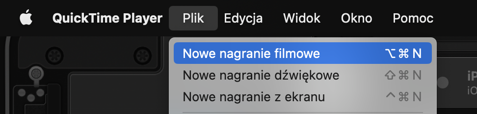
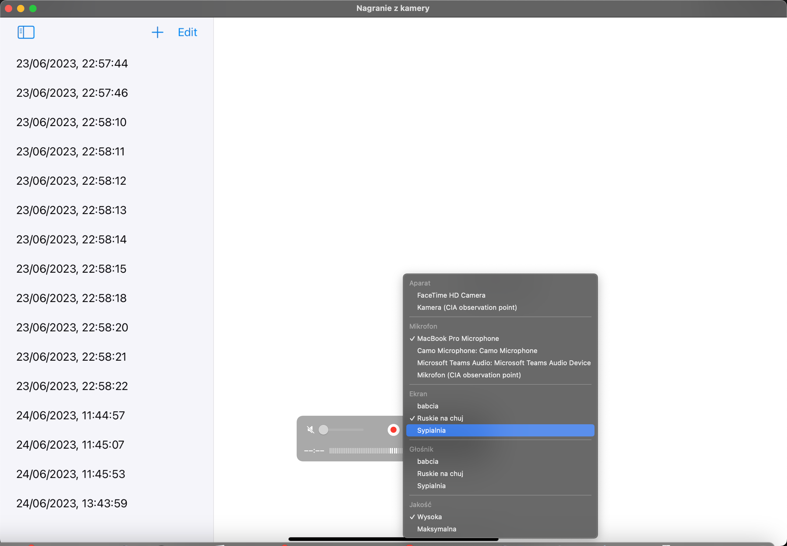
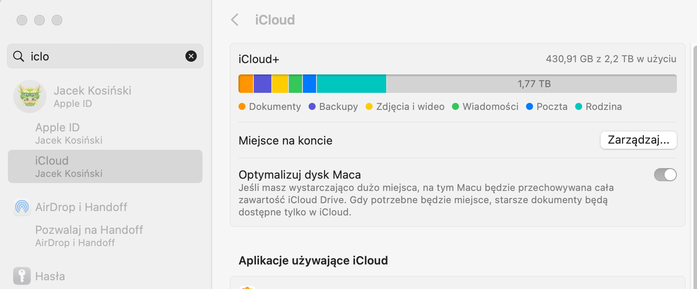
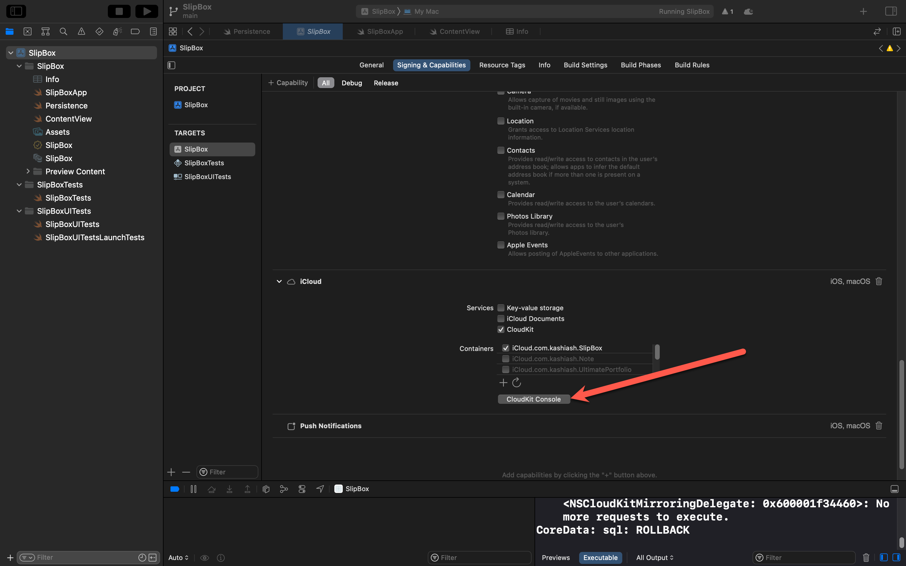
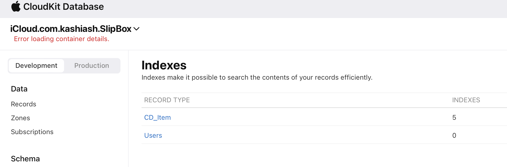
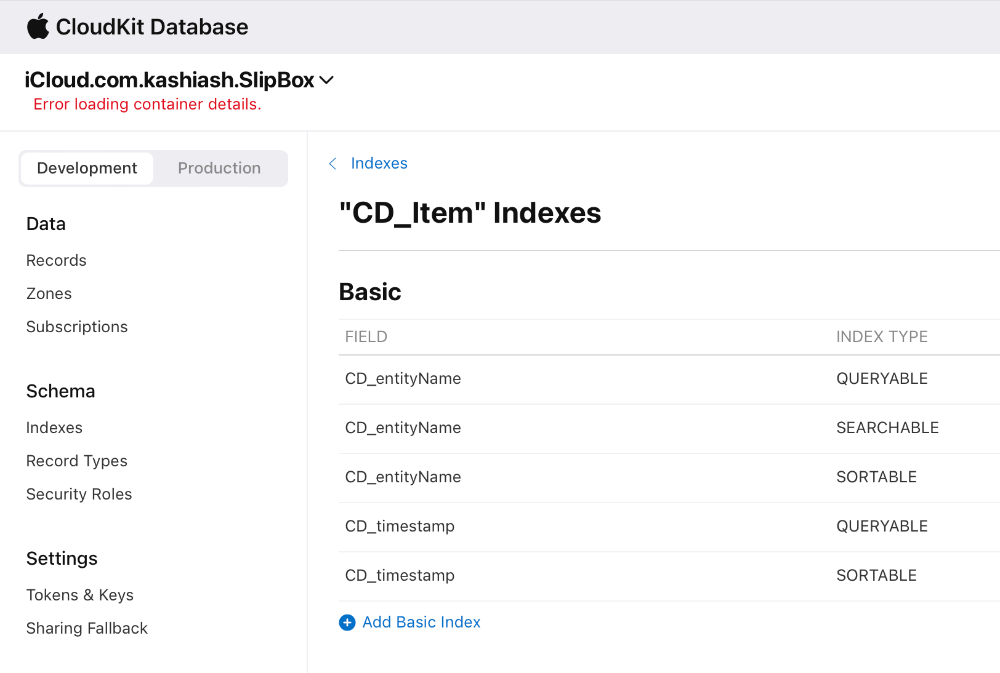
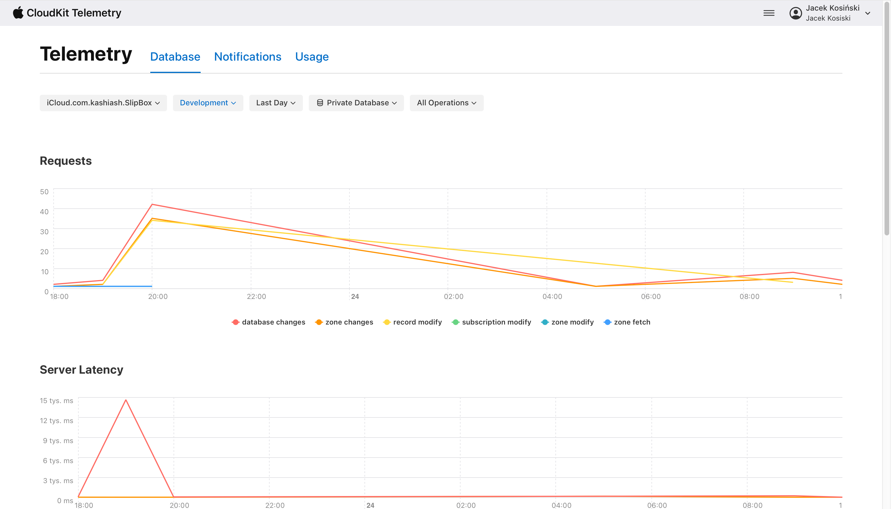
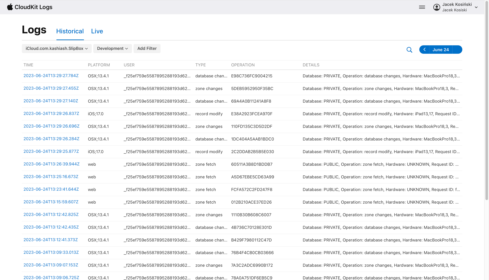

# Core Data + iCloud Sync


Teraz chcę porozmawiać o używaniu Core Data z synchronizacją iCloud. Muszę wprowadzić kilka zmian konfiguracyjnych. Chcę także pokazać Ci panel iCloud, gdzie znajdują się dane i jak działa ich przepływ. Porozmawiamy też trochę o problemach z synchronizacją iCloud. Większość z tych możliwości działa tylko dla płatnych kont deweloperów. Jeśli nie masz takiego konta i próbujesz dodać iCloud, to nie pojawi się ono. Muszę więc teraz przełączyć się na płatne konto dewelopera. W tym przypadku mam większą liczbę możliwości i mogę dodać iCloud. Teraz, pod sekcją iCloud, włączam CloudKit i musisz dodać kontener. Kontener mówi, jaki serwer chcesz użyć, jest to odpowiednik serwera i kontenera.


Muszę teraz przełączyć się na płatne konto dewelopera. W tym przypadku mam znacznie więcej możliwości i mogę dodać iCloud. Teraz, pod sekcją iCloud, włączam CloudKit i musisz dodać kontener. Kontener mówi, jaki serwer chcesz użyć, jest to odpowiednik serwera i kontenera. Ponieważ już mam tutaj kilka, po prostu wybieram jeden z nich. Możesz także dodać nowy kontener i musi on mieć nazwę. Określa, jaki rodzaj kontenera chcesz utworzyć. Zazwyczaj kopiujesz identyfikator pakietu, ponieważ jest on unikalny i ma sens, żeby identyfikator aplikacji i identyfikator serwera były ze sobą powiązane. Kopiujesz to, wracasz tutaj i w sekcji iCloud naciskasz przycisk "plus", a następnie dodajesz ten kontener. 


Mam już tak wiele kontenerów, że nie muszę tutaj klikać przycisku "odśwież". Po pewnym czasie powinno to działać i kontener zostanie utworzony na serwerze CloudKit. Dlatego dodano tutaj przycisk "Konsola CloudKit". Teraz przechodzimy do konsoli i wybieramy bazę danych CloudKit. 


U góry możesz wybrać różne kontenery. Na początku nie masz tutaj nic. Jeśli klikniesz na "indeksy", zobaczysz tylko jeden rodzaj rekordu, którym są użytkownicy. Teraz uruchamiamy naszą aplikację. Po prawidłowej konfiguracji dla CloudKit powinniśmy zobaczyć, że nasza definicja schematu lub modelu zostanie również zsynchronizowana z CloudKit. Powinniśmy to zobaczyć. Wracamy, aby zakończyć wszystkie konfiguracje. Razem z **CloudKit** dodane zostały również powiadomienia `push`. Dzieje się tak dlatego, że kiedy **CloudKit** łączy się z naszą bazą danych, musi przekazać wszystkie aktualizacje z serwera z powrotem do naszej aplikacji. Dlatego musimy mieć automatyczne tło, które będzie to robić w tle. Nie widzimy tego bezpośrednio; jest to kodowanie **CloudKit**. Muszę również komunikować się w tle, aby otrzymywać aktualizacje. 


Po synchronizacji muszę również dodać tryb pracy w tle. Teraz, dla tej sekcji, potrzebuję powiadomień zdalnych oraz przetwarzania w tle. Konkretnie dla systemu macOS, ponieważ ten cel dotyczy również macOS, muszę przejść do sekcji `Signing & Capabilities` (Podpisywanie i Możliwości) i zaznaczyć `Network incoming connections` (Przychodzące połączenia sieciowe). Domyślnie w systemie macOS nie jest dozwolone pobieranie ani przesyłanie danych do internetu, dlatego musimy to jasno zadeklarować. To wystarczy, aby to działało. 

​	Dodam jeszcze jeden klucz w pliku `Info.plist`, aby uniknąć problemów podczas wysyłania aplikacji do App Store. 


W pliku `Info.plist` muszę dodać kilka więcej kluczy. Jeden z nich to `NSUserActivityTypes`, który jest typu `Array`.  Muszę również mieć kilka wpisów, które są wolne. Rozwijam to miejsce i dodaję trzy elementy, które są typu `string`. To, co jest interesujące, to wartości, które tutaj wprowadzamy. Pierwsza to `com.apple.security.networked-on-server`, następna to `client` i `sendMessageIntent`. Dodane zostało również wprowadzenie dla wymaganych trybów pracy w tle, ale domyślnie są one dodawane, więc nie musisz ich również dodawać. Teraz wszystko jest w porządku z ustawieniami i możemy przejść do kontenera **CloudKit**.


Teraz musimy naprawdę mieć tutaj ten **CloudKit**, aby to działało. W inicjalizatorze, gdy to konfigurujemy, chcę dodać kilka rzeczy. Ponieważ powiedziałem, że musimy przesłać nasz schemat do **CloudKit**, muszę dodać niektóre opcje, aby to zrobić. W inicjalizatorze chcę dodać te opcje, ale nie wtedy, gdy używamy zapisu do pamieci. Kiedy używamy in memory, oznacza to, że jest to tymczasowe miejsce, które zostanie wyczyszczone przy kolejnym uruchomieniu, na które nie zwracam uwagi. Dlatego mogę również użyć `else`. Nie chcę również tego robić, gdy jestem w trybie debug. 

```swift
        if inMemory {
            container.persistentStoreDescriptions.first!.url = URL(fileURLWithPath: "/dev/null")
        } else {
            #if DEBUG
            setupSchemaSync()
            #endif
        }
```

Jest to opcja inicjalizacji schematu kontenera **CloudKit**. Następnie mogę wywołać `container.initialCloudKitSchema(options: myOptions)`. To może generować błąd, więc muszę użyć `try`, a następnie skorzystać z bloku `do-catch`, aby uzyskać wszystkie informacje.

```swift
    func setupSchemaSync() {
        let options = NSPersistentCloudKitContainerSchemaInitializationOptions()
        do {
            try container.initializeCloudKitSchema(options: options)
        } catch {
            print("cloudkit sync - schema error: \(error)")
        }
    }
```

Bardzo ważne jest użycie `catch`, ponieważ czasami mogą wystąpić niespodziewane problemy. 

Teraz, w trybie debug, mogę zobaczyć, że muszę przeprowadzić przesyłanie schematu. Skonfigurowałem wszystko dla mojego kontenera, wczytuję mój kontener i konfiguruję moje konteksty widoku w celu automatycznego scalania zmian z rodzica. Możesz również dodać inną politykę scalania. Używam `NSMergeByPropertyObjectTrumpMergePolicy`, więc to dotyczy zmian w pamięci lub w trybie `NSMergeByPropertyObjectTrumpMergePolicy`, który jest polityką bazową dla właściwości. Używam tylko pierwszej polityki.

   `container.viewContext.mergePolicy = NSMergeByPropertyObjectTrumpMergePolicy`

Teraz, gdy to uruchamiam, powinienem móc uruchomić to z synchronizacją **iCloud**. Spróbujmy na **MacOS**. Właśnie wyczyściłem moje dane wcześniej. Teraz, jeśli tutaj dodam kilka wpisów, pierwszą rzeczą, którą zobaczysz, jest to, że jest tu ogromny ruch w komunikacji pomiędzy bazą, aplikacją i cloudSync

```swift
CoreData: debug: CoreData+CloudKit: -[PFCloudKitThrottledNotificationObserver noteRecievedNotification:](49): <PFCloudKitThrottledNotificationObserver: 0x6000006d8840>: Got: NSApplicationWillBecomeActiveNotification - 0
CoreData: debug: CoreData+CloudKit: -[PFCloudKitThrottledNotificationObserver noteRecievedNotification:](49): <PFCloudKitThrottledNotificationObserver: 0x6000006d8840>: Got: NSApplicationDidBecomeActiveNotification - 1
CoreData: CloudKit: CoreData+CloudKit: -[PFCloudKitThrottledNotificationObserver noteRecievedNotification:](70): <PFCloudKitThrottledNotificationObserver: 0x6000006d8840> - Already scheduled a block to respond to 'NSApplicationDidBecomeActiveNotification', 2 notifications since.
CoreData: sql: BEGIN EXCLUSIVE
CoreData: sql: COMMIT
CoreData: sql: BEGIN EXCLUSIVE
CoreData: sql: INSERT INTO ZITEM(Z_PK, Z_ENT, Z_OPT, ZTIMESTAMP) VALUES(?, ?, ?, ?)
CoreData: sql: INSERT OR IGNORE INTO ATRANSACTIONSTRING(Z_PK, Z_ENT, Z_OPT, ZNAME) VALUES(?, ?, ?, ?)
CoreData: sql: SELECT Z_PK FROM ATRANSACTIONSTRING WHERE ZNAME = ?
CoreData: sql: INSERT OR IGNORE INTO ATRANSACTIONSTRING(Z_PK, Z_ENT, Z_OPT, ZNAME) VALUES(?, ?, ?, ?)
CoreData: sql: SELECT Z_PK FROM ATRANSACTIONSTRING WHERE ZNAME = ?
CoreData: sql: INSERT INTO ATRANSACTION(Z_PK, Z_ENT, Z_OPT, ZAUTHORTS, ZBUNDLEIDTS, ZCONTEXTNAMETS, ZPROCESSIDTS, ZAUTHOR, ZBUNDLEID, ZCONTEXTNAME, ZPROCESSID, ZQUERYGEN, ZTIMESTAMP) VALUES(?, ?, ?, ?, ?, ?, ?, ?, ?, ?, ?, ?, ?)
CoreData: sql: INSERT INTO ACHANGE(Z_PK, Z_ENT, Z_OPT, ZTRANSACTIONID, ZCHANGETYPE, ZCOLUMNS, ZENTITY, ZENTITYPK) VALUES(?, ?, ?, ?, ?, ?, ?, ?)
CoreData: sql: COMMIT
CoreData: sql: BEGIN TRANSACTION
CoreData: annotation: connection 0x15a108190 created snapshot:
	ss {length = 48, bytes = 0x18e22d00 00000000 c0030000 01000010 ... 2ffb68f3 ed565942 } value: 
	pointer value:{length = 8, bytes = 0xe0a56b0000600000}
	pointer: 0x6000006ba5e0
CoreData: sql: BEGIN TRANSACTION
CoreData: annotation: connection 0x158e06350 adopting snapshot:
	ss value: {length = 48, bytes = 0x18e22d00 00000000 c0030000 01000010 ... 2ffb68f3 ed565942 }
	pointer value:_PFSQLiteSnapshotWrapper (0x6000008e5600) : {length = 48, bytes = 0x18e22d00 00000000 c0030000 01000010 ... 2ffb68f3 ed565942 }
	pointer: 0x6000006ba5e0
...
//wycialem kilkaset linii kodu , ktore mozesz` zobaczyc u siebie w oknie executable
...
CoreData: CloudKit: CoreData+CloudKit: -[NSCloudKitMirroringDelegate checkAndExecuteNextRequest](3328): <NSCloudKitMirroringDelegate: 0x6000031a8700>: Checking for pending requests.
CoreData: sql: ROLLBACK
CoreData: CloudKit: CoreData+CloudKit: -[NSCloudKitMirroringDelegate checkAndExecuteNextRequest]_block_invoke(3344): <NSCloudKitMirroringDelegate: 0x6000031a8700>: No more requests to execute.

```

I ostatnia wiadomość mówi, że nie ma już żądania do wykonania, ponieważ aktualizowano dane i wysyłano je. Możesz spróbować jeszcze raz. Tak, zawsze próbuje, zawsze komunikuje się z **CloudKit**. Dodajmy jeszcze jeden wpis. Widzisz, że tutaj mamy zmienione pola. Mamy tutaj nowy rekord. 

Ponieważ chcę to zobaczyć w pełni, połączę się teraz. Muszę uruchomić to na dwóch urządzeniach, więc zobaczymy, czy wszystko się synchronizuje. Nie możesz używać symulatora, ponieważ to nie działa z **iCloud** - *poprawka, działa ale na symulatorze musisz sie logowac na swoje konto*. Będę używał iPada w jednej ręce i Maca w drugiej. Możesz również użyć telefonu. 

Przy okazji jak nagrac obraz z Iphone, iPada lub Apple TV na Macu:

- uruchamiamy QuickTimePlayer
- w meny File/New movie recording




- po pojawieniu sie obrazu z kamery na przycisku record wybierz urządzenie źródłowe 




I zajęło to kilka sekund, żeby zaktualizować wszystko, ale teraz także dostałem wszystkie wpisy dla mojego Maca. Zatrzymam to i uruchamiam na moim Macu. Teraz mogę otworzyć to ponownie na moim iPadzie. I widzisz, oba są tutaj. Na przykład na tym jest mój Mac mogę dodać jeden wpis. I pojawia się tutaj na moim iPadzie. Mogę też przesunąć w lewo, żeby usunąć i usunąć ten wpis produktu. Więc ten tutaj, a potem także na moim Macu zniknął. Widzisz, że jest opóźnienie jednej sekundy między tymi aktualizacjami, to dlatego, że wszystko musi zostać przesłane, musi to być przetworzone na serwerze i potem wrócić.

https://www.youtube.com/watch?v=SsMz5RFgyK8

i pojawia się tutaj na moim iPadzie. Mogę również przesunąć w lewo, aby usunąć ten wpis produktu. Więc ten tutaj, a potem także na moim Macu zniknął. Widzisz, że jest opóźnienie jednej sekundy między tymi aktualizacjami, to dlatego, że wszystko musi zostać przesłane, musi to być przetworzone na serwerze, a potem wrócić na moje inne urządzenie, ale działa to dość szybko. Okej. Więc to działa, mam moją synchronizację tutaj. Jednym typowym błędem jest to, że twoje miejsce w **iCloud** jest pełne. Możesz zobaczyć tutaj, że przekroczyłeś dostępne dane. 



 Jeśli już wykorzystałeś wszystkie pięć gigabajtów, które są dostępne za darmo, i myślisz o swojej własnej aplikacji, to również nie będzie działać, ponieważ nie ma danych na serwerze dla twojej aplikacji. Bądź tego świadomy. Następnie chcę sprawdzić **CloudKit Dashboard**. 

Tak więc to były te ustawienia tutaj, kiedy jesteś już w konsoli.



Dalej wchodzimy w CloudKitDatabase. Teraz, jeśli spojrzę w sekcję Indexes, widać, że mam element z nazwą CD_Item:.



Dalej:




 To są nazywane pola koordynatora w **CloudKit**. Niektóre z nich są dodane dla nas, takie jak nazwa jednostki, a niektóre inne, które dodaliśmy we własnym schemacie, takie jak znacznik czasowy. Właściwie, to były domyślne wartości. Więc jeśli przejdę tutaj do schematu, mam ten element jednostki z tym atrybutem znacznika czasowego o typie daty. Dokładnie to dodano tutaj. To jest znacznik czasowy. Dla każdego z tych atrybutów lub jednostek, widzisz również, że dla elementu dodano CD. To jest Core Data, to jest w zasadzie **CloudKit**, które mówi: "Dodajemy kolejny poziom abstrakcji". Więc **CloudKit** mówi, że to są jednostki, które mapujemy z **Core Data** do **CloudKit**. To są dane, które właśnie przesłałem. I mamy wiele instancji naszego kontenera lub serwera. Zazwyczaj mamy wersję developerską, taką jak ta, którą wybrałem tutaj, i wersję produkcyjną. To jest schemat przeznaczony do użytku produkcyjnego. Możesz dodawać i modyfikować, ale nie możesz usuwać typów rekordów w środowisku produkcyjnym. Musisz uważać, co dodajesz do schematu dla środowiska produkcyjnego, ponieważ nie możesz łatwo tego później zmienić. To jest znacznie bardziej ograniczone niż to, co można zrobić z **Core Data**. Zawsze możesz dodawać nowe atrybuty, to nie jest problem, ale zmienianie nazw, na przykład, nie sądzę, żeby to działało. I jest to prawdopodobnie zbyt ryzykowne. Jeśli teraz spojrzysz na środowisko produkcyjne, pod NDC Schema jest tutaj tylko sekcja dla użytkowników. To dlatego, że gdy chcę opracować mój schemat, po prostu chcę testować rzeczy. Dodaję kilka rekordów i może zmienię zdanie i chcę z tych zmian zrezygnować. Jeśli zmienisz zdanie i chcesz wrócić, jest tutaj inna sekcja mówiąca "Ustawiamy środowisko".

To spowoduje zresetowanie wszystkich Twoich rekordów. To właśnie zrobiłem wcześniej. Jeśli to zrobisz, trwale usuniesz wszystkie informacje. Oznacza to usunięcie środowisk produkcyjnych, które mam teraz. Nie dotyczy to użytkowników. Jeśli więc zmienisz zdanie i chcesz po prostu pozbyć się wszystkiego i zacząć od nowa, tak naprawdę nie możesz. Kiedy zresetujesz swoje środowisko, zresetuje ono środowisko produkcyjne. Używa wersji środowiska produkcyjnego, więc zawsze możesz wrócić do oryginalnego, ponieważ nie możesz się cofnąć dalej niż do środowiska produkcyjnego. Gdy jesteś zadowolony z tego, co zrobiłeś ze swoim schematem w środowisku developerskim i chcesz go przenieść do środowiska produkcyjnego, musisz przejść tutaj pod "Wdrożenie zmian schematu". Tutaj zostanie ci powiedziane, co dokładnie zmieniłeś. Na przykład, utworzyłem tutaj znaczniki czasu. Niektóre z nich nie dodaliśmy, takie jak znacznik czasu utworzenia i znacznik czasu modyfikacji. To tylko dla **CloudKit**, aby obsługiwał rzeczy. Również indeksy. Jeśli jesteś pewny tych ustawień tzn spełniaja twoje wymogi, możesz dotknąć tutaj przycisku "Wdroż". I wtedy przeniesie to. Nie chcę tego robić, ponieważ tak naprawdę nie chcę zachować moich elementów, ponieważ wkrótce je usuniemy.


### Telemetria




### Logs

 Następnie możesz przejść do dzienników. Na przykład przetestowaliśmy naszą aplikację na różnych urządzeniach. Jeśli masz tylko jedno urządzenie, możesz użyć tego tutaj w środowisku developerskim. To jest aplikacja. To jest środowisko, a następnie chcesz zobaczyć wszystkie dzienniki w ciągu ostatnich 30 sekund i ostatniej godziny.



 Jeśli chcesz zobaczyć rzeczy na żywo, możesz wybrać historię. Na przykład ostatnią minutę, ostatnie siedem dni. Możesz także przejść na tryb na żywo i zacząć przesyłać teraz. Muszę po prostu dotknąć czegoś na moim iPadzie lub dodać coś. Mam nadzieję, że to coś robi. Dobrze, teraz to przyszło. Dobrze, musiałem to powiększyć. Oto informacja, że rekord został zmodyfikowany. A potem możesz dotknąć i zobaczyć więcej. To jest interesujące, abyś zobaczył, że jesteś naprawdę połączony. Dobrze. Zatrzymaj przesyłanie strumieniowe. Wszystkie te badania związane z tym, jak działa Twoja aplikacja, są ważne, ale ponieważ jesteśmy tutaj w środowisku developerskim, mam nadmiar dostępu. Ale co się dzieje, gdy jesteś użytkownikiem i chcesz wiedzieć, czy wszystko działa tak, jak powinno, albo czy przekroczono limit? Jeśli wykorzystasz wszystkie pięć gigabajtów, jak uzyskać tę informację? To jest nieco trudniejsze, a najlepsze, co znalazłem, to skorzystanie z centrum powiadomień dla zdarzeń **CloudKit**. 

W kontrolerze Persistence.swift dodajemy obsługe zdarzeń i błędów związanych z zyssnchronizają:

```swift
    func checkSyncStatus() {
        NotificationCenter.default.publisher(for: NSPersistentCloudKitContainer.eventChangedNotification)
            .sink { notification in
            guard let event = notification.userInfo?[NSPersistentCloudKitContainer.eventNotificationUserInfoKey] as?
                    NSPersistentCloudKitContainer.Event else { return }
                if event.endDate == nil {
                    print("cludkit event start")
                } else {
                    switch event.type {
                    case .setup: print("cloudkit event - setup finished")
                    case .import: print("cloudkit event - import finished")
                    case .export: print("cloudkit event - export finished")
                    }
                }

        }
        .store(in: &subscriptions)
    }
```

Więc to jest w centrum powiadomień domyślnych, a tutaj używam wydawcy, ponieważ chcę, aby to było łatwiejsze, ponieważ ja

Więc jest to w centrum powiadomień. Domyślnie korzystam z Combine publisher -> sink, czyli miejsca gdzie obsluże informację o zdarzeniu.

Weryfikacja składni krzyczy, ze nie zna ni c o sink czy publisher, trzeba uzyc bibliotek Combine i CloudKit.

Następnie muszę utworzyć `VAR subscriptions`. To jest trzeci typ `AnyCancellable`. Teraz mogę to przechowywać w moich subskrypcjach. Więc ten strumień danych jest utrzymany tak długo, jak długo kontroler trwałego jest żywy. I narzeka, że niezmienna sama w sobie. Więc jeśli mógłbyś, ponieważ to jest struktura. Więc mogę zrobić z tego funkcję mutującą. Ale myślę, że lepiej byłoby to mieć jako klasę. Lepiej działa z wzorcem Singleton.

```swift

import CoreData
import Combine
import CloudKit

class PersistenceController {
...
    var subscriptions = Set<AnyCancellable>()
...
```

Więc mamy powiadomienie i mogę sprawdzić informacje. i informacje użytkownika, ma problemy i jakiekolwiek. Klucz, więc pierwszy, którego szukam, nazywa się `persistent cloudkit container event notification user info`. Dobrze, po prostu wprowadzam to, nie musisz tego zapamiętywać, raz masz ten kod, możesz go oczywiście używać. Więc to jest pozycja `cloudkit container event notification user info key`. Więc to mi teraz nie daje wartości dla tego klucza, który jest typem `Any`. Nie lubię tego, muszę to rzutować, dlatego rzucam to na coś, co ma. 

Mogę faktycznie zrobić coś, co jest bardziej, co jest typem zdarzenia. Więc jest to `persistent Cloudkit container event`. Więc użyjmy wyrażenia `guard`. Ponieważ mam tutaj kilka opcjonalnych. Więc `guard let event`. Inaczej, po prostu wracam, bo nie wiem, jeśli nie mam tego klucza. Nie naprawdę wiem, co to jest. 

Teraz mamy zdarzenie do sprawdzenia. Na przykład ma typ błędu i datę. Na przykład mamy datę rozpoczęcia i zakończenia. Jeśli nie masz daty końca, to znaczy, że coś zdarzyło. Procesowanie tego zdarzenia. Coś właśnie się zaczęło. Jak przesyłanie nowej jednostki i nie nowe wprowadzenie do naszej bazy danych. Więc możemy po prostu powiedzieć. jeśli zdarzenia i data są nowe. Wtedy coś się zaczęło. Więc po prostu tu używam wyrażeń `Cloud Print`. zdarzenie start else Wiemy, że skończyło, więc teraz mogę użyć innych rzeczy, takich jak zdarzenia. Typ. To jest wyliczenie. Więc po prostu używam `switch`. I patrzymy na przypadki konfiguracji. 

Oznacza to, że cloudkit sink skończył konfigurować. Konfiguracja zakończona. To powinno zdarzyć się tylko raz, gdy uruchamiamy naszą aplikację. Następnie mamy import. import event export jest to z punktu widzenia naszej aplikacji wysyłanie nowych zdarzeń, danych X i właściwie co się dzieje, skończyliśmy eksport. Więc mogę to po prostu przemianować na zakończone. Aby było to trochę łatwiejsze na później, gdy widzę moje instrukcje drukowania. i zmuszają cię do użycia domyślnego, więc to jest cloudkit dodał nowy typ zdarzenia. Nie zamierzam zawiesić mojej aplikacji tylko dlatego, że kalkulator coś zmienił. 

Dobrze, możemy też spojrzeć na zdarzenie. Sukces to jest ciekawe, ponieważ jeśli się powiodło, wszystko jest chyba w porządku. Więc jeśli to zdarzenie miało miejsce, zakończenie konfiguracji było udane, powinieneś to zobaczyć tutaj. zakończone nie jest to sukces, co oznacza, że jeśli to nie sukces, chcemy wiedzieć więcej. I dlatego powinniśmy spojrzeć na błąd. Więc jeśli mam błąd, chcę wydrukować ten błąd zdarzenia. Jest to błąd typu. Więc to i chcę dostać więcej informacji jak kody błędów i do tego muszę rzutować jako `CK record CK` oznacza `cloudkit` `cloudkit` błąd. Więc jeśli mamy błąd jako `CK error`. Możemy wtedy. Wydrukuj ten błąd. tutaj ma zlokalizowany opis, który mogę używać do debugowania, ponieważ jest czytelny dla użytkownika. Najlepszą rzeczą jest jednak używanie tych kodów błędów. Jest to typ wyliczenia. na przykład. 

Więc przekroczyłeś limit, proszę zwolnić. trochę miejsca na iCloud to będzie coś, co możesz potem zrobić, to dla każdego z tych przypadków możesz stworzyć wiadomość dla swojego użytkownika którą mu pokażesz.

 poniżej możliwa lista błędów ;)

```swift
                        case .internalError:
                            <#code#>
                        case .partialFailure:
                            <#code#>
                        case .networkUnavailable:
                            <#code#>
                        case .networkFailure:
                            <#code#>
                        case .badContainer:
                            <#code#>
                        case .serviceUnavailable:
                            <#code#>
                        case .requestRateLimited:
                            <#code#>
                        case .missingEntitlement:
                            <#code#>
                        case .notAuthenticated:
                            <#code#>
                        case .permissionFailure:
                            <#code#>
                        case .unknownItem:
                            <#code#>
                        case .invalidArguments:
                            <#code#>
                        case .resultsTruncated:
                            <#code#>
                        case .serverRecordChanged:
                            <#code#>
                        case .serverRejectedRequest:
                            <#code#>
                        case .assetFileNotFound:
                            <#code#>
                        case .assetFileModified:
                            <#code#>
                        case .incompatibleVersion:
                            <#code#>
                        case .constraintViolation:
                            <#code#>
                        case .operationCancelled:
                            <#code#>
                        case .changeTokenExpired:
                            <#code#>
                        case .batchRequestFailed:
                            <#code#>
                        case .zoneBusy:
                            <#code#>
                        case .badDatabase:
                            <#code#>
                        case .zoneNotFound:
                            <#code#>
                        case .limitExceeded:
                            <#code#>
                        case .userDeletedZone:
                            <#code#>
                        case .tooManyParticipants:
                            <#code#>
                        case .alreadyShared:
                            <#code#>
                        case .referenceViolation:
                            <#code#>
                        case .managedAccountRestricted:
                            <#code#>
                        case .participantMayNeedVerification:
                            <#code#>
                        case .serverResponseLost:
                            <#code#>
                        case .assetNotAvailable:
                            <#code#>
                        case .accountTemporarilyUnavailable:
                            <#code#>
```

my obsłużymy przykładowo jeden:

```swift
 func checkSyncStatus() {
        NotificationCenter.default.publisher(for: NSPersistentCloudKitContainer.eventChangedNotification)
            .sink { notification in
            guard let event = notification.userInfo?[NSPersistentCloudKitContainer.eventNotificationUserInfoKey] as?
                    NSPersistentCloudKitContainer.Event else { return }
                if event.endDate == nil {
                    print("cludkit event start")
                } else {
                    switch event.type {
                    case .setup: print("cloudkit event - setup finished")
                    case .import: print("cloudkit event - import finished")
                    case .export: print("cloudkit event - export finished")
                    @unknown default:
                       print("cloud kit event - add new type")
                    }
                    if event.succeeded {
                        print("cloudkit event - succesed")
                    } else {
                        print("cloudkit event - not succesed")
                    }
                    if let error = event.error as? CKError {
                        print("cloudkit event - error \(error.localizedDescription)")
                        switch error.code {
                        case .quotaExceeded: print("quota exceeded, please free up some space on iCloud")
                          // ... another errors to describe
                        @unknown default:
                            print("Ask chat gpt what happens")
                        }
                    }
                }
        }
        .store(in: &subscriptions)
    }
```

 Jak przejść od mojego kontrolera trwałego do mojego UI? Możesz tutaj stworzyć właściwość, to dlatego, że to jest Swift UI. Muszę zrobić `ObservableObject` a potem mogę użyć `@Published var syncErrorMessage: String? = nil`

```swift
class PersistenceController : ObservableObject {
    static let shared = PersistenceController()

    let container: NSPersistentCloudKitContainer
    var subscriptions = Set<AnyCancellable>()

    @Published var syncErrorMessage: String? = nil
```

 Możesz ustawić tę wiadomość podczas obslugi błędu: 

```swift
... 
print("cloudkit event - error \(error.localizedDescription)")
switch error.code {
  case .quotaExceeded:
       self.syncErrorMessage  = "quota exceeded, please free up some space on iCloud"
       print("quota exceeded, please free up some space on iCloud")
  @unknown default:
       print("Ask chat gpt what happens")
  ...
```

Dla wszystkich tych. Nie wiem, 30 przypadków. I ta własność może mieć nadmiar ustawień widoku dla twojego ubrania Cloud kit think a potem pokaż do użycia. Działa to całkiem nieźle, Dostarcza uzytkownikowi konkretną informacje, wstecznie robi wielką różnicę w jakości aplikacji. 

Nie chcę dodawać wszystkich innych przypadków. Po prostu  zostawiamy to jedno wydarzenie Cloud kit. 

 Stworzyłem tutaj moją funkcję sprawdzającą status `checkSyncStatus`. Ale nigdy jej faktycznie nie użyłem. Dodajmy ją w konstruktorze na końcu:

```swift
    init(inMemory: Bool = false) {
        container = NSPersistentCloudKitContainer(name: "SlipBox")
        if inMemory {
            container.persistentStoreDescriptions.first!.url = URL(fileURLWithPath: "/dev/null")
        } else {
            #if DEBUG
            setupSchemaSync()
            #endif
        }
        container.loadPersistentStores(completionHandler: { (storeDescription, error) in
            if let error = error as NSError? {
                fatalError("Unresolved error \(error), \(error.userInfo)")
            }
        })
        container.viewContext.automaticallyMergesChangesFromParent = true
        container.viewContext.mergePolicy = NSMergeByPropertyObjectTrumpMergePolicy
        checkSyncStatus()
    }
```


Musiałem tutaj wprowadzić wiele funkcji dotyczących zdalnych powiadomień i mojego kontenera w chmurze. Najważniejsze jest skonfigurowanie kontenera w chmurze. Możesz to zrobić z poziomu konsoli. Jeśli chcesz to zrobić na produkcji, musisz przejść do bazy danych. Następnie użyj swojego schematu wdrożenia. Jeśli chcesz przetestować środowisko produkcyjne, powinienem również to wspomnieć.

Gdy testowaliśmy lokalnie, robiliśmy to tylko dla środowiska developerskiego. Jeśli chcesz sprawdzić, czy wszystko jest prawidłowo skonfigurowane na serwerze produkcyjnym, musisz skorzystać z budowy testowej. Więc musisz to przesłać do App Store Connect i tam stworzyć test, prawda?

Zdecydowanie powinieneś to zrobić, aby uzyskać pełne doświadczenie z testowania. Jeśli nie jesteś zadowolony, możesz również zresetować swoje środowisko. Powinniśmy to zrobić, jeśli mamy jakieś elementy. Muszę to zrobić wkrótce, gdy zmienimy nasze dane.

Więc usunąłem mój typ elementu, którego właściwie nie chciałem. Potem musiałem zrobić pewną konfigurację w kontrolerze trwałości. Tak jak tutaj, ta część, gdzie naprawdę wysłałem cały schemat. Przesłałem niektóre z schematów, ale nie wszystko. To jest zalecane.

Potem dodałem trochę więcej polityk scalania, ponieważ teraz musimy scalić wersję serwerową naszych danych z lokalnymi. Więc musi wiedzieć, jak łączyć rzeczy.

I rozmawiałem trochę o tym, jak wiedzieć, czy wszystko idzie dobrze. Z tymi powiadomieniami mamy też coś do pokazania użytkownikowi. Co jest bardzo wygodne. To jest krótkie podsumowanie wszystkich rzeczy związanych z czystą chmurą, o których powinieneś pamiętać.

Zamierzam później zrobić trochę więcej. Część tych informacji była dla mnie dość trudna do znalezienia, mieliśmy wiele problemów z przesyłaniem i faktycznym publikowaniem aplikacji. Mam nadzieję, że te zebrane informacje pomogą ci zaoszczędzić trochę czasu i uniknąć problemów.
