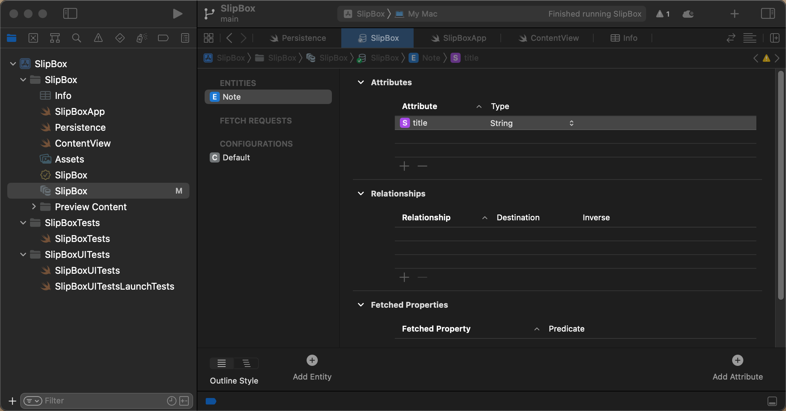

## Model notatek + CRUD

Zaczynamy od zmiany schematu . Tworzymy naszą główna tabele Note - encję z atrybutami, wykorzystując nasze nowe dane i widoki interfejsu Swift UI. Dla tego potrzebne nam będą operacje CRUD - tworzenie nowych obiektów w Core Data, odczytywanie obiektów z bazy danych, aktualizowanie ich, manipulowanie danymi i usuwanie. 

Sprawdźmy, co już tam jest. W pliku `slipboxProject.xcdatamodel` mamy jedną encję - `item`. Nie chcemy tego używać. Klikamy `Tab`, a następnie usuwamy - teraz to zniknęło. Musimy utworzyć nowe. 

Na dole mamy przycisk `Add Entity`. Po dwukrotnym kliknięciu zmieniamy jego nazwę na `Note`. 



Wybrana jest ta encja. Mogę również dodać atrybuty, takie jak tytuł mojej notatki, a następnie muszę zdefiniować typ. Jeśli nie zdefiniujesz typu, otrzymasz błąd. Wybieram typ "string" dla tytułu. W bocznym panelu mamy więcej informacji. Mamy tutaj tytuł, więc możesz również nadać mu nazwę i typ "Optional". Jest to opcjonalne dla bazy danych. Możesz również ustawić wartość domyślną, ale na razie nie będziemy z tego korzystać. Dodam więcej atrybutów. Drugi to "creation date", typu "date". Oba atrybuty są opcjonalne. 


Muszę otworzyć ponownie boczny panel. Jeśli klikniesz na encję w bocznym panelu, wyświetli się nazwa encji nadrzędnej. Nie mam nic. To jest klasa Note. Encje w Core Data zawsze są klasami. Program Xcode generuje pliki dla nas, możesz to zmienić na "manual", i smaodzielnie napisać te klasy, ale to jest skomplikowane i w tym przypadku nie ma sensu. Lepiej pozwolić Xcode zadbać o te rzeczy. Możemy spojrzeć na to, co generuje, jak tylko pozbędziemy się wszystkich błędów w kodzie wynikłych ze zmiany Item na Note.

 Problem dotyczy pliku "PersistentFile", dodajemy tu pozycje Item, ktorych już nie mamy wiec zamieniamy je na Notę. W procedurze generujacej dane do podglądu dodajemy kilka domyślnych elementów do kontekstu. To jest pierwsza operacja CRUD, czyli jak tworzyć instancję obiektu koordynatora bazy danych. Widzisz, jak tworzyć obiekt "item" i Core Data musi mieć kontekst, który mówi, że ten obiekt należy do tej bazy danych. To jest również bardzo przydatne, ponieważ można zapytać obiekt o jego zarządzany kontekst obiektu, a każdy z moich obiektów otrzymuje ten sam inicjalizator z kontekstem. Możesz uruchomić cały projekt, dzieki temu zostanie przebudowany, ponieważ czasami nie aktualizuje się poprawnie po zmianach modelu. Możesz również wyczyścić folder z plikami tymczasowymi (wybeirając w menu Product/Clean Build Folder), ponieważ zmieniłem zbyt wiele rzeczy. Teraz działa, nie ma żadnych błędów. 

`**let** newNote = Note(context: viewContext)`

To jest najprostszy sposób tworzenia nowego obiektu, używając konstruktora  z kontekstem. Gdy już masz obiekt, możesz go modyfikować lub aktualizować jego właściwości. Na przykład, mogę tutaj ustawić tytuł lub datę utworzenia. Często tworzymy obiekt a potem ustawiamy wszystkie jego cechy. Zamiast tego możesz napisać domyslny konstryktor i w nim ustawić wartości domyślne dla niektórych właściwości, na przykład dla tej daty. W dalszejh cześci kody takich kostruktorów uzywa sie wygodniej zamiast kazdorezowego twoerznie aobiektu i wpisywania do niego wartości. Ale gdzie powinienem umieścić mój wygodny konstruktor? Nie stworzyłem klasy "notes" samodzielnie. Możesz sprawdzić, skacząc do definicji "note". 


Plik "Note+CoreDataClass" został wygenerowany automatycznie i nie powinien być edytowany. Możesz sprawdzić ten plik, ale nie umieszczaj w nim kodu bezpośrednio, ponieważ nie jest zarządzany przez nas. To samo dotyczy własciwości creationDate 

```swift
extension Note {

    @nonobjc public class func fetchRequest() -> NSFetchRequest<Note> {
        return NSFetchRequest<Note>(entityName: "Note")
    }

    @NSManaged public var creationDate: Date?
    @NSManaged public var title: String?

}

extension Note : Identifiable {

}
```

 Widzisz tutaj niektóre rzeczy, które zostały wygenerowane. Jest to dodane w rozszerzeniu "notes", ponieważ jest to klasa i można łatwo dodać do rozszerzenia. I mają oznaczony, że jest `@NSManaged`, ponieważ jest częścią aktualizacji dla Core Data. Widzisz tutaj moje dwie właściwości i funkcję, którą również chcemy użyć, czyli `fetchRequest`. To sposób odczytywania danych i interesujące jest to, że "note" jest `Identifiable`. Dodano kilka wygodnych funkcji. Ale jak widzisz, są to automatycznie generowane pliki. Nie chcę ich dotykać, ale chcę dodać coś do "note" w rozszerzeniu.


 *i na szczęście dzięki protokołowi `Identifiable` dodano dla nas kilka przydatnych rzeczy. Ale jak widzisz, są to pliki generowane automatycznie, które nie chcę dotykać, ale wciąż chcę dodać kilka rzeczy do obiektu "note" w rozszerzeniu. Tworzę nową grupę, ponieważ jest to również dla innych modeli, dla innych encji. Więc to jest model, a tutaj tworzę plik Swift. To jest plik Swift, ponieważ jest to plik modelu. Nie ma to nic wspólnego z interfejsem użytkownika. Czyli nie jest to Swift UI. To zwykle zaczyna się od rozszerzenia "node". Plus tutaj po prostu importujemy Core Data, ponieważ będziemy dużo z nim robić. Teraz w końcu mogę napisać wszystkie moje wygodne pomocne rzeczy. Dodaję rozszerzenie dla "note" w rozszerzeniach. Możesz tam umieszczać funkcje, ale możesz też deklarować właściwości, co jest w porządku, ponieważ moje właściwości znajdują się w modelu danych Core Data. Można tu umieszczać właściwości obliczeniowe, co również zrobimy w odpowiednim momencie. Teraz chcę zacząć od napisania własnego wygodnego inicjalizatora. `convenience init`, co chciałem zrobić, to `title: String`, ponieważ obiekty koordynatora są klasami, musimy używać inicjalizatorów klasowych. W tym przypadku musisz wywołać dedykowany inicjalizator tej klasy z wygodnego inicjalizatora. Jest to `self.init(context:)`, a to jest ten, którego właśnie użyłem, co oznacza, że tworzymy tu obiekt, więc potrzebujemy tego kontekstu. Skopiuj to i dodaj do mojego inicjalizatora. Teraz mogę tutaj wywołać to samo. I ponieważ to rozszerzenie, mogę ustawić wszystkie moje właściwości, takie jak tytuł na ten tytuł i datę utworzenia na nową datę. Teraz moja data utworzenia będzie zawsze ustawiona. Jeśli na przykład znajdujesz się w sytuacji, w której nie używasz tego wygodnego inicjalizatora, ale nadal chcesz zawsze ustawić datę utworzenia, jest jeszcze jedno fajne rozwiązanie. Można to zrobić, nadpisując `awakeFromInsert`, ponieważ jest to wywoływane za każdym razem. Ustawienie daty utworzenia tutaj też ma sens. 

Tworzymy nową grupę o nazwie Model i nowy plik Note+Helper.swift, w którym dodamy rozszerzenie dla klasy `Note`

```swift
import Foundation
import CoreData

extension Note {

    convenience init (title: String, context:NSManagedObjectContext) {
        self.init(context: context)
        self.title = title
    }
    public override func awakeFromInsert() {
        self.creationDate = Date()
    }
}
```


W pliku "Persistent" możemy teraz korzystać z tego wygodnego inicjalizatora. Możemy korzystać z właściwości "title" i "notes", na przykład w kontekście indeksu, jeśli chcemy zobaczyć różne daty utworzenia. Możemy również zmienić datę utworzenia, przydatną w tej formie w trybie podglądu:

```swift
            let newNote = Note(title: "new note \(index)",context: viewContext)
            newNote.creationDate = Date() + TimeInterval(index)
```

Stworzyliśmy własną encję, dodaliśmy do niej atrybuty. Teraz musimy skompilować ten projekt, żeby sprawdzić czy wszystko działa. 

Teraz możemy iść do naszego `ContentView`. Poprawiamy błędy zamieniając Item na Note i odpowiednie kolumny. 

Teraz, co muszę tutaj faktycznie zmienić? Po pierwsze, typ, który pobieram, to nie jest element (`Item`), ale notatka (`Note`). Oznacza to, że nazwa mojego portfolio to "notes". Teraz tutaj, sposób sortowania, nie sortuję po kluczu (`key path`), ale po węzłach (`notes`). Możesz również sortować to po dacie (`creation date`). Dobrze. Pokrótce uporządkujmy to, co mamy tutaj. Teraz na liście używam `notes`. Dla każdego obiektu pokazuję notatkę (`note`) i datę utworzenia (`creation date`) węzła. Przed każdym `ForEach` wymaga, aby typ był identyfikowalny (`identifiable`). To jest już domyślnie dodane dla wszystkich naszych obiektów przez CoreData. ID, którego używa, to identyfikator obiektu (`object identifier`) notatki, który jest typu `NSManagedObjectID`. 

Wszystko mamy w Note+CoreDataProperties.swift:

```swift
//  This file was automatically generated and should not be edited.
extension Note {
    @nonobjc public class func fetchRequest() -> NSFetchRequest<Note> {
        return NSFetchRequest<Note>(entityName: "Note")
    }
    @NSManaged public var creationDate: Date?
    @NSManaged public var title_: String?
}
extension Note : Identifiable {
}
```

Może to być przydatne, jeśli chcesz pobierać węzeł na podstawie jego ID. Jest to jednak nieco ograniczone, więc wolę dodać kolejny identyfikator. Bardzo wygodny tutaj. Teraz narzeka, że mam tutaj dwie funkcje. Nie rozumie tego, ponieważ jedna służy do dodawania elementu. Już to widziałeś - to było to, co robiliśmy wcześniej, czyli tworzenie nowego obiektu. Zamiast tego użyję tutaj `note.newNote` z kontekstem `ViewContext`, który otrzymuję tutaj ze środowiska (`environment`). Możesz zobaczyć, że po dodaniu tego elementu zostaje on od razu zapisany. Możesz go zapisać od razu, ponieważ zapis jednocześnie odświeża mój widok.  Kod zapisujący mozemy przeniśc do naszego rozszerzenia klasy Note na koniec metody init.


```swift
    convenience init (title: String, context:NSManagedObjectContext) {
        self.init(context: context)
        self.title = title

        do {
            try context.save()
        } catch {
            // Replace this implementation with code to handle the error appropriately.
            // fatalError() causes the application to generate a crash log and terminate. You should not use this function in a shipping application, although it may be useful during development.
            let nsError = error as NSError
            fatalError("Unresolved error \(nsError), \(nsError.userInfo)")
        }
    }
```

 Jeśli jesteś pewien, że zawsze chcesz go zapisać po utworzeniu, zawsze możesz dodać to do wygodnego inicjalizatora. Zmienię nazwę tej funkcji na "addNote", co jest tutaj także. Podobnie zapis wywalamy z delete i zostaje nam to:

```swift
    private func addNote() {
        let newNote = Note(title: "new note",context: viewContext)
    }
    
    private func deleteItems(offsets: IndexSet) {
        offsets.map { notes[$0] }.forEach(viewContext.delete)
    }
```

 Stwórzmy Widok szczegółowy dla Notaki NoteDetailView, ponieważ możemy również usuwać i aktualizować za jego pomocą. "NoteDetailView" potrzebuje otrzymac jako parametr naszą notakę (`note`). Teraz Podgląd sygnalizuje problem, że musi mieć podany ten parametr (`note`). Już powiedziałem, że zawsze potrzebujemy kontekstu bazy danych. utworzmy obiekt notatki i podajmy go jako parametr w podlądzie.   W zależności od tego, jak to zrobimy, zawsze powinniśmy właściwie zawsze dodać tutaj kontekst do bazy. 

```swift
            struct NoteDetailView_Previews: PreviewProvider {
                static var previews: some View {
                    let context = PersistenceController.preview.container.viewContext
                    let note = Note(title: "New note ", context: context)
                    NoteDetailView(note: note)
                        .environment(\.managedObjectContext, context)
                }
            }
```


Teraz głowny widok , zmieńmy tytuł na "Note Detail View" w "VStack". To jest tytuł naszej formatki, a następnie pokazuję tutaj tytuł notatki. To jest wartość opcjonalna, czyli moze miec wartośc null i Swift wymaga od nas abysmy to obsluzyli:


```swift
 Text(note.title ?? "no title")

//drugi wariant :

if let title = note.tile {
	Text(title)
}
```

Jednym ze sposobów obsługi tego jest powiedzenie, jeśli "let title" coś zawiera, to pokaż ten tekst. Nie ma tytułu, to nic nie wyświetlamy. Mój widok staje się po prostu tym tytułem. Zmienimy czcionkę na `.title` i odstęp w `VStack` na 20.Powinno to juz byc widoczne na podglądzie. Teraz ten  `NoteDetailView`, chcę go połączyć do mojej listy notatek w `ConvtentView`. Więc w moim "ContentView" dla "NavigationLink" używam "NoteDetailView" z obiektem notatki. 


```swift
               ... 
							 ForEach(notes) { note in
                    NavigationLink {
                        NoteDetailView(note: note)
                    } label: {
                      ...
                    }
                }
```

Dobrze, teraz po naciśnięciu przechodzę do tych szczegółów, a tu właściwie liczby, ponieważ dodałem różne liczby wcześniej. Widziałeś, jak tworzyć widoki. Już wspomniałem tutaj, jak je usuwać. I gdy jestem tutaj, moje dane, dodam przycisk usuwania. Usuń notatkę i niech to trochę stylizacji. Dodam tutaj różowy kolor jako kolor tekstu. Wszystko, co dotyczy tworzenia lub usuwania obiektów, musi przechodzić przez kontekst widoku. Teraz mogę ponownie pobrać nowy kontekst ze środowiska, podobnie jak w przypadku "ContentView", pytając

 menedżera środowiska o kontekst. Ale w tym przypadku faktycznie nie muszę tego robić. Ponieważ mam notatkę, każdy obiekt coordinatora ma swój kontekst, należy do pliku. Należy do bazy danych, do której można uzyskać dostęp za pomocą właściwości "notes.managedObjectContext". Zwraca mi to wartość opcjonalną i jest to zarządzany kontekst obiektu. Może się zdarzyć, że nie należy do kontekstu. Dobrze, użyję tego, to jest mój kontekst lid.

```swift

                VStack(spacing: 20){
                    Text("Note detail view").font(.title)
                    HStack {
                        Text("Title:")
                        Text(note.title ?? "no title")
                    }
                    .foregroundColor(.pink)
                }
```

Dodajmy sobie następnie przycisk, ktory bedzie nam zmeinial wartość w polu title (nie patzrcie na wygląd chce pokazac funkcjonalnosc bez wprowadzenia komplacji zwiazanych z  UI):

```swift
                    Button("Clean the tile") {
                        note.title = ""
                    }
```

i co sie dzieje, jak klikniemy to sie niz nie zmenia

ale jak wrocimy do listu i znow wejdziemy to okazuje sie ze nasze pole jednak zostalo wyczyszczone. Wynika to z tego ze zmiany na oknie nie odswiezaja widoku. Aby to soagnac musimy nasz obiekt note udekorowac atrybutem `ObservedObject`

```swift
struct NoteDetailView: View {

    @ObservedObject var note: Note
    var body: some View {
      ...
```

i teraz juz nasze zmiany sa widoczne natychmiast po nacisnieciu przycisku.

 Więc powiedzmy, że chcę teraz zaktualizować to. Co mogę teraz zrobić? Mogę tutaj zrobić coś takiego, jak tekst. Chcę edytować tekst. Mogę użyć TextField. Nie jestem pewien, jak to działa na macOS, ale wydaje mi się, że powinno działać tak samo. Więc na TextField. To jest tekst notatki. 

```swift
 TextField("title", text: note.title)
```

tu bedzie problem, bo dostaniemy komunikat błędu:


problem wynika z tego ze pole jest opcjonalne, czyli kolejny raz zderzamy sie z tym ze dane z CoreData sa opcjonalne.

Mozna to obejsc definiujac dodatkowa zmienna ktora przejmie nasze pole z obiektu note:

```swift
        var textBinding = Binding (
            get: { note.title ?? "" },
            set: { note.title = $0  }
                )
```

na nastepnie użyć 

```swift
                   //  TextField("title", text: $note.title)
                    TextField("title", text: textBinding)
```

ale to będzie wymagalo powtzrania tejs amej operacji na kazdej formacje gdzie edytujemy `note`.

Zdedowanie lepszym i polecanum przeze mnie miejscem jest nasz Note+Helper, gdzie mozemy obsluzyc opcjonalnosc naszego pola, Dla uproszczenia najpierw w modelu zmodyfikujmy nasze opcjonalne pole title na title_ i przebudujmy aplikację, następnie dodajemy metodę:

```swift
    var title: String {
        get {
            self.title_ ?? ""
        }
        set {
            self.title_ = newValue
        }
    }
```

dzieki temu w naszym textField mozemy wpisać:

```swift
                    TextField("title", text: $note.title)
                        .textFieldStyle(.roundedBorder)
```

dodatkowo mozemy zrezygnowac z kombinacji naszym VStack:

```swift
                    HStack {
                        Text("Title:")
//                      Text(note.title ?? "no title")
                        Text(note.title)
                    }
```

I to jest najlepszy sposob radzenia sobie z polami optional w CoreData, obsluzyc to w dodatkowym roszerzeniu klasy Notę, i potem juz nie porzejmowac sie tym tematem.

Dodajmy jeszcze przycisk, ktory usuwa nam obiekt note z poziomu NoteDetaolView:

```swift
                    Button("Delete Note"){
                        let context = note.managedObjectContext
                        context?.delete(note)
                    }
                    .foregroundColor(.pink)
```

Tu tak najprawde nie ma wielkiej filozofii, z kontekstu bazy danych wywolujemy delete i rekord usunięty. Fajne jest to ze kazda z tych zmian automatycznie odswieża nam liste notatek. Dzieje sie to za pomoca FetchRequest:

```swift
    @FetchRequest(sortDescriptors: [NSSortDescriptor(
      keyPath: \Note.creationDate, ascending: true)],
      animation: .default)
   private var notes: FetchedResults<Note>
```

Możemy stworzyc bardziej uniwerslany FetchReqiest, pzowalajacy nam decydowac o zkaresie danych i sposobie sortowania. Wysyłamy zapytanie NSFetchRequest z nazwą encji. Musisz tutaj określić, co to jest nazwa encji. To dlatego, że mam tutaj węzeł, więc musi być dokładnie wpisany jako 'note'. Mogę to zwrócić, więc przestaje narzekać. I musi znowu zadeklarować, jaki to jest typ. Wpisałem 'note'. 

```swift
    func fetch()  -> NSFetchRequest<Note> {
        let request = NSFetchRequest<Note>(entityName: "Note")
        request.sortDescriptors = [NSSortDescriptor(keyPath: \Note.creationDate, ascending: true)]
        request.predicate = NSPredicate(format: "TRUEPREDICATE")
        return request
    }
```

mozemy to nieco przerrobic tak aby mozna bylo podawac predykat filtra jako parametr:

```swift
    static func fetch(_ predicate: NSPredicate = .all)  -> NSFetchRequest<Note> {
        let request = NSFetchRequest<Note>(entityName: "Note")
        request.sortDescriptors = [NSSortDescriptor(keyPath: \Note.creationDate, ascending: true)]
        request.predicate = predicate

        return request
    }
```

Wracając do mojego szczegółu, dodaję do mojej wygody, w tym zapytaniu. Można również dodać predykat, a predykaty mają określony format. Pokażę ci bardzo specyficzny, który może wyglądać trochę dziwnie. Ale jest pewna sytuacja, kiedy po prostu chcesz zawsze dawać predykat, ale tak naprawdę chcesz pokazać, chcesz pobrać wszystkie encje.  Teraz zrobmy sobie repozyctorum naszych predykatów, na początek pokaż wszystkie i nic :

```swift
//  NSPredicate+Helper.swift

import Foundation
extension NSPredicate {
    static let all = NSPredicate(format: "TRUEPREDICATE")
    static let none = NSPredicate(format: "FALSEPREDICATE")
}
```


teraz nasz FetchRequest mozna uproscic do :

```swift
    @FetchRequest(fetchRequest: Note.fetch(.all))
    private var notes: FetchedResults<Note>
```

Więc to zastępuje. Ta część, którą nie mogę usunąć. Sprawia, że jest trochę krótsze. dla mnie prawie teraz pasuje w jednym wierszu i łatwo zrozumieć. W porządku. Zamierzam zobaczyć wszystkie moje notatki w tych notatkach. Nic się nie zmieniło, bo nadal pobieram wszystko, nadal używam tego samego. Sortowanie fajne w tym jest to, że możesz również zmienić, jak ustawiasz to zapytanie fetch w inicjatorze. 

I to będzie przydatne, gdy pozwolisz użytkownikowi na filtrowanie i ustawianie opisów sortowania. Więc wtedy będziemy to rozwijać. Osobiście bardzo mi się to podoba, bo nie muszę robić dużo i zawsze dostaję najnowsze dane. To jest świetne. A zastosowanie tutaj ma tablicę notatek. Co to jest nie inne przypadki, o których nie rozmawialiśmy, ostatni przypadek, o którym nie rozmawialiśmy dla operacji zgrubnej, to jak zaktualizować coś. 

A jestem tutaj w mojej notatce. Mogę usunąć teraz jedną z tych notatek, ale chcę faktycznie zmienić tytuł. Jak to zrobić? Jest na moim nie szczegółowym tylko pewnym pierwszym przykładzie. Chciałem dodać tutaj przycisk, żeby powiedzieć. Zmiana tytułu na jasny tytuł i w tej sytuacji. Chcę ustawić tytuł notatki na pusty ciąg. Więc to by pójdź puste. 

Więc jeśli stuknę tutaj. Nic się nie dzieje, nic nie widzisz. Po prostu muszę udowodnić coś, weź pierwszy wpis. Stukam na czysty tytuł. To nie aktualizuje tutaj mojego tytułu, wracam, idę znowu i tym razem mój tytuł faktycznie znika. Jedna część tego, jak to zaktualizować, to tak naprawdę zmieniłem dane, dane analityczne zmieniły się. Tylko nie zaktualizowałem tutaj mojego widoku. 

Więc muszę zmienić, jak zużywam tę notatkę w moim swiftui view, żeby upewnić się, że zawsze dostaje prawidłowe. aktualizowanie Swift UI, a to będzie trochę zaskakujące. Ale tak naprawdę notatka lub te encje mogą tworzyć obserwowany obiekt, więc mogę tutaj zrobić obiekt przestrzegający paska. W porządku teraz spróbuj jeszcze raz jasny tytuł i ja tak naprawdę go czyści. 

Możesz też spróbować tego w widoku treści. i możesz również większość typu, kiedy masz tytuł i kiedy masz ciąg, który chcesz dodać, masz tekst. Pola prawidłowe tytuł i powiązanie idzie do moich notatek. tytuł po prostu musisz myśleć o tym jak o normalnym obiekcie obserwowanym, który w tym przypadku ma być. 

ciąg ten jest skarżący się. Są dwa sposoby na naprawienie tego. Jeden to jeśli dodasz tutaj opaskę wiążącą. To jest wiązanie tekstu. To jest wiązanie. I widzisz tutaj, że ma get i set. Więc dla get używam notatek. Tytuł, a jeśli to jest nie, po prostu zwracam pusty. Nie potrzebuję przejść. 

Ale teraz na ustawieniu muszę powiedzieć notatka.tytuł jest równa wartości, której właśnie użyłem, żeby ją ustawić. Więc muszę zrobić if let new title jest wartość. Czy muszę zrobić, jak to było ustawione na pustą wartość, to mogę użyć tej wartości. 

I potem, jak to było puste, teraz mogę rzeczywiście zastosować ten nowy tytuł. Muszę jednakże zapewnić, że ta nowa wartość nie jest pusta, a potem mogę ustawić to jako mój tytuł. 

Mogę powiedzieć, że to jest nowy tytuł, i to jest faktycznie to samo, co napisałem tutaj. I mogę je zastosować bezpośrednio tutaj. Więc teraz mogę powiedzieć, że jeśli nowy tytuł jest pusty, a jeśli to nie jest puste, to będę je ustawić jako mój tytuł notatek. 

Jeżeli ten nowy tytuł jest pusty, to właściwie powinienem go ustawić jako puste. I to jest to, co to zrobi. To jest trochę trudne, ale mam nadzieję, że to zrozumiesz. Nie jestem pewien, czy to jest prawdziwe, bo jakby tam był tylko jeden znak, to by go usunął, więc to nie jest prawdziwe. Chciałbym to zmienić. 

Chciałbym powiedzieć, że jeśli to jest puste, to będę to ustawił jako puste. I w przeciwnym razie, to jest, ten nowy tytuł, który jest nieznany, a jeżeli to jest puste, to będę to ustawił jako puste. Więc mogę usunąć tę część. 

I tak naprawdę mogę to ustawić jako nowy tytuł, który jest nieważny. Tak więc teraz, kiedy otworzę to pole tekstowe, jest to puste, ale jak tylko zaczynam wpisywać, to jest to tak naprawdę widoczne. I potem, kiedy go usuwam, jest to puste. I tak dalej, i tak dalej. Więc mogę dodać nowe tytuły. Mogę dodać nowe notatki. Mogę zaktualizować te notatki. Mogę je usunąć. Więc wszystko to jest tutaj.
