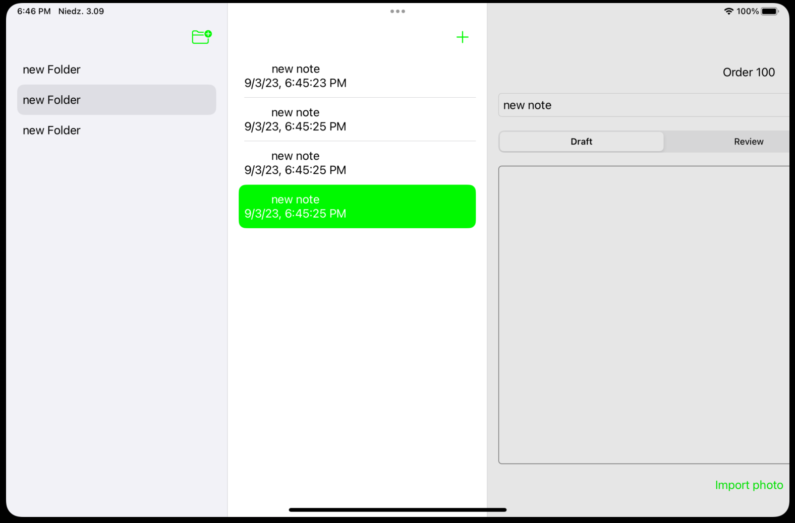

## NavigationSplitView


#### Zmiany w ContentView

Teraz chcę mieć trzy kolumny, a zamiast widoku nawigacji, używam widoku podzielonego nawigacji. Mam w `ContentView` moją listę notatek wewnątrz, a wolałbym, żeby była ona osobno, podobnie jak w moim widoku listy folderów. 




Tworzę teraz widok listy notatek w moim folderze notatek: `NoteListView`. Musze przeniesc czesc kodu do nowego pliku. Otworze oba plki obok siebie w edytorze i poprzenosze czesc kodu:. Importuję Core Data.  Potrzebuję kontekstu, gdy tworzę nową notatkę, i to jest fetch dla nowej notatki. W rzeczywistości mogę to teraz usunąć z mojego widoku treści. Następnie główna część jest tutaj, ta lista, którą chcę przenieść do mojego widoku listy notatek. Mogę to także usunąć. Następnie muszę dodać dwie funkcje tutaj, dodawanie i usuwanie. Podczas edycji, edytuję to w celu usunięcia węzła. Używam funkcji usuwania węzła. Wywołuję moją właściwą implementację. Mogę także przenieść to do mojego głównego widoku i przesunąć formater elementu, znaczy formater daty, także do mojego widoku listy węzłów. Na koniec muszę dodać tutaj środowisko dla kontekstu zarządzania obiektami. 

```swift
struct NoteListView: View {
    @Binding var selectedNote: Note?
    @Environment(\.managedObjectContext) private var viewContext
    @FetchRequest(fetchRequest: Note.fetch(.all))

    private var notes: FetchedResults<Note>
  
    var body: some View {
        List {
            ForEach(notes) { note in
                NavigationLink {
                    NoteDetailView(note: note)
                } label: {
                    VStack{
                        Text(note.title)
                        Text(note.creationDate!, formatter: itemFormatter)
                    }
                }
            }
            .onDelete(perform: deleteItems)
        }
        .toolbar {
            ToolbarItem {
                Button(action: addNote) {
                    Label("Add Item", systemImage: "plus")
                }
            }
        }
    }

    private func addNote() {
        let newNote = Note(title: "new note", context: viewContext)
    }

    private func deleteItems(offsets: IndexSet) {
        offsets.map { notes[$0] }.forEach(viewContext.delete)
    }

    private let itemFormatter: DateFormatter = {
        let formatter = DateFormatter()
        formatter.dateStyle = .short
        formatter.timeStyle = .medium
        return formatter
    }()
}

struct NoteListView_Previews: PreviewProvider {
    static var previews: some View {
        NoteListView().environment(\.managedObjectContext, 		PersistenceController.preview.container.viewContext)
    }
}
```


Teraz w ContentView mogę teraz usunąć widok nawigacyjny i dodać widok podzielonej nawigacji, chcę mieć trzy kolumny i mogę także bezpośrednio użyć tej kolumny widoczności. To oznacza, czy chcę pokazać szczegóły, dwie kolumny czy trzy kolumny?


```swift
    @Environment(\.managedObjectContext) private var viewContext

    @State private var selectedNote: Note? = nil
    @State private var selectedFolder : Folder? = nil
    @State private var columnVisiblity: NavigationSplitViewVisibility = .all

    
    var body: some View {
        NavigationSplitView (columnVisibility: $columnVisiblity){
            FolderListView(selectedFolder: $selectedFolder)
        } content: {
            NoteListView(selectedNote: $selectedNote)
        } detail: {
            if let note = selectedNote {
                NoteDetailView(note: note)
            } else {
                Text("Select a note")
                    .foregroundColor(.secondary)
            }
        }
    }
```

To jest typu `navigation splitViewVisibility`, więc potrzebuję stanu właściwości. Ustalam stan jako `private var columnVisibility` o typie `navigation split view visibility` i używam wartości "all". To jest wartość początkowa, która jest widoczna po uruchomieniu aplikacji. Teraz mogę tego użyć w moim widoku `navigation split view`. Początkowo chciałem mieć trzy kolumny, ale wydaje się, że użyłem złego typu. Chcę mieć kolumny: "sidebar", która jest widokiem listy folderów, "node list", która jest widokiem listy notatek, oraz "detail", który jest widokiem szczegółów notatki. Teraz muszę przekazać zaznaczoną notatkę z widoku listy notatek, ponieważ obecnie to nie działa. Tworzę właściwość stanu `selectedNote`, która jest opcjonalną notatką, ponieważ na początku nic nie jest zaznaczone. Teraz muszę przekazać tę właściwość za pomocą wiązania do widoku listy notatek. Widok `NoteListView` musi mieć `@State` wiązanie do `selectedNote`.  Gdy wywołuję widok listy notatek, mogę powiedzieć, że `selectedNote` jest wiązane z `my selectedNote`. W przypadku widoku szczegółów, jeśli notatka jest dostępna (nie jest nullem), to widok szczegółów notatki jest wyświetlany. W przeciwnym razie jest wyświetlany komunikat o wyborze notatki i używam koloru "secondary", który sprawia, że jest on szarym tekstem. Teraz uruchamiam aplikację, aby sprawdzić te zmiany. Mamy teraz trzy kolumny i przyciski "plus". Niestety zaznaczanie tekstu w polach tekstowych nie działa poprawnie na macOS, ale zaraz to zmienimy


Możesz wykonać kilka ciekawych trików z zarządzaniem fokusem. Wykorzystaj `focused` dla stanu fokusa o typie `focus state bool`. Najpierw tworzysz stan fokusa, np. `private var textFieldIsSelected = false`. Następnie używasz tego stanu jako wiązania, np. `textFieldIsSelected`, aby kontrolować fokus na polu tekstowym. Gdy naciskasz przycisk "Rename", chcesz aktywować pole tekstowe, ustawiając wartość `textFieldIsSelected` na `true`.

Ważne jest, że nie musisz określać domyślnej wartości, ponieważ `focus state` automatycznie zarządza tym, czy pole tekstowe ma fokus, czy nie.

W twojej aplikacji, w przypadku folderów, po kliknięciu prawym przyciskiem myszy i wybraniu opcji "Rename", pole tekstowe staje się aktywne. Możesz również zauważyć, że tekst w nim jest od razu zaznaczony. Możesz wprowadzić zmiany, a następnie nacisnąć Enter, aby zakończyć edycję. Po zakończeniu edycji pole tekstowe automatycznie traci fokus. To zachowanie jest obsługiwane automatycznie przez pole tekstowe na macOS.

Jednak w przypadku iOS to rozwiązanie może być mniej wygodne. Dlatego na iOS preferujesz zwykły tekst zamiast pola tekstowego. Możesz to zrobić za pomocą dyrektywy kompilatora `#if`. Jeśli jesteś na iOS, używasz zwykłego tekstu, a jeśli jesteś na macOS, używasz pola tekstowego.

Jeśli chodzi o menu kontekstowe, nadal chcesz je dodać do obu widoków: z polem tekstowym i bez. Aby to zrobić, możesz opakować te widoki w grupę (`Group`). Grupa nie dodaje żadnych stylizacji ani efektów, ale pozwala na zastosowanie tych samych modyfikatorów do obu widoków, co eliminuje konieczność powtarzania kodu. To pozwala na dodanie menu kontekstowego do obu widoków bez konieczności duplikowania kodu.

Następnie możesz utworzyć widok edytora folderu (`folder editor view`) i przekazać do niego folder, który ma być edytowany. Główną właściwością tego widoku jest `name`, która przechowuje nazwę folderu do edycji. Nazwa jest ustawiana na początku, aby zawierała aktualną nazwę folderu, który ma być edytowany. W tym widoku możesz stworzyć interfejs użytkownika do edycji nazwy folderu, a także przyciski "Save" i "Cancel".

Akcje "Save" i "Cancel" mogą aktualizować nazwę folderu (jeśli użytkownik dokona zmian) i zamknąć edytor. Możesz użyć `dismiss` do zamknięcia edytora, ponieważ korzystasz z arkusza (`sheet`) do jego wyświetlenia.

To są kroki, które możesz podjąć, aby zarządzać fokusem i dodawać menu kontekstowe w twojej aplikacji.

Chcę to zmienić i aktualizować tylko po naciśnięciu przycisku "Zapisz". Muszę zadeklarować folder jako zmienną prywatną (`private`) na końcu, aby móc go zaktualizować. Główną właściwością jest osobna zmienna prywatna `name` o typie `String`. Chcę, aby ta właściwość była ustawiana na nazwę folderu podczas tworzenia widoku. Aby to zrobić, wykorzystuję inicjalizator.

Najpierw tworzę inicjalizator `init(folder:)`, który przyjmuje folder jako argument. Następnie ustawiam własną właściwość `name` na nazwę folderu przekazywaną w inicjalizatorze. Ostateczny efekt to to, że gdy tworzysz ten widok, wartość `name` jest ustawiana na nazwę folderu.

```swift
init(folder: YourFolderType) {
    self.name = folder.name
    // Inicjalizacja innych właściwości, jeśli to konieczne
    super.init()
}
```

Następnie tworzę `VStack` jako główny kontener dla widoku edytora folderu. Wewnątrz `VStack` dodaję pole tekstowe (Text Field) o nazwie `Name`, które korzysta z wiązania (`binding`) do właściwości `name`. Dodaję styl `rounded border rect`, który jest odpowiedni dla iOS i iPadOS.

```swift
TextField("Name", text: $name)
    .roundedBorderRect()
```

Następnie dodaję dwa przyciski: "Cancel" i "Save", używając `HStack` do umieszczenia ich obok siebie. Możesz użyć inicjalizatora `roll` do dodania stylu destrukcyjnego do przycisku "Cancel".

```swift
HStack {
    Button(action: {
        // Akcja dla przycisku "Cancel"
        // Tutaj możesz zamknąć edytor folderu
    }) {
        Text("Cancel")
    }.rollStyle(.destructive)

    Button(action: {
        // Akcja dla przycisku "Save"
        // Tutaj możesz zaktualizować nazwę folderu
        // i zamknąć edytor folderu
    }) {
        Text("Save")
    }
}
```

Teraz, aby zamknąć edytor folderu po naciśnięciu "Cancel" lub "Save", możesz użyć `dismiss`. Musisz uzyskać dostęp do `dismiss` za pomocą środowiska i wywołać go w odpowiednich miejscach. Na przykład:

```swift
@Environment(\.dismiss) var dismiss

Button(action: {
    // Akcja dla przycisku "Cancel"
    // Tutaj możesz zamknąć edytor folderu
    dismiss()
}) {
    Text("Cancel")
}.rollStyle(.destructive)

Button(action: {
    // Akcja dla przycisku "Save"
    // Tutaj możesz zaktualizować nazwę folderu
    // i zamknąć edytor folderu
    dismiss()
}) {
    Text("Save")
}
```

W ten sposób można obsługiwać akcje "Cancel" i "Save" oraz zamknąć edytor folderu po ich wykonaniu. Dodatkowo możesz dodać logikę do aktualizacji nazwy folderu w akcji "Save".


Te dwa fragmenty kodu różnią się w zależności od platformy. Jeśli jesteś na iOS, chcesz użyć `TextField` do edycji nazwy folderu. Jeśli jesteś na macOS, chcesz użyć arkusza (sheet), aby edytować nazwę folderu.

Oto jak można to osiągnąć:

```swift
#if os(iOS)
// Kod dla iOS
TextField("Name", text: $name)
    .focused($textFieldIsSelected) // Zarządzanie fokusem na iOS
    .roundedBorderRect()
#else
// Kod dla macOS
Button(action: {
    // Akcja dla przycisku "Rename" na macOS
    showRenameEditor = true
}) {
    Text(name)
}.contextMenu {
    // Dodawanie menu kontekstowego na macOS
    Button(action: {
        // Akcja dla opcji "Rename" w menu kontekstowym
        showRenameEditor = true
    }) {
        Text("Rename")
    }
}
#endif
```

Podczas gdy na iOS używasz `TextField` i zarządzasz fokusem za pomocą `.focused`, na macOS używasz przycisku i menu kontekstowego, aby uruchomić edytor w formie arkusza (sheet).

Kod wydaje się działać poprawnie, zarówno na iOS, jak i macOS, jak opisałeś w swoim wpisie. Teraz możesz przystąpić do dalszego łączenia nawigacji i obsługi notatek w zależności od wybranego folderu.

Całość:

```swift
struct FolderRow: View {

    @ObservedObject var folder: Folder

    @State private var showRenameEditor: Bool = false
    @State private var showDeleteConfirmation: Bool = false
    @FocusState private var textFieldIsSelected: Bool

    var body: some View {
        Group {
            #if os(iOS)
            Text(folder.name)
            #else
            TextField("name", text: $folder.name)
                .focused($textFieldIsSelected)

            #endif
        }
            .contextMenu {

                Button("Rename") {
                    #if os(OSX)
                    textFieldIsSelected = true
                    #else
                    showRenameEditor = true
                    #endif
                }

                Button("Delete") {
                   showDeleteConfirmation = true
                }
            }
            .confirmationDialog("Delete", isPresented: $showDeleteConfirmation) {
                Button("Delete") {
                    Folder.delete(folder)
                }
            }
            .sheet(isPresented: $showRenameEditor) {
                FolderEditorView(folder: folder)
            }
    }
}

struct FolderRow_Previews: PreviewProvider {
    static var previews: some View {
        FolderRow(folder: Folder(name: "new", context: PersistenceController.preview.container.viewContext))

            .frame(width: 200)
            .padding(50)
    }
}
```


```swift
struct FolderEditorView: View {

    init(folder: Folder) {
        self.folder = folder
        self._name = State(initialValue: folder.name)
    }

    let folder: Folder
    @State private var name: String = ""

    @Environment(\.dismiss) var dismiss

    var body: some View {
        VStack(spacing: 30) {

            Text("Rename Folder")
                .font(.title)

            TextField("name", text: $name)
                .textFieldStyle(.roundedBorder)

            HStack(spacing: 30) {

                Button("Cancel", role: .destructive) {
                    dismiss()
                }

                Button("Save") {
                    folder.name = name
                    dismiss()
                }
            }
        }
        .padding()
    }
}

struct FolderEditorView_Previews: PreviewProvider {
    static var previews: some View {
        FolderEditorView(folder: Folder(name: "name", context: PersistenceController.preview.container.viewContext))
    }
}
```

