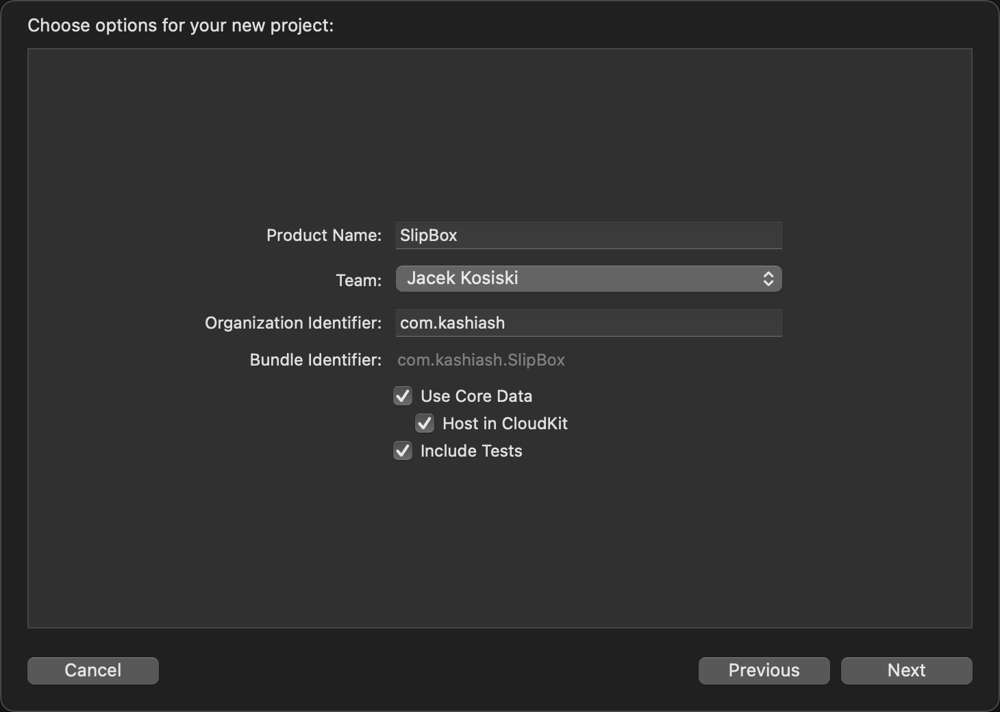
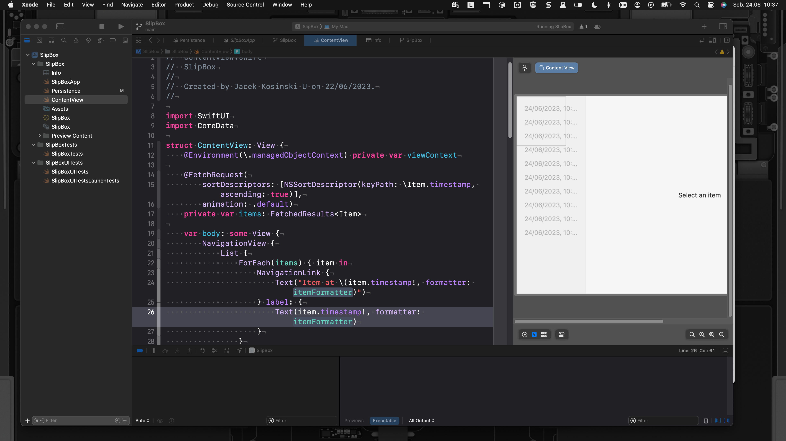
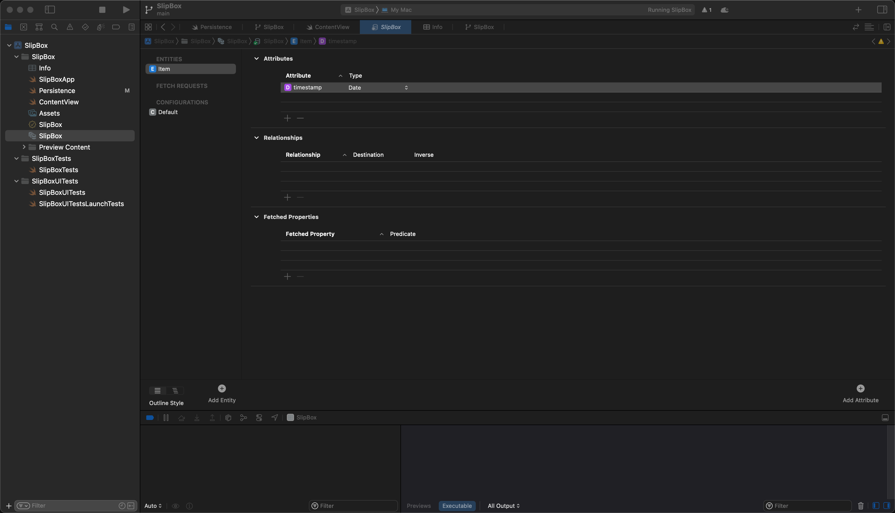
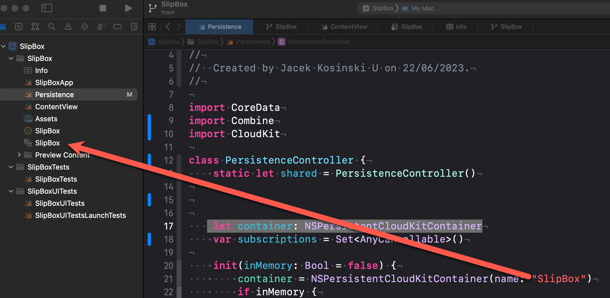

# Zakładamy nowy projekt 

Mogą słyszeć aplikację działającą na wielu platformach, nadając jej nazwę. To jest mój projekt *Slipbox*, a potem wybieram tutaj. Używam *Core Data* i hostuję w *CloudKit*, aby przetestować to teraz z *CloudKit*. Potrzebujesz płatnego konta dewelopera. atnego konta z pewnymi ograniczeniami. Po prostu nie widzisz wszystkich możliwości i synchronizacji, ale jeśli wiesz, że w przyszłości zamierzasz to dodać, zdecydowanie zaznacz to, ponieważ już dodaje odpowiednie ustawienia. Używam tu również opcji *include tests*, ponieważ jeśli chcesz przetestować nasz kod *Core Data* lub logikę biznesową, a potem tworząc ten projekt, dodało już dość dużo domyślnego kodu. 




To jest widok, który zobaczysz na MacOS. Więc może po prostu wybiorę iPhone'a. Jeśli przejdziesz do ustawień projektu pod 




*Target General*, ponieważ wybrałem wieloplatformowość, mam już cele dla iPhone'a, iPada i Maca. To jest szczególnie interesujące, jeśli myślisz o przyszłości dodawania subskrypcji, ponieważ wtedy automatycznie obsługuje uniwersalne subskrypcje, zakupy, co ułatwia pracę. Nie musisz wszystkiego ustawiać dwa razy, potem pod minimum development jest dobrze. Wybieram iOS 16 i MacOS 13. Używam Xcode 14.1. Jeśli chcesz tylko używać lokalnej *Core Data*, nie musisz robić wiele stąd. Jeśli jesteś zainteresowany synchronizacją iCloud, musisz dodać dużo możliwości, ale zrobię to w oddzielnej sekcji, bo nie każdy tego potrzebuje i nie każdy ma płatne konto dewelopera. Teraz przyjrzyjmy się wszystkim plikom, które dostaliśmy. Więc mam tutaj dwa foldery na testy. Po prostu je zamknę. Na razie nie są takie interesujące. 



Więc skupiamy się na głównych plikach. I pierwszy, który jest unikalny dla *Core Data*, to model *slipbox*. Więc tutaj definiujemy schemat, z jakimi danymi chcemy pracować, wiesz, na przykład chcemy mieć notatki i foldery. Projekt, który został automatycznie wygenerowany, ma jeden typ modelu. Musisz dodać przynajmniej jeden. Inaczej projekt nie robi dużo. Więc to jest tylko dla nas, aby sprawdzić. Więc w tym przypadku poszli na bardzo ogólny element. Więc to jest ta jedna jednostka i ma jedną właściwość lub atrybut, którym jest znacznik czasu typu data.


Jeśli tutaj klikniesz, zobaczysz wszystkie inne, które możemy użyć, jak integer, kilka innych liczb, ciąg, pool, jakieś dane, UUID i również to nie jest sposób przeprowadzania transformacji danych. Więc definiujemy nasze atrybuty. Co chcemy mieć, jak teksty, znaczniki czasu, identyfikatory, potem mamy kolejny dla relacji. Więc na przykład, każdy z naszych folderów ma relację do notatek. Każdy folder ma wiele notatek. I każda notatka należy do jednego folderu. Więc zdefiniowalibyśmy to tutaj. Potem możemy również zadeklarować pewne pobrane właściwości tutaj na dole. Mamy plik konfiguracyjny. Więc to jest, jeśli chcesz pracować z wieloma widokami, na przykład musisz zmienić definicję modelu, musisz zrobić migrację danych. Możesz dodać ten plik konfiguracyjny, aby powiedzieć, okay. Teraz używam innej konfiguracji. Migracja jest trochę skomplikowana, bo plik SQL Light lub baza danych zawsze musi mieć typ. Jeden z błędów, zawsze musisz mieć typ. Więc jeśli musiałbyś zmapować i powiedzieć, jak chcesz przejść do nowej definicji danych, ten plik modelu exceed data jest bardzo ważny. Bo nasza skrzynka z danymi core zależy od tego. Jak wie, że ma używać tego pliku? Jak to działa, że wkłada to do pliku i wyjmuje z powrotem z pliku i manipuluje naszymi danymi, a dla tego core data ma pewien poziom, pewne jednostki w tej talii. Więc obiekty w tej talii i dodały pewną wygodę w pliku persistency. Więc to jest ten kontroler persistency.

```swift
import CoreData

class PersistenceController {
    static let shared = PersistenceController()

    static var preview: PersistenceController = {
        let result = PersistenceController(inMemory: true)
        let viewContext = result.container.viewContext
        for index in 0..<10 {
            let newItem = Item(context: viewContext)
            newItem.timestamp = Date() + TimeInterval(index)
        }
        do {
            try viewContext.save()
        } catch {
            // Replace this implementation with code to handle the error appropriately.
            // fatalError() causes the application to generate a crash log and terminate. You should not use this function in a shipping application, although it may be useful during development.
            let nsError = error as NSError
            fatalError("Unresolved error \(nsError), \(nsError.userInfo)")
        }
        return result
    }()

    let container: NSPersistentCloudKitContainer
    var subscriptions = Set<AnyCancellable>()

    init(inMemory: Bool = false) {
        container = NSPersistentCloudKitContainer(name: "SlipBox")
        if inMemory {
            container.persistentStoreDescriptions.first!.url = URL(fileURLWithPath: "/dev/null")
        } 
        container.loadPersistentStores(completionHandler: { (storeDescription, error) in
            if let error = error as NSError? {
                fatalError("Unresolved error \(error), \(error.userInfo)")
            }
        })
        container.viewContext.automaticallyMergesChangesFromParent = true
    }
}
```


 Więc ponieważ pracujemy z core data, importuje core data. Ten kontroler persistent jest singletonem. Więc mamy tutaj ten statyczny. 

 `static let shared = PersistenceController()`

Niech to będzie wspólny kontroler persistent. To dlatego, że kiedy pracujemy z naszym plikiem, tak naprawdę chcemy pracować z plikiem tylko raz. Chodzi o to, że punkt dostępu do bazy danych to tylko jeden, nie chcemy mieć różnych jednostek, które manipulują plikiem z danymi w inny sposób. Bo wtedy może być kilka konfliktów między nimi. Więc chcemy upewnić się, że mamy tylko jedną jednostkę, która zajmuje się wszystkim. Ponieważ chcemy mieć tylko jedną. Tak czy inaczej, singleton, jedna jednostka jest w porządku, ułatwia to również korzystanie z niego w dowolnym miejscu w naszym projekcie. 

​	Potem to jest pomocnik, który ja przeniosę to w dół. To jest dla po prostu dodam znacznik. Oznacz pomocnik podglądu Swift UI. 

```swift
    //MARK: SwiftUI preview helper
    static var preview: PersistenceController = {
        let result = PersistenceController(inMemory: true)
        let viewContext = result.container.viewContext
        for index in 0..<10 {
            let newItem = Item(context: viewContext)
            newItem.timestamp = Date() + TimeInterval(index)
        }
        do {
            try viewContext.save()
        } catch {
            // Replace this implementation with code to handle the error appropriately.
            // fatalError() causes the application to generate a crash log and terminate. You should not use this function in a shipping application, although it may be useful during development.
            let nsError = error as NSError
            fatalError("Unresolved error \(nsError), \(nsError.userInfo)")
        }
        return result
    }()
```


Wrocimy do niego później ...

Więc teraz widzisz główną część, która jest interesująca. Mamy jedną właściwość, która jest  **let** container: `NSPersistentCloudKitContainer` . Gdybyś nie miał CloudKit, byłby to zwykły kontener. W zasadzie działa to tak samo, jeśli klikniesz prawym przyciskiem myszy, ten kontener NS persistential kid dziedziczy po kontenerze NS persistent. 


Po prostu dodaje więcej funkcjonalności do zapisywania do cloudkit. Więc możemy robić to samo, niezależnie od tego, czy mamy cloudkit, czy nie, możemy robić wszystko tak samo. Więc to jest jednostka, która obsługuje pobieranie pliku w naszym przypadku sqlite. Otwieranie go, patrzenie na schemat, wkładanie schematu do sqlite. Więc musimy stworzyć jednego z nich, aby pracować z core data. To jest to, co dzieje się w inicjatorze, tworzy konkretny kontener, nazwa tutaj. To jest nazwa pliku modelu. Więc to jest dokładnie ta nazwa tutaj. Więc teraz wie, okay. To jest schemat. To są struktury danych, które chcemy używać.



 Potem tutaj dla wygody. Używa tego w pamięci. To dlatego, że chcemy po prostu czasami potrzebujesz testować rzeczy i nie chcesz zawsze zapisywać go jak dla naszych testów. Tak dla naszych testów. Byłoby wygodnie zawsze zaczynać z nowym, pustym magazynem danych. Aby to nie było trwałe, ustawiają tutaj URL na ten mały, co oznacza, że nie zapisuje go do systemu plików. Trzyma go tylko w pamięci. To jest fajny przykład, co robi ten kontener core, to jedna z tych jednostek persistence, opis. Pierwszy URL. Więc na przykład, możesz zmienić, ponieważ kontener jest odpowiedzialny za obsługę pliku z danymi, pracę z podstawowym plikiem SQL light. Wkładanie go tam. Widzisz? O, jeśli chcesz zmienić lokalizację swojego magazynu danych, możesz to również zrobić za pomocą tego kontenera, po stworzeniu jednego z tych kontenerów. Trzeba go faktycznie załadować.

Potrzebujesz go faktycznie załadować, aby rozpocząć, ponieważ w celu uruchomienia wszystkiego inne rzeczy, takie jak uzyskiwanie wszystkiego, to może się nie powieść. Dlatego w funkcji completion otrzymujesz teraz błąd tutaj dla tego fałszywego dnia, który powoduje krytyczny błąd. Więc twoja aplikacja Apple się zawiesza. Możesz przeczytać to i małe wyjaśnienie. Ponieważ tutaj zawieszamy aplikację, możliwe, że nie chcesz tego robić w produkcji. Być może chcesz pokazać użytkownikowi, jaki jest problem, a więc niektóre typowe błędy, które wystąpią lub niektóre przyczyny, dlaczego tutaj otrzymujesz błąd, to jest lokalizacja, którą próbujesz ustawić tutaj w URL, może nie działać. Być może nie istnieje, jakieś uprawnienia dotyczące danych. Urządzenie nie ma wystarczająco dużo miejsca. Być może twój magazyn danych jest po prostu trochę za duży. Następnie masz migrację danych. Być może nieprawidłowo dokonałeś migracji danych. Więc nie wie, co zrobić z nowym schematem i starymi danymi. Dlatego zdecydowanie zawsze warto wydrukować ten błąd. Ponieważ nie mam tyle miejsca, usunę wszystkie te dane. A potem, gdy już masz kontener, faktycznie otrzymujesz kontekst widoku. To jest interesująca część, w której obsługujemy nasze dane, i tutaj mówią automatycznie łączymy zmiany z rodzica na prawdę. To jest właściwie bardziej interesujące dla iCloud. To jest dla iCloud. Jeśli nie masz iCloud, nie zobaczysz tej linii. Ponieważ mamy wersję cloudkit innej bazy danych na serwerze i cloudkit oraz lokalną, jeśli masz różne dane, musisz je połączyć. Może być konieczne połączenie dwóch różnych baz danych. Więc tutaj mówimy, że zawsze automatycznie łączymy wszystko. Więc ten kontroler persistency pomaga nam po prostu stworzyć kontener i kontekst widoku. To możesz zobaczyć w pliku aplikacji. Więc to jest główna aplikacja, wejście do naszej aplikacji, i stworzyli to tutaj, uzyskali dostęp do kontrolera persistency. Ponownie za pomocą tej statycznej wartości współdzielonej, to jest jedna jednostka singleton, jedna instancja. I to, co musimy zrobić, aby bezpiecznie działać w koordynatorze, to umieścić w nim kontekst. To jest z punktu widzenia pracy z core data, jak tworzenie, usuwanie jednostek, manipulacja danymi, wszystko działa za pośred

nictwem kontekstu widoku, a jest specyficzne dla zarządzania obiektami. Więc ta linia kodu jest bardzo ważna, ponieważ po prostu daje dostęp do wszystkich naszych aplikacji do tego kontekstu widoku. Następnie przechodzimy do jednego widoku, którym jest widok zawartości, więc tutaj stworzyli już dość dużo informacji. Po pierwsze, ponownie widzisz, że uzyskujemy dostęp do kontekstu widoku. To jest interesujące, aby utworzyć jednostkę. Jeśli przejdę tutaj na dół do tego. Przycisk paska narzędzi tego przycisku plus. Mówi dodaj element. I funkcja, którą wykonuje, jest tutaj. Więc tutaj tworzymy nowy element. To jest jeden model, który mamy. Daj mu kontekst widoku. Dlatego tak naprawdę dodali to. Musieliśmy mieć dostęp do kontekstu widoku, który pochodzi z otoczenia, ponieważ po prostu go tam umieściliśmy, więc możemy go tutaj utworzyć. I możemy go dostosować, dodając znacznik czasu. Ten fragment kodu zapisuje. Nie zawsze musisz zapisywać, ale jak widzisz tutaj, właśnie utworzyłem element. A po prawej stronie mamy listę wszystkich już istniejących elementów. I musisz być w podglądzie na żywo. Jeśli tutaj naciśniesz, pojawi się jeszcze jedno. Jak aktualizuje widok, aby to pokazać, i wracając z powrotem do tego, co chcę zrobić, to obserwuj mój magazyn i otrzymaj wszystkie elementy w magazynie. Więc muszę mieć na żywo. Fetch request, muszę pobrać i upewnić się, że zawsze mam najnowsze i najlepsze dane. I to też coś pobiera, także działa z tym kontekstem widoku, i żeby to ułatwić, można dodać właściwości opakowujące, które działają bardzo dobrze z swift UI, i to jest ten fetch request, gdzie mogę powiedzieć, czego chcę pobrać. To są wyniki pobierania. Chcę pobrać elementy. Nazwałem go Emmy item. Jak chcę je uporządkować? To są właściwości. Na przykład mogę powiedzieć, jak je chcę sortować według znacznika czasu, rosnąco true. Jeśli to zmienię na Notes to Folds, mój podgląd zostanie zaktualizowany i faktycznie odwrotnie. Właśnie straciłem jeden z danych. To jest podgląd, jeśli dodasz jeden, dodaje go na górze, ponieważ powiedziałem, że najnowsze na górze. W dodatku do sortowania można również dodać filtry. Na przykład, chcę tylko elementy, które utworzyłem w ciągu ostatnich 10

 minut, w ciągu ostatniego dnia, w ciągu ostatniego tygodnia. Na przykład, lub coś, co ma tekst, którego szukasz konkretnego słowa kluczowego. To wszystko działa bardzo dobrze z tymi zapytaniami o pobranie, a zawsze będziesz je widzieć wiele. Teraz powiedziałem, że te elementy tutaj są używane w liście przed każdym. I tu jest element z tylko znacznikiem czasu, którego właśnie widziałeś, że kiedy zmieniam coś, mogę stworzyć podgląd. Skąd podgląd pobiera swoje dane? Jeśli przewijasz w dół do dostawcy podglądu, ponieważ muszę, ponieważ ten widok potrzebuje tego kontekstu widoku. Musimy także dodać wartości środowiska do podglądu. Musimy ustawić wartość środowiskową dla tego obiektu kontekstu. I w tym przypadku nie używam normalnego, ponieważ to jest mój podgląd. Chcę mieć tylko jakieś dane podglądowe, coś, co zdefiniowałem wcześniej, to jest. Mam wariację wszystkich moich danych i już coś widać, a tutaj użyto tej innej właściwości. Więc przejdźmy do właściwości podglądu. To jest to, co powiedziałem tutaj. Więc tutaj ponownie tworzę jedną instancję mojego kontrolera persistent, ale tworzy taką, która jest w pamięci, ponieważ w moim podglądzie nie chcę tego zachować. Nie chcę tego zapisywać. Więc mówię, że gdy go utworzę w ten sposób, używa tutaj, to jest. Ustawia URL na domyślny, nie na ten, z którym pracuję, gdy uruchamiam mój projekt. Tworzę tutaj tylko domyślny i ponieważ utworzyłem domyślny i tymczasowy, jest pusty, ale chcę mieć coś w moim podglądzie, dlatego musimy utworzyć jakieś dane testowe. Więc tutaj używa dla każdego i tworzy 10 elementów i po prostu podaje datę. Moglibyśmy też to zmienić. Na przykład, teraz mam zawsze daty takie same. Chcę mieć plus ten indeks, choć nie sądzę, że to działa. Muszę przekształcić, ponieważ teraz typy nie pasują. Więc w zasadzie używam indeksu, aby zwiększyć datę. I wcześniej, jeśli przejdę do mojego widoku. Na razie stworzyłem nowy. I teraz widzisz, że moje dane podglądowe się zmieniły, ponieważ zmieniłem znacznik czasu, co zrobiłem, zwiększając datę dla każdego z tych elementów o jeden, więc widzisz tutaj. Mam jeden, który zaczyna się od 32, 33, 34, 45 i 41. Więc to jest właściwie trochę ładniejsze, ponieważ teraz mam od razu pokazane, że to sortowanie tutaj coś robi. Na przykład, jeśli teraz przejdę tutaj, mój skrypt sortowania i wrócę do dwójki. Wtedy uruchamia go ponownie. Widzisz różne znaczniki czasu i zaczynamy od najstarszego na górze i najnowszego na dole, wracając do mojego podglądu. Widzisz tutaj, jak możesz tworzyć różne wpisy danych do testowania lub podglądu. Musisz zmodyfikować to, gdy zmieniasz modele, na przykład jeśli chcesz używać naszych notatek. Będziesz musiał zaktualizować to. Zawsze musisz mieć jakieś dane. W przeciwnym razie podgląd nie będzie działał. Więc jeśli to usuniesz, upewnij się, że dodasz przynajmniej coś. W przeciwnym razie będziesz mieć pusty podgląd, a wtedy twoje podglądy nie będą miały sensu. Druga część to faktyczne zapisywanie tego. Naprawdę nie wiem, dlaczego to zapisuje, ponieważ pracujemy tylko z tymczasowymi, więc po prostu to wyłączę. I widzisz, że mój podgląd nadal jest taki sam, nadal mogę testować sortowanie, coś takiego. Nie jestem pewien, dlaczego to robię, więc wolę to wyłączyć. Nie widzę sensu, a to sprawia, że jest to krótsze. Ok. Teraz omówiliśmy wszystko w tym kontrolerze persystencji. I tutaj pokazałem ci ten jeden plik, w którym widzimy listę wszystkich tych wpisów. To właściwie jest Navigation View. Z linkiem nawigacji. Navigation View jest przestarzałe. Jest trochę przestarzałe, więc wciąż możesz go używać.
