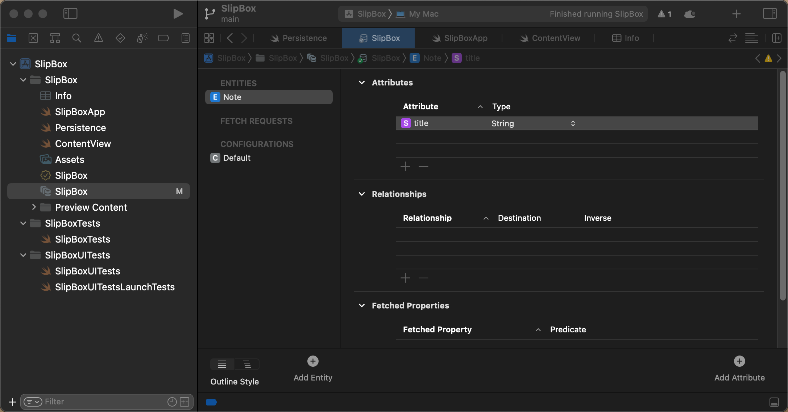
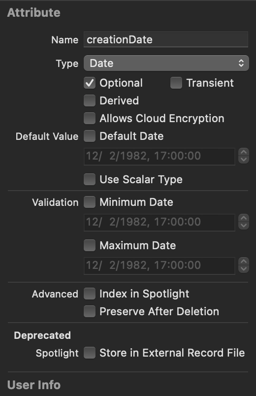

## Model notatek + CRUD

Zaczynamy od zmiany schematu . Tworzymy naszą główna tabele Note - encję z atrybutami, wykorzystując nasze nowe dane i widoki interfejsu Swift UI. Dla tego potrzebne nam będą operacje CRUD - tworzenie nowych obiektów w Core Data, odczytywanie obiektów z bazy danych, aktualizowanie ich, manipulowanie danymi i usuwanie. 

Sprawdźmy, co już tam jest. W pliku `slipboxProject.xcdatamodel` mamy jedną encję - `item`. Nie chcemy tego używać. Klikamy `Tab`, a następnie usuwamy - teraz to zniknęło. Musimy utworzyć nowe. 

Na dole mamy przycisk `Add Entity`. Po dwukrotnym kliknięciu zmieniamy jego nazwę na `Note`. 



Wybrana jest ta encja. Mogę również dodać atrybuty, takie jak tytuł mojej notatki, a następnie muszę zdefiniować typ. Jeśli nie zdefiniujesz typu, otrzymasz błąd. Wybieram typ "string" dla tytułu. W bocznym panelu mamy więcej informacji. Mamy tutaj tytuł, więc możesz również nadać mu nazwę i typ "Optional". Jest to opcjonalne dla bazy danych. Możesz również ustawić wartość domyślną, ale na razie nie będziemy z tego korzystać. Dodam więcej atrybutów. Drugi to "creation date", typu "date". Oba atrybuty są opcjonalne. 



Muszę otworzyć ponownie boczny panel. Jeśli klikniesz na encję w bocznym panelu, wyświetli się nazwa encji nadrzędnej. Nie mam nic. To jest klasa Note. Encje w Core Data zawsze są klasami. Program Xcode generuje pliki dla nas, możesz to zmienić na "manual", i smaodzielnie napisać te klasy, ale to jest skomplikowane i w tym przypadku nie ma sensu. Lepiej pozwolić Xcode zadbać o te rzeczy. Możemy spojrzeć na to, co generuje, jak tylko pozbędziemy się wszystkich błędów w kodzie wynikłych ze zmiany Item na Note.

 Problem dotyczy pliku "PersistentFile", dodajemy tu pozycje Item, ktorych już nie mamy wiec zamieniamy je na Notę. W procedurze generujacej dane do podglądu dodajemy kilka domyślnych elementów do kontekstu. To jest pierwsza operacja CRUD, czyli jak tworzyć instancję obiektu koordynatora bazy danych. Widzisz, jak tworzyć obiekt "item" i Core Data musi mieć kontekst, który mówi, że ten obiekt należy do tej bazy danych. To jest również bardzo przydatne, ponieważ można zapytać obiekt o jego zarządzany kontekst obiektu, a każdy z moich obiektów otrzymuje ten sam inicjalizator z kontekstem. Możesz uruchomić cały projekt, dzieki temu zostanie przebudowany, ponieważ czasami nie aktualizuje się poprawnie po zmianach modelu. Możesz również wyczyścić folder z plikami tymczasowymi (wybeirając w menu Product/Clean Build Folder), ponieważ zmieniłem zbyt wiele rzeczy. Teraz działa, nie ma żadnych błędów. 

`**let** newNote = Note(context: viewContext)`

To jest najprostszy sposób tworzenia nowego obiektu, używając konstruktora  z kontekstem. Gdy już masz obiekt, możesz go modyfikować lub aktualizować jego właściwości. Na przykład, mogę tutaj ustawić tytuł lub datę utworzenia. Często tworzymy obiekt a potem ustawiamy wszystkie jego cechy. Zamiast tego możesz napisać domyslny konstryktor i w nim ustawić wartości domyślne dla niektórych właściwości, na przykład dla tej daty. W dalszejh cześci kody takich kostruktorów uzywa sie wygodniej zamiast kazdorezowego twoerznie aobiektu i wpisywania do niego wartości. Ale gdzie powinienem umieścić mój wygodny konstruktor? Nie stworzyłem klasy "notes" samodzielnie. Możesz sprawdzić, skacząc do definicji "note". 


Plik "Note+CoreDataClass" został wygenerowany automatycznie i nie powinien być edytowany. Możesz sprawdzić ten plik, ale nie umieszczaj w nim kodu bezpośrednio, ponieważ nie jest zarządzany przez nas. To samo dotyczy własciwości creationDate 

```swift
extension Note {

    @nonobjc public class func fetchRequest() -> NSFetchRequest<Note> {
        return NSFetchRequest<Note>(entityName: "Note")
    }

    @NSManaged public var creationDate: Date?
    @NSManaged public var title: String?

}

extension Note : Identifiable {

}
```

 Widzisz tutaj niektóre rzeczy, które zostały wygenerowane. Jest to dodane w rozszerzeniu "notes", ponieważ jest to klasa i można łatwo dodać do rozszerzenia. I mają oznaczony, że jest `@NSManaged`, ponieważ jest częścią aktualizacji dla Core Data. Widzisz tutaj moje dwie właściwości i funkcję, którą również chcemy użyć, czyli `fetchRequest`. To sposób odczytywania danych i interesujące jest to, że "note" jest `Identifiable`. Dodano kilka wygodnych funkcji. Ale jak widzisz, są to automatycznie generowane pliki. Nie chcę ich dotykać, ale chcę dodać coś do "note" w rozszerzeniu.

Tworzymy nową grupę o nazwie Model i nowy plik Note+Helper.swift, w którym dodamy rozszerzenie dla klasy `Note`

```swift
import Foundation
import CoreData

extension Note {

    convenience init (title: String, context:NSManagedObjectContext) {
        self.init(context: context)
        self.title = title
    }
    public override func awakeFromInsert() {
        self.creationDate = Date()
    }
}
```


W pliku "Persistent" możemy teraz korzystać z tego wygodnego inicjalizatora. Możemy korzystać z właściwości "title" i "notes", na przykład w kontekście indeksu, jeśli chcemy zobaczyć różne daty utworzenia. Możemy również zmienić datę utworzenia, przydatną w tej formie w trybie podglądu:

```swift
            let newNote = Note(title: "new note \(index)",context: viewContext)
            newNote.creationDate = Date() + TimeInterval(index)
```

Stworzyliśmy własną encję, dodaliśmy do niej atrybuty. Teraz musimy skompilować ten projekt, żeby sprawdzić czy wszystko działa. 

Teraz możemy iść do naszego `ContentView`. Poprawiamy błędy zamieniając Item na Note i odpowiednie kolumny. 


 i na szczęście dzięki protokołowi `Identifiable` dodano dla nas kilka przydatnych rzeczy. Ale jak widzisz, są to pliki generowane automatycznie, które nie chcę dotykać, ale wciąż chcę dodać kilka rzeczy do obiektu "note" w rozszerzeniu. Tworzę nową grupę, ponieważ jest to również dla innych modeli, dla innych encji. Więc to jest model, a tutaj tworzę plik Swift. To jest plik Swift, ponieważ jest to plik modelu. Nie ma to nic wspólnego z interfejsem użytkownika. Czyli nie jest to Swift UI. To zwykle zaczyna się od rozszerzenia "node". Plus tutaj po prostu importujemy Core Data, ponieważ będziemy dużo z nim robić. Teraz w końcu mogę napisać wszystkie moje wygodne pomocne rzeczy. Dodaję rozszerzenie dla "note" w rozszerzeniach. Możesz tam umieszczać funkcje, ale możesz też deklarować właściwości, co jest w porządku, ponieważ moje właściwości znajdują się w modelu danych Core Data. Można tu umieszczać właściwości obliczeniowe, co również zrobimy w odpowiednim momencie. Teraz chcę zacząć od napisania własnego wygodnego inicjalizatora. `convenience init`, co chciałem zrobić, to `title: String`, ponieważ obiekty koordynatora są klasami, musimy używać inicjalizatorów klasowych. W tym przypadku musisz wywołać dedykowany inicjalizator tej klasy z wygodnego inicjalizatora. Jest to `self.init(context:)`, a to jest ten, którego właśnie użyłem, co oznacza, że tworzymy tu obiekt, więc potrzebujemy tego kontekstu. Skopiuj to i dodaj do mojego inicjalizatora. Teraz mogę tutaj wywołać to samo. I ponieważ to rozszerzenie, mogę ustawić wszystkie moje właściwości, takie jak tytuł na ten tytuł i datę utworzenia na nową datę. Teraz moja data utworzenia będzie zawsze ustawiona. Jeśli na przykład znajdujesz się w sytuacji, w której nie używasz tego wygodnego inicjalizatora, ale nadal chcesz zawsze ustawić datę utworzenia, jest jeszcze jedno fajne rozwiązanie. Można to zrobić, nadpisując `awakeFromInsert`, ponieważ jest to wywoływane za każdym razem. Ustawienie daty utworzenia tutaj ma sens. Dzięki temu nie musisz tego robić. Czyli wszystkie właściwości, które muszą być zawsze ustawione, bez względu na to, jaki inicjalizator używasz, powinny być umieszczone w `awakeFromInsert`. To jest coś,  co należy do obiektów zarządzanych klasą. Mamy nasze pierwsze wygodne  rozszerzenie w rozszerzeniu. W moim persistent możemy teraz z tego  skorzystać. Mogę używać `title` zamiast `notes`,  na przykład. Mogę tu użyć indeksu i kontekstu, jeśli chcesz zobaczyć  różne daty utworzenia. Możesz je zawsze później zmienić. Szczególnie  teraz, dla mojego podglądu, może chcę to zrobić. Możesz też wrócić do  początkowego stanu. Możesz także dodać funkcje do tworzenia domyślnych  wartości, ale możemy to zrobić później w naszym rozszerzeniu. To był  pierwszy krok dotyczący tworzenia encji, tworzenia obiektu koordynatora, a także już zobaczyłeś trochę, jak aktualizować rzeczy. Teraz przejdźmy do sytuacji, w których używasz naszych danych. Muszę przejść do mojego widoku "ContentView". Już zaczyna się pojawiać wiele  błędów, ponieważ za każdym razem, gdy jest tam Item, będzie narzekał. Pierwszą rzeczą tutaj jest to, o czym już mówiłem trochę. Jak odczytać? Jak uzyskać dostęp do moich danych z bazy danych? SwiftUI dostarcza nam przydatnego opakowania właściwości o nazwie `@FetchRequest`.

Teraz, co muszę tutaj faktycznie zmienić? Po pierwsze, typ, który pobieram, to nie jest element (`Item`), ale notatka (`Note`). Oznacza to, że nazwa mojego portfolio to "notes". Teraz tutaj, sposób sortowania, nie sortuję po kluczu (`key path`), ale po węzłach (`notes`). Możesz również sortować to po dacie (`creation date`). Dobrze. Pokrótce uporządkujmy to, co mamy tutaj. Teraz na liście używam `notes`. Dla każdego węzła pokazuję notatkę (`note`) i datę utworzenia (`creation date`) węzła. Przed każdym `ForEach` wymaga, aby typ był identyfikowalny (`identifiable`). To jest już domyślnie dodane dla wszystkich naszych obiektów. ID, którego używa, to identyfikator obiektu (`object identifier`) notatki, który jest typu `NSManagedObjectID`. Może to być przydatne, jeśli chcesz pobierać węzeł na podstawie jego ID. Jest to jednak nieco ograniczone, więc wolę dodać kolejny identyfikator. Bardzo wygodny tutaj. Teraz narzeka, że mam tutaj dwie funkcje. Nie rozumie tego, ponieważ jedna służy do dodawania elementu. Już to widziałeś - to było to, co robiliśmy wcześniej, czyli tworzenie nowego obiektu. Zamiast tego użyję tutaj `note.newNote` z kontekstem `ViewContext`, który otrzymuję tutaj ze środowiska (`environment`). Możesz zobaczyć, że po dodaniu tego elementu zostaje on od razu zapisany. Możesz go zapisać od razu, ponieważ odświeża mój widok. Trochę za dużo jak na mój gust. W zasadzie możemy po prostu przenieść to. Jeśli jesteś pewien, że zawsze chcesz go zapisać po utworzeniu, zawsze możesz dodać to do wygodnego inicjalizatora. To jest kontekst. Save, omówię trochę później strategie zapisywania. Dobrze, to jest sposób dodawania elementu. Faktycznie, zmienię nazwę tej funkcji na "addNote", co jest tutaj także. "addNote" jest używane dla przycisku plus, usunę ten tekst, a tutaj narzeka również na to "delete". Jeśli chcesz, możesz zostawić to, zmieniając tylko na "notes". I ponownie, przesuwam wszystko tutaj. Save i także animację. Nie potrzebujesz animacji. Pokażę ci to. Muszę to uporządkować, bo jest to trochę trudne do zrozumienia. Pokażę ci prostszy przykład - usuwanie jednego węzła. Następnie możesz usunąć ten przycisk edycji, ponieważ na iOS można używać przesunięcia w celu usunięcia. Dobrze, teraz jest to znacznie mniejsze, aby tylko przetestować, czy gdzieś nie ma błędów. Dobrze, to jest dobrze. Aby przetestować inne rzeczy, tworzę Widok szczegółowy. Więc tutaj, to jest nawigacyjny widok z listą. Gdzie używam jednego tekstu jako szczegółów. Stwórzmy Widok szczegółowy węzła, ponieważ możemy również usuwać i aktualizować tam. "NoteDetailView" potrzebuje mieć węzeł (`note`). Teraz narzeka, że musi mieć węzeł (`note`). Już powiedziałem, że zawsze potrzebujemy kontekstu, ponieważ używam podglądu (`preview`). Kontrolery persistentów, podglądu kontenerów i widok kontekstu to moje środowisko. "Let note" to jest węzeł (`note`). "Note.newNote" z tym kontekstem, a następnie można tutaj dodać `return`. Wcześniej musieliśmy zwrócić jakiś widok. Zwracamy węzeł (`note`). W zależności od tego, jak to zrobimy, zawsze powinniśmy właściwie zawsze dodać tutaj kontekst w środowisku. Dobrze, zmieńmy tytuł na "Note Detail" w "VStack", a może pokażę tutaj tytuł. To jest tytuł, a następnie pokazuję tutaj tytuł notatki. To jest opcjonalne. Jednym ze sposobów obsługi tego jest powiedzenie, jeśli "let title" coś zawiera, to pokaż ten tekst. Nie ma tytułu. Mój widok staje się po prostu tym tytułem. Widzisz tutaj pojawiający się tytuł. Dobrze, po prostu zmienimy czcionkę na tytuł i odstęp na 20. Dobrze, mam coś w podglądzie, fajnie. Widzę tytuł, który dodałem tutaj. To jest tylko inny sposób odczytywania tego, a ponieważ mam ten "NoteDetailView", chcę go połączyć. Więc w moim "ContentView" dla "NavigationLink" używam "NoteDetailView" z tym węzłem. Dobrze, teraz po naciśnięciu przechodzę do tych szczegółów, a tu właściwie liczby, ponieważ dodałem różne liczby wcześniej. Widziałeś, jak tworzyć widoki. Już wspomniałem tutaj, jak je usuwać. I gdy jestem tutaj, moje dane, dodam przycisk usuwania. Usuń notatkę i niech to trochę stylizacji. Dodam tutaj różowy kolor jako kolor tekstu. Wszystko, co dotyczy tworzenia lub usuwania obiektów, musi przechodzić przez kontekst widoku. Teraz mogę ponownie pobrać nowy kontekst ze środowiska, podobnie jak w przypadku "ContentView", pytając

 menedżera środowiska o kontekst. Ale w tym przypadku faktycznie nie muszę tego robić. Ponieważ mam notatkę, każdy obiekt coordinatora ma swój kontekst, należy do pliku. Należy do bazy danych, do której można uzyskać dostęp za pomocą właściwości "notes.managedObjectContext". Zwraca mi to wartość opcjonalną i jest to zarządzany kontekst obiektu. Może się zdarzyć, że nie należy do kontekstu. Dobrze, użyję tego, to jest mój kontekst lid.


**Przetłumaczony tekst z oznaczeniami markdown:**

Oczywiście, jest to bardzo proste, ponieważ gdy usuwam obiekt, muszę powiedzieć bazie danych, że nie należy go usuwać. Jest to bardzo przydatne rozwiązanie, aby uzyskać dostęp do kontekstu. Kontekst zawiera funkcje do wykonywania różnych zadań, a ta, którą chcę użyć, to `Delete object`. Dzięki temu mogę usunąć obiekt, a w tym przypadku usuwam obiekt typu "note". Usunięcie obiektu spowoduje usunięcie kilku pustych linii, aby lepiej zmieścił się na jednej stronie. Kontekst jest opcjonalny. Jeśli nie ma kontekstu, to oznacza, że obiekt nie należy do bazy danych i wtedy nie powinien być widoczny. Obiekt zawsze powinien być częścią kontekstu.

Teraz przetestujmy, czy usuwanie obiektu jest tak proste, jak się wydaje. Wróćmy do widoku "Content View". Tutaj możemy wybrać jeden z tych elementów, nacisnąć przycisk "Usuń" i obiekt zniknie. To samo dotyczy przesunięcia palcem w celu usunięcia obiektu. Usuwanie jest zatem proste zarówno przy dodawaniu, jak i usuwaniu węzłów.

Widoki zawsze są poprawnie aktualizowane, co jest niesamowite. Dzieje się tak dzięki właściwości `FetchRequest`. Możemy zmieniać deskryptor sortowania, zawsze musząc zdefiniować klucz, według którego chcemy sortować. Możemy również użyć predykatu, na przykład, gdy chcemy filtrować notatki zawierające określone słowo kluczowe. Możemy ustawić predykat i animację. Obecnie lista animuje pojawianie się nowych elementów. Jeśli ustawimy animację na "None", elementy będą pojawiać się bez animacji. Wracając jednak do domyślnej animacji, zazwyczaj lepiej zostawić pewną animację.

Możemy również tworzyć bardziej wygodne rozwiązania, korzystając z innego inicjalizatora `FetchRequest`. W naszym rozszerzeniu możemy stworzyć funkcję, która tworzy ten obiekt. Tworzymy funkcję `fetch`, która zwraca obiekt `FetchRequest`. Musimy podać typ, dla którego chcemy utworzyć żądanie, na przykład "note". Tworzymy obiekt `FetchRequest` z podaną nazwą encji, w tym przypadku "note". Należy również zadeklarować typ. W tym przypadku jest to "note". Następnie możemy dostosować ten obiekt, w szczególności musimy ustawić deskryptor sortowania. Jeśli tego nie zrobimy i mamy kilka notatek o

 tym samym tytule, nie wiadomo, jak je posegregować. Możemy dodać drugorzędny deskryptor sortowania, który mówi, że jeśli notatki mają ten sam tytuł, to sortowane są według daty. Dlatego jest to tablica deskryptorów sortowania. Wracając do naszego przykładu w widoku "Content View", gdzie sortujemy po dacie utworzenia, jest to dokładnie to samo. 

Jeśli chodzi o wygodę, możemy dodać predykat do naszego żądania. Predykaty mają określony format. Chciałbym pokazać specyficzny przypadek. Czasami chcemy użyć predykatu, który zawsze zwraca wszystkie obiekty, ale nadal chcemy go podać. Wtedy jest to predykat prawdziwy, czyli mówimy, że chcemy pobrać wszystkie notatki. Dlatego teraz mamy predykat, który mówi, że chcemy pobrać wszystkie notatki. Jest to wygodne rozwiązanie, ponieważ często chcemy pobrać wszystkie obiekty. Możemy również przekazać predykat jako argument. Domyślnie jest to predykat "wszystko". 

Czasami trudno pisać długie ciągi znaków, zwłaszcza jeśli muszą być dokładnie przepisane. Czasami zapominamy, jak coś napisać lub popełniamy błąd, a Xcode nie zawsze dobrze informuje nas o błędach. Aby to ułatwić, możemy utworzyć rozszerzenie dla `NSPredicate`, gdzie zdefiniujemy predykat "wszystko". To nie pasuje do grupy modelu, dlatego tworzymy rozszerzenie `CoreDataHelper`. Pragnę trochę uporządkować kod i unikać mieszania widoków i logiki. Tworzę plik rozszerzenia Swift o nazwie `NSPredicate+Helper`, które jest rozszerzeniem dla `NSPredicate`. Możemy utworzyć statyczną właściwość `all`, która jest właściwością tego rozszerzenia. Następnie możemy przekazać ten predykat do naszej funkcji `fetch`. Dzięki temu domyślnym wartością będzie pobranie wszystkich notatek, co może być przydatne w wielu przypadkach.

Jestem zwolennikiem tworzenia bardziej wygodnych rozwiązań, dlatego lubię tworzyć rozszerzenia, takie jak to, dla `NSPredicate`, gdzie można umieścić predykat "wszystko". To nie pasuje do grupy modelu, dlatego tworzę rozszerzenie `CoreDataHelper`. Na przykład, moje narzędzie do zarządzania `Persistent Store` powinno być tam umieszczone. Chcę zacząć organizować kod i unikać mieszania widoków i logiki. Tworzę plik rozszerzenia Swift o nazwie `NSPredicate+Helper`, które jest rozszerzeniem dla `NSPredicate`. Dl

atego właśnie tworzę to rozszerzenie, aby umieścić tam ten predykat "wszystko". Nie chcę go umieszczać w grupie modelu, dlatego tworzę oddzielne miejsce dla narzędzi Core Data.

W ten sposób, w funkcji `fetch` w moim widoku "Content View", domyślną wartością będzie pobranie wszystkich notatek, co jest sytuacją, którą chcemy ustawić jako domyślną, gdy nie podamy innego predykatu.


**To ma sens**, ponieważ gdy usuwam i chcę to usunąć, chcę powiedzieć plikowi to.

**Baza danych nie należy** do usuwania tego węzła. To jest bardzo przydatny trik tutaj, aby uzyskać kontekst.

Następnie **kontekst** ma **funkcje** do wykonywania określonych **zadań**, a ta, którą chcę użyć, to `Delete object`. Więc to ma na celu **usunięcie** tego **obiektu**, a obiektem, który chcę usunąć, jest **notatka**. To usunie niektóre z moich pustych linii.

Więc to się mieści na **jednej stronie**. Jest to **opcjonalny kontekst**. Jeśli nie mam kontekstu, to faktycznie nie należy do bazy danych i wtedy naprawdę nie wiem, co to oznacza praktycznie. Ponieważ tak naprawdę nie powinienem tego widzieć. Zawsze powinien być częścią kontekstu.

Teraz sprawdźmy, czy **usuwanie obiektu** jest naprawdę takie łatwe, **wracając do widoku treści**. Tutaj możesz wybrać jeden z tych elementów, nacisnąć **Delete**, a następnie odchodzi. Być może powinienem było zapamiętać, jaki znacznik czasu, na przykład pierwszy to 55.

Usuń i faktycznie znika. To jest również **mniej w widoku treści** dla tego presetu implementacji. Robi to samo, **usuwa z kontekstu**. Wywołuje funkcję **usuń** z kontekstu, aby usunąć wszystkie te węzły. Więc to samo dzieje się, kiedy przeciągniesz, aby usunąć. Dlatego jest dość łatwe do usunięcia, kiedy usunąłem lub dodałem węzły.

Faktycznie zawsze aktualizują się **moje widoki**. Co przypomina mi o odczytywaniu danych. To niesamowite, zawsze otrzymuję **prawidłowe dane**. Ta tablica węzłów, którą używam w mojej liście, zawsze zawiera najnowsze dane, a **magia uzyskiwania właściwych aktualizacji** pochodzi od tego **opakowania właściwości @FetchRequest**. Możesz tu zmienić deskryptor sortowania. Zawsze musisz zdefiniować, którą właściwość chcesz posortować. Możesz również mieć jedną właściwość dla **predykatu**. Właściwie może powinienem użyć `FetchRequest`, aby zobaczyć wszystkie inne sposoby tworzenia. Tutaj mamy deskryptor sortowania encji. Jest tu także **predykat**, którym możesz filtrować, na przykład wyszukiwać notatkę o określonym słowie kl

uczowym. Możesz ustawić predykat i animację. Na przykład teraz moja lista animuje nowe elementy tutaj. Animuje ich pojawienie się. Jeśli ustawisz tutaj animację na `None`, spróbuj ponownie, po prostu się pojawiają. Nie ma żadnych animacji. Ponieważ to podstawowe mówi, że obserwacja moich danych powinna odbywać się z aktualizacją interfejsu użytkownika z tą animacją. Wróćmy do wartości domyślnej. Prawdopodobnie lepiej jest zostawić nieco animacji teraz, ponieważ czasami nie chcesz tego. **FetchRequest** wygląda trochę bardziej skomplikowanie, ale można stworzyć więcej wygody, używając innego inicjalizatora `fetchRequest`. Tutaj musisz podać `NSFetchRequest`. Zamierzam utworzyć funkcję, która tworzy to w moim rozszerzeniu. Tworzę funkcję `fetch`, która zwraca `NSFetchRequest`. Tutaj musisz powiedzieć, jakiego typu chcesz użyć. Więc to po prostu jest notatka.

Dobrze, stwórzmy to. Żądanie jest `NSFetchRequest` z nazwą encji. Więc musisz powiedzieć, jaką nazwę encji chcesz użyć. Więc to jest, ponieważ mam tu węzeł, musi być dokładnie napisane "note". I możemy to zwrócić, aby przestał narzekać. I musi ponownie mieć podobne hitnijście, zadeklarować, jakiego typu to jest. Wpisałem notatka.

Teraz, kiedy to utworzę, mogę dalej dostosowywać i zdecydowanie muszę ustawić jedną rzecz, która jest deskryptorem sortowania. Jeśli tego nie zrobisz, to jest w liczbie mnogiej, ponieważ masz wiele sposobów sortowania czegoś. Na przykład, dwa z moich notatek chcę posortować według tytułu. I dwa z moich notatek mają ten sam tytuł. Jak je posortować? Wtedy mogę dodać kolejne sortowanie, które mówi, że jeśli są takie same, użyj określonego sortowania według daty lub czegoś. Dlatego to jest tablica. Więc to jest deskryptor sortowania. W moim przypadku `note.creationDate` rosnąco lub malejąco. To jest to samo, co miałem w widoku treści. To samo. Wróćmy do mojego szczegółu i do mojej wygody w tym żądaniu. Możesz również dodać **predykat**. A **predykaty** mają określony format. Pokażę ci bardzo konkretny przykład. Może wydawać się trochę dziwny. Ale istnieją pewne sytuacje, w których chcesz zawsze używać predykatu, ale faktycznie chces

z pobrać wszystkie obiekty. Więc wtedy jest to prawdziwy predykat. Teraz mówię, że chcę pobrać wszystkie moje notatki jako wygodny sposób użycia tej funkcji. Możesz również podać argument **predykat**, którym jest predykat jako **NSPredicate**. A wartość domyślna to `all`. Więc teraz przesyłam ten predykat, mówiąc, że chcę pobrać wszystko, to jest coś, co chcesz robić częściej. Czasami zapominasz, jak to napisać lub masz błąd, a Xcode nie jest zbyt dobry w informowaniu, gdzie popełniłeś błąd w nazwie jednego z tych żądań predykatu. Lubię to być bardziej wygodne, dlatego chcę utworzyć tutaj rozszerzenie dla mojego **NSPredicate**, gdzie możemy po prostu umieścić to `all`. To nie należy naprawdę do moich grup modelu, więc po prostu stworzę pomocnika **CoreData**. Na przykład tutaj należy do mojego **persistentContainer**. Chcę zacząć trochę porządkować i nie mieszać tak bardzo moich widoków z logiką. Tworzę plik rozszerzenia Swift o nazwie **NSPredicate+Helper**, to jest rozszerzenie dla **NSPredicate**. Ponieważ to jest jak właściwość, chcę po prostu utworzyć jedną z tych i jest to właściwość, statyczną lub i wtedy mogę umieścić to wszystko tam, co oznacza, że teraz w mojej funkcji **fetchRequest** domyślna wartość to `all`. To jest coś, co chcesz robić częściej.

I zamiast pisania ciągu znaków, który musi być dokładnie napisany w ten sposób, czasami po prostu zapominasz, jak to napisać lub masz błąd, a Xcode nie jest zbyt dobry w informowaniu, gdzie popełniłeś błąd w nazwie jednego z tych żądań predykatu. Lubię to, aby było bardziej wygodne, dlatego chcę utworzyć rozszerzenie **NSPredicate**, gdzie możemy po prostu umieścić to `allPredicate`. To naprawdę nie pasuje do moich grup modelu, więc po prostu utworzę pomocnika CoreData o nazwie **CoreDataHelper**. Na przykład, tutaj należy do mojego **persistentContainer**. Chcę zacząć uporządkowywać i nie mieszać moich widoków zbyt mocno z logiką, dlatego tworzę plik rozszerzeń Swift o nazwie **NSPredicate+Helper**, to jest rozszerzenie dla **NSPredicate**. Ponieważ to jest jak właściwość, chcę po prostu utworzyć jedno z nich i jest to właściwość statyczną lub i wtedy mogę umieścić to wszystko tam, co oznacza, że teraz w mojej funkc

ji **fetchRequest** domyślna wartość to `allPredicate`.

Wiem, że brzmi to dziwnie, ale czasami po prostu nie jesteś gotowy, aby cokolwiek pobierać, i najlepiej jest tego nie pobierać.

Przeciwnym jest **none**. I wtedy staje się to fałszywe. Po prostu mam nadzieję, że napisałem to poprawnie. OK, mamy to teraz gotowe i możemy użyć tego dla wszystkich naszych innych obiektów. Zauważyłem wygodny sposób tworzenia tutaj mojego **fetchRequest** i możemy to tak naprawdę użyć w widoku treści jako alternatywy dla tego. Więc mogę to zadeklarować jako `@FetchRequest`. **FetchRequest** wiedzą, że ta funkcja jest w moich notatkach. I tak naprawdę tego chciałem, ponieważ chcę go wywołać w ten sposób. Musi to być funkcja statyczna. Więc ta funkcja musi być statyczna. Oznacza to, że tutaj nie mogę powiedzieć `fetch` z predykatem `all`, więc wygląda jak czytanie ładnie `FetchRequest`, `Note.fetch` albo

To zastępuje tę część, którą nie mogę usunąć. Skracam to trochę dla mnie, prawie mieści się teraz w jednej linii i jest łatwe do zrozumienia. OK, zobaczymy wszystkie moje notatki w tych notatkach. Nic się nie zmieniło, ponieważ wciąż pobieram wszystko, wciąż używam tego samego sortowania. Fajną rzeczą jest to, że można również zmienić, jak ustawiasz to **fetchRequest** w inicjalizatorze. I to może być przydatne, gdy użytkownik filtruje i ustawia deskryptory sortowania. Więc rozszerzamy to. Osobiście bardzo to lubię, ponieważ nie muszę robić dużo i zawsze otrzymuję najnowsze dane. To jest świetne. A przypadki użycia to tutaj posiadanie tablicy notatek. Jaki jest inny przypadek, o którym nie rozmawialiśmy, ostatni przypadek, o którym nie rozmawialiśmy, dla operacji CRUD, to jak zaktualizować coś. I tutaj, w moim **Note**, mogę usunąć jedną z tych notatek, ale chcę faktycznie zmienić tytuł. Jak to zrobić? To jest w moim **NoteDetail**, od pewnego czasu pierwszy przykład. Chciałem dodać tutaj przycisk, który mówi "Zmień tytuł na czysty tytuł" i w tej sytuacji chcę ustawić tytuł notatki na pusty ciąg znaków. Więc to by zeszło na pusto. Więc jeśli nacisnę tutaj. Naprawdę się nie dzieje, nic nie widać. Właśnie muszę ci co

ś udowodnić, weź pierwszy wpis. Naciskam "Wyczyść tytuł" i tutaj aktualizuje się na moim tytule. Wracam, idę ponownie i tym razem mój tytuł faktycznie znika. Jednym aspektem aktualizowania tego jest faktycznie zmiana danych, dane analityczne się zmieniły. Po prostu nie zaktualizowałem mojego widoku tutaj. Więc muszę zmienić sposób konsumowania tej notatki w moim widoku Swift UI, aby upewnić się, że zawsze otrzymuje właściwe aktualizacje w **Swift UI**, a to jest trochę zaskakujące. Ale tak naprawdę **Notatka** lub te **obiekty** mogą służyć jako obserwator obiektów. Więc mogę to zrobić tutaj, aby przyjąć obiekt. Teraz spróbuję ponownie "Czyść tytuł" i faktycznie to usuwa. Możesz to również wypróbować w **ContentView** i możesz również używać tego, gdy masz wiele obiektów do sprawdzenia, wtedy ten **fetchRequest** jest właściwym rozwiązaniem. Ponieważ to jest tablica i można to również użyć do pobrania tylko jednego obiektu. I wtedy aktualizuje wszystko dla tego jednego obiektu. Jedna rzecz, która nie działa poprawnie, to dla **relacji**. Ale obserwuje wszystkie właściwości, wszystkie atrybuty tej notatki, ponieważ wszystko jest ze sobą połączone. Czasami nie zdajesz sobie sprawy, że nie obserwujesz tego obiektu. Ale chciałem to teraz wspomnieć. Pokażę ci przykład później. Najpierw zmiana właściwości obiektów jest łatwa, ale zawsze musisz dbać o właściwe obserwowanie ich w widokach, aby uzyskać właściwe aktualizacje. Mam tu kilka trików. Możesz sprawić, że to zadziała naprawdę ładnie.


Najpierw potrzebuję dostępu do naszych notatek z bazy danych Core Data. Dla tego potrzebujemy fetch request, który jest dostępny w SwiftUI, ale potrzebujemy contextu dla naszej bazy danych. Dla tego potrzebujemy czegoś, co nazywamy `@Environment` i jest to `\.managedObjectContext`, kontekst naszej bazy danych. 

Oto nasz pierwszy krok. Teraz, z tą wiedzą, możemy stworzyć fetch request. Tworzymy go tutaj, więc jest to `@FetchRequest`. Chcemy dostarczyć kilka parametrów, takich jak sort descriptor. Wcześniej musieliśmy napisać duży blok kodu, teraz mamy tylko jedną linijkę, co jest naprawdę fajne. Wprowadzamy sort descriptor, a potem entity name. To jest nazwa naszej encji, która nazywa się `Note`. 

Chcemy sortować nasze notatki według daty utworzenia. Wprowadzamy `Note.creationDate`, a potem wstawiamy nasze notatki. To jest zmienna, tablica z naszymi notatkami, więc jest to `var notes: FetchedResults<Note>`. 

Pierwszym krokiem jest zawsze stworzenie widoku. Chcemy pokazać nasze notatki na liście, więc tworzymy `List`. Musimy wprowadzić nasze notatki tutaj, więc wprowadzamy `notes`. Dla każdej notatki chcemy pokazać jej tytuł, więc wprowadzamy `note in`, a potem stworzymy `Text`, który pokazuje `note.title ?? "Untitled"`. Chcemy pokazać domyślną nazwę, jeśli nie ma tytułu, więc używamy "Untitled". 

To wszystko. To jest nasza lista notatek, ale musimy wprowadzić nasze notatki do bazy danych, prawda? Potrzebujemy jakiegoś przycisku, który pozwoli nam to zrobić. Używamy tu paska narzędzi, więc tworzymy `Toolbar`, a wewnątrz niego `ToolbarItem`. Jako identyfikatora używamy `.navigationBarTrailing`, a potem tworzymy przycisk. 

Przycisk wywołuje funkcję, która tworzy nową notatkę. Musimy napisać tę funkcję. Stworzymy ją tutaj. Funkcja nazywa się `addNote` i nie z

wraca nic, więc jest `Void`. Wewnątrz funkcji tworzymy nową notatkę, więc jest to `let newNote = Note(context: self.managedObjectContext)`. Potem ustawiamy tytuł naszej notatki, więc jest to `newNote.title = "Untitled"`, a potem ustawiamy datę utworzenia, więc jest to `newNote.creationDate = Date()`. 

Ostatnią rzeczą, którą musimy zrobić, to zapisać nasze zmiany. Używamy tu try-catch, więc wprowadzamy `do`, a potem `try self.managedObjectContext.save()`. Jeśli coś pójdzie nie tak, to chcemy to wyłapać, więc wprowadzamy `catch`, a potem wywołujemy `print(error)`. 

To jest nasz przycisk, który tworzy nową notatkę. Przycisk ma nazwę "Add Note", więc wprowadzamy `Button(action: addNote, label: { Image(systemName: "plus") })`. 

To jest nasz podgląd, możemy go uruchomić i zobaczyć, czy wszystko działa. Tworzymy nową notatkę, pojawia się na liście. Jeśli tworzymy więcej notatek, są one sortowane według daty utworzenia. To jest naprawdę fajne. 

To jest podstawowe wprowadzenie do Core Data w SwiftUI. Jest wiele więcej do nauczenia, ale to jest dobry początek.

Jak uzyskać dostęp do moich danych z mojej bazy danych? SwiftUI dostarcza nam przydatny dekorator właściwości `FetchRequest`. W przeciwnym razie, jakbyś był początkującym, tradycyjnie musiałbyś poprosić kontekst widoku o pobranie czegoś. Wszystkie te operacje, jak sortowanie, tworzenie kontrolera wyników zapytań, uzyskiwanie wszystkich aktualizacji z urządzenia to dużo pracy. To jest dużo krótsze.

Czy muszę coś tutaj zmienić? Po pierwsze, typ, który pobieram, to nie jest przedmiot. To jest wezel (node). Co oznacza, że nazwa mojego portfolio to `notes`. Teraz tutaj, sposób, w jaki to sortuję, nie sortuję tego przez ścieżkę klucza. Właściwość, według której chcę to sortować, to `notes`. Możesz również sortować to według daty utworzenia.

Teraz zrobię małe porządki. Teraz na mojej liście, używam `notes`. Dla każdego z moich węzłów pokazuję notatkę i datę utworzenia notatki, a także datę utworzenia przed każdym węzłem. Każdy z nich wymaga, aby typ był identyfikowalny. To jest już domyślnie dodane do wszystkich naszych obiektów. ID, które używa, to identyfikator obiektu.

To jest identyfikator obiektu `notes`, który jest typu NS Managed Object ID. Może to być przydatne, jeśli chcesz pobrać węzeł po ID. Jest to nieco ograniczone, więc wolę po prostu dodać inny identyfikator, co jest tutaj bardzo wygodne.

Następnie skarży się, że mam tu dwie funkcje. Nie rozumie tego, ponieważ jedna służy do dodawania elementu. Czy już to widziałeś? To było to, co robiliśmy wcześniej, dodawanie, tworzenie nowego obiektu. Więc po prostu zamienię to na `note`.

Właściwie, to nie jest nowa notatka. To jest `note`. Nowa notatka z kontekstem Widok kontekstu, który dostaję tutaj ze środowiska, to jest ten kontekst. Możesz zobaczyć tutaj, kiedy dodaję ten przedmiot. Bezpośrednio zapisują. Możesz bezpośrednio zapisać do pliku.

Gdy to tworzysz. Ponieważ to trochę za bardzo upraszcza mój widok. Moglibyśmy po prostu przenieść to. Jeżeli zawsze chcesz to zapisać, kiedy to tworzysz. Zawsze możesz dodać to do konstruktora.

Więc to jest kontekst. Zapis, omówię trochę później niektóre strategie zapisywania. Dobrze, tak dodajesz element. I właściwie zamierzam

 przemianować tę funkcję na `add a note`, która jest tutaj również. `add a note` używana dla przycisku plus, zamierzam usunąć ten tekst i skarży się tutaj o to usuwanie. Jeśli chcesz, teraz możesz to zostawić, zmieniając to na `nodes`. I znowu tutaj przenosząc wszystko.

Zapisuję i przenoszę animację. Nie potrzebujesz swojej animacji. Po prostu pokażę ci. Muszę to wyczyścić. Jest to trochę za trudne do zrozumienia, co to robi. Więc pokażę ci inny, prostszy przykład. Po prostu usuwając jeden węzeł. Wtedy możesz usunąć ten przycisk edycji, ponieważ na iOS, to jest tylko iOS, możesz użyć Swipe on delete. Dobrze. Teraz, to jest dużo mniejsze, aby tylko przetestować. Czy nadal gdzieś się zawieszam.

Dobrze, to jest miłe. Aby przetestować inne rzeczy, tworzę widok szczegółów. Więc tu jest widok nawigacyjny z listą. Gdzie używa tylko jednego tekstu z detalami. Stwórzmy widok szczegółowy notatki, bo możemy tam również zrobić jakieś usuwanie i aktualizowanie. Więc szczegół notatki musi mieć notatkę. Jest notatką. Skarży się tutaj. Musi mieć węzeł. Już powiedziałem, że zawsze potrzebujemy kontekstu, bo podgląd iusd. Stałe kontrolery previews containers view context. Niech notatka. Będzie węzłem. Nowa notatka z tym kontekstem, a potem możesz tutaj dodać powrót. Musimy tylko w podglądach zwrócić jakiś widok. zwróć węzeł W zależności od tego, jak to robimy, powinniśmy zawsze tak naprawdę zawsze dodawać tutaj. I kontekst w środowisku. Dobrze, zmieńmy tytuł na `Note detail` w V stick i może pokażę tytuł. Więc to jest tytuł, a potem pokazuję tutaj tytuł Notatek to jest opcjonalne. więc jeden sposób obsługi tego to mówienie, jeśli Niech tytuł Mam coś tylko wtedy pokazuję ten tekst. Nie tytuł. Mój widok staje się tylko tym tytułem. Widzisz tu ten tytuł pojawiający się. Dobrze, po prostu zróbmy ten font. lub tytuł i odstęp 20 Dobrze, mam coś w moim podglądzie. Widzę tytuł, który tutaj dodałem. To jest po prostu inny sposób odczytywania tego i od kiedy mam ten brak szczegółów. Chcę go tylko użyć razem. Więc w moim widoku treści dla celu nawigacyjnych linków używam moj

ego widoku szczegółowego notatki z tą notatką. Dobrze. Teraz, kiedy naciskam, przechodzę do tego szczegółu i widzisz tutaj właściwie numery, ponieważ mam to jest poprzednie, gdzie dodałem różne numery zobaczyłeś, jak tworzyć widoki. Już tutaj wspomniałem, jak je usunąć. A kiedy jestem tutaj, moje dane, zamierzam dodać przycisk usuwania. przycisk, usuń notatkę i zróbmy trochę wysiłku w stylizacji, dodając Tutaj Pink jako kolor obcy wszystko, co działa z tworzeniem lub usuwaniem obiektów, musi przechodzić przez widok kontekstu. Mogłabym teraz zdobyć nowy kontekst znowu ze środowiska. podobnie do widoku treści tutaj, pytając środowiska managera o kontekst. Ale w tym przypadku właściwie nie muszę tego robić. Ponieważ mam notatkę, każdy obiekt z twórcy ma swój kontekst, plik. Należy do bazy danych, do której należy. Które możesz dostać przez własność węzłów, nie zarządzaj kontekstem. To zwraca mi opcjonalny i zarządzany obiekt kontekstu. Być może nie należy do kontekstu. Dobrze, więc zamierzam użyć tego, to jest mój kontekst pokrywy. Ma sens, bo w zasadzie, kiedy usuwam i chcę go usunąć, chcę powiedzieć plikowi, baza danych, do której należy, usuwa ten węzeł. Więc to jest bardzo przydatny trik tutaj, aby dostać kontekst. Potem kontekst ma funkcje. Dla wykonywania pewnych zadań i tego, którego chcę użyć, jest tutaj. Usuń obiekt. Więc to idzie do usunięcia tego obiektu i obiekt, który chcę usunąć, to notatka. Usuwa niektóre z moich pustych linii. Więc to pasuje na jedną stronę. Jest opcjonalnym kontekstem. Jeśli nie mam kontekstu, to właściwie nie należy do bazy danych, a potem naprawdę nie wiem, co to oznacza praktycznie. Ponieważ właściwie nie powinienem go widzieć. Zawsze powinien być częścią kontekstu. Teraz sprawdźmy, czy usuwanie obiektu jest naprawdę takie proste, wracając do widoku treści. Tutaj możesz wybrać jeden z tych elementów naciśnij na. Usuń. A potem to opuściło, może powinienem zapamiętać, jaki był czas jak pierwszy, gdzie 55. usuń i to właściwie znika. Jest też mniej w widoku treści dla preset implementacji tutaj. To robi to samo kontekst usu

wa notatkę, a potem tutaj zapisuję, co właściwie nie jest konieczne, jeśli wyjdę z widoku, ponieważ SwiftUI zrobi to za mnie. Więc to jest usuwanie.


 Możesz również dodać funkcje, aby stworzyć wartości domyślne i być może zrobimy to później w naszym rozszerzeniu. To był pierwszy krok, jak stworzyć encję? Jak stworzyć obiekt koordynatora, a już widziałeś trochę, jak aktualizować rzeczy?

Teraz przejdźmy do sytuacji, gdy korzystasz z naszych danych. W tym widoku 50i muszę przejść do mojego widoku zawartości. To już zaczyna generować wiele błędów, ponieważ za każdym razem, kiedy pojawia się jakiś element, pojawiają się skargi.

Pierwsza rzecz, o której już wspomniałem, to jak odczytać dane? Jak mogę uzyskać dostęp do moich danych z mojej bazy danych? SwiftUI daje nam przydatny property wrapper @FetchRequest. W przeciwnym razie, tak jak to robią tradycyjni, musiałbyś poprosić context view o pobranie czegoś. Stworzyć wszystkie sort description, stworzyć kontroler wyników pobierania, uzyskać wszystkie aktualizacje urządzenia. To dużo do zrobienia. To jest bardzo krótkie.

Teraz co muszę tu właściwie zmienić? Po pierwsze, typ, który pobieram, to nie element, ale węzeł. Oznacza to, że nazwa mojego portfolio to węzły. Teraz tu i sposób, w jaki sortuję to, nie sortuję tego po kluczu ścieżki właściwości. Chcę sortować to po notatkach. Możesz również sortować to po dacie pytania.

Dobrze, teraz szybko posprzątam to, co mamy tutaj. Więc teraz na mojej liście, używam węzłów. Dla każdego z moich węzłów pokazuję notatkę i datę utworzenia notatki, a także datę utworzenia notatki. Każda z nich wymaga typu, który jest identyfikowalny, więc jest to już dość domyślnie dodane do wszystkich naszych obiektów. ID, które używa, to identyfikator obiektu.

To są notatki. ID obiektu, który jest ID zarządzanego obiektu NS. Może być przydatny. Jeśli chcesz pobrać węzeł według ID. Jest to trochę ograniczone, więc wolę po prostu dodać inny identyfikator, bardzo wygodny tutaj. Potem narzeka, że mam tutaj dwie funkcje, których nie rozumie, bo jedna służy do dodawania elementu. Już to widziałeś? To było to, co robiliśmy wcześniej, dodając, tworząc nowy obiekt. Więc po prostu zamiast tego użyję tu. Właściwie, to nie jest nowa notatka. To jest notatka. nowa notatka z kontekstem kontekstu widoku, który dostaję tutaj z mojego środowiska. Możesz zobaczyć tutaj, kiedy dodaję ten element. Bezpośrednio zapisujesz. Możesz bezpośrednio do pliku. Kiedy to tworzysz. Ponieważ trochę zbytnio sprząta moje widoki. Trochę za bardzo na mój gust. Moglibyśmy po prostu przenieść to. Jeśli zawsze jesteś pewien, że zawsze chcesz to zapisać, kiedy je tworzysz. Zawsze możesz to dodać do niewygodnego inicjalizatora. Więc to jest kontekst. Zapisz, omówię trochę później niektóre strategie zapisywania. Dobrze, to jest sposób na dodanie elementu. I właściwie zamierzam przemianować tę funkcję na dodaj notatkę, która jest tutaj również. Dodaj notatkę używaną do przycisku plus, usunę ten tekst i tutaj również narzeka o tym usuwaniu. Jeśli chcesz teraz, możesz to zostawić, zmieniając to na węzły. I znowu tutaj przenoszę wszystko to. Zapisanie i przenoszenie również animacji. Nie musisz mieć animacji. Po prostu pokażę ci. Muszę to oczyścić. To jest trochę za trudne do zrozumienia, co to robi. Więc pokażę ci łatwiejszy inny przykład tego. Po prostu usuwając jeden węzeł. Potem możesz usunąć ten przycisk edycji, bo na iOS to jest tylko iOS, możesz użyć przesunięcia do usuwania. Dobrze, teraz to jest dużo mniejsze, aby po prostu przetestować. Czy nadal gdzieś się rozgnieciony.

Dobrze, to jest miłe. Aby przetestować inne rzeczy, tworzę szczegółowy widok. Więc słyszę, że to jest widok nawigacji z listą. Gdzie używa tylko jednego tekstu z detalami. Stwórzmy widok szczegółów notatki, ponieważ możemy tam też zrobić jakieś usuwanie i aktualizowanie. Widok szczegółów notatki, więc szczegół notatki musi mieć notatkę. To jest notatka Nie, narzeka tutaj. Musi mieć węzeł. Już powiedziałem, że zawsze musimy mieć kontekst, bo jestem podglądem. persistent controllers previews containers view context Let note. Jest węzłem. nowa notatka z tym kontekstem, a potem możesz tutaj dodać powrót. Musimy tylko w podglądach zwrócić jakiś widok. Zwracaj węzeł W zależności od tego, jak to robimy. Zawsze powinniśmy też zawsze tutaj dodać. I kontekst w środowisku. Dobrze, zmieńmy tytuł na szczegół notatki w palce V i może pokaż

ę teraz, co to robi. Więc otwiera to nowy widok. Więc powiedzmy, że chcę teraz zaktualizować to. Co mogę teraz zrobić? Mogę zrobić coś takiego. Gdzie jestem? Okej. Mogę tutaj zrobić coś takiego, jak tekst. Czy mogę tutaj dodać tekst? Tylko tekst? Chcę edytować tekst. Nie, jestem na iOSie. Mogę użyć TextField. Nie jestem pewien, jak to działa na macOS, ale wydaje mi się, że powinno działać tak samo. Więc na TextField. To jest tekst notatki. Tekst notatki jest tylko dla wyświetlenia. To jest tylko dla wyświetlenia. Więc muszę tu wpisać $ notatka. Jest tutaj zmienna. Teraz mogę zmienić tekst i jest on aktualizowany. Więc wracam tutaj. To jest automatycznie zapisywane, bo jak tylko nacisnę enter. Więc jak tylko nacisnę enter. Jak tylko nacisnąłem, zaczęło zapisywać to do bazy danych. Ale, jak już powiedziałem, chciałem ci pokazać inne, różne strategie zapisywania. Nie zawsze chcesz od razu zapisywać wszystko, prawda? Bo to zawsze powoduje, że twoja baza danych jest zapisywana. To zawsze powoduje, że twoja baza danych jest aktualizowana. Ale nie zawsze to chcesz. Chcesz czasami, żeby użytkownik mógł anulować. Więc pokażę ci, jak zrobić undo i redo.

Dobrze, stwórzmy to. Wysyłamy zapytanie NSFetchRequest z nazwą encji. Musisz tutaj określić, co to jest nazwa encji. To dlatego, że mam tutaj węzeł, więc musi być dokładnie wpisany jako 'note'. Mogę to zwrócić, więc przestaje narzekać. I musi znowu zadeklarować, jaki to jest typ. Wpisałem 'note'. 

Teraz tę prośbę mogę dalej dostosować i zdecydowanie muszę ustawić jedną rzecz, która jest najkrótszym opisem. Jeśli tego nie zrobisz, może dojść do awarii. Jest to liczba mnoga, ponieważ masz wiele sposobów sortowania czegoś, na przykład dwie moje notatki. Chcę je sortować według tytułu. A jeśli dwie moje notatki mają ten sam tytuł, jak je sortować? 

Mogę dodać kolejne sortowanie, wtórne sortowanie, które mówi: dobrze, jeśli są takie same, to użyj sortowania według daty lub czegoś innego. Dlatego jest to tablica. Więc jest to bez końca sortowanie według klucza 'Puff', znowu moja notatka. Data utworzenia rosnąco lub malejąco. To jest to samo, co miałem na moim widoku treści, to jest dokładnie to samo. 

Wracając do mojego szczegółu, dodaję do mojej wygody, w tym zapytaniu. Można również dodać predykat, a predykaty mają określony format. Pokażę ci bardzo specyficzny, który może wyglądać trochę dziwnie. Ale jest pewna sytuacja, kiedy po prostu chcesz zawsze dawać predykat, ale tak naprawdę chcesz pokazać, chcesz pobrać wszystkie encje. Więc to jest prawdziwy predykat. 

Więc teraz mówię, że chcę mieć wszystkie swoje notatki jako wygodny sposób dla tej funkcji, aby uczynić ją trochę bardziej wielokrotnego użytku. Możesz również powiedzieć, że jako argument mogę użyć tutaj predykatu. Który jest predykatem NS. A domyślny to ten 'all'. Więc teraz wysyłam mu ten predykat. Ponieważ mówienie, że chcesz pobrać wszystko, może być czymś, co chcesz robić częściej. 

I pisząc ciąg, który musi być konkretnie tak napisany, czasami po prostu zapominasz, jak to napisać, albo masz błąd i Xcode nie jest bardzo dobry w pokazywaniu, gdzie to zrobiłeś źle. Błędne pisownie dla jednego z tych zapytań, wolę to trochę ułatwić. I dlatego lubię tworzyć tutaj rozs

zerzenie do mojego NSPredicate, gdzie możemy po prostu umieścić ten cały predykat. 

To naprawdę nie pasuje do moich grup modeli, więc po prostu stworzę pomocnika Core Data. Na przykład tutaj mój uporczywy jeden tam należy. Chcę zacząć trochę organizować i nie mieszać moich widoków i mojej logiki tak dużo. Tworzę plik rozszerzenia Swift do NSPredicate Plus. Helper, to jest rozszerzenie do NSPredicate. 

Ponieważ jest to jak właściwość. Chcę tylko stworzyć jedną z nich i jest to predykat, który jest raz ze wszystkimi, to jest właściwość. Nie mogę używać normalnej właściwości jako rozszerzeń, ale mogę używać statycznych właściwości, które są statyczne albo, a potem mogę umieścić. Całą tę rzecz tam, co oznacza, że teraz w mojej funkcji fetch node. Domyślny to teraz wszystko. 

Sytuacja, w której naprawdę chcesz to ustawić jako domyślne To None. Wiem, że to brzmi dziwnie. Ale czasami po prostu nie jesteś gotowy na pobieranie czegokolwiek i najlepiej nie pobierać. Przeciwieństwo to brak. A potem to staje się fałszywe. Mam nadzieję, że dobrze to napisałem. Dobrze, mamy to teraz gotowe i możemy go używać dla wszystkich naszych innych encji. 

Zauważyłem wygodny sposób tworzenia tutaj mojego zapytania Fetch. I tak naprawdę możemy to wykorzystać w widoku treści jako alternatywę. do tego więc mogę zadeklarować to jako ADD fetch request. Zapytanie fetch wiem, że ta funkcja jest w moich notatkach. I właściwie chciałem, bo chcę to tak wywołać. Musi to być również funkcją statyczną. Więc ta funkcja musi być statyczna. Więc na klasie, co oznacza, że tutaj nie mogę powiedzieć fetch. z predykatem wszystko, więc to wygląda jak czyta ładnie zapytanie fetch note fetch lub. 

Więc to zastępuje. Ta część, którą nie mogę usunąć. Sprawia, że jest trochę krótsze. dla mnie prawie teraz pasuje w jednym wierszu i łatwo zrozumieć. W porządku. Zamierzam zobaczyć wszystkie moje notatki w tych notatkach. Nic się nie zmieniło, bo nadal pobieram wszystko, nadal używam tego samego. Sortowanie fajne w tym jest to, że możesz również zmienić, jak ustawiasz to zapytanie fetch w inicjatorze. 

I to będzie przydatne, gdy pozwolisz użytkownikowi na filtrowanie i ustawianie opisów sortowania. Więc w

tedy będziemy to rozwijać. Osobiście bardzo mi się to podoba, bo nie muszę robić dużo i zawsze dostaję najnowsze dane. To jest świetne. A zastosowanie tutaj ma tablicę notatek. Co to jest nie inne przypadki, o których nie rozmawialiśmy, ostatni przypadek, o którym nie rozmawialiśmy dla operacji zgrubnej, to jak zaktualizować coś. 

A jestem tutaj w mojej notatce. Mogę usunąć teraz jedną z tych notatek, ale chcę faktycznie zmienić tytuł. Jak to zrobić? Jest na moim nie szczegółowym tylko pewnym pierwszym przykładzie. Chciałem dodać tutaj przycisk, żeby powiedzieć. Zmiana tytułu na jasny tytuł i w tej sytuacji. Chcę ustawić tytuł notatki na pusty ciąg. Więc to by pójdź puste. 

Więc jeśli stuknę tutaj. Nic się nie dzieje, nic nie widzisz. Po prostu muszę udowodnić coś, weź pierwszy wpis. Stukam na czysty tytuł. To nie aktualizuje tutaj mojego tytułu, wracam, idę znowu i tym razem mój tytuł faktycznie znika. Jedna część tego, jak to zaktualizować, to tak naprawdę zmieniłem dane, dane analityczne zmieniły się. Tylko nie zaktualizowałem tutaj mojego widoku. 

Więc muszę zmienić, jak zużywam tę notatkę w moim swiftui view, żeby upewnić się, że zawsze dostaje prawidłowe. aktualizowanie Swift UI, a to będzie trochę zaskakujące. Ale tak naprawdę notatka lub te encje mogą tworzyć obserwowany obiekt, więc mogę tutaj zrobić obiekt przestrzegający paska. W porządku teraz spróbuj jeszcze raz jasny tytuł i ja tak naprawdę go czyści. 

Możesz też spróbować tego w widoku treści. i możesz również większość typu, kiedy masz tytuł i kiedy masz ciąg, który chcesz dodać, masz tekst. Pola prawidłowe tytuł i powiązanie idzie do moich notatek. tytuł po prostu musisz myśleć o tym jak o normalnym obiekcie obserwowanym, który w tym przypadku ma być. 

ciąg ten jest skarżący się. Są dwa sposoby na naprawienie tego. Jeden to jeśli dodasz tutaj opaskę wiążącą. To jest wiązanie tekstu. To jest wiązanie. I widzisz tutaj, że ma get i set. Więc dla get używam notatek. Tytuł, a jeśli to jest nie, po prostu zwracam pusty. Nie potrzebuję przej

ść. 

Ale teraz na ustawieniu muszę powiedzieć notatka.tytuł jest równa wartości, której właśnie użyłem, żeby ją ustawić. Więc muszę zrobić if let new title jest wartość. Czy muszę zrobić, jak to było ustawione na pustą wartość, to mogę użyć tej wartości. 

I potem, jak to było puste, teraz mogę rzeczywiście zastosować ten nowy tytuł. Muszę jednakże zapewnić, że ta nowa wartość nie jest pusta, a potem mogę ustawić to jako mój tytuł. 

Mogę powiedzieć, że to jest nowy tytuł, i to jest faktycznie to samo, co napisałem tutaj. I mogę je zastosować bezpośrednio tutaj. Więc teraz mogę powiedzieć, że jeśli nowy tytuł jest pusty, a jeśli to nie jest puste, to będę je ustawić jako mój tytuł notatek. 

Jeżeli ten nowy tytuł jest pusty, to właściwie powinienem go ustawić jako puste. I to jest to, co to zrobi. To jest trochę trudne, ale mam nadzieję, że to zrozumiesz. Nie jestem pewien, czy to jest prawdziwe, bo jakby tam był tylko jeden znak, to by go usunął, więc to nie jest prawdziwe. Chciałbym to zmienić. 

Chciałbym powiedzieć, że jeśli to jest puste, to będę to ustawił jako puste. I w przeciwnym razie, to jest, ten nowy tytuł, który jest nieznany, a jeżeli to jest puste, to będę to ustawił jako puste. Więc mogę usunąć tę część. 

I tak naprawdę mogę to ustawić jako nowy tytuł, który jest nieważny. Tak więc teraz, kiedy otworzę to pole tekstowe, jest to puste, ale jak tylko zaczynam wpisywać, to jest to tak naprawdę widoczne. I potem, kiedy go usuwam, jest to puste. I tak dalej, i tak dalej. Więc mogę dodać nowe tytuły. Mogę dodać nowe notatki. Mogę zaktualizować te notatki. Mogę je usunąć. Więc wszystko to jest tutaj.