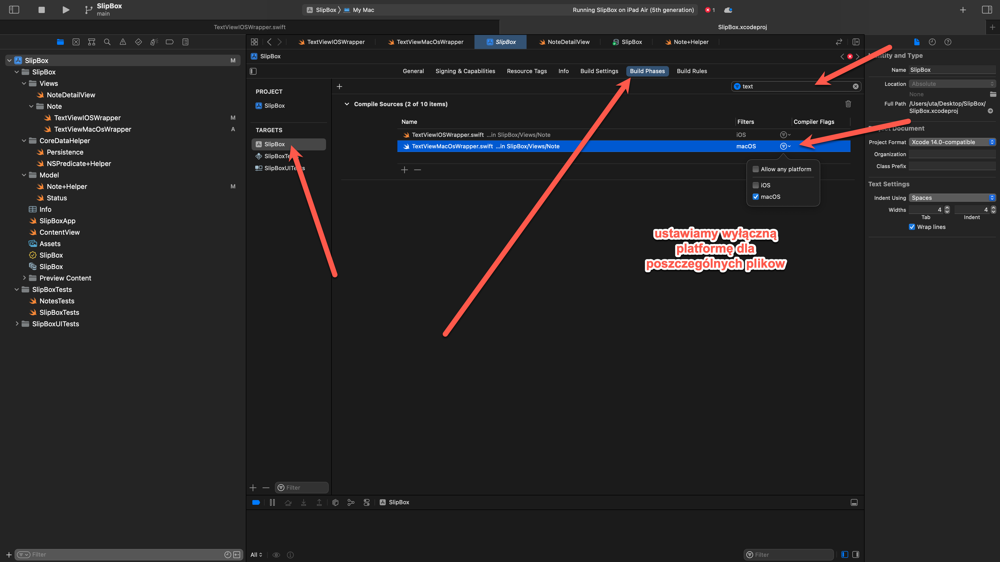

`## 3.3 RTF` (Rich Text Format).


Teraz zaczynam główną część mojego widoku szczegółowego notatki, którym jest edytor tekstu, a właściwie notatnik. Jest to przygotowane jako `RTF` (Rich Text Format). Jeśli przyjrzysz się elementom, mamy `UI` (User Interface), mamy edytor tekstu, który służy do wprowadzania ciągów znaków, mamy pole tekstowe, które również służy do wprowadzania ciągów znaków. To są podstawowe typy tekstu, ale chciałbym mieć ten miły edytor. Tego nie ma w `SwiftUI`, więc muszę skorzystać z `UIKit` i `AppKit`. Najpierw stworzę to, tworzę elementy `UI`. Następnie przechowam to w `Core Data`. Ponieważ korzystam z `UIKit`, musimy napisać, musimy użyć `UIViewRepresentable`, czyli nowego reprezentanta widoku `UI`. 

Zaczynam od wersji `UIKit` na iOS. Muszę dodać kod specyficzny dla `UIKit` i `AppKit`. Pokażę wam, jak mieć dwa pliki. i uruchom je w zależności od schematu. To trochę się zmieniło z powodu mojego uniwersalnego celu tutaj w moich ustawieniach. Dobrze, dodam ten plik gdzieś. Może po prostu stworzę folder widoku. Więc, to jest View. A następnie tworzę tu nową grupę Notes. 

Dodaję tutaj mój szczegółowy widok notatki. i tutaj tworzę nowy plik dla mojego tekstu, więc jest to ten widok `IView`. To jest mój `iOS` wrapper dla widoku tekstu. Dobrze. Mam pewne konwencje nazewnictwa. Możesz też mieć inne dla reprezentantów widoku `UI`. Zazwyczaj używam słowa "wrapper", ale możesz też użyć innego słowa i stworzę dwa, jeden na `iOS` i jeden na `macOS`. 

Ułatwia to zadanie, ponieważ niektóre ustawienia są różne i nie chcę, tak, po prostu tworzę dwa bardzo różne pliki. Jest trochę kodu do powtórzenia, ale uprosci nam kod na poszczegolne platformy.


Możesz w porządku. To nie jest, nie naciskaj na DODAJ. Musimy dać dwie funkcje. Jedna to tworzenie `UIView`. Więc tutaj musimy zwrócić `UIView`. A tego, którego chcę użyć, jest specjalny, którym jest `UITextView`. To jest widok bogatego tekstu, więc tworzymy jeden. To jest teraz kod `UIKit`. To jest `UITextView`. Nie mówię specjalnie o ramce czy czymkolwiek. Po prostu idź, dostaniesz ramkę, którą.


```swift
import Foundation
import UIKit
import SwiftUI

struct TextViewIOSWrapper: UIViewRepresentable {

    func makeUIView(context: Context) -> some UIView {
        let view = UITextView()

        return view
    }

    func updateUIView(_ uiView: UIViewType, context: Context) {

    }
}
```

Możesz zobaczyć, ile to będzie. Więc to jest to, co tutaj zwracam. a druga funkcja to aktualizacja `UIView` i domyślnie, ponieważ zdefiniowałem ten typ.  I możemy tutaj kontynuować konfigurację. Więc po prostu pokażę ci kilka opcji.


```swift
    func makeUIView(context: Context) -> some UITextView {
        let view = UITextView()

        view.allowsEditingTextAttributes = true
        view.isEditable = true
        view.isSelectable = true
        view.font = UIFont.systemFont(ofSize: 18)

        view.layer.borderWidth = 1
        view.layer.borderColor = UIColor.gray.cgColor
        view.layer.cornerRadius = 5

        return view
    }
```

Całość powyzej chyba nie wymaga komentarza 

 W Note+Helper.swift dodajemy kolejna właściwość:

```swift
    var formattedBodyText:NSAttributedString {
        get {
            NSAttributedString()
        }
        set {
            
        }
    }
```

 Chcę ustawić `NSAttributedString`. Którego powinienem dostać dla mojego wezła. Więc na pewno muszę tu mieć jedną właściwość w tym widoku, która jest moim węzłem.

```swift
    ...
        view.textStorage.setAttributedString(note.formattedBodyText)

        return view
    }
```


Kiedy jest wywoływana ta aktualizacja, na przykład, kiedy moja notatka się zmienia, muszę również odpowiednio zmienić. Więc w zasadzie robię tę linię jeszcze raz. dla mojego `UIView`, więc nie ustawia ono tej właściwości tutaj. 


```swift
    func updateUIView(_ uiView: UIViewType, context: Context) {
        uiView.textStorage.setAttributedString(note.formattedBodyText)
    }
```


To jest jednokierunkowe, kiedy? Mam własność mojej notatki, tekst, i chcę zaktualizować mój element interfejsu użytkownika, mój widok tekstu, ale muszę mieć przeciwny kierunek, kiedy wpisuję w moim polu tekstowym. 

Muszę otrzymać sygnał zwrotny. Muszę wiedzieć, kiedy tekst się zmienia, aby przekazać to z powrotem do moich notatek, do mojego magazynu danych. dla `UIKit` zamierzamy używać delegata `UITextView`. Więc ten widok ma delegata. Jeśli się do niego podłączymy, dostaniemy sygnały zwrotne dla `textviewDidChange`. 

```swift
    class Coordinator: NSObject, UITextViewDelegate {
        let note: Note
        let parent: TextViewIOSWrapper

        init(_ parent:TextViewIOSWrapper,note:Note ) {
            self.parent = parent
            self.note = note
        }
        func textViewDidChange(_ textView: UITextView) {
            note.formattedBodyText = textView.attributedText

        }
    }
```

Delegaty `UIViewRepresentable` już używają koordynatorów. Więc muszę ustawić koordynatora, po prostu zrobię to tutaj, w klasie w moim opakowaniu widoku. Więc koordynator. To jest obiekt. I ten ma być delegatem `UITextViewDelegate`, więc także musi mieć, bo tutaj dostaję te sygnały zwrotne o zmienionym tekście. 


I dostaję widok tekstu, z którym mogę korzystać, aby uzyskać sformatowany tekst. Więc to jest nowy tekst, który chcę przechować w mojej notatce. Aby Twój koordynator mógł to zrobić, musi mieć notatkę.  Więc w tym wywołaniu zwrotnym, kiedy wiem, że coś się zmieniło,  mogę ustawić tekst z mojego widoku tekstu na tekst mojej notatki. 


Teraz znowu muszę stworzyć inną funkcję, aby prawidłowo ustawić ten kąt, muszę ustawić funkcję `makeCoordinator`. 

```swift
    func makeCoordinator() -> Coordinator {
        Coordinator(self, note: note)
    }
```


Tak, ten jest rodzicem mojego `UITextViewiOSWrapper`, więc mogę to ustawić tutaj. Muszę znowu utworzyć inną funkcję, aby poprawnie ustawić ten kąt. Muszę skonfigurować funkcję `makeCoordinator`. Więc to jest po prostu koordynator, którego właśnie stworzyłem. Muszę przekazać notatkę. To jest podstawowa konfiguracja. Ale na pewno muszę zrobić jedną rzecz, muszę powiedzieć `UIView`, że jest delegatem, więc tutaj, gdy tworzę mój widok tekstu, jedną rzecz, którą muszę jeszcze zrobić, to delegat. Jaki jest delegat widoku tekstu, a to jest mój kontekstowy koordynator, ten, którego właśnie stworzyłem. Ten koordynator teraz otrzymuje wywołania aktualizacji, gdy tekst się zmienia. 

Inna rzecz już jest. Myślę, że muszę zrobić to z koordynatorem, kiedy zmieniam moją notatkę. Koordynator musi również otrzymać zaktualizowaną notatkę. Więc tutaj mówię, że zmieniłem tekst, ale muszę też powiedzieć koordynatorowi, który jest w kontekście, że kontynuuję notatkę, aby używał nowej notatki. Dlatego muszę to zrobić. 

Teraz możesz również zaimplementować podgląd ponownie, a potem wydaje się, że musisz dać tutaj domyślną notatkę z moim poprzednim kontekstem kontenerów. masz kontekst, więc jest tam. Możesz faktycznie pisać. Będzie trochę więcej, ponieważ nadal muszę mieć moje menu i inne rzeczy. Zamierzam to użyć w moim widoku szczegółów notatki, który jest bardzo niezorganizowany, bo miałem tutaj tyle dodatków. Co tak naprawdę chciałem zachować? Zamierzam zachować porządek tylko na razie. Ten tytuł i ten tekst. Usunę status. Chcę zachować przycisk czyszczenia. Usunę pole tekstowe z mojego tytułu. Może to zostawię, ale zmienię to, aby umieścić to na froncie. przed moim wybierakiem i może zmienię czcionkę na tytuł.


mamy textview dla Ios

zmodyfikujmy teraz okno notatki :

```swift
struct NoteDetailView: View {

    @ObservedObject var note: Note

    var body: some View {


        VStack(spacing: 20){
            Text("Order \(Int(note.order))")

            TextField("title", text: $note.title)
                .textFieldStyle(.roundedBorder)
            Picker(selection: $note.status) {
                ForEach(Status.allCases){ status in
                    Text(status.rawValue)
                        .tag(status)
                }
            } label: {
                Text("Note's status")
            }
            .pickerStyle(.segmented)
            TextViewIOSWrapper(note: note)
        }
        .padding()
        .onDisappear {
            PersistenceController.shared.save()
        }

    }
}
```


Teraz robimy wrapper dla macOS :

```swift
import SwiftUI

struct TextViewMacOsWrapper: NSViewRepresentable {
    let note: Note
  
    func makeCoordinator() -> Coordinator {
        Coordinator(note: note, parent: self)
    }
    func makeNSView(context: Context) -> some NSTextView {
        let view = NSTextView()

        view.isRichText = true
        view.isEditable = true
        view.isSelectable = true
        view.allowsUndo = true
        view.allowsImageEditing = true

        view.usesInspectorBar = true

        view.usesFindPanel = true
        view.usesFindBar = true
        view.isGrammarCheckingEnabled = true
        view.isRulerVisible = true

        view.delegate = context.coordinator
        return view
    }
    func updateNSView(_ nsView: NSViewType, context: Context) {
        nsView.textStorage?.setAttributedString(note.formattedBodyText)
        context.coordinator.note = note
    }
    class Coordinator: NSObject, NSTextViewDelegate {
        var note: Note
        let parent: TextViewMacOsWrapper

        init(note: Note, parent: TextViewMacOsWrapper) {
            self.note = note
            self.parent = parent
        }

        func textDidChange(_ notification: Notification) {
            if let textview = notification.object as? NSTextView {
                note.formattedBodyText = textview.attributedString()
            }
        }
    }

}

struct TextViewMacOsWrapper_Previews: PreviewProvider {
    static var previews: some View {
        TextViewMacOsWrapper(note: Note(title: "new note",context: PersistenceController.preview.container.viewContext))
    }
}
```

mamy bledy kompilacji bo oba wrappery sa zgodne wylacznie na jedna z platform iOS lub macOS. Mozna to dokonfigurowac w ustawieniach projektu:




oraz odpowiadajaca poprawka w NoteDetailView:


```swift
            #if os(iOS)
            TextViewIOSWrapper(note: note)
            #else
            TextViewMacOsWrapper(note: note)
            #endif
```

