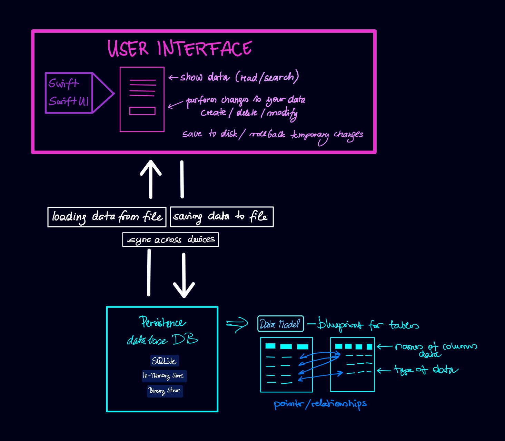
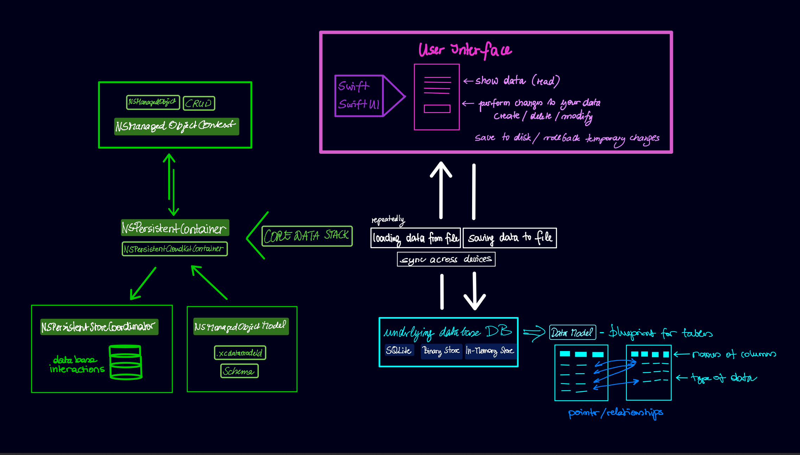

# CoreDataStack

Apple wprowadził ramy Coordinator jako narzędzie do przechowywania danych w twojej aplikacji. W skład tych ramek wchodzą niektóre przydatne klasy, które pomagają Ci to zrobić, więc nie musisz pisać całego tego kodu, jak widziałeś w projekcie szablonu.

W projekcie było bardzo mało kodu, chcę Ci tylko krótko opisać, co naprawdę dla nas zrobiłem, abyś nie był tak zdezorientowany tymi wszystkimi rzeczami związanymi z chmurą. Cztery elementy współpracują razem, aby zapewnić wygodne zapisywanie i zarządzanie danymi oraz zarządzanie bazą danych, która jest zapisana na dysku. Są to cztery składniki: kontener utrzymujący, kontekst `NSManagedObjectContext`, model `NSManagedObjectModel` i koordynator.

Aby to trochę wyjaśnić, zacznę od kroku wstecz. W tym małym schemacie mamy dwie główne części. Po jednej stronie mamy interfejs użytkownika, który wyświetla dane. Użytkownik może chcieć wykonać szereg typowych zadań, takich jak tworzenie nowych wpisów, usuwanie, modyfikowanie i zapisywanie na dysku. W pewnym momencie może chcieć także cofnąć tymczasowe zmiany.

Z perspektywy nas, developerów, chcemy opisać interfejs użytkownika w naszym ulubionym języku programowania, Swift, i chcemy używać SwiftUI do wyświetlania wszystkich tych elementów interfejsu użytkownika. Chcemy, aby zadania były jak najprostsze i aby zawsze poprawnie aktualizować dane, kiedy coś modyfikujemy.

Na drugim końcu tego spektrum mamy persystencję danych. Zamierzamy używać bazy danych, a jednym z narzędzi, które możemy używać, jest baza danych SQLite. Ale jeśli chcielibyśmy bezpośrednio pracować z tą bazą danych, musielibyśmy pisać w innym języku programowania, którym jest SQL. To jest już coś, czego na pewno nie chcemy robić.

Właśnie dlatego mamy Core Data. Dzięki Core Data możemy pozostać przy języku Swift i na przykład opisać nasze filtry za pomocą `NSPredicate`. W celu wykonania wszystkich tych zadań Core Data tworzy cztery różne jednostki, aby trochę je oddzielić. Te cztery jednostki są opisane jako stos Core Data.

Główną częścią jest kontener `NSPersistentContainer`. To jest lider zespołu, ponieważ niektóre zadania muszą być przekazywane do siebie nawzajem i są od siebie zależne. Dlatego pierwszą rzeczą, którą robimy w naszej aplikacji, jest tworzenie

 instancji tego kontenera. Kiedy to robimy, tworzy on również inne trzy instancje, więc tworzy jednego z tych manipulatorów modeli, `NSManagedObjectModel`, a także koordynatora magazynu `NSPersistentStoreCoordinator` i `NSManagedObjectContext`.

Zazwyczaj nie widzimy koordynatora magazynu, ponieważ to on wykonuje całą pracę związaną z SQL i obsługą pliku SQL. Kontekst `NSManagedObjectContext` natomiast wykonuje wszystkie te rzeczy, które chcielibyśmy zrobić z punktu widzenia interfejsu użytkownika. Wszystko jest ładnie zapisane w Swift, a my dostajemy dużo ułatwień dla SwiftUI z tymi opakowaniami właściwości.

Kontekst jest w zasadzie wejściem do naszej bazy danych. Wszystko, co robimy przez kontekst, jak tworzenie instancji `NSManagedObject`, jest zarządzane w bazie danych. Możemy również wykonać operacje CRUD: tworzenie, odczytywanie, aktualizowanie i usuwanie. Więc wszystko, co robimy w naszej aplikacji, działa przez kontekst.

Jeżeli chcemy pracować z koordynatorem, musimy stworzyć kontener i poprosić kontener o kontekst. Możemy poprosić kontener o wiele kontekstów. Tworzenie nowego kontekstu jest stosunkowo tanie. Na przykład, jeśli chcemy wykonać jakieś zadania w tle, stworzylibyśmy nowy kontekst tła.

Praca z wieloma kontekstami może być trochę skomplikowana. Konteksty nie są bezpieczne pod względem wątków, więc jeśli mamy obiekt powiązany z kontekstem, zawsze idą razem. Jeśli mamy jeden obiekt w kontekście, a następnie chcemy go przenieść do innego kontekstu, nie jest to bezpieczne. Co możemy zrobić, to użyć identyfikatora obiektu z jednego kontekstu, a następnie ponownie go pobrać z innego kontekstu.

Więc na końcu będziemy skupiać się na opisywaniu naszych modeli za pomocą koordynatora i edytora Core Data. Pokażemy, jak opisać typy niestandardowe, jak zapisywać obrazy, kolory, tekst sformatowany. Następnie pokażemy, jak radzić sobie z relacjami, na przykład naszymi węzłami, które mają relację z kluczami i folderami. Na koniec dodamy wiele ułatwień, aby ułatwić pracę ze SwiftUI.

Będziemy przechodzić przez wszystkie te różne aspekty pobierania danych, modyfikowania danych, uzyskiwania odpowiednich aktualizacji. W ten sposób na koniec będziesz miał wiele przykładów dla tych różnych zadań, ale ograniczenia

 są takie, jak to zrobić najlepiej, jak zorganizować swój kod najbardziej efektywnie. Tak, abyś mógł znaleźć rzeczy i był konsekwentny, aby koordynator był dla ciebie super efektywny do pracy. W ten sposób będziesz miał więcej czasu na pracę nad interfejsem użytkownika swojej aplikacji.