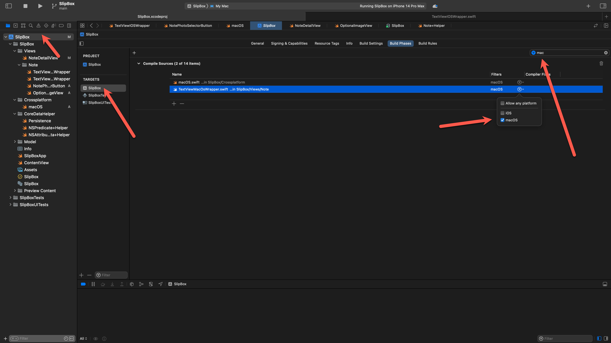
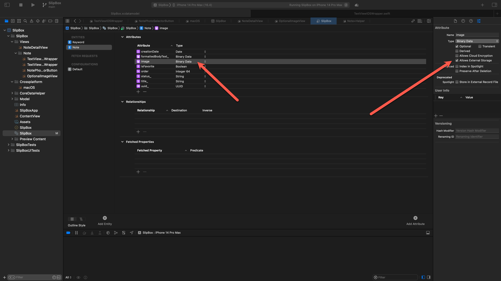

# 3.4 PhotoPicker

Tworzymy dodatkowy widok, ktory pozwoli wybrac nam zdjecie i dopisac je do notatki:


```swift
import SwiftUI
import PhotosUI

struct NotePhotoSelectorButton: View {
    let note: Note
    @State private var selectedItem: PhotosPickerItem? = nil
    var body: some View {
        PhotosPicker(selection: $selectedItem,
                    matching: .images,
                    photoLibrary: .shared()){
            Text("Import photo")

        }
                    .onChange(of: selectedItem) { newValue in
                        Task{
                            if let data = try? await newValue?.loadTransferable(type: Data.self) {
                                note.image = data
                            }
                        }
                    }
    }
}

struct NotePhotoSelectorButton_Previews: PreviewProvider {
    static var previews: some View {
        NotePhotoSelectorButton(note: Note(title: "new note",context: PersistenceController.preview.container.viewContext))
    }
}
```


W NoteDetailView dodajemy kontrolke image i nasz selector:


```swift
            Image(uiImage: UIImage(data: note.image))
            NotePhotoSelectorButton(note: note)
```

Niestety notę.image jest optcjonalne, i musimy obsluzyc wariant, ze nie jest wypełnione. W zwiazku z tym, ze w wielu miejschach nam sie to przyda na wzor selektora zrobimy tez `OptionalImageView`:


```swift
struct OptionalImageView: View {

    let data: Data?
    
    var body: some View {

        if let data = data, let uiImage = UIImage(data: data){
            Image(uiImage: uiImage)
                .resizable()
                .scaledToFit()
        } else {
            EmptyView()
        }
    }
}
```

i teraz w `NoteDetailView`, zamiast wyświetlającego błędy `Image` dajemy nasz OptionalImage:


```swift
            OptionalImageView(data: note.image)
            NotePhotoSelectorButton(note: note)
```


Dodatkowo mozemy zmodyfikowac nasz selector, aby wyświetlał info o Imporcie zdjecia gdy go nie mamy , a jak juz mamy to opszmy to "ChangePhoto".

```swift
struct NotePhotoSelectorButton: View {
    @ObservedObject var note: Note
    @State private var selectedItem: PhotosPickerItem? = nil         
...
if note.image == nil {
      Text("Import photo")
    } else {
      Text("Change photo")
}
 ...
```

ObservedObject dodalismy do note aby zmiana  w notę.image odswiezala nam widok.

Niestety jak zmienimy platforme na macOS to okaze sie ze nie mamy UIImage (powinno byc NSImage). Znow klania sie tabun ifów, ale mozemy to ogarnac inaczej:

dodajmy nowy plik macOs.swift :

```swift
typealias UIImage = NSImage

extension Image {
    init(uiImage: UIImage){
        self.init(nsImage: uiImage)
    }
}
```

w wylaczeniach ustawiamy dla tego pliku, ze ma byc tylko macOS:



ten kod spowoduje podmiane typu UIImage na NSImage jeśli platforma docelowa to macOS.

zdjecia zajmuja dużo, dlatego warto rozwazyc wariant, gdzie zdjecia nie beda zapisywane do bazy danych.

latwo to osiągnąć zaznaczając w modelu CoreData jedną opcję `AllowExternalStorage`:





tematy do rozważenia:


importowanie zdjec wprost do Textu:


```swift
UITextView supports the display of text using custom style information and also supports text editing. You typically use a text view to display multiple lines of text, such as when displaying the body of a large text document.

This class supports multiple text styles through use of the attributedText property. In this case we will use NSTextAttachment to attach an image to the attributedText. You can use the image instance property to link an Image representing the text attachment contents.

import UIKit

class ViewController: UIViewController {
    
    override func viewDidLoad() {
        super.viewDidLoad()
        self.navigationItem.title = "Main View"
        
        addUITextView()
       
    }
    
    func addUITextView(){
        
        //lauout for the View
        let myTextView = UITextView()
        myTextView.translatesAutoresizingMaskIntoConstraints = false
        self.view.addSubview(myTextView)
        
        let views = [
            "view" : view,
            "textView" : myTextView
            ]
        
        var allConstraints: [NSLayoutConstraint] = []
        allConstraints += NSLayoutConstraint.constraints(withVisualFormat: "V:|-[textView]-|",
                                                         options: [], metrics: nil, views: views as [String : Any])
        allConstraints += NSLayoutConstraint.constraints(withVisualFormat: "H:|-[textView]-|",
                                                         options: [], metrics: nil, views: views as [String : Any])
        NSLayoutConstraint.activate(allConstraints)
        
        // start with our text data
        let font = UIFont.systemFont(ofSize: 26)
        let attributes: [NSAttributedString.Key: Any] = [
            .font: font,
            .foregroundColor: UIColor.orange
            ]
        let myString = NSMutableAttributedString(string: "Text at the beginning\n",
                                                 attributes: attributes)
        
        // A text attachment object contains either an NSData object or an FileWrapper object,
        // which in turn holds the contents of the attached file.
        let imageAttachment = NSTextAttachment()
        imageAttachment.image = UIImage(named: "apple.jpg")!
        let imageSize = imageAttachment.image!.size.width;
        
        // calculate how much to resize our image
        // here we are doing it base on the space available in the view
        var frameSize = self.view.frame.size.width - 100;
        let topBarHeight = UIApplication.shared.statusBarFrame.size.height +
            (self.navigationController?.navigationBar.frame.height ?? 0.0)
        let height = self.view.frame.size.height - topBarHeight - 100;
        if(height < frameSize) {
            frameSize = height;
        }
        let scaleFactor = imageSize / frameSize;
        
        // scale the image down
        imageAttachment.image = UIImage(cgImage: imageAttachment.image!.cgImage!, scale: scaleFactor, orientation: .up)
        
        // create attributed string from image so we can append it
        let imageString = NSAttributedString(attachment: imageAttachment)
        
        // add the NSTextAttachment wrapper to our original string, then add some more text.
        myString.append(imageString)
        myString.append(NSAttributedString(string: "\nTHE END!!!", attributes: attributes))
        
        // set the text for the UITextView
        myTextView.attributedText = myString;
        
       
    }
    
    
    
}

```


wersja z dodawaniem na końcu:

```swift
//create your UIImage
let image = UIImage(named: change_arr[indexPath.row]);
//create and NSTextAttachment and add your image to it.
let attachment = NSTextAttachment()
attachment.image = image
//put your NSTextAttachment into and attributedString
let attString = NSAttributedString(attachment: attachment)
//add this attributed string to the current position.
textView.textStorage.insertAttributedString(attString, atIndex: textView.selectedRange.location)
```

