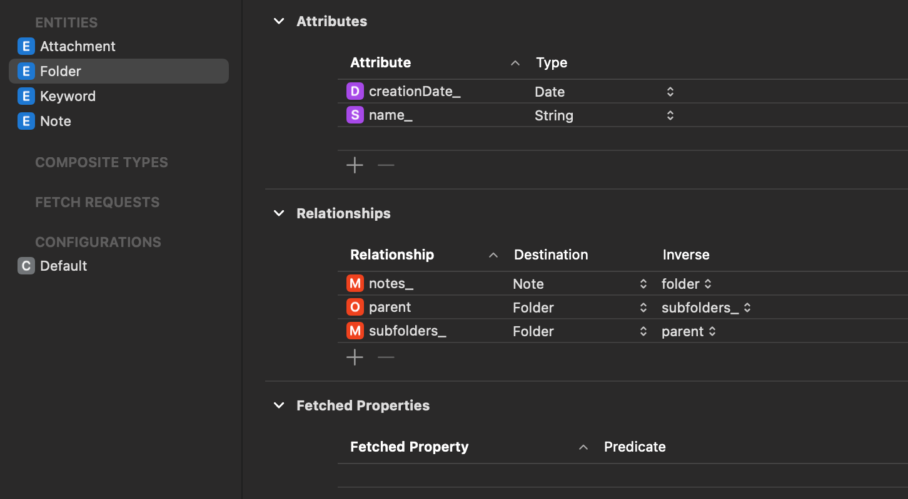

# Pobieranie danych Folderów  - Fetch z predykatami


## Wstęp


 Jedną z największych zalet baz danych relacyjnych jest możliwość przeprowadzenia zaawansowanego sortowania i filtrowania. Dzięki temu możemy dodać wiele świetnych funkcji do naszej aplikacji. Obecnie skonfigurowałem wiele tych relacji we wszystkich moich danych, ale nie zaimplementowałem na przykład wyświetlania tutaj głównych folderów i zagnieżdżonych subfolderów. To dlatego, że jeszcze nie używałem żadnego filtrowania w bazie danych. Najpierw pokażę Ci ten przykład. Pokażę Ci filtrowanie za pomocą testów jednostkowych dla notatek. Następnie zajmę się słowami kluczowymi (Tagami ?), ponieważ jeszcze ich tutaj nie dodałem. Muszę tutaj dodać przycisk, który umożliwi mi wyświetlenie pola do wyszukiwania słów kluczowych, dzięki któremu mogę dołączyć już istniejące słowo kluczowe do tej notatki lub utworzyć nowe. A na koniec chcę wyszukać swoje notatki, również je sortować. Na przykład możemy dodać tutaj pole tekstowe do wyszukiwania i wyszukiwać wszystko. Możemy szukać tytułu folderów, możemy szukać słów kluczowych. Na przykład możesz szukać notatek w polu tekstowym wyszukiwania. Jeśli fraza wyszukiwania znajduje się zarówno w tytule notatki, jak i w treści notatki. Następnie możesz dodać dodatkowe filtry, ile tylko chcesz. Więc szukasz tego terminu wyszukiwania. Notatka musi być w trybie zarchiwizowanym, a ty wiesz, że do niej dołączyłeś obraz. Mówimy: "O, chcemy sortować tylko notatki z załącznikiem". I pamiętasz, że zrobiłeś to w zeszłym tygodniu. Wtedy możemy również dodać więcej filtrów, aby określić, w jakim przedziale czasowym musi wpasować się tworzenie tej notatki. Aby jeszcze bardziej Cię zmotywować, pokażę Ci dwie przykładowe aplikacje, w których używa się dużo sortowania i filtrowania.


I jeden z nich to aplikacja Notatki. Po lewej stronie mamy tutaj te foldery. Jeśli klikniesz na któryś z nich, pierwszą rzeczą, którą musimy zrobić, jest filtrowanie wszystkich naszych notatek, aby pokazywać tylko te, które należą do tego folderu. Następnie sortują tę listę notatek, nie tylko według daty. Pokazują to również jako sortowanie sekcji. Pierwsza sekcja to poprzednie siedem dni. Następnie poprzednie 30 dni, październik, wrzesień. A potem jest chyba też ostatni rok. Możesz również przełączać się tutaj między listą a galerią. Znowu mają tutaj ten miesiąc. Dodałem wiele, zwykle nie używam notatek, więc dodałem wiele fikcyjnych notatek, ponieważ tutaj w prawym górnym rogu jest możliwość wyszukiwania notatek. I znowu używają sortowania sekcji z wyświetlaniem tutaj tych najlepszych trafień. Wydaje mi się, że zazwyczaj pokazują tylko kilka wyników wyszukiwania. Dla ostatnich notatek, które zawierają tekst wyszukiwania, a nawet podświetlają, gdzie go użyłem. Potem, kiedy tutaj coś wpiszesz. Kiedy jesteś tutaj, w polu tekstowym wyszukiwania, dodają sugerowane wyszukiwania. Dodają te tokeny do wyszukiwania. Mamy możliwość zrobienia dokładnie tego samego. W nowym systemie iOS 16 dodali to. Na przykład mogę powiedzieć, że chcę tylko notatki z tagami lub notatki z załącznikiem. Teraz przynosi mi to tę notatkę. I możesz dalej szukać. Teraz już nie mam tego dla tego. Faktycznie dodali możliwość korzystania tylko z jednego tokenu, ale możesz dodać ich więcej, jeśli chcesz. To jest miłe do zrobienia. A druga aplikacja to aplikacja Finder, gdzie wyszukiwanie jest jeszcze ważniejsze, bo tak, to jest cały cel tej aplikacji, aby wyszukiwać swoje pliki, dokumenty i grupy. Na przykład mogę wyszukać coś z hasłem "Note", i widzisz, możemy wybrać, czy chcemy szukać notatki jako nazwy pliku, czy też notatka ma być w treści, czy może to ma być na przykład nagie notatka lub załącznik do galerii.


Potem możemy dalej określić, to jest typ pliku, możemy również powiedzieć, czy chcemy przeszukiwać cały Mac czy tylko ten folder projektu lub sieć. Gdzie chcemy przeszukiwać? To jest znowu kolejne ograniczenie, gdzie ten węzeł należy. Na przykład możemy powiedzieć to samo, że przeszukujemy tylko węzeł w tym konkretnym folderze. Wtedy można używać jako kolumny lub listy. SwiftUI ma ten sam styl z tymi zmieniającymi się tłami i tym stylem tabeli, ponieważ tutaj na górze można zmienić kolejność sortowania. Możesz również sortować to alfabetycznie, według nazwy. styl tabeli jest dostępny dla macOS 12 i teraz dodali go także dla iPadOS na iPadzie z iOS 16, ponieważ na iPadzie jest wystarczająco dużo miejsca, aby również pokazywać te ładne tabele i korzystać z sortowania i filtrowania. Jeśli masz coś wybrane, tak jak w ostatnim przykładzie, tutaj także dodali tagi, więc możemy utworzyć nowy tag i widzisz, jeśli go nie znajduje, mówi "utwórz nowy tag" i wybierz kolor. Możemy również zaimplementować coś podobnego dla naszych słów kluczowych, czerpiąc trochę inspiracji z tego, jak działa Finder. Finder także używa sortowania sekcji, na przykład jeśli jestem tutaj w stylu listy dla mojego projektu. Tutaj mam możliwość sortowania według rodzaju. To jest programista i inne. Według daty dodania, ponownie poprzednie siedem dni i poprzednie 30 dni lub tutaj rozmiaru, daty modyfikacji, daty utworzenia dla tagów. SwiftUI ma teraz wbudowany sposób tworzenia sekcji w wynikach wyszukiwania, zamiast modyfikatora widoku dodaj wyniki fetch to jest wyniki fetch section. To trochę trudne do pracy, ale zdecydowanie warto to zaimplementować, ponieważ jest to bardzo przydatne. W tej sekcji chcę się skoncentrować na filtrowaniu, jak tworzyć NSPredicate, które są używane z zapytaniem fetch, a także na ustawianiu różnych deskryptorów sortowania. Jedna część polega na naukę Core Data i jak to skonfigurować. A druga główna część to to, jak możemy to połączyć z naszymi widokami SwiftUI, z naszymi deklaracjami interfejsu użytkownika.

## Pobieranie folderów nadrzędnych 

Od w iOS 15 zrobili to nieco łatwiejszym , ponieważ ten modyfikator widoku `addFetchViewModifier` może teraz dynamicznie aktualizować konfigurację i zmieniać ją w trakcie działania, jak jak dane są sortowane i filtrowane. Istnieje także inna alternatywa, gdzie można użyć inicjalizatora do tworzenia żądania fetch. Pokażę ci obie te implementacje w różnych częściach aplikacji. Ponieważ mamy trzy główne części, które omówimy:

- Mam tu sekcję folderu, gdzie filtruję na najważniejsze foldery. 

- Mam ten klucz lub ten tekst u góry, gdzie po prostu możemy sortować słowa kluczowe i wyszukiwać. 

- I ostatni to notatki, gdzie mogę wyszukiwać notatki w zależności od wyszukiwania, sortować według daty utworzenia, robimy także trochę sortowania sekcji, gdzie sortuję według statusu. 

  

  Jest sekcja, w której są wszystkie notatki w trybie roboczym, inna sekcja, w której są wszystkie notatki w trybie przeglądania i wszystkie są archiwizowane. Pokażę ci wiele przykładów NSPredicate, jak tworzyć te filtry za pomocą testów jednostkowych, abyś mógł zrozumieć, jakie rzeczy można faktycznie filtrować. Następnie użyjemy tego do naszych widoków SwiftUI, aby przefiltrować w nich dane. Pod koniec tej sekcji powinieneś mieć bardzo dobre zrozumienie sortowania i filtrowania w Core Data dla SwiftUI.

I teraz pokażę ci kilka przykładów filtrowania za pomocą Core Data. Chcę to zrobić na przykładzie folderów. Szukamy folderów, które spełniają określone kryteria. Bardzo wygodnie jest to praktykować w testach jednostkowych. W mojej klasie testowej folderu już rozpocząłem pracę nad jednym testem, w którym dostarczyłem wszystkie moje foldery. Główną częścią tutaj było to, że testowaliśmy to NSPredicate dla wszystkich. To są dwa przykłady, które ci pokazałem. Całe filtrowanie i wyszukiwanie w Core Data opiera się na tym `NSPredicate`. Muszą być w bardzo określonym formacie. Ponieważ czasami występują bardzo konkretne przypadki, dołączyłem do tej sekcji poniżej materiał do ściągnięcia, czyli tak zwany cheat sheet. To jest od Realm.io. Realm to inna baza danych podobna do Core Data i SQLite, to baza dokumentowa. Ale także korzystają z tego `NSPredicate`. Jak już wiesz, jak one działają w jednej z tych baz danych, to jest dość łatwo przenieść swoją wiedzę na inne. Tutaj dostajesz przegląd słów kluczowych, które musisz użyć. 


https://www.andrewcbancroft.com/2015/02/18/core-data-cheat-sheet-for-swift-ios-developers/


 [NSPredicateCheatsheet.pdf](NSPredicateCheatsheet.pdf) 


#### Format string summary

```
@"attributeName == %@"
```

object’s attributeName value is equal to value passed in

```
@"%K == %@"
```

pass a string variable to %K, it will be represented as a keypath, then check if it’s value is equal to value passed in

```
@"%name IN $NAME_LIST"
```

templated for predicate, checks if the value of key name is in $NAME_LIST. Uses predicateWithSubstitutionVariables

```
@"'name' IN $NAME_LIST"
```

checks if the constant value ‘name’ is in $NAME_LIST. Uses predicateWithSubstitutionVariables

```
[NSPredicate predicateWithFormat: @"title == %@", @"minecraft"]
```


#### Keypath collection queries

```
@avg
```

returns the average of the objects in the collection as an NSNumber

```
@count
```

returns the number of objects in a collection as an NSNumber

```
@min
```

returns the minimum value of the objects in the collection as an NSNumber

```
@max
```

returns the maximum value of the objects in the collection as an NSNumber

```
@sum
```

returns the sum of the objects in the collection based on the property

```
[NSPredicate predicateWithFormat: @"expenses.@avg.doubleValue < 200"]
```


#### Object, array, and set operators

```
@distinctUnionOfObjects
```

returns an array containing the distinct objects in the property specified by the key path to the right of the operator

```
@unionOfObjects
```

returns the same as `@distinctUnionOfObects` except it also includes duplicates

```
NSArray *payees = [transactions valueForKeyPath:@"@distinctUnionOfObjects.payee"]
@distinctUnionOfArrays
```

returns an array containing the distinct objects in the property specified by the key path to the right of the operator

```
@unionOfArrays
```

returns the same as `@distinctUnionOfArrays` except it also includes duplicates

These must be run on an array of arrays. For example if you had:

```
NSArray *arrayOfTransactions = [[Array of transactions], [Array of transactions]]
NSArray *payees = [arrayOfTransactions valueForKeyPath:@"@distinctUnionOfObjects.payee"]
@distinctUnionOfSets
```

returns an `NSSet` instance containing distinct objects in the property specified by the key path to the right of the operator. Expects an `NSSet` instance containing `NSSet` instances


#### Array operations

```
array[index]
```

specifies the element at the specified index in the array.

```
array[FIRST]
```

specifies the first element in the array.

```
array[LAST]
```

specifies the last element in the array.

```
array[SIZE]
```

specifies the size of the array.

Let’s say we have a person with many dogs. `index` should be replaced with a number which will return the dog that you want to check against. Here we’re checking if the first dog’s age is 5.

```
[NSPredicate predicateWithFormat: @"dogs[0].age = 5"]
```

Here we’re checking if a person has 3 dogs

```
[NSPredicate predicateWithFormat: @"dogs[SIZE] = 3"]
```


#### Basic comparisons

```
=,==
```

Left hand expression is equal to right hand expression

```
>=,=>
```

Left hand expression is greater than or equal to right hand expression

```
<=,=<
```

Left hand expression is less than or equal to right hand expression

```
>
```

Left hand expression is greater than right hand expression

```
<
```

Left hand expression is less than right hand expression

```
!=,<>
```

Left hand expression is not equal to right hand expression

```
IN
```

Left hand expression must appear in collection specified by right hand expression. i.e. name IN {‘Milk’, ‘Eggs’, ‘Bread’}

```
BETWEEN
```

Left hand expression is between or equal to right hand expression. i.e. 1 Between {0, 33}. If your left hand expression was 0 or 33 it would also make this true

```
[NSPredicate predicateWithFormat: @"expenses BETWEEN {200, 400}"]
```


#### Basic compound predicates

```
AND,&&
```

Logical AND

```
OR,||
```

Logical OR

```
NOT,!
```

Logical NOT

```
[NSPredicate predicateWithFormat: @"age == 40 AND price > 67"]
```


#### String comparison operators

```
BEGINSWITH
```

Left hand expression begins with the right hand expression

```
CONTAINS
```

Left hand expression contains the right hand expression

```
ENDSWITH
```

Left hand expression ends with the right hand expression

```
LIKE
```

Left hand expression equals the right hand expression: ? and * are allowed as wildcard characters, where ? matches 1 character and * matches 0 or more characters

```
MATCHES
```

Left hand expression equals the right hand expression using a regex - style comparison

```
[NSPredicate predicateWithFormat: @"name BEGINSWITH 'm'"]
```


#### Aggregate operators

```
ANY,SOME
```

returns objects where ANY or SOME of the predicate results are true.

```
ALL
```

returns objects where ALL of the predicate results are true.

```
NONE
```

returns objects where NONE of the predicate results are true.

```
[NSPredicate predicateWithFormat: @"ALL expenses > 1000"]
```

#### Subqueries

SUBQUERY(collection, variableName, predicateFormat)

Iterates through the collection to return qualifying queries

Collection - array or set of objects

variableName - variable that represents an iterated object

predicateFormat - predicate that runs using the variableName

```
[NSPredicate predicateWithFormat: @"SUBQUERY(tasks, $task, $task.completionDate != nil AND $task.user = 'Alex') .@count > 0"]
```

Assume this was run on an array of projects. It will return projects with tasks that were not completed by user Alex

------

Na przykład, jeśli chcesz dowiedzieć się, ile obiektów znajduje się w kolekcji, to jest @count. Lub tutaj, gdy chcemy porównać ciąg znaków, szukając tekstu wyszukiwania i mówimy, że tytuł naszych notatek musi zawierać termin wyszukiwania `CONTAINS`  lub rozpoczyna się od. `BEGINSWITH`


Niektóre warunki bardziej przypominają wyszukiwanie notatek, które zawierają którykolwiek z poniższych słów kluczowych, a następnie trochę złożonych i zapytań podrzędnych, ponieważ musiałem dowiedzieć się, jak połączyć wszystkie te predykaty razem, więc można to traktować jako odniesienie, jest dość przydatne, żeby szybko spojrzeć, ale pokażę ci wiele tego, co jest używane w tym, zaczynając od folderów. W zasadzie muszę znać różnicę i predykaty. Na przykład, chcę teraz pobrać najwyższe foldery z naszej bazy danych. 

Bazę danych skonfigurowałem tutaj z tym związkiem folder rodzica do foldera potomnego. Folder może mieć rodzica. Jest to jeden opcjonalny rodzic, ponieważ może nie mieć rodzica, co oznacza, że jest to folder główny. Więc musimy stworzyć zapytanie, w którym powiemy, że rodzic musi być null lub nieistniejący. 




Przejdźmy do moich testów . Tworzymy test testFetchTopFolders. Aby to przetestować, muszę naprawdę mieć dwa foldery. Tworzę rodzica. Jest to folder z nazwą i kontekstem. Oto mój kontekst i dziecko. To jest inny folder z nazwą i kontekstem, a następnie muszę stworzyć między nimi ten związek, więc mogę powiedzieć, że dzieci mojego rodzica, wstawiam teraz to nowe dziecko, 

```swift
        let parent = Folder(name:"parent",context: context)
        let child = Folder(name: "child", context: context)
        parent.subfolders.insert(child)
```


my musimy pobrać foldery, które nie mają rodzica, co oznacza, że powinienem otrzymać tylko folder parent . Napiszmy predykat. 

```swift
let predicate = NSPredicate(format: "parent == nil")
```

 I tutaj to jest argumenty formatu lub tablica argumentów. Będę to pisać jako jeden ciąg znaków. Mój rodzic, to jest nazwa atrybutu, dokładnie tak napisana, jest równy nil. Następnie tworzymy żądanie pobrania.

```swift
        let predicate = NSPredicate(format: "parent == nil")
        let fetchRequest = Folder.fetch(predicate)

        let retrievedFolders = try! context.fetch(fetchRequest)
```

Ten fragment kodu dotyczy pobierania folderów przy użyciu predykatu. Używam tego kodu, ponieważ już ma on sortowanie. Zawsze muszę mieć deskryptor sortowania. Teraz mogę podać tutaj ten predykat i wykonać. To praktycznie to, ponieważ już to przetestowałem. Moje żądanie jest właściwie działające. Tu jest pewne narzucanie rozpakowania opcjonalnych wartości. Teraz możemy wykonać, to jest tam prawda, i jak powiedziałem, mam tutaj dwa foldery, ale tylko jeden z nich jest najwyższym folderem, który jest moim rodzicem. Dlatego ilość pobranych folderów powinna wynosić jeden, a te pobrane foldery powinny zawierać mój folder nadrzędny. Pobrane foldery zawierają mojego rodzica. 

```swift
        XCTAssertTrue(retrievedFolders.count == 1)
        XCTAssertTrue(retrievedFolders.contains(parent)
```


Dobrze, mój test jest udany. Te warunki są prawdziwe. Teraz nie chcę testować niepowodzenia. W tym celu nie wstawiam tego dziecka do mojego rodzica lub nie dodaję tego dziecka do mojego rodzica. Co oznacza, że teraz powinienem mieć dwa foldery najwyższego poziomu, a ten warunek już nie będzie spełniony. 

```swift
        let parent = Folder(name:"parent",context: context)
        let child = Folder(name: "child", context: context)
        //parent.subfolders.insert(child)
```

Uruchamiam i faktycznie nie powiodło się. Więc wiem, że to załączenie tutaj działa teraz z prawidłowym formatem, z tym predykatem. Dobrze, mogę to załączyć i zrobić to jeszcze raz. Jak widzisz, muszę tutaj napisać format ciągu i muszę podać nazwy atrybutów. Nie jest to naprawdę coś, co lubię robić, ponieważ nie mam tutaj Xcode korygującego moje właściwości, ponieważ to tylko ciągi znaków. A czasami, zwłaszcza jeśli źle to napiszesz, to będzie  crash. Ponieważ moje pobieranie nie działa. Tak, więc informuje, że nie znajduje tej właściwości ani tego ścieżki klucza w folderze. Ponieważ jestem tutaj w swoim teście jednostkowym, od razu mówi mi, gdzie popełniłem błąd. Jeśli masz to gdzieś w swoich widokach, czasami naprawdę trudno jest dowiedzieć się, gdzie jest problem lub jaki jest problem, ponieważ tutaj przynajmniej wiem, która nazwa atrybutu jest nieprawidłowa. Pisanie tego NSParenticate w swoich widokach SwiftUI bezpośrednio jest trochę uciążliwe.

Całość :

```swift
    func testFetchTopFolders() {
        let parent = Folder(name:"parent",context: context)
        let child = Folder(name: "child", context: context)
        parent.subfolders.insert(child)

        let predicate = NSPredicate(format: "parent == nil")
        let fetchRequest = Folder.fetch(predicate)

        let retrievedFolders = try! context.fetch(fetchRequest)

        XCTAssertTrue(retrievedFolders.count == 1)
        XCTAssertTrue(retrievedFolders.contains(parent))

                      }
```


Rzecz do zrobienia jest podobna tutaj do tego fetch all. Tworzę inną funkcję, która tworzy mi to żądanie fetch w moim rozszerzeniu folderu, a następnie możemy użyć tego testu. Potrzebuję tego predykatu, a idę do mojego modelu folderu. Po moim pobraniu, tworzę inną statyczną funkcję, która tworzy mi żądanie pobrania. Funkcja do pobrania głównych folderów.

```swift
    static func fetchTopFolders() -> NSFetchRequest<Folder> {
        let predicate = NSPredicate(format: "%K == nil", FolderProperties.parent)
        return Folder.fetch(predicate)
    }

```


 W tym przypadku nie muszę mieć żadnych argumentów. I zwracam to i to jest żądanie pobrania z typem folderu.  Teraz tworzenie tego predykatu jest ładnie zizolowane i mogę to naprawdę przetestować w moim teście jednostkowym. Żądanie pobrania jest tutaj, a pobierz najwyższy folder i nie muszę tego pisać bezpośrednio. Testuj ponownie i udaje się. Następnie mogę się upewnić, że wiem, że piszę właściwy NSPredicate, zanim przejdę do widoków SwiftUI. Następnie wracam do mojego folderu, gdzie utworzyłem tę funkcję. Inną rzeczą, którą chcę zrobić, chce pozbyc sie tzw hardcoded strings, zwłaszcza w trakcie rozwoju, nie chcę potem wszędzie ręcznie szukać tych stringów i ręcznie muszę je zamieniać. Przenoszę tę wartość stringa jako stałą. Tworzę strukturę pomocniczą, który definiuje moje  stałe stringi. 


```swift
struct FolderProperties {
    static let parent = "parent"
    static let children = "children_"
    static let name = "name_"
}
```

 To są moje właściwości folderów, nazwa rodzica i muszę tutaj zastąpić tę wartość stringa, co mogę zrobić za pomocą %k. To jest w zasadzie zmienna zastępcza dla wszystkiego, co przychodzi później. %k jest dla wartości tesktowych (string).

```swift
NSPredicate(format: "%K == nil", FolderProperties.parent)
```


Teraz mogę przejść do swoich testów i spróbować jeszcze raz znowa funkcją: 

```swift
        let fetchRequestNew = Folder.fetch(predicate)
        let rerievedTopFolders = try! context.fetch(fetchRequestNew)
        XCTAssertTrue(rerievedTopFolders.count == 1)
        XCTAssertTrue(rerievedTopFolders.contains(parent))
```

​	Możesz również wykonać pewne optymalizacje, ponieważ zazwyczaj nie powinieneś pobierać więcej, niż naprawdę potrzebujesz. Na przykład, jeśli masz listę w aplikacji z 1000 postami notatek, możesz mieć wiele tych obiektów, które pobierasz jednocześnie, ale twoje UI pokazuje tylko 10 na raz. Więc jak ograniczyć to, co pobieramy, aby nie wykonywać więcej pracy na bazie danych niż jest to konieczne?  Na przykład możemy przetestować, aby pobrać tylko pierwsze 10 folderów. Tak naprawdę musiałbym tutaj utworzyć 10 folderów lub może sprobuje pobrać tylko dwa pierwsze foldery. Więc potrzebuję utworzyć tutaj tylko trzy foldery. 

```swift
    func testFetchTop2Folders(){
        let parent1 = Folder(name:"parent",context: context)
        let parent2 = Folder(name:"parent",context: context)
        let parent3 = Folder(name:"parent",context: context)

        let fetchRequestNew =  Folder.fetchTopFolders()
        fetchRequestNew.fetchLimit = 2
        let rerievedTopFolders = try! context.fetch(fetchRequestNew)

        XCTAssertTrue(rerievedTopFolders.count == 2)
        XCTAssertTrue(rerievedTopFolders.contains(parent1))
    }
```

 Mamy ograniczenie odbioru. To, co powiedziałem, możesz tutaj powiedzieć, że chcę tylko dwa. Teraz, jeśli wykonasz to, więc wykonujemy nasze zapytanie i sprawdzamy, ile wyników mamy.  To prawdopodobnie niewielka poprawka wydajności.


Okej, może po prostu zignoruję to ostrzeżenie. Już ustawiłem dla listy moich folderów, kiedy je wyświetlam. Nie chcę naprawdę pokazywać tylko dwóch, ponieważ gdy użytkownik przewija, mogę, jeśli początkowo ustawię na przykład, że chcę pokazać tylko 10, co wiem, że wypełni cały ekran. To jest minimalne wymaganie, aby coś pokazać. Ale gdy użytkownik przewija, chcę pobrać więcej. W tym celu mają inną właściwość w tym żądaniu odbioru, która nosi nazwę rozmiaru partii (batch limit). Więc to jest func test batch size (test rozmiaru partii). Okej, po prostu skopiuję wszystko to i zmienimy to tutaj, zamiast żądań odbioru (fetch requests). W tym przypadku zmieniamy rozmiar partii (fetch batch size). Na przykład możesz powiedzieć, że chcę tutaj pokazać tylko dwa. Mam rozmiar partii żądania odbioru (fetch batch size) ustawiony na dwa. Jeśli to uruchomię, nadal zwróci mi trzy, ponieważ, jak powiedziałem, to tylko je dzieli i ładuje, gdy jest to konieczne.

```swift
        let fetchRequestNew =  Folder.fetchTopFolders()
        fetchRequestNew.fetchBatchSize = 2
        let rerievedTopFolders = try! context.fetch(fetchRequestNew)
```

Więc jeśli to uruchomię, zwraca mi trzy, i to nie jest dobry przykład. Przedstawię to w widoku, w liście. Więc tutaj, po lewej stronie, dla mojego folderu, muszę zobaczyć, ile żądań odbioru faktycznie wykonuje lub ile razy wczytuje partycje. A w tym celu przydatny jest argument debugowania (debug argument). I ten, który jest interesujący, to tutaj, całkowity czas wykonania żądania odbioru dla dwóch wierszy (total fetch execution time for two rows). Więc muszę dodać znacznie więcej folderów. Wydaje mi się, że mam teraz 15. Następnie muszę tutaj rzeczywiście zapisać. Jeśli teraz to uruchomię ponownie, to teraz mówi całkowity czas wykonania żądania odbioru dla 17 wierszy (total fetch execution time for 17 rows). To dlatego, że obecnie, dla tego, który używam w moim SwiftUI, nie ustawiam limitu, ani nie dzielę ich na partycje, więc zawsze pobiera wszystkie, wszystkie 17. Teraz, jak powiedzieć mu, żeby pobierał tylko pięć? Więc dodam ten rozmiar partii (batch size) do mojego żądania pobrania, które używam w widoku.

```swift
    static func fetch(_ predicate: NSPredicate) -> NSFetchRequest<Folder> {
        let request = Folder.fetchRequest()
        request.sortDescriptors = [NSSortDescriptor(keyPath: \Folder.creationDate_, ascending: true)]
        request.fetchBatchSize = 5
        request.predicate = predicate
        return request
    }
```

 Więc tutaj dodaję żądanie odbioru o rozmiarze pięciu. Używam tutaj liczby pięć, więc dostaję więcej tych informacji. Uruchommy to ponownie. Więc tutaj widzisz, że to jest całkowite zestawienie dla pięciu wierszy, dla pięciu wierszy, a następnie dla dwóch ostatnich, ponieważ to jest ostatnia partycja, to już 17 w moim przypadku. Teraz pobiera je tylko partiami.


*To jest naprawdę ciekawe, zwłaszcza jeśli zmniejszę to okno. Teraz zmniejszam je. Program zapisuje ostatnią pozycję na przyszłość, a teraz ponownie uruchamiam go. Gdy uruchamiam moją aplikację po raz pierwszy, już wczytuje kilka z tych wierszy. Teraz po prostu oczyśćmy moją strefę debugowania. Teraz przewijam. Zauważysz, że za każdym razem, gdy przewijam, faktycznie ładuje ich coraz więcej, ponieważ ładowane są partiami po pięć. Wczytywane są te piątki razem, a potem następne piątki, i tak dalej. Jeśli chcesz zobaczyć więcej informacji na temat tego, co dokładnie jest pobierane, to użyłem argumentu debugowania, który nazywa się "SQLite debug". Istnieją cztery poziomy tego debugowania. Jeśli ustawisz go przynajmniej na poziom "free", otrzymasz informacje na temat obiektów, które są faktycznie pobierane. Teraz widzisz, że moja strefa debugowania staje się trochę zatłoczona. Na przykład tutaj widzisz pięć wierszy, a to są pięć obiektów folderów, które zostały pobrane, wraz z ich identyfikatorami obiektów. To są identyfikatory obiektów. Następnie widzisz, jak są ustawiane granice, a potem kolejne granice, i tak dalej. Zauważ to samo, na przykład, gdy wybieram mój najwyższy folder, który zawiera notatki. Teraz to jest kolejne zapytanie o pobranie notatek.*


Okej, to zaczyna być za dużo. Dlatego mogę tutaj przefiltrować notatki. W tym przypadku pobiera ono wszystkie notatki z tej zbyt licznej relacji, ponieważ użyłem relacji folderów notatki. I uzyskałem osiem wierszy z wszystkimi tymi obiektami notatek. W rzeczywistości nie użyłem NSFetchRequest. Użyłem tutaj widoku listy notatek. Miałem wybrany folder, który był tym @observed object. I użyłem tutaj notatek z wybranego folderu. Ze względu na ten @observed object, faktycznie tworzy się więcej żądań pobierania. I możesz to zobaczyć tutaj. Co to jest pobieranie, a co jest rzeczywistym pobieraniem, które jest wykonywane? Przeszukuje ono wszystkie relacje notatek tutaj. Apple zaleca stosowanie tego fetch batch size do wyszukiwań, gdzie masz nieograniczone wyniki lub wyniki bez ograniczeń, gdzie możliwe jest uzyskanie wyników bez ograniczeń. W naszym przypadku prawdopodobnie nie zrobi to zbyt wiele. Jest to bardziej przydatne, gdy mamy do czynienia z tysiącami wyników. Dla naszego przypadku może to nie być dużym problemem. Działa to bardziej, jeśli mówimy o tysiącach. Nie zostawię tego, to tylko po to, abyś zobaczył, że faktycznie coś robi. Teraz mam naprawdę tylko dwa foldery tutaj. Więc to również działa. Domyślnie, przypuszczam, że używam tutaj 10. Zwykle będziesz to testować w zależności od tego, jak duże są twoje komórki i na jakich ekranach operujesz, ale 10 wydaje się być w porządku.


> Before I go back to my unit test, I'm actually changing my debug here back to one because it does do some performance to your application, so it makes it a little bit slower. And I don't really need to have all of these print statements all the time. Okay, then when you want to optimize your fetches more, of course, also in the notion of not fetching more than is necessary, in some cases you don't really need to fetch all objects with all of the attributes. For example, that you only want to fetch the object with certain attributes, or you can say, I don't actually care about any of these attributes. For example, if you want to, for the keywords, you show your keywords in a list, and you just want to show a little number next to this keyword saying how many nodes I actually used for this keyword. And for this I only need to have the number, the count of this links, or the count of the nodes that you fetched. So I'm going to show you how to do this with the folders. So test, fetch, count, top, folder. top folder. That's really just the count that I care about right now. So I'm just going to copy most of these. So I still have some test folders. I still need to have my default fetch request. Fetch request has a result type property that you can change. The default is managed object results type and in this case I I just want to tell Core Data I care about the count. Don't do more than just count the object. 


Zanim wrócę do mojego testu jednostkowego, zmieniam moją wartość debugową z powrotem na jeden, ponieważ wpływa to na wydajność twojej aplikacji, co sprawia, że jest trochę wolniejsza. I naprawdę nie potrzebuję tych wszystkich komunikatów drukowanych cały czas. Okej, jeśli chcesz zoptymalizować swoje pobierania jeszcze bardziej, oczywiście także w sensie niepobierania więcej niż to konieczne, w niektórych przypadkach faktycznie nie musisz pobierać wszystkich obiektów ze wszystkimi atrybutami. Na przykład możesz chcieć pobrać obiekt tylko z pewnymi atrybutami, lub możesz powiedzieć, że faktycznie nie obchodzą cię żadne z tych atrybutów. Na przykład jeśli chcesz, aby słowa kluczowe były wyświetlane na liście, i chcesz tylko pokazać obok tego słowa kluczowego małą liczbę mówiącą, ile węzłów faktycznie użyłem do tego słowa kluczowego. I do tego potrzebuję tylko numeru, ilości tych odnośników lub ilości pobranych węzłów. Pokaże ci, jak to zrobić z folderami. Testuj pobieranie ilości węzłów w najwyższym folderze. To jest naprawdę liczba, o którą mi chodzi teraz. Więc po prostu skopiuję większość z tych. Nadal mam kilka testowych folderów. Nadal muszę mieć moje domyślne żądanie pobierania. Żądanie pobierania ma właściwość result type, którą możesz zmienić. Domyślna to managed object results type, a w tym przypadku chcę tylko powiedzieć Core Data, że zależy mi na liczbie. Nie rób niczego więcej niż po prostu zlicz obiekt.


> Furthermore, instead of fetching here all of these objects, I can perform a context count for this fetch request. This is now the retrieve folders count. And my test is XCT is zero two, my retrieved folders count is three. and my test actually succeeds. If I take out one of these folders, it fails, so this is good. This is probably the best performing operation on your database that you can do, which for my case, we have just three folders. It's not really interesting, but if you fetch something like in the thousands or 10 thousands of objects and you just want to count all of them, then this is much more performant. For example, if you want to show a graph of how many nodes did the user per time, so per day or per month, or for the last year, some of them might have a couple of hundred or thousand nodes and then this performance optimization can really help you to fast show this graph. There's also some other options to store some intermediate attributes, but I'm not going to do this now. I just want to let you know there's quite a bit more in this direction of performance optimization. Now that you saw some more customization of this fetch request, and in particular here how to fetch off the topmost folders, in the next video I'm going to use this new fetch request to show our nested folder structure.


Co więcej, zamiast pobierać tutaj wszystkie te obiekty, mogę wykonać kontekstowy licznik dla tego żądania pobierania. Teraz jest to retrieve folders count. A mój test to XCT to zero two, mój licznik pobranych folderów wynosi trzy. I mój test faktycznie udaje się. Jeśli usunę jeden z tych folderów, to się nie powiedzie, więc jest dobrze. To prawdopodobnie najwydajniejsza operacja, jaką można wykonać na bazie danych, która dla mojego przypadku ma tylko trzy foldery, nie jest zbyt interesująca, ale jeśli pobierasz coś w tysiącach lub dziesiątkach tysięcy obiektów i chcesz tylko je zliczyć, to jest znacznie bardziej wydajne. Na przykład, jeśli chcesz pokazać wykres, ile węzłów użytkownik wykonał w określonym czasie, na przykład na dzień, na miesiąc lub przez ostatni rok, niektórzy z nich mogą mieć kilkaset lub tysiąc węzłów, a następnie ta optymalizacja wydajności może naprawdę pomóc w szybkim pokazaniu tego wykresu. Istnieją także inne opcje przechowywania pewnych pośrednich atrybutów, ale teraz tego nie zrobię. Chcę tylko, żebyś wiedział, że jest jeszcze więcej w tej dziedzinie optymalizacji wydajności. Teraz, gdy widziałeś więcej dostosowań tego żądania pobierania, a w szczególności tutaj, jak pobrać najwyższe foldery, w następnym filmie użyję tego nowego żądania pobierania, aby pokazać naszą zagnieżdżoną strukturę folderów.


