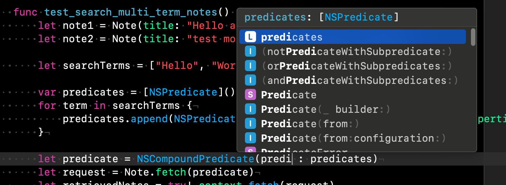

# 5.4 Fetching Notes

linki pomocnicze: 

https://developer.apple.com/library/archive/documentation/Cocoa/Conceptual/Predicates/AdditionalChapters/Introduction.html#//apple_ref/doc/uid/TP40001798-SW1

originalny artykuł: https://player.vimeo.com/video/780081104?autopause=1&autoplay=false#t=0.00s


Teraz pokażę ci znacznie więcej przykładów dla NSPredicates. Będziemy szukać różnych warunków. Stworzę nową klasę testową, aby nieco to rozdzielić. To jest klasa testów jednostkowych. To są moje testy pobierania notatek. Tworzę to i znowu muszę to skonfigurować. Usuwam domyślne dane. Muszę ponownie zaimportować Core Data do mojego projektu i potrzebuję kontrolera kontekstu oraz funkcje konfiguracji i usuwania. Teraz możemy zacząć pisać nasz test.

Pierwszy przykład to wyszukiwanie po terminie. Jeśli chcemy znaleźć notatki zawierające dany termin w tytule. Tworzę funkcję testową `searchTermNodes`. Potrzebuję czegoś, w czym mogę szukać w mojej bazie danych, więc tworzę tutaj dwie notatki. 

```swift
func test_search_term_notes() {
  let note1 = Note(title: "Test", context: context)
  let note2 = Note(title: "Dummy", context: context)
  let searchTerm = "tast"
}
```

 Powiedzmy, że chcę teraz wyszukać notatkę numer jeden z tekstem  "test". Muszę zdefiniować mój predykat. To, co chcę zrobić, to porównanie łańcuchów. I to byłoby polem `title`. Muszę sprawdzić bazę danych. Ponieważ nie chcę używać wartości łańcuchowych, robię to samo, co dla folderów, tworząc tutaj statyczną strukturę, w której trzymam wszystkie stałe, nazwy atrybutów.

```swift
//MARK: - define my string constants

struct NoteProperties {
    static let title = "title_"
    static let bodyText = "bodyText_"
    static let status = "status_"
    static let creationDate = "creationDate_"
    
    static let folder = "folder"
    static let keywords = "keywords_"
}
```

Aby dodać to do mojego łańcucha, mogę użyć `%k` jako zastępowanie wartości łańcucha. A argumentem, który chcę podać tutaj, jest termin wyszukiwania. 


```swift
        let predicate = NSPredicate(format: "%K CONTAINS %@",NoteProperties.title , searchTerm as CVarArg)
```


W bazie danych jest to inny typ, więc muszę użyć rzutowania typu `CVarArg`. A jeśli masz właściwość, którą chcesz dodać tutaj, jest to procent dolar. Teraz to jest właściwość, która powinna być podobna do terminu wyszukiwania.

Wróćmy do arkusza z przykładami predykatów: 

 [NSPredicateCheatsheet.pdf](NSPredicateCheatsheet.pdf) 

oficjalna dokumentacja apple :

https://developer.apple.com/library/archive/documentation/Cocoa/Conceptual/Predicates/AdditionalChapters/Introduction.html#//apple_ref/doc/uid/TP40001798-SW1

. Mamy możliwość przeprowadzenia pewnych porównań łańcuchów. Na przykład mamy `contains`. Więc możemy powiedzieć, że tytuł węzła zawiera termin wyszukiwania. Mogę po prostu dodać tutaj `contains`.


```swift
let predicate = NSPredicate(format: "%K CONTAINS[cd] %@",NoteProperties.title , searchTerm as CVarArg)
```

Dobrze, teraz kontynuujemy z resztą. Tworzę tu moje żądanie. To jest w klasie Note, żądanie pobierania z predykatem. A potem pobieram węzły, próbując wykonać to żądanie pobierania na moim kontekście. 

```swift
    func test_search_term_notes() {
        let note1 = Note(title: "Täst", context: context)
        let note2 = Note(title: "Dummy", context: context)

        let searchTerm = "tast"

        let predicate = NSPredicate(format: "%K CONTAINS[cd] %@",NoteProperties.title , searchTerm as CVarArg)
        let request = Note.fetch(predicate)
        let retrievedNotes = try! context.fetch(request)
    }
```

Mamy teraz wyniki z naszej bazy danych i sprawdzamy, czy naprawdę otrzymujemy to, czego szukaliśmy, czyli nasza notatka nr jeden. Liczba naszych otrzymanych rekordów powinna wynosić jeden. 

 `XCTAssertTrue(retrievedNotes.count == 1)`

A nasze otrzymane notatki powinny zawierać notatkę numer jeden.

`XCTAssertTrue(retrievedNotes.contains(note1))`

 I możesz również dodać tutaj, że otrzymane węzły zawierają węzeł numer dwa. I to jest naprawdę fałsz, więc wykonaj `assert false`. 

 `XCTAssertFalse(retrievedNotes.contains(note2))`

Teraz spróbuj uruchomić ten test i jest poprawny.

```swift

```

 Możesz spróbować, na przykład, jeśli zmienisz termin wyszukiwania na "Tess", z dwoma "S", ponieważ muszę go naprawdę całkowicie zmienić. Teraz nie powinniśmy otrzymywać niczego, test nie powinien nam przechodzić. Teraz cofam te zmiany. Aby to działało i naprawdę uzyskać notatkę, musi to być dość dokładne. Na przykład to, co nie jest obecnie prawidłowe, to jeśli masz wielkie litery zamiast małych liter. Teraz znów go nie znajduje. Jeśli chcesz wykonać wyszukiwanie bez uwzględniania wielkości liter, po `contains` i nawiasach klamrowych, możesz dodać "c" dla wyszukiwania bez uwzględniania wielkości liter.

`let predicate = NSPredicate(format: "%K CONTAINS[c] %@",NoteProperties.title , searchTerm as CVarArg)`

 I to działa. Istnieje także inna możliwość. To jest na przykład z dialektem. Teraz, w zależności od twojego języka, w angielskim nie masz na przykład niemieckich umlałtów czy polskich liter. . Jeśli chcesz zignorować ten dialekt, możesz dodać "cd". 

`let predicate = NSPredicate(format: "%K CONTAINS[cd] %@",NoteProperties.title , searchTerm as CVarArg)`

 Jeśli dodasz [cd], wyszukiwania stają się bardziej kosztowne, ponieważ teraz musi także porównywać wszystkie przypadki bez uwzględniania wielkości liter. I dialekty, więc muszą, tak. Porównywanie łańcucha nie jest już takie proste. Ale to coś, co zdecydowanie powinieneś dodać, ponieważ czasami z różnymi słowami kluczowymi to "ą" lub "ę" nie jest takie łatwe, a ludzie również zapominają. A także wielkie i małe litery. 

```swift
    func test_search_term_notes() {
        let note1 = Note(title: "Täst", context: context)
        let note2 = Note(title: "Dummy", context: context)

        let searchTerm = "tast"

        let predicate = NSPredicate(format: "%K CONTAINS[cd] %@",NoteProperties.title , searchTerm as CVarArg)
        let request = Note.fetch(predicate)

        let retrievedNotes = try! context.fetch(request)

        XCTAssertTrue(retrievedNotes.count == 1)
        XCTAssertTrue(retrievedNotes.contains(note1))
        XCTAssertFalse(retrievedNotes.contains(note2))
    }
```

Dobrze, a teraz dla naszych notatek mamy nie tylko tytuł, w którym można szukać, ale także treść notatki. W tym przypadku chcę wyszukać, czy mój termin wyszukiwania jest zawarty zarówno w tytule, jak i w treści notatki, czyli jest to logiczne lub. W tym przypadku mamy dwa predykaty NS, które chcemy połączyć, złożyć z OR. Tworzę nowy test dla tego. To jest test `searchTermInTitleOrBodyText`. 


Dobrze, duplikuję to, kopiuję to samo dla jednego z nich. Właściwie powinienem dodać tutaj `bodyText`. Więc musimy zresetować to za pomocą sformatowanego tekstu treści, który jest NSAttributedString z tekstu. Na przykład możemy dodać tutaj "test" dla jednego z nich, a dla drugiego "test" muszę to teraz zmienić. Teraz dodałem "test" zarówno w treści jednego z nich, jak i w tytule drugiego, co oznacza, że jeśli teraz szukam "test", powinienem otrzymać oba. Teraz muszę napisać dwa predykaty i połączyć je. Tworzę tablicę dwóch predykatów. Predykaty. Pierwszy to, po prostu skopiuję tę część.

```swift
        let note1 = Note(title: "Dummy", context: context)
        note1.formattedBodyText = NSAttributedString(string: "test")
        let note2 = Note(title: "test more", context: context)

        let searchTerm = "test"
```

Więc powtórzmy. Jeśli to jest w tytule, a drugi, jeśli to jest w treści notatki, okay, teraz muszę sprawdzić, jaka była właściwość w mojej bazie danych, a była to treść notatki podkreślnik. Dobrze, po prostu kontynuujmy tutaj dodawanie właściwości. `static let bodyTextUnderbar`. Więc moje drugie przeszukiwanie dotyczy treści. Mamy jedno warunki, gdzie szukamy tego w tytule, i jeden raz w treści notatki. Teraz muszę połączyć te dwa predykaty w jeden. To są predykaty, i możemy stworzyć NSCompoundPredicate z predykatów. I jak można sobie wyobrazić, można łączyć predykaty inaczej. Możesz powiedzieć, że chcę, żeby oba moje warunki były spełnione. To byłoby AND: `let predicate = NSCompoundPredicate(andPredicateWithSubpredicates: predicates)`




Widzisz tutaj operację logicznego AND, mamy OR, AND i operację NOT. W tym przypadku powiedziałem "albo albo", więc używamy tego. I tutaj mogę podać moją tablicę predykatów. 

```swift
let predicates = [NSPredicate(format: "%K CONTAINS[cd] %@", NoteProperties.title, searchTerm as CVarArg),
                          NSPredicate(format: "%K CONTAINS[cd] %@", NoteProperties.bodyText , searchTerm as CVarArg)]
```


 Te rodzaje złożonych predykatów można dodawać coraz więcej. Możesz teraz połączyć ten predykat z innym i potem z jeszcze innym za pomocą "and" lub "or". Istnieje wiele możliwości łączenia i tworzenia bardzo zaawansowanych predykatów.

```swift
    func test_search_term_in_title_or_bodytext() {

        let note1 = Note(title: "Dummy", context: context)
        note1.formattedBodyText = NSAttributedString(string: "test")
        let note2 = Note(title: "test more", context: context)

        let searchTerm = "test"

        let predicates = [NSPredicate(format: "%K CONTAINS[cd] %@", NoteProperties.title, searchTerm as CVarArg),
                          NSPredicate(format: "%K CONTAINS[cd] %@", NoteProperties.bodyText , searchTerm as CVarArg)]


        let predicate = NSCompoundPredicate(orPredicateWithSubpredicates: predicates)

        let request = Note.fetch(predicate)
        let retrievedNotes = try! context.fetch(request)

        XCTAssertTrue(retrievedNotes.count == 2)
        XCTAssertTrue(retrievedNotes.contains(note1))
        XCTAssertTrue(retrievedNotes.contains(note2))
    }
```

Na przykład, inny skomplikowany fetch może polegać na tym, że zamiast jednego terminu wyszukiwania mam dwa terminy, które chcę znaleźć. I chcę, aby oba były w tytule. Tak więc piszę nowy test. To jest test, w którym wyszukujemy po wielu terminach. Terminy w notatkach. Ponownie tworzę dwa węzły. I w tym przypadku mam dwa. Powiedzmy, że mam "hello world". I węzeł numer jeden ma tekst "hello" i "world". 

`let searchTerms = ["Hello", "World", "and"]`

Jeśli po prostu wyszukasz "hello world", to nie będziesz w stanie znaleźć tego węzła. Ale dzięki temu mogę indywidualnie wyszukiwać te słowa. Więc zaczynam od tablicy predykatów. 

```swift
        var predicates = [NSPredicate]()
        for term in searchTerms {
            predicates.append(NSPredicate(format: "%K CONTAINS[cd] %@", NoteProperties.title, term as CVarArg))
        }
```

Predykaty, tym razem jest to var, ponieważ muszę dołączyć ich więcej. Iiteruję po  warunkach wyszukiwania, ponieważ wtedy mogę dodawać nowy za każdym razem. tu bedziemy szukac po  tytule. Teraz dodaję wszystkie terminy wyszukiwania. Możesz dodać więcej niż tylko ten. Na przykład możesz również dodać tutaj "i". I teraz muszę ponownie zrobić to połączenie. A potem rzeczywisty test polega na tworzeniu tego żądania fetch i następnie pobieraniu, wykonywaniu żądania fetch. I potem testujemy, ile wyników mamy. Więc powiedziałem, że w tym przypadku powinienem otrzymać tylko węzeł numer jeden, który również powinien być zawarty w węzłach do odzyskania, a węzła numer dwa nie powinienem otrzymać. Czyli byłby to znowu fałsz. Uruchomienie testu i to działa. I właściwie nie chcę używać "lub", ponieważ wtedy którykolwiek z nich byłby uwzględniony. Na przykład, jeśli mam tutaj "test more world", otrzymałbym również węzeł numer dwa, ale to nie było celem. Chcę upewnić się, że wszystkie te terminy są uwzględnione. Dlatego zmieniłem tutaj moje NSCompound predicate na "AND".

`let predicate = NSCompoundPredicate(andPredicateWithSubpredicates: predicates)`

 Teraz wszystkie muszą być uwzględnione. I w tym przypadku naprawdę zwracamy tylko węzeł numer jeden. Możesz być bardzo konkretny, jeśli chodzi o to, jakie terminy chcesz znaleźć, czy to jest "i", "lub", możesz też łączyć je w różne sposób.


