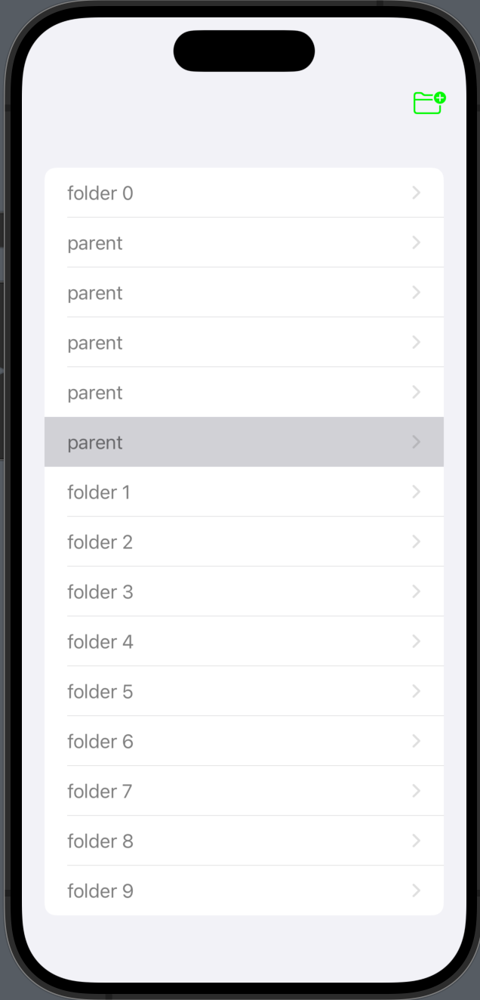
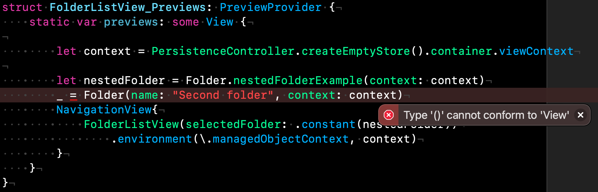
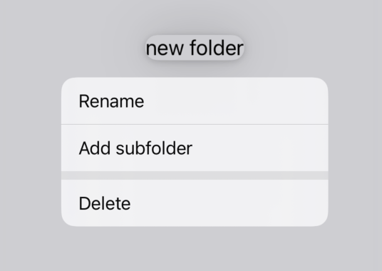
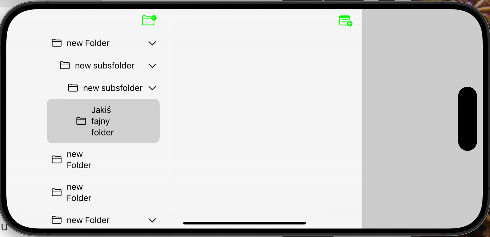

## Folder List View


Moja lista folderów w widoku obecnie pokazuje wszystkie foldery. Chcę to zmienić, aby pokazywać je jako foldery nadrzędne i podrzędne lub tę zagnieżdżoną strukturę folderów. Pierwszą rzeczą, którą muszę zmienić, jest żądanie pobierania. Zamiast pobierać i pokazywać wszystkie moje foldery, teraz korzystam z nowego żądania pobierania folderu nadrzędnego, które nie zmienia zbytnio mojego interfejsu użytkownika. 

```swift
struct FolderListView: View {

    @Environment(\.managedObjectContext) var context
    @FetchRequest(fetchRequest: Folder.fetchTopFolders()) private var folders: FetchedResults<Folder>
```

Dzieje się tak dlatego, że dane podglądu, które pokazuję, są podglądem mojego kontrolera trwałego. Tutaj pokazuję tylko 10 folderów, i wszystkie są folderami nadrzędnymi, nie mają rodzica. Nie utworzyłem żadnych zagnieżdżeń. Aby utworzyć jeden z tych przykładów, przechodzę do pomocnika folderu i tutaj dodaję znacznik z podglądem, aby móc utworzyć statyczną funkcję przykładu. Właściwie, powinienem prawdopodobnie nazwać to przykładem folderu zagnieżdżonego. Przykład folderu zagnieżdżonego, i potrzebuję mieć dostęp do kontekstu oraz zarządzania kontekstem zwracającego folder. Okej, mam jednego rodzica, więc nazwę go "parent" i z kontekstem. Teraz tworzę dziecko, to jest folder dziecka pierwszy z kontekstem, a następnie folder dziecka drugi z nazwą "child" itd..Następnie zwracam ten folder nadrzędny. 

```swift
    static func nestedFolderExample(context: NSManagedObjectContext) -> Folder {
        let parent = Folder(name: "parent", context: context)
        let child1 = Folder(name: "child1", context: context)
        parent.subfolders.insert(child1)
        let child2 = Folder(name: "child2", context: context)
        parent.subfolders.insert(child2)
        let child1_2 = Folder(name: "child1_2", context: context)
        child1.subfolders.insert(child1_2)
        let child1_1 = Folder(name: "child1_1", context: context)
        child1.subfolders.insert(child1_1)
        let child1_2_1 = Folder(name: "child1_2_1", context: context)
        child1_2.subfolders.insert(child1_2_1)
        return parent
    }
```


Teraz mogę przejść do widoku listy moich folderów gdzie przykladowe dane dostarczymy do naszej struktury Prview.

```swift
struct FolderListView_Previews: PreviewProvider {
    static var previews: some View {
        let context = PersistenceController.preview.container.viewContext
        let nestedFolder = Folder.nestedFolderExample(context: context)
        NavigationView{
            FolderListView(selectedFolder: .constant(nestedFolder))
                .environment(\.managedObjectContext, context)
        }
    }
}
```

Niestety po uruchomieniu widac mnóstwo powtórzonych katalogów:




Za każdym razem, gdy to uruchamiam, to jest dowany kolejny raz folder z podfolderami. Musimy podczas tworzenie kontekstu czyścić magazyn danych:


```swift
struct FolderListView_Previews: PreviewProvider {
    static var previews: some View {

        let context = PersistenceController.createEmptyStore().container.viewContext
      ...
```

 I jak widzisz, mam naprawdę tylko ten jeden folder nadrzędny tutaj. Jeśli chcesz zobaczyć inny, możesz tutaj stworzyć folder o nazwie "second" z tym kontekstem. Tu niersttey mamy błąd:



 Musimy zwrócić ten widok nawigacyjny. 

```swift
struct FolderListView_Previews: PreviewProvider {
    static var previews: some View {

        let context = PersistenceController.createEmptyStore().container.viewContext

        let nestedFolder = Folder.nestedFolderExample(context: context)
        _ = Folder(name: "Second folder", context: context)
       return  NavigationView{
            FolderListView(selectedFolder: .constant(nestedFolder))
                .environment(\.managedObjectContext, context)
        }
    }
}
```

Teraz mam te dwie foldery nadrzędne i możemy kontynuować pracę nad interfejsem użytkownika. 

```swift
struct FolderListView: View {
...

    var body: some View {
        Group{
            List(selection: $selectedFolder) {
                ForEach(folders) { folder in
                    NavigationLink(value: folder) {
                        FolderRow(folder: folder)
                    }
                }
            }
        }
    }
 ...
}
```

Tutaj mam listę i pętlę po wszystkich moich folderach w moim folderze nadrzędnym. Dla każdego z tych folderów pokazuję widok `FolderRow`, który ma tutaj pole tekstowe z nazwą folderu i to menu kontekstowe. Teraz muszę to zmienić, aby pokazywać również te zagnieżdżone podfoldery dla każdego z tych folderów. Lista ma wygodny sposób na wyświetlanie danych zagnieżdżonych. 

```swift
            List(folders,children:  \.subfolders) { folder in
                FolderRow(folder: folder)
            }
```

 Problem polega na tym, że to "children", ponieważ jest zagnieżdżone, musi rekurencyjnie wywoływać sam siebie, więc typy muszą pasować. Właściwość "children" musi być tego samego typu co moja właściwość `Folder`, ale jest to wynik funkcji fetch, a moje "children" są w typie "NS<Set>".  Imamy komunikat błedu : 

```swift
Key path value type 'Set<Folder>' cannot be converted to contextual type 'FetchedResults<Folder>?'
```

Mogę to zamienić na tablicę. , co oznacza, że muszę to posortować.  Jednak nie chcę wykonywać dodatkowego sortowania ani operacji na tablicy w moich wynikach fetch. Te właściwości, ponieważ to dodatkowa praca, i może to spowolnić działanie mojej aplikacji.  Zamiast dostosowywać moją strukturę danych do tej właściwości "children", zamierzam stworzyć dodatkowy widok `RecursiveFolderView`, ponieważ to nie jest naprawdę trudne. W zasadzie chcę mieć przycisk rozwijania. To po prostu przycisk, który pozwala pokazać zawartość, czyli podfoldery. I muszę to rekurencyjnie wywoływać. 

Zamiast bezpośrednio tutaj pokazywać mój `FolderRow`, muszę mieć ten widok `RecursiveFolderView`. 

```swift
struct RecursiveFolderView: View {

    @ObservedObject var folder: Folder
    @State private var showSubfolders = true

    var body: some View {

        HStack {
            Image(systemName: "folder")
            FolderRow(folder: folder)

            Spacer()

            if folder.subfolders.count > 0 {
                Button {
                    withAnimation {
                        showSubfolders.toggle()
                    }

                } label: {
                    Image(systemName: "chevron.right")
                        .rotationEffect(.init(degrees: showSubfolders ? 90 : 0))
                }
            } else {
                Color.clear
            }
        }
        .tag(folder)

        if showSubfolders {
            ForEach(folder.subfolders.sorted()) { subfolder in
                RecursiveFolderView(folder: subfolder)
                    .padding(.leading)
            }
            .onDelete(perform: deleteFolders(offsets:))
        }

    }

    private func deleteFolders(offsets: IndexSet) {
        offsets.map { folder.subfolders.sorted()[$0] }.forEach(Folder.delete(_:))
    }
}

struct RecursiveFolderView_Previews: PreviewProvider {
    static var previews: some View {
        List {
            RecursiveFolderView(folder: Folder.nestedFolderExample(context: PersistenceController.preview.container.viewContext))

        }
    }
}

```

 To jest po prostu komórka dla każdego z tych folderów, więc musi mieć właściwość folderu. Ponieważ chcę obserwować moje dzieci, musi być to właściwość obserwowalna "observed object var folder folder". Teraz muszę to mieć w podglądzie i po prostu użyję tego samego, co wcześniej, z folderami zagnieżdżonymi folderami i używam tutaj kontekstu widoku kontenera podglądu kontrolerów trwałych. Teraz mogę pracować nad moim głównym interfejsem użytkownika. Również główną częścią jest pokazanie surowego folderu mojego folderu, i dodam tu ten folder jako ikonę.


```swift
HStack {
  Image(systemName: "folder")
  FolderRow(folder: folder)

  Spacer()
}
```

Więc to jest obraz z nazwą systemu, która jest folderem w układzie h-stack, a następnie chcę mieć ten symbol , który wskazuje w dół lub na bok, w zależności od tego, czy otworzyłem czy rozwinąłem to zagnieżdżenie.

```swift
if folder.subfolders.count > 0 {
  Button {
    withAnimation {
      showSubfolders.toggle()
    }

  } label: {
    Image(systemName: "chevron.right")
    .rotationEffect(.init(degrees: showSubfolders ? 90 : 0))
  }
} else {
  Color.clear
}
```

 Etykieta pokazuje podfoldery, a obraz systemowy to kropka chevron w prawo, więc jest w tej kierunku. Okay, właściwie zawsze chcę pokazywać obraz, więc zmienię to tylko na pokazywanie obrazu. Obraz z nazwą systemu i muszę dodać spację między nimi. Chcemy przełączyć  ten chevron tutaj, czyli ten przycisk ma dwie stany: otwarty lub zamknięty. 


Może dodajmy trochę animacji. Umieszczam moje przełączanie w widoku z animacją. Teraz przełącza się między nimi, ale właściwie chcę obrócić to, więc nie mogę tego zrobić w ten sposób. Muszę użyć efektu obrotu wewnątrz niego z efektem rotacji. Jeśli pokazuję moje podfoldery, to jest 90, a w przeciwnym razie 0. Teraz zawsze pokazuję ten chevron, ale po prostu obracam go. Jeśli teraz klikniesz, obraca się o 90 stopni. 

`.rotationEffect(.init(degrees: showSubfolders ? 90 : 0))`

Animacje między dwoma różnymi ikonami, nie wie, jak je animować. Ale efekt obrotu nie wie, ponieważ może pokazać wszystkie obrazy lub animację dla wszystkich pośrednich kroków, czyli pokazuje stopniowo wszystkie przejścia. 

Następnie ten przełącznik chcę pokazać tylko, jeśli mam jakieś podfoldery. Możemy sprawdzić, czy liczba dzieci w moich folderach jest większa niż zero, wtedy pokazuję ten przełącznik. 

 `if folder.subfolders.count > 0`

 Teraz główna część polega na pokazaniu moich podfolderów. Poniżej mojego H-stack muszę pokazać listę podfolderów. Muszę właściwie osadzić to tutaj w V-stacku wokół mojej komórki. Tutaj mogę dodać "for each" dla wszystkich dzieci moich folderów. 

```swift
if showSubfolders {
  ForEach(folder.subfolders.sorted()) { subfolder in
                                       RecursiveFolderView(folder: subfolder)
                                       .padding(.leading)
                                      }
  .onDelete(perform: deleteFolders(offsets:))
}
```

Następnie muszę przełączyć, kiedy zmieniam ten chevron, żeby nie pokazywać rekurencyjnie moich dzieci. Pokazuję to tylko, jeśli pokazuję moje podfoldery, a potem używam tego "for each". Teraz, jeśli to zrobisz, możesz pokazywać i ukrywać podfoldery. To po prostu przesuwa się w górę i w dół, ponieważ mamy tylko tę jedną komórkę tutaj. Jeśli przeniesiesz to w podglądzie na listę, lepiej zobaczysz, jak to działa razem w podglądzie. 

```swift
struct RecursiveFolderView_Previews: PreviewProvider {
    static var previews: some View {
        List {
            RecursiveFolderView(folder: Folder.nestedFolderExample(context: PersistenceController.preview.container.viewContext))

        }
    }
}
```

Mamy teraz jeden fragment, i mogę użyć tego widoku rekurencyjnego folderu w moim widoku listy folderów. Więc tutaj, zamiast bezpośrednio wywoływać folderRow, zaczynam od widoku rekurencyjnego folderu dla tego folderu. Te inne strzałki są teraz trochę dziwne. Dzieje się tak z powodu linku nawigacyjnego w pętli. Usuwam link nawigacyjny i część problemu wynika z tego, że nie mogę właściwie niczego wybrać. 

```swift
struct FolderListView: View {
    ...
            List(selection: $selectedFolder) {
                ForEach(folders) { folder in
                        RecursiveFolderView(folder: folder)
                }
                .onDelete(perform: deleteFolders(offsets:))
            }}
```

Musimy dodać tagi dla tego wyboru na liście. 

```swift
struct RecursiveFolderView: View {
    ...

    var body: some View {

        HStack {
            ...
        }
        .tag(folder)
```

To, co chcę wybrać, to `HStack` w mojej części rekurencyjnej, więc to jest właściwie tylko górna część każdej z komórek, więc dodaj tag tutaj dla tego folderu, ponieważ wszystko jest `VStackiem`, to jest jedna komórka, więc lista, w której się znajduje, używa jednej komórki i nie rozpoznaje tego jako tag. Właściwie chcę, żeby to była jedna komórka na mojej liście, a to jest inna komórka. Więc nie powinienem tutaj używać tego `VStack`. Zmiana, która teraz zachodzi, dotyczy linii oddzielających. Teraz animacje i wszystko działa znacznie lepiej, ponieważ wie, że to jest tylko jedna komórka więcej na mojej liście. Mogę teraz przejść do widoku listy folderów, i tutaj pierwszą rzeczą, którą widzimy, jest to, że wybrany zagnieżdżony folder jest w rzeczywistości zaznaczony jako wybrany, i mogę wybierać różne foldery.


Tworzenie takiego rodzaju zagnieżdżonych folderów jest w rzeczywistości dość proste, i faktycznie preferuję to, ponieważ masz pełną kontrolę i możesz także tutaj używać sortowania, które chcesz, lub tworzyć nowe żądania pobierania, aby pokazywać to, co chcesz i w jakiej kolejności. Teraz, jeśli uruchomisz to, to się wiele nie zmieniło, ponieważ nadal muszę być w stanie tworzyć nowe podfoldery. 


Ten przycisk tworzy tylko kolejny folder nadrzędny. Więc to, co mogę dość łatwo dodać, to ten menu kontekstowe. Po prostu dodam inny przycisk do dodawania podfolderu. Menu kontekstowe było dołączone do mojego FolderRow. Mam tu dwie możliwości: zmień nazwę i usuń. Więc dodam separator, aby mieć oddzielenie przed usuwaniem, i dodam tutaj przycisk, akcję i etykietę. Chcę powiedzieć tekst "Utwórz nowy podfolder", a potem muszę utworzyć nowy folder. Podfolder, folder, nowy, podfolder, a potem muszę mieć kontekst, który muszę pobrać z otoczenia. 

```swift
Button("Add subfolder"){
  let subfolder = Folder(name: "new subsfolder", context: viewContext)
  folder.subfolders.insert(subfolder)
}

Divider()
```





. Spróbujmy dodać kilka podfolderów. Przytrzymaj długo i kliknij "Utwórz nowy podfolder". Teraz widzisz, jak się zmieniają. Jeśli chcesz, możesz także bezpośrednio, gdy tworzysz nowy podfolder, pokazać edytor zmiany nazwy. Wtedy możesz także powiedzieć "pokaż edytor zmiany nazwy" w tym przypadku lub po prostu użyj tego, ponieważ miałem tutaj różnice w iOS i macOS, ponieważ chcę to zrobić dwukrotnie. Wyodrębniłem to jako funkcję podrzędną `func startRenameAction`, która przesuwa te zmiany stanu do właściwości stanu tam, aby móc to wywołać albo po naciśnięciu przycisku "Zmień nazwę", albo gdy tworzę nowy podfolder. Jedyny problem to jest ten "startRename". Możesz to po prostu przetestować, zrozumieć, które zachowanie jest bardziej sensowne. "Utwórz nowy podfolder", i prawdopodobnie powinienem teraz zmienić to na "Utwórz nowy podfolder" tutaj. I rzecz w tym, że tak naprawdę nie powinienem tego pokazywać dla tego folderu, ale dla podfolderu. Dobra, może teraz usunę to na razie, bo musisz jeszcze coś dodać, aby pokazać inny widok edytora folderu, nie dla tego folderu, ale dla tego podfolderu. No i na koniec, zanim odejdę, ponieważ w przeciwnym razie jest błąd wewnątrz, jest to właściwie akcja usuwania. Mam tutaj jedno usuwanie w moim głównym "for each". Na przykład mogę usunąć ten folder.





Jak usunąć mój folder podrzędny? Okej, to jest wyraźnie nie to, czego chciałem. Co mam zrobić w tym przypadku usuwania folderu? W rzeczywistości usuwam właściwy folder, ale muszę dodać kolejne "on delete" dla odpowiedniego "for each". Ponieważ tutaj moje rekurencyjne, to właściwie "for each", które musi usuwać dzieci. A funkcja usuwania w tym przypadku polega na uzyskaniu indeksu mojego "for each", więc to właściwie to. 

```swift
    private func deleteFolders(offsets: IndexSet) {
        offsets.map { folder.subfolders.sorted()[$0] }.forEach(Folder.delete(_:))
    }
```

 Muszę najpierw dodać kilka podfolderów. Teraz usuwanie tego usuwa właściwy folder, a jeśli usunę ten, to usuwa również podfoldery razem ze względu na nasze reguły usuwania. Teraz zmieniam widok listy folderów, aby pokazywać te zagnieżdżone foldery, zaczynając od najwyższych folderów, które do tej pory nie mają rodzica. Następnie musieliśmy zmienić listę, którą pokazujemy, ponieważ teraz muszę także pokazać podfoldery w zagnieżdżeniu, zamiast korzystać z istniejącego widoku SwiftUI do listy dzieci. Stworzyłem tu własną grupę ujawniającą, swoją własną listę z jej dziećmi, tworząc widok rekurencyjnego folderu, w którym rekurencyjnie wywołuję sam siebie, czyli ten widok rekurencyjnego folderu dla każdego z dzieci. Aby to działało z resztą, musiałem także dodać tutaj funkcję usuwania i trochę więcej tych menu, abyśmy mieli sposób na tworzenie, w rzeczywistości, podfolderów na razie. Jedna zmiana, którą wprowadziłem do tego żądania dla najwyższego folderu, jest właściwie bardzo prosta, lub co najmniej zmieniłem niewiele kodu, który jest tutaj, tworząc nowe NSPredicate, gdzie mówię, że rodzic moich folderów powinien być null. Musiałem jednak znacznie więcej pracy, aby zaktualizować swoje UI. 